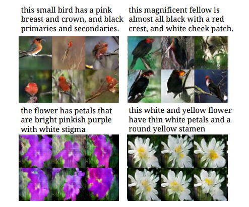
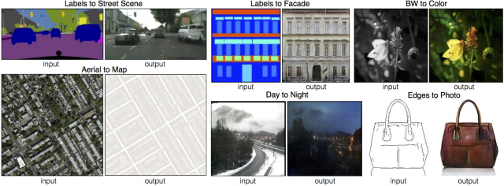
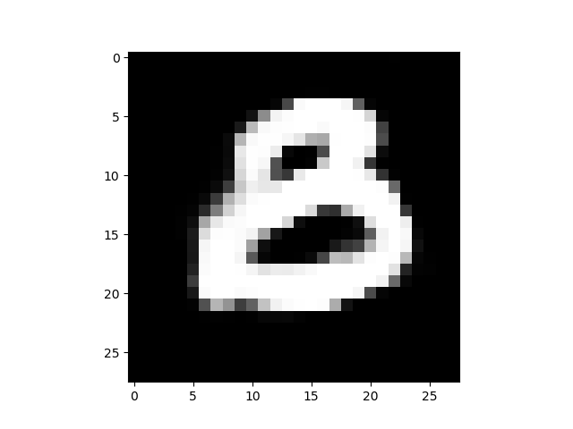

# Üretici Hasımsal Ağlar (Generative Adverserial Networks -GAN-)

Derin Öğrenme ustalarından Yann LeCun GAN'leri "son 10 senede yapay öğrenmede
görülen en büyük ilerleme'' olarak tarif ediyor. Burada haksız değil. YSA'lar
ilk başta (geri gelişinden sonraki ilk evresinde de) bir resimde kedi, köpek ya
da uçak olup olmadığını sınıflayabiliyordu. Yeni evrişimsel (convolutional) yapı
ile çetrefil görüntü ilişkilerini öğrenip bunları sınıflama özelliği kazandı,
fakat bunlar basit bir etikete bağlı olarak denetimli (süpervised) olarak
yapıyordu.

GAN'ler denetimsiz olarak eğitilebiliyor, ve daha ilginci "üretimsel
(generative)'' olarak kullanılabiliyor. Mesela pek çok görüntüye bakıp yeni
görüntüler üreten bir GAN olabilir, ya da, sözel tarif verilince o tarifteki
söylenen görüntüyü üreten bir GAN olabilir! Öyle ya sonuçta verilen girdi bir
takım reel sayılar içeren çok boyutlu vektörlerdir, bu sayıların kelimeleri,
başka görüntüleri temsil etmesi mimarı açısından çok fark yaratmaz.



Resimden resime tercüme edebilmek, "üretim yapmak'' elle çizilmiş taslakları
gerçeğe çok yakın resimlere dönüştürmek, ya da tam tersi yönde gitmek mesela
bir uydunun çektiği şehir resmini haritasal yollar, evler şemasına tercüme
etmek, vs.



Mimari

Şimdi GAN'lerin nasıl kurulduğuna gelelim. Bir GAN yapısı kabaca bir kalpazan
(üretimsel) ve polis (ayırtaç -discriminatör-) arasındaki ilişkiyi
benzetilebilir. İlk başta kalpazan polise bir sahte para gösterir, polis buna
sahte der. Bu noktada polis kalpazana önemli bir bilgi / geri besleme vermiş
olur, kalpazan bu bilgiyi kullanarak bir sonraki sefere daha iyi sahte para
basmaya uğraşabilir. Bu döngü uzun süre devam ettirilir ta ki kalpazan işleri
iyice ilerletip polisi tamamen aldatabilinceye kadar. 

İmajlar bağlamında düşünelim şimdi; sahte imajlar üretmek ve onları
ayırdedebilmek. Üstteki anlatımdan bize iki tane ağ gerektiğinin
anlayabiliriz. Birincisi ayırtaç, bu ağa imaj verilir, o da cevap olarak 0/1
olarak sahte / değil, doğru / yanlış şeklinde bir cevap hesaplar. 


İkinci ağ yapısı sahte imaj üretmeye uğraşıyor, ve bu üretimi çok iyi yapmaya
uğraşıyor. Peki girdi nedir? Gürültü! İkinci ağa 100 boyutlu gürültü vereceğiz
(başka boyutlar da olabilir), ve bu gürültüyü işleyerek 28x28 boyutlarında bir
imaj üretmesini bekleyeceğiz. Bu dahiyane bir yöntem. Ağın hayal görmesini,
üretmesini istiyoruz, bu tür bir ağa gürültü, ya da hiçlikten daha iyi bir girdi
verilemezdi herhalde. Bu arada eğitildikten sonra YSA'nın deterministik bir
yapıda olduğunu unutmayalım, yani eğitim bitince aynı gürültü iki kere verilince
aynı imaj üretilir. Değişik imajlar için değişik gürültüler vermek lazım!
Değişik gürültü nasıl olur? Gaussian bazlı N(0,1) gürültü ürettiğimizi
düşünelim, bazen 0'in solundan bazen sağından değer üretiyor olabiliriz. Müthiş
olan YSA'nın eğitim sırasında bu tür gürültü farklarına hassas hale
gelmesidir! İkinci ağ altta,


Peki eğitim verisi $X,y$ nedir, yani kaynak etiket nasıl ayarlanır? Eğitim
sırasında gerçek görüntüler arasından belli sayıda dosya toplanır, bunlar
"gerçek'' yani 1 etiketi, ardından elde en son olan üretece görüntü üretmesi
söylenir ve bu veriler 0 etiketi ile eğitim verisine dahil edilir. Dikkat
edersek MNIST bağlamında mesela bu tabandan gelen 0,1,2,. gibi etiketleri
kullanmıyoruz, etiketleri kendimiz üretiyoruz. 


Amaç üretecin o kadar iyi hale gelmesi ki ayırtaç gerçek imaj ile hayali
olanı birbirinden ayırt edemesin.

```python
"""
From https://github.com/eriklindernoren/Keras-GAN/tree/master/dcgan
"""
import os
import numpy as np
from tqdm import tqdm
from keras.layers import Input
from keras.models import Model, Sequential
from keras.layers.core import Reshape, Dense, Dropout, Flatten
from keras.layers.advanced_activations import LeakyReLU
from keras.layers.convolutional import Conv2D, UpSampling2D
from keras.datasets import mnist
from keras.optimizers import Adam
from keras import backend as K
from keras import initializers

K.set_image_dim_ordering('th')

# Deterministic output.
# Tired of seeing the same results every time? Remove the line below.
np.random.seed(1000)

# The results are a little better when the dimensionality of the
# random vector is only 10.  The dimensionality has been left at 100
# for consistency with other GAN implementations.
randomDim = 200


def get_model():
    # Optimizer
    adam = Adam(lr=0.0002, beta_1=0.5)

    # Generator
    generator = Sequential()
    generator.add(Dense(128*7*7, input_dim=randomDim, kernel_initializer=initializers.RandomNormal(stddev=0.02)))
    generator.add(LeakyReLU(0.2))
    generator.add(Reshape((128, 7, 7)))
    generator.add(UpSampling2D(size=(2, 2)))
    generator.add(Conv2D(64, kernel_size=(5, 5), padding='same'))
    generator.add(LeakyReLU(0.2))
    generator.add(UpSampling2D(size=(2, 2)))
    generator.add(Conv2D(1, kernel_size=(5, 5), padding='same', activation='tanh'))
    generator.compile(loss='binary_crossentropy', optimizer=adam)

    # Discriminator
    discriminator = Sequential()
    discriminator.add(Conv2D(64, kernel_size=(5, 5), strides=(2, 2), padding='same', input_shape=(1, 28, 28), kernel_initializer=initializers.RandomNormal(stddev=0.02)))
    discriminator.add(LeakyReLU(0.2))
    discriminator.add(Dropout(0.3))
    discriminator.add(Conv2D(128, kernel_size=(5, 5), strides=(2, 2), padding='same'))
    discriminator.add(LeakyReLU(0.2))
    discriminator.add(Dropout(0.3))
    discriminator.add(Flatten())
    discriminator.add(Dense(1, activation='sigmoid'))
    discriminator.compile(loss='binary_crossentropy', optimizer=adam)

    # Combined network
    discriminator.trainable = False
    ganInput = Input(shape=(randomDim,))
    x = generator(ganInput)
    ganOutput = discriminator(x)
    gan = Model(inputs=ganInput, outputs=ganOutput)
    gan.compile(loss='binary_crossentropy', optimizer=adam)

    return generator, discriminator, gan

def train(epochs=1, batchSize=128):

    # Load MNIST data
    (X_train, y_train), (X_test, y_test) = mnist.load_data()
    X_train = (X_train.astype(np.float32) - 127.5)/127.5
    X_train = X_train[:, np.newaxis, :, :]
    
    batchCount = X_train.shape[0] / batchSize
    print ('Epochs: %d' % epochs)
    print ('Batch size: %d' % batchSize)
    print ('Batches per epoch: %d' % batchCount)
    generator, discriminator, gan = get_model()
    for e in range(1, epochs+1):
        print ('Epoch %d' % e)
        for _ in tqdm(range(int(batchCount))):
            # Get a random set of input noise and images
            noise = np.random.normal(0, 1, size=[batchSize, randomDim])
            imageBatch = X_train[np.random.randint(0, X_train.shape[0], size=batchSize)]

            # Generate fake MNIST images
            generatedImages = generator.predict(noise)
            X = np.concatenate([imageBatch, generatedImages])

            # Labels for generated and real data
            yDis = np.zeros(2*batchSize)
            # One-sided label smoothing
            yDis[:batchSize] = 0.9

            # Train discriminator
            discriminator.trainable = True
            dloss = discriminator.train_on_batch(X, yDis)

            # Train generator
            noise = np.random.normal(0, 1, size=[batchSize, randomDim])
            yGen = np.ones(batchSize)
            discriminator.trainable = False
            gloss = gan.train_on_batch(noise, yGen)

    generator.save('dcgan_generator_epoch_%d.h5' % e)
    discriminator.save('dcgan_discriminator_epoch_%d.h5' % e)


if __name__ == '__main__':
    train(50, 128)
```

Eğittikten sonra bir gürültü verip üretim yapalım,

```python
import mnist_dcgan
generator, discriminator, gan = mnist_dcgan.get_model()
generator.load_weights("dcgan_generator_epoch_50.h5")
noise = np.random.randn(1,200)
pixels = generator.predict(noise).reshape((28,28))
plt.imshow(pixels)
plt.gray()
plt.savefig('gan_01.png')
```


Bir kez daha gürültü üretelim ve imaj üretelim,

```python
noise = np.random.randn(1,200)
pixels = generator.predict(noise).reshape((28,28))
plt.imshow(pixels)
plt.gray()
plt.savefig('gan_03.png')
```



Bu çıktıların görüntüsü ilginç değil mi? Aslında MNİST imajlarına tıpatıp
benzemiyorlar, "hayal edilmiş'' ya da "tekrar oluşturulmuş'' bir halleri
var sanki. GAN'lerin sihri burada. 

Kaynaklar

[1] [https://towardsdatascience.com/gans-n-roses-c6652d513260](https://towardsdatascience.com/gans-n-roses-c6652d513260)

[2] [https://towardsdatascience.com/gan-by-example-using-keras-on-tensorflow-backend-1a6d515a60d0](https://towardsdatascience.com/gan-by-example-using-keras-on-tensorflow-backend-1a6d515a60d0)


