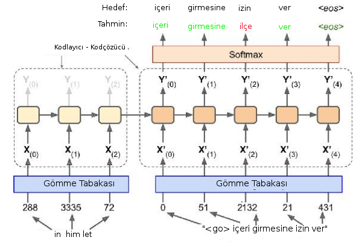
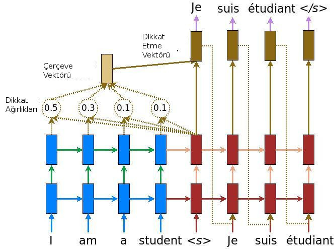

# Otomatik Tercüme, Makine Tercümesi (Machine Translation)

Dizin-Dizin İlişkisini Öğrenmek (Sequence to Sequence Learning)

Dillerarası otomatik tercüme yazılımı Google Translate ile popüler hale
geldi. Google bu servisi ilk kodladığında parça parça, istatistiki bir
yaklaşım kullanarak kodlamış, fakat 2017 yılında bu servis tamamen derin
öğrenme üzerinden işleyecek şekilde değiştirildi, kod satır sayısı
500,000'den 500'e indi!

DO bazlı tercüme sistemleri nasıl işler? 



Not: kaynak cümlesi ters şekilde girilmiş, bu mimarı ilk teklif edildiğinde
bu şekilde yapılıyordu, fakat [3]'e göre her eğitim verisi için dinamik
şekilde yaratılabilen RNN hücreleri durumunda buna gerek yok.

Servisin temelinde, üstte görüldüğü gibi bir RNN tabakası var. Fakat bu RNN
yapısında ilk (soldaki) bölüm kodlayıcı, ikinci (sağdaki) bölüm kod çözücü
olarak planlanmış.  Eğitim verisinde kaynak ve hedef cümle beraber, yanyana
olarak hem girdi olarak veriliyor, ayrıca tercüme sonuç cümlesi alınıp bir
de etiket verisi olarak kullanılıyor, bir farkla, etiketteki cümle zaman
indisinde eğitimdeki sonuç cümlenin bir geri kaydırılmış hali.

Kaynak, sonuç tercüme cümleleri farklı boylarda olabilir, hem aynı eğitim
noktası içinde birbirlerinden, hem de değişik eğitim noktalarında
kendilerinden bile farklı boyutlarda olabilirler, bu sebeple RNN öğe
sayıları dinamik şekilde, her eğitim verisine göre farklı olacak. Fakat bu
farklı boyutlar karışıklık yaratmıyor, çünkü tercüme için önemli olan şey
kodlayıcı bloktan kod çözücü bloğa geçen gizli konum.

Bu konuma daha önceki yazılarda $h$ adı vermiştik. Eğitim süreci şöyle, tüm
cümleler + tüm kelimeler üzerinden bir sözlük oluştururuz, bu sözlüğe göre
her kelimeye bir tam sayı indis değeri atarız, sonra kelimeleri tam
sayılara çevirip gömme tabakasına veririz, bu tabaka reel sayı içeren
vektörlere dönüşür, ve eğitim ilerledikçe referans gömme matrisinde
kelimelerin temsil değerleri iyileşir. Bunlar otomatik oluyor tabii, biz
soldan sağa YSA'ya her eğitim veri noktasındaki kelimeleri teker teker
geçiyoruz, bir eğitim noktası için önce birinci kelimeyi ilk RNN öğesine,
oradan çıkan $h$'yi ve ikinci kelimeyi ikinci RNN öğesine, böyle devam
ediyor.

Kodlayıcıdan çıkış olduğu anda (dikkat hala tek bir eğitim noktasını
işliyoruz) elimizde olan $h$'nin özel bir anlamı var. Üstteki mimariye göre
bu gizli katman tüm kaynak cümleyi temsil eden bir $h$'dir. Başta pek
değildir ama zaman geçtikçe öyle olacaktır. $h$ boyutu önceden planlanan
şekilde, yani cümleye göre küçülüp büyüyen bir şey değil. Neyse tabii ileri
besleme orada durmuyor, kod çözücüye devam ediliyor, burada kelimeler sonuç
tercümeden geliyor, şimdi onun kelimelerini almaya başlıyoruz ve etikette
bahsettiğimiz şekilde kaydırılan kelimelere tekabül edecek şekilde eğitime
devam ediyoruz, ve sağa en sona gelince bir eğitim noktası ile işimiz
bitiyor.

Hedef kelimeleri softmax olarak planlanmış, yani kod çözücüdeki RNN öğeleri
mümkün tüm kelimeler üzerinden bir olasılık vektörü üretiyor. Gerçek dünya
uygulamalarında bu yaklaşım külfetli olabilir, çünkü sözlük çok büyük ise
softmax boyutu tek bir kelime çıktısı için olasılıkları temsil etmek için
çok fazla boyutlu olmalıdır, burada performansı iyileştirebilecek başka
bazı yaklaşımlar var, ama kavramsal olarak çıktının sanki her mümkün kelime
üzerinden bir softmax olduğunu düşünebiliriz.

Eğitim bittikten sonra hiç görülmemiş yeni test verisi için tercüme nasıl
yaparız? Biraz önce gördüğümüz gibi kaynak cümlenin kelimeleri soldan sağa
YSA'ya verilir, kod çözücüye geldiğimizde $h$ ile beraber Go sembolü
verilecektir, ve bu sembol sonuç tercümede ilk kelimeyi üretir. Tercümenin
ilk kelimesini bu şekilde elde etmiş oluruz. Eğer eğitim iyi yapılmışsa
derin YSA ilk kelimeyi güzel bir şekilde üretecektir (daha doğrusu softmax
tüm kelimelerin olasılıklarını hesaplar, biz bu olasılıklara göre en olası
kelimeyi örnekleme yaparak alırız). Sonra bu üretilen kelimeyi alıp alttan
YSA'ya (artık kod çözücüde tabii) beslemeye devam ederiz, mesela Go sonucu
"içeri'' kelimesi verilmiş, biz "içeri'' kelimesini alttan ikinci RNN
öğesine veririz, bu bize üstten "girmesine'' kelimesini üretebilir, böyle
devam ederiz.

Dikkat Etme Vektörü (Attention Vector)

Bazı yaklaşımlara göre kodlayıcı bloktan çıkan $h$ bir cümleyi temsil etmek
için yeterli görülmüyor, kod çözücü bloğundaki RNN öğelerinden kaynak
cümledeki tüm kelimelere giden bir dikkat etme vektörü üzerinden bağlantı
koyuluyor. Detaylar [2]'de bulunabilir. Alttaki örnekte İngilizce
"I am a student'', yani ben bir öğrenciyim cümlesinin Fransızca karşılığı
"Je suis etuidant'' gösterilmiş. 



Ayrıca RNN katmanı tek bir zincir olmayabilir, üst üste konulmuş birkaç
katmandan da oluşuyor olabilir. Resimde istiflenmiş iki RNN seviyesi
görüyoruz mesela.

Not: Bilgisayar ile söyleşi yapılmasını sağlayan chatbot teknolojisi
aslında üstteki tercüme teknolojisinin değişik bir kullanımı sadece. Eğer
kaynak ve sonuç cümleler aynı cümlenin iki farklı dildeki karşılığı yerine
iki kişi arasındaki konuşmalar olsaydı, YSA yapısı gömme tabakası, cümleler
alakası üzerinden "bir konuşmayı'' öğrenmeye başlardı. "Nasılsın''
cümlesine "çok iyiyim'' karşılığı veriliyor, bu iki cümle ve onun gibi
cümleleri üstteki teknikle eğitince yavaş yavaş YSA nasıl karşılık
vereceğini öğrenebilmeye başlıyor. 

Örnek kod [1] alttadır, veri [4]'ten.

```python
# translate.py
import pickle
import tensorflow as tf
import numpy as np, os

checkpoint_path = "/home/burak/Downloads/model.ckpt"

from data_utils import (
    process_data,split_data,generate_epoch,generate_batch,
)

def rnn_cell(FLAGS, dropout, scope):

    with tf.variable_scope(scope):
        rnn_cell_type = tf.nn.rnn_cell.BasicLSTMCell
        single_cell = rnn_cell_type(FLAGS.num_hidden_units)
        single_cell = tf.nn.rnn_cell.DropoutWrapper(single_cell,
            output_keep_prob=1-dropout)
        stacked_cell = tf.nn.rnn_cell.MultiRNNCell(
            [single_cell] * FLAGS.num_layers)

    return stacked_cell

def rnn_inputs(FLAGS, input_data, vocab_size, scope):

    with tf.variable_scope(scope, reuse=True):
        W_input = tf.get_variable("W_input",
            [vocab_size, FLAGS.num_hidden_units])

    # embeddings will be shape [input_data dimensions, num_hidden units]
    embeddings = tf.nn.embedding_lookup(W_input, input_data)
    return embeddings

def rnn_softmax(FLAGS, outputs, scope):
    with tf.variable_scope(scope, reuse=True):
        W_softmax = tf.get_variable("W_softmax",
            [FLAGS.num_hidden_units, FLAGS.sp_vocab_size])
        b_softmax = tf.get_variable("b_softmax", [FLAGS.sp_vocab_size])

    logits = tf.matmul(outputs, W_softmax) + b_softmax
    return logits

class model(object):

    def __init__(self, FLAGS):

        self.encoder_inputs = tf.placeholder(tf.int32, shape=[None, None],
            name='encoder_inputs')
        self.decoder_inputs = tf.placeholder(tf.int32, shape=[None, None],
            name='decoder_inputs')
        self.targets = tf.placeholder(tf.int32, shape=[None, None],
            name='targets')
        self.en_seq_lens = tf.placeholder(tf.int32, shape=[None, ],
            name="en_seq_lens")
        self.sp_seq_lens = tf.placeholder(tf.int32, shape=[None, ],
            name="sp_seq_lens")
        self.dropout = tf.placeholder(tf.float32)

        with tf.variable_scope('encoder') as scope:

            # Encoder RNN cell
            self.encoder_stacked_cell = rnn_cell(FLAGS, self.dropout,
                scope=scope)

            # Embed encoder inputs
            W_input = tf.get_variable("W_input",
                [FLAGS.en_vocab_size, FLAGS.num_hidden_units])
            self.embedded_encoder_inputs = rnn_inputs(FLAGS,
                self.encoder_inputs, FLAGS.en_vocab_size, scope=scope)

            # Outputs from encoder RNN
            self.all_encoder_outputs, self.encoder_state = tf.nn.dynamic_rnn(
                cell=self.encoder_stacked_cell,
                inputs=self.embedded_encoder_inputs,
                sequence_length=self.en_seq_lens, time_major=False,
                dtype=tf.float32)

        with tf.variable_scope('decoder') as scope:

            # Initial state is last relevant state from encoder
            self.decoder_initial_state = self.encoder_state

            # Decoder RNN cell
            self.decoder_stacked_cell = rnn_cell(FLAGS, self.dropout,
                scope=scope)

            # Embed decoder RNN inputs
            W_input = tf.get_variable("W_input",
                [FLAGS.sp_vocab_size, FLAGS.num_hidden_units])
            self.embedded_decoder_inputs = rnn_inputs(FLAGS, self.decoder_inputs,
                FLAGS.sp_vocab_size, scope=scope)

            # Outputs from encoder RNN
            self.all_decoder_outputs, self.decoder_state = tf.nn.dynamic_rnn(
                cell=self.decoder_stacked_cell,
                inputs=self.embedded_decoder_inputs,
                sequence_length=self.sp_seq_lens, time_major=False,
                initial_state=self.decoder_initial_state)

            # Softmax on decoder RNN outputs
            W_softmax = tf.get_variable("W_softmax",
                [FLAGS.num_hidden_units, FLAGS.sp_vocab_size])
            b_softmax = tf.get_variable("b_softmax", [FLAGS.sp_vocab_size])

            # Logits
            self.decoder_outputs_flat = tf.reshape(self.all_decoder_outputs,
                [-1, FLAGS.num_hidden_units])
            self.logits_flat = rnn_softmax(FLAGS, self.decoder_outputs_flat,
                scope=scope)

            # Loss with masking
            targets_flat = tf.reshape(self.targets, [-1])
            losses_flat = tf.nn.sparse_softmax_cross_entropy_with_logits(
                logits=self.logits_flat, labels=targets_flat
            )
            mask = tf.sign(tf.to_float(targets_flat))
            masked_losses = mask * losses_flat
            masked_losses = tf.reshape(masked_losses,  tf.shape(self.targets))
            self.loss = tf.reduce_mean(
                tf.reduce_sum(masked_losses, reduction_indices=1))

        # Optimization
        self.lr = tf.Variable(0.0, trainable=False)
        trainable_vars = tf.trainable_variables()
        # clip the gradient to avoid vanishing or blowing up gradients
        grads, _ = tf.clip_by_global_norm(
            tf.gradients(self.loss, trainable_vars), FLAGS.max_gradient_norm)
        optimizer = tf.train.AdamOptimizer(self.lr)
        self.train_optimizer = optimizer.apply_gradients(
            zip(grads, trainable_vars))

        #self.saver = tf.train.Saver(tf.all_variables())

    def step(self, sess, FLAGS, batch_encoder_inputs, batch_decoder_inputs,
        batch_targets, batch_en_seq_lens, batch_sp_seq_lens, dropout):

        input_feed = {self.encoder_inputs: batch_encoder_inputs,
            self.decoder_inputs: batch_decoder_inputs,
            self.targets: batch_targets,
            self.en_seq_lens: batch_en_seq_lens,
            self.sp_seq_lens: batch_sp_seq_lens,
            self.dropout: dropout}
        output_feed = [self.loss, self.train_optimizer]
        outputs = sess.run(output_feed, input_feed)

        return outputs[0], outputs[1]

class parameters(object):

    def __init__(self):
        self.max_en_vocab_size = 30000
        self.max_sp_vocab_size = 30000
        self.num_epochs = 100
        self.batch_size = 20
        self.num_hidden_units = 300
        self.num_layers = 3
        self.dropout = 0.2
        self.learning_rate = 1e-3
        self.learning_rate_decay_factor = 0.99
        self.max_gradient_norm = 5.0

def create_model(sess, FLAGS):
    tf_model = model(FLAGS)
    print "Created a new model"
    sess.run(tf.initialize_all_variables())
    return tf_model

def restore_model(sess, FLAGS):
    tf_model = model(FLAGS)
    tf_model.saver.restore(sess, checkpoint_path) 
    return tf_model

def train(FLAGS):

    # Load the data
    en_token_ids, en_seq_lens, en_vocab_dict, en_rev_vocab_dict = \
        process_data('nmtdata/tst2013.en', max_vocab_size=30000, target_lang=False)
    sp_token_ids, sp_seq_lens, sp_vocab_dict, sp_rev_vocab_dict = \
        process_data('nmtdata/tst2013.tr', max_vocab_size=30000, target_lang=True)

    # Split into train and validation sets
    train_encoder_inputs, train_decoder_inputs, train_targets, \
        train_en_seq_lens, train_sp_seq_len, \
        valid_encoder_inputs, valid_decoder_inputs, valid_targets, \
        valid_en_seq_lens, valid_sp_seq_len = \
        split_data(en_token_ids, sp_token_ids, en_seq_lens, sp_seq_lens,
            train_ratio=0.8)
    
    output = open('nmtdata/vocab_en.pkl', 'wb')
    pickle.dump(en_vocab_dict, output)
    output.close()
    output = open('nmtdata/vocab_sp.pkl', 'wb')
    pickle.dump(sp_vocab_dict, output)
    output.close()

    # Update parameters
    FLAGS.en_vocab_size = len(en_vocab_dict)
    FLAGS.sp_vocab_size = len(sp_vocab_dict)

    print 'len(en_vocab_dict)', len(en_vocab_dict)
    print 'len(sp_vocab_dict)', len(sp_vocab_dict)
    
    # Start session
    with tf.Session() as sess:
        model = None
        # Create new model or load old one
        f = checkpoint_path + ".index"
        print f
        exit()
        if os.path.isfile(f):
            model = restore_model(sess)
        else:
            model = create_model(sess, FLAGS)

        # Training begins
        losses = []
        for epoch_num, epoch in enumerate(generate_epoch(train_encoder_inputs,
            train_decoder_inputs, train_targets,
            train_en_seq_lens, train_sp_seq_len,
            FLAGS.num_epochs, FLAGS.batch_size)):

            print "EPOCH: %i" % (epoch_num)
            # Decay learning rate
            sess.run(tf.assign(model.lr, FLAGS.learning_rate * \
                (FLAGS.learning_rate_decay_factor ** epoch_num)))

            batch_loss = []

            for batch_num, (batch_encoder_inputs, batch_decoder_inputs,
                batch_targets, batch_en_seq_lens,
                batch_sp_seq_lens) in enumerate(epoch):

                loss, _ = model.step(sess, FLAGS,
                    batch_encoder_inputs, batch_decoder_inputs, batch_targets,
                    batch_en_seq_lens, batch_sp_seq_lens,
                    FLAGS.dropout)
                print loss
                batch_loss.append(loss)
            print 'mean: ', np.mean(batch_loss)

            print "Saving the model."
            model.saver.save(sess, checkpoint_path)
            
if __name__ == '__main__':
    FLAGS = parameters()
    train(FLAGS)
```

Kaynaklar

[1] Mohandas, *The Neural Perspective, RNN - Part 3 - Encoder - Decoder*,[https://theneuralperspective.com/2016/11/20/recurrent-neural-networks-rnn-part-3-encoder-decoder/](https://theneuralperspective.com/2016/11/20/recurrent-neural-networks-rnn-part-3-encoder-decoder/)

[2] TensorFlow, *TensorFlow Neural Machine Translation Tutorial*, [https://github.com/tensorflow/nmt](https://github.com/tensorflow/nmt)

[3] Géron, *Hands-On Machine Learning with Scikit-Learn and TensorFlow*

[4] ManyThings Verisi, İngilizce-Türkçe, *Tab-delimited Bilingual Sentence Pairs*, [https://drive.google.com/uc?export=view&id=16fsAVPaPgp9gW9mdLmKz0OOR9lQ1M9WU](https://drive.google.com/uc?export=view&id=16fsAVPaPgp9gW9mdLmKz0OOR9lQ1M9WU)


