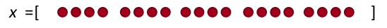

# Derin Öğrenme ile Doğal Dil İşlemek (Natural Language Processing -NLP-)

Doküman sınıflamak, bir film için yazılmış yorumu beğendi / beğenmedi
şeklinde irdelemek; tüm bu işlemler doğal dil işlemek kategorisine girer,
ve derin yapay sinir ağları (DYSA) bu alanda kullanılabilir.

Doküman nasıl temsil edilir? 

Doküman kelimelerden oluşur, fakat kelimeler sayısal değil kategorik
şeyler, DYSA kullanmak için kelimelerin sayısallaştırılması lazım. Bir
çözüm 1-hot kodlaması, tüm dokümanlardaki tüm kelimeler on bin kelimelik
bir "sözlükten'' geliyorsa, her kelime için on bin boyutunda bir vektör
yaratırız, bu vektörde kelimelerin yerleri önceden bellidir, "cat (kedi)''
kelimesi mesela 300. indis, o zaman "cat'' kelimesini temsil için 10,000
büyüklüğündeki bir vektörün 300. öğesi 1 diğer 9999 ögesi 0 olur.

Bu temsil şekli biraz israflı degil mi? Ayrıca kelimeler arasında benzerlik
için bize hiçbir fayda getirmiyor.

Daha önce [4] yazısında boyut azaltma işleminden bahsettik. Bir kelimeyi,
ya da dökümanı her ikisinin ilişkisini içeren bir matris üzerinde SVD
işlettikten sonra daha ufak bir boyutta temsil edebiliyorduk. Bu azaltılmış
boyutta, ki boyutu binlere varan ham veri için azaltılmış boyut
$k=10,20,100$ gibi olabiliyordu, kelimeler pür sayısal hale geliyordu ve
kelimelere tekabül eden $k$ büyüklüğündeki vektörlerin, anlamsal bağlamda
birbirine yakınlık ya da uzaklıkları bu sayılar üzerinden
ölçülebiliyordu. Bu tür bir temsilde bazı kelimeler sayısal olarak şu halde
olabiliyordu,

```
cat:  (0.01359, ..., -0.2524, 1.0048, 0.06259)
mat:  (0.01396, ..., 0.033483, -0.10007, 0.1158)
chills: (-0.24776, ..., 0.079717, 0.23865, -0.014213)
sat:  (-0.35609, ..., -0.35413, 0.38511, -0.070976)
```

Derin YSA ile aynı sonuç kelime gömme (word embedding) mekanizması ile elde
ediliyor. Fikir aslında gayet basit ve dahiyane. Kelime yerine onları
temsil eden sayısal vektörler YSA'nın bir tabakasına "gömülür'' ve aynen
YSA'nın diğer katmanları gibi ağırlık olarak addedilip
eğitilirler. Başlangıçta tüm kelimelerin gömme vektörleri rasgele
sayılardır, eğitim ilerledikçe bu değerler anlamlı hale gelirler.

Kodlama kabaca şöyle: tüm dokümanlar üzerinden sözlüğü oluştururuz.
Kelimeler 1-hot vektörü değil, tek bir indis haline getirilir, üstteki
"cat'' sadece 300 sayısına dönüşür yani. Gömme tabakası için sadece
sınırlı sayıda kelimeyi alırız, mesela ilk 5'i, yani her dokümanın ilk 5
kelimesi tutulur, gerisi atılır, eğer eksik varsa dolgulama (padding) ile
sıfırlar eklenip 5'e getirilir. Tabii bu indis değerleri YSA için direk
kullanılamaz, bir sonraki aşama, YSA'ya bir gömme tabakası eklemek, YSA'nın
eğitimde kullanacağı esas değerler bunlar. Her (tek) kelimenin gömme boyutu
da önceden kararlaştırılır (gömme vektörünün sayısal boyutu), $n$ diyelim,
mesela $n=4$, eğer sözlük büyüklüğü $|V|$ ise, $n \times |V|$ boyutunda bir
büyük gömme referans matrisi elde edilir. 


Bu referans matrisin başlangıç değerleri rasgeledir. Bu örnekte YSA içinde
bulunan gömme girdi katmanının tamamı 5 x 4 = 20 olacaktır. Altta "cat
chills on a mat (kedi paspas üzerinde takılıyor)'' cümlesini görüyoruz,


Üstteki girdiyi olduğu gibi alabilirdik, yani girdi katmanı 5 x 4
boyutundaki bir "tensor'' da olabilirdi (modern YSA araçları çok boyutlu
tensorlar ile rahatça çalışırlar), biz basitleştirme amacıyla vektörün
düzleştirildiğini düşünelim,



Burada ilginç bir durum var, alışılagelen YSA kodlamasından farklı olarak
$x$ vektörüne "girdi'' dedik, fakat $x$'i bir tamamen bağlanmış ağırlık
tabakası olarak görmek daha doğru. Fakat bu ağırlık tabakası diğer ağırlık
tabakaları gibi de değil; Her eğitim veri noktasının içindeki kelimelerin
indisleri üzerinden *referans gömme matrisindeki* uygun satırlar
çekilip o anda bir $x$ haline getiriliyor. Ardından geriye yayılma ile YSA
hata düzeltme yapacağı zaman gömme referans matrisindeki uygun vektörler
güncelleniyor.

Bu kadar. Şimdi eğitim hedef değerlerine bakalım. Burada farklı yaklaşımlar
var, üstteki *Lineer Cebir* yazısında bahsedilen YSA komşu kelimeleri
tahmin etmeye uğraşıyordu. Bir başka numara bir cümleyi alıp içindeki tek
bir kelimeyi "bozmak'', oraya anlamsız bir kelime getirmek, ve bu yeni
cümleyi 0, bozulmamış olanını 1 etiketiyle eğitmek. Cümleler nasıl olsa hazır
var, onları bozmak kolay, bu şekilde iki kategorili bir sınıflama problemi
elde ediyoruz. Örnek boyutlarla [3],

$x \in \mathbb{R}^{20 \times 1}, 
W \in \mathbb{R}^{8 \times 20}, 
U \in \mathbb{R}^{8 \times 1}$ 

olsa, örnek girdi,

$$ x = \left[\begin{array}{rrrrr}
x_{cat} & x_{chills} & x_{on} & x_{a} & x_{mat}
\end{array}\right]$$

olacak şekilde, 

$$ s = U^T a$$

$$ a = f(z)$$

$$ z = Wx + b$$

katmanları tasarlanabilir.


TensorFlow 

TF bağlamında gömme tabakası ile referans matrisi arasındaki ilişki
`embedding_lookup` çağrısı ile yapılıyor. Bu çağrı bir matriste indis
erişimi sadece,

```python
import tensorflow as tf
tf.reset_default_graph()

params = tf.constant([10,20,30,40])
ids = tf.constant([0,1,2,3])

with tf.Session() as sess:
     print tf.nn.embedding_lookup(params,ids).eval()
```

```
[10 20 30 40]
```

Fakat YSA içine konduğu zaman bu çağrı ve onun oluşturduğu katman geriye
yayılma sırasında nasıl davranacağını biliyor. 

Şimdi daha geniş bir örnek olarak [2] verisi üzerinde üstte tarif edilen
türden basit ağ yapısını oluşturalım. Veri *Rotten Tomatoes* adlı film
yorum sitesinden alınan kullanıcı yorumları (yazdığı kelimeler yani) ve
kullanıcının filmi beğendi / beğenmedi şeklindeki hissiyatı 0/1 olarak
içeriyor (bozma işlemine gerek yok, her iki etiket için bol veri
mevcut). Bu bir doğal dil işleme ikisel sınıflama problemi. Veriye bakalım,

```python
import tensorflow as tf
import numpy as np
import data_helpers
from tensorflow.contrib import learn

dev_sample_percentage = .1
positive_data_file = "./data/rt-polarity.pos"
negative_data_file = "./data/rt-polarity.neg"
embedding_dim = 120 # bir kelime icin gomme boyutu
batch_size = 40
num_epochs = 200

x_text, y = data_helpers.load_data_and_labels(positive_data_file, negative_data_file)
```

```python
print y[3], x_text[3]
print y[4], x_text[4]
print y[10000], x_text[10000]
```

```
[0 1] if you sometimes like to go to the movies to have fun , wasabi is a good place to start
[0 1] emerges as something rare , an issue movie that 's so honest and keenly observed that it does n't feel like one
[1 0] like mike is a slight and uninventive movie like the exalted michael jordan referred to in the title , many can aspire but none can equal
```

Örnek gösterdiğimiz üç yoruma bakıyoruz, birincisi, ikincisi pozitif,
üçüncüsü negatif. Yorumlarda kullanılan kelimelerde mesela ilkinde "a good
place to start (iyi bir başlangıç noktası)'' yorumu pozitifsel bir hava
taşıyor, üçüncüde "uninventive (bir yenilik yok)'' kelimesi kullanılmış,
negatif. YSA eğitildikten sonra bu kelimelerin doğru temsilsel (gömme)
ağırlıklarını ve onların 0/1 hedefine olan bağlantısını öğrenmeyi umuyoruz.

İndis matrisini yaratalım,

```python
max_document_length = max([len(x.split(" ")) for x in x_text])
print 'dokuman buyuklugu', max_document_length
vocab_processor = learn.preprocessing.VocabularyProcessor(max_document_length)
x = np.array(list(vocab_processor.fit_transform(x_text)))
print x
```

```
dokuman buyuklugu 56
[[    1     2     3 ...,     0     0     0]
 [    1    31    32 ...,     0     0     0]
 [   57    58    59 ...,     0     0     0]
 ..., 
 [   75    84  1949 ...,     0     0     0]
 [    1  2191  2690 ...,     0     0     0]
 [11512     3   147 ...,     0     0     0]]
```

İndis için `x` kullanımı kafa karıştırmasın, [1] kodlaması o şekilde
seçmiş.

Ardından gömme yapılır, ve bu ağırlıklar `fully_connected` ile tam
bağlanmış YSA tabakasına verilir, oradan çıkan sonuç ise iki kategorili
softmax'e verilir. Tüm kod,

```python
# nlp1.py
import tensorflow as tf
import numpy as np
import data_helpers
from tensorflow.contrib import learn

dev_sample_percentage = .1
positive_data_file = "./data/rt-polarity.pos"
negative_data_file = "./data/rt-polarity.neg"
embedding_dim = 120
batch_size = 40
num_epochs = 200

x_text, y = data_helpers.load_data_and_labels(positive_data_file, negative_data_file)

max_document_length = max([len(x.split(" ")) for x in x_text])
vocab_processor = learn.preprocessing.VocabularyProcessor(max_document_length)
x = np.array(list(vocab_processor.fit_transform(x_text)))

np.random.seed(10)
shuffle_indices = np.random.permutation(np.arange(len(y)))
x_shuffled = x[shuffle_indices]
y_shuffled = y[shuffle_indices]

dev_sample_index = -1 * int(dev_sample_percentage * float(len(y)))
x_train, x_dev = x_shuffled[:dev_sample_index], x_shuffled[dev_sample_index:]
y_train, y_dev = y_shuffled[:dev_sample_index], y_shuffled[dev_sample_index:]
print("Vocabulary Size: {:d}".format(len(vocab_processor.vocabulary_)))
print("Train/Dev split: {:d}/{:d}".format(len(y_train), len(y_dev)))

tf.reset_default_graph()

num_classes=y_train.shape[1]
sequence_length=x_train.shape[1]

input_x = tf.placeholder(tf.int32, [None, sequence_length])
input_y = tf.placeholder(tf.float32, [None, num_classes])

# rasgele agirliklar
W = tf.Variable(tf.random_uniform([len(vocab_processor.vocabulary_),
                                   embedding_dim], -1.0, 1.0))

ec = tf.nn.embedding_lookup(W, input_x)

# duzlestir
embed = tf.contrib.layers.flatten(ec)

scores = tf.contrib.layers.fully_connected(inputs=embed, num_outputs=2, 
                                           activation_fn=tf.nn.softmax)

predictions = tf.argmax(scores, 1)

losses = tf.nn.softmax_cross_entropy_with_logits(logits=scores, labels=input_y)

loss = tf.reduce_mean(losses) 

correct_predictions = tf.equal(predictions, tf.argmax(input_y, 1))

accuracy = tf.reduce_mean(tf.cast(correct_predictions, "float"))

global_step = tf.Variable(0, trainable=False)

optimizer = tf.train.AdamOptimizer(1e-3)

grads_and_vars = optimizer.compute_gradients(loss)

train_op = optimizer.apply_gradients(grads_and_vars, global_step=global_step)

sess = tf.Session()

sess.run(tf.global_variables_initializer())

batches = data_helpers.batch_iter(list(zip(x_train, y_train)),batch_size,num_epochs)

saver = tf.train.Saver(tf.global_variables())

for i,batch in enumerate(batches):
    
    x_batch, y_batch = zip(*batch)    
    feed_dict = { input_x: x_batch, input_y: y_batch }    
    sess.run(train_op, feed_dict)
    
    if (i % 30) == 0:
        feed_dict2 = { input_x: x_dev, input_y: y_dev }
        train_acc = sess.run(accuracy, feed_dict)
        test_acc = sess.run(accuracy, feed_dict2)
        print train_acc, test_acc
    if (i % 200) == 0: # arada sirada modeli kaydet
        path = saver.save(sess, "/tmp/nlpembed1")
```

Bu kodun başarısı yüzde 67 civarı. 

Evrişim Tabakası

Fakat daha yapılacaklar var. NLP alanında DYSA moda olmadan önce mesela
lojistik regresyon ile eğitim yapıldığında bir n-gram yaklaşımı vardı. Bir
doküman sayısal hale getirilirken kelimeleri tek tek alabiliriz, ya da,
yanyana gelen her iki (2-gram), üç (3-gram) kelime demetlerini sanki başlı
başına kelimelermiş gibi sayısala çevirebiliriz. Eğer mesela "küçük ev''
ve "sarı kedi'' 2-gramları sürekli dökümanlarda beraber görülüyorsa, bu
kelime çiftinin bir sınıflayıcı kuvveti olabilir, ve n-gram yaklaşımı bunu
kullanmaya uğraşır. n-gram işlemi bu yaklaşımlarda çoğunlukla bir önişlem
(preprocessing) aşamasında veriden yeni veri çıkartarak yapılırdı
(dokümanın kelimelerini sırayla ikişer ikişer, üçer üçer okuyarak), DYSA
ile elimizde daha kullanışlı bir silah var. Evrişim.


Üstte görülen örnekte gömme tabakası $9 \times 6$ boyutunda, bu tabaka
üzerinde farklı boyutlarda evrişim operasyonları uygulanıyor, mesela 2 x 6
boyutlu bir evrişim var (kırmızı renkli), üstten başlanıp birer birer aşağı
kaydırılarak ikinci tabakadaki sonuç elde ediliyor, aynı şekilde 3 x 6 bir
diğeri (sarı renkli), vs. Böylece ikinci seviyedeki vektörler elde
ediliyor, bu vektörler üzerine max-pool işlemi uygulanıyor üçüncü seviye
elde ediliyor, ve oradan gelen sonuçlar softmax'e veriliyor.

Evrişim bir blok olarak girdi üzerinde işletildiği için, yanyana olan
kelimeler arasında alaka bulabilmesi gayet normal. Ayrıca değişik
boyutlarda, pek çok farklı filtre tanımladık, yani pek çok farklı ilişkiyi
bu filtreler üzerinden yakalamaya uğraştık.

Evrişim içeren genişletilmiş kod altta.

```python
# nlp2.py
import tensorflow as tf
import numpy as np
import data_helpers
from tensorflow.contrib import learn

dev_sample_percentage = .1
positive_data_file = "./data/rt-polarity.pos"
negative_data_file = "./data/rt-polarity.neg"
embedding_dim = 200
filter_sizes = "3,4,5"
num_filters = 200
dropout_keep_prob = 0.5
l2_reg_lambda = 0.0
batch_size = 70
num_epochs = 200

x_text, y = data_helpers.load_data_and_labels(positive_data_file, negative_data_file)

max_document_length = max([len(x.split(" ")) for x in x_text])
vocab_processor = learn.preprocessing.VocabularyProcessor(max_document_length)
x = np.array(list(vocab_processor.fit_transform(x_text)))

np.random.seed(10)
shuffle_indices = np.random.permutation(np.arange(len(y)))
x_shuffled = x[shuffle_indices]
y_shuffled = y[shuffle_indices]

dev_sample_index = -1 * int(dev_sample_percentage * float(len(y)))
x_train, x_dev = x_shuffled[:dev_sample_index], x_shuffled[dev_sample_index:]
y_train, y_dev = y_shuffled[:dev_sample_index], y_shuffled[dev_sample_index:]
print("Vocabulary Size: {:d}".format(len(vocab_processor.vocabulary_)))
print("Train/Dev split: {:d}/{:d}".format(len(y_train), len(y_dev)))

tf.reset_default_graph()

num_classes=y_train.shape[1]
sequence_length=x_train.shape[1]
filter_sizes=list(map(int, filter_sizes.split(",")))

input_x = tf.placeholder(tf.int32, [None, sequence_length])
input_y = tf.placeholder(tf.float32, [None, num_classes])
dropout_keep_prob = tf.placeholder(tf.float32)

l2_loss = tf.constant(0.0)

W = tf.Variable(tf.random_uniform([len(vocab_processor.vocabulary_),
                                   embedding_dim], -1.0, 1.0))

embedded_chars = tf.nn.embedding_lookup(W, input_x)
embedded_chars_expanded = tf.expand_dims(embedded_chars, -1)

pooled_outputs = []
for i, filter_size in enumerate(filter_sizes):
    filter_shape = [filter_size, embedding_dim, 1, num_filters]
    W = tf.Variable(tf.truncated_normal(filter_shape, stddev=0.1))
    b = tf.Variable(tf.constant(0.1, shape=[num_filters]))
    conv = tf.nn.conv2d(
        embedded_chars_expanded,
        W,
        strides=[1, 1, 1, 1],
        padding="VALID")

    h = tf.nn.relu(tf.nn.bias_add(conv, b))

    pooled = tf.nn.max_pool(
        h, ksize=[1, sequence_length - filter_size + 1, 1, 1],
        strides=[1, 1, 1, 1],
        padding='VALID',
        name="pool")
    pooled_outputs.append(pooled)

num_filters_total = num_filters * len(filter_sizes)

h_pool = tf.concat(pooled_outputs, 3)

h_pool_flat = tf.reshape(h_pool, [-1, num_filters_total])

h_drop = tf.nn.dropout(h_pool_flat, dropout_keep_prob)

l2_loss = tf.constant(0.0)

W = tf.Variable(tf.random_normal(shape=[num_filters_total, num_classes]))

b = tf.Variable(tf.constant(0.1, shape=[num_classes]))

l2_loss += tf.nn.l2_loss(W)
l2_loss += tf.nn.l2_loss(b)

scores = tf.nn.xw_plus_b(h_drop, W, b)

predictions = tf.argmax(scores, 1)

losses = tf.nn.softmax_cross_entropy_with_logits(logits=scores, labels=input_y)

loss = tf.reduce_mean(losses) + l2_reg_lambda * l2_loss

correct_predictions = tf.equal(predictions, tf.argmax(input_y, 1))

accuracy = tf.reduce_mean(tf.cast(correct_predictions, "float"))

global_step = tf.Variable(0, trainable=False)

optimizer = tf.train.AdamOptimizer(1e-3)

grads_and_vars = optimizer.compute_gradients(loss)

train_op = optimizer.apply_gradients(grads_and_vars, global_step=global_step)

sess = tf.Session()

sess.run(tf.global_variables_initializer())

batches = data_helpers.batch_iter(
    list(zip(x_train, y_train)), batch_size, num_epochs)

saver = tf.train.Saver(tf.global_variables())

for i,batch in enumerate(batches):
    x_batch, y_batch = zip(*batch)
    feed_dict = {
        input_x: x_batch,input_y: y_batch, dropout_keep_prob: dropout_kp
    }
    sess.run(train_op, feed_dict)
    if (i % 30) == 0:
        feed_dict2 = {
            input_x: x_dev,
            input_y: y_dev,
            dropout_keep_prob: dropout_kp
        }
        train_acc = sess.run(accuracy, feed_dict)
        test_acc = sess.run(accuracy, feed_dict2)
        print train_acc, test_acc
    if (i % 100) == 0:
        path = saver.save(sess, "/tmp/nlpembed2")


```

Bu kod eğitim sonrası yüzde 74 başarıya erişti, kodun orijinal yazarı [1]
yüzde 76'yi görmüş, zaten bu veri seti üzerinde bilinen en iyi başarı bu
civarda.

Gömme Temsilinin Transferi

Ya kelimelerin komşuyla olan ilişkisini, ya da bozma tekniği, ya da başka
şekilde etiket elde edip eğittiğimiz gömülü referans matrisindeki
ağırlıkların anlamsal bir önemi olduğunu söylemiştik. O zaman, eğer
yeterince büyük bir sözlük, etiket ile eğitince elde ettiğimiz gömme
ağırlıklarının bir uygulamadan alınıp bir diğerinde de kullanılabilmesi
gerekir, değil mi? Bu sorunun cevabı evet. Gömme ağırlıklarını transfer
etmek hakikaten mümkün, ve bunu yapan pek çok kişi var.

Ödev

1'inci kodu işletin, ve gömme referans matris ağırlıklarına bakın. Örnek
bir kelime seçip o kelimenin gömme matrisindeki diğerlerine olan mesafesini
Öklitsel uzaklık hesabıyla bulun, en yakın on kelimeyi gösterin.


Kaynaklar

[1] Britz, *Implementing a CNN for Text Classification in TensorFlow*, [http://www.wildml.com/2015/12/implementing-a-cnn-for-text-classification-in-tensorflow/](http://www.wildml.com/2015/12/implementing-a-cnn-for-text-classification-in-tensorflow/)

[2] Cornell U., *Movie Review Data*, [http://www.cs.cornell.edu/people/pabo/movie-review-data](http://www.cs.cornell.edu/people/pabo/movie-review-data)

[3] Socher, *Deep Learning for NLP, without Magic), \url{https://nlp.stanford.edu/courses/NAACL2013/NAACL2013-Socher-Manning-DeepLearning.pdf*

[4] Bayramlı, Lineer Cebir, *SVD ile Kümeleme, Benzerlik*


