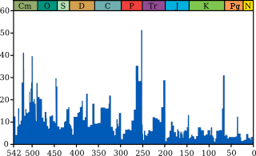

# Grafikten Veri Cikartmak

Bazen mesela grafiksel gördüğümüz bir zaman serisinin verisi elde
olmayabilir. Veriyi grafikten çıkartmak için, örneğe bakalım

Veriyi sayısal olarak çıkartmak için imaj işleme (image processing)
metotlarını kullanabiliriz. Mesela bir metot yanyana iki pikselin
farkını hesaplar, eğer fark büyükse orada bir "kenar" vardır. Bu
teknikle yukarıdaki imajdaki eğri bulunabilir.

Ana imaj

https://en.wikipedia.org/wiki/File:Extinction_intensity.svg

PGM'e cevirelim

```
convert -crop 495x245+29+54 -resize 900x400 Extinction_intensity.svg  extinct.pgm
```

Imaj isleme kodu

```python
import pandas as pd
from PIL import Image

im2=Image.open("extinct.pgm")
grady,gradx = np.gradient(im2)
grady = (grady>0).astype(float)
extin = np.argmax(grady,axis=0)
df = pd.DataFrame(extin)
df2 = df.max()-df
mymin = 1.
mymax = 52. - mymin
df3 = df2 / df2.max() * mymax
df3 = df3 + mymin
idx = np.linspace(542,1,len(df3))
df4 = df3.set_index(idx)
df4[0].to_csv('extinct.csv',header=None,index=None)

ext = pd.DataFrame(pd.read_csv('extinct.csv',header=None))
ext = ext.set_index(np.linspace(542,1,len(ext)))
ext[0].plot()
ext = ext[0]
plt.savefig('ex1.png')
```




