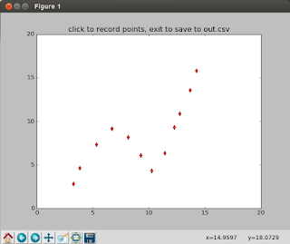

# Tıklamaları Örnek Veriye Çevirmek

Bazen belli bir şekilde olan veri noktalarını kabaca tıklayarak
üretmek gerekebilir, bu noktaları metin editör içinde yazmak zor olur,
görsel yaklaşım tercih edilebilir. Bu işi yapacak basit bir Python
programı altta

```python
import pandas as pd
from matplotlib import pyplot as plt

class PointRec:
    def __init__(self, line, ax, fig):
        self.line = line
        self.ax = ax
        self.fig = fig
        self.xs = list(line.get_xdata())
        self.ys = list(line.get_ydata())
        self.cid = line.figure.canvas.mpl_connect('button_press_event', self)

    def __call__(self, event):
        if event.inaxes!=self.line.axes: return
        self.xs.append(event.xdata)
        self.ys.append(event.ydata)
        self.ax.plot(event.xdata, event.ydata,'rd')
        self.fig.canvas.draw()

fig = plt.figure()
ax = fig.add_subplot(111)
ax.set_xlim(0, 20);ax.set_ylim(0, 20)
ax.set_title('click to record points, exit to save to out.csv')
line, = ax.plot([0], [0])  
rec = PointRec(line,ax,fig)

plt.show()

df = pd.DataFrame([rec.xs, rec.ys]).T
df.columns = ['x','y']
df.to_csv("out.csv",index=None)
```

Program tıklamaları hafızada biriktirerek tutar, ve program
kapatıldığında veriyi `out.csv` dosyasına yazar.



Anahtar kelimeler: click, onclick, sample data, ornek veri, uretmek


