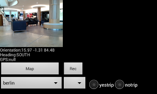

# Algılayıcı Ölçümleri, Video, Android, GPS, Haritalama

İki uygulama: Birincisi cep telefonunda nerede olduğumuzu harita
üzerinde bulmak, algılayıcı, GPS değerlerini kaydetmek için. Diğeri
hızlı frekansta ivmeölçer (acceloremeter), GPS kaydeder.

https://github.com/burakbayramli/classnotes/tree/master/sk/2017/02/sensorcam

1) uygulama kamera görüntüleri, yön algılayıcısı, GPS verilerini
kaydetme özelliği var. Uygulama başka bir proje için veri kaydı, test
etme ve sonradan analiz amaçlı yazildi, başlangıç noktası olarak
faydalı olabilir. Harita gösteren kodun zoom özelliği var, sağa, sola,
yukarı, aşağı kaydırma hareketi ile doğu, batı, vs. yönündeki diğer
haritaları da görmek mümkün.

https://github.com/burakbayramli/kod/tree/master/sensorcam/cam

Uygulama tüm bir şehrin haritasını tek bir zip dosyasında tutar, başka
hiçbir veriye, ya da Google Maps bağlantısına ihtiyaç yok. Haritalama
uygulaması böyle çalışmalı; Internet bağlantısı olmayınca harita
çalışmazsa bu iyi olmaz, turist, gezgin yolda kalır. "Merkezle" fazla
bağlantı iyi bir şey değil, sağlam bilgi işlem sistemleri de bu
mantıkla kurulur.

Derlemek için ant yeterli, ant debug, ant installd, ya da ant release
ile apk yaratılır.

Robotik hedefleri (dış dünyada bağımsız gezinebilen yapay zeka
uygulamaları) için ölçüm toplama bağlamında faydalı olabilir.

Kamera resimleri, yön algılayıcısı (orientation sensor), GPS
değerleri, ivme algılayıcı (accelerometer) belli aralıklarla
biriktirir, ve istendiği anda (Rec düğmesine basılınca) sonuçları
telefon dizinine kaydeder. Dosya SDCARD/Bass altında bir numaralı
dizindir, her Rec sonrası yeni bir dizin yaratılır. Böylece birkaç
ölçümü arka arkaya kaydetmek mümkün olur.

Her ölçüm ayrı bir txt dosyasında, analiz amacıyla bu dosyaları USB
ile dizüstüne aktarilabilir. Her veri dosyasındaki satır sayısı ve
kameranın kaydettiği tek resim (frame) sayısı birbiriyle aynı, yani
eğer ivme algılayıcından 20 satır kaydedildiyse, yön algılayıcısından
da 20 satır kaydedilmiş demektir, ve her satırın zaman indisi
birbiriyle eşittir. Yani herhangi bir zaman anında tüm
algılayıcılardan alınan veri aynı anda bellege alınır. Böylece
sonradan analiz sırasında odaklanan zaman diliminde tüm ölçümlerin
hangi seviyede olduğu bilinebilir.

Uygulama içinde ve eğer GPS bağlantısı kurulduysa Map düğmesine
basılarak o anda olunan yerin haritası alınabilir. Haritalar bir zip
dosyası içinde.

Kamera kalibrasyonu hakkındaki bir yazı aynı bağlantıdan erisilebilir.

Steps adlı 2. uygulama adım sayısı ölçme, yürüyüş yönü saptaması için
gereken ölçümleri çok daha hızlı frekansta kaydeder.

https://github.com/burakbayramli/kod/tree/master/sensorcam/steps

Sigma Bazlı Kalman Filtreleri (Unscented Kalman Filter) Java kodları

https://github.com/burakbayramli/kod/tree/master/sensorcam/ukf

