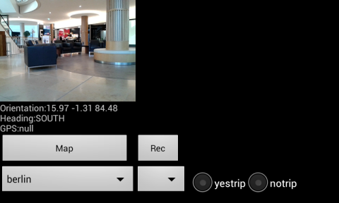

TR

Iki proje var. Birincisi [cam](cam), Kamera resimlerini, yön
algılayıcısı (orientation sensor), GPS, ivme algılayıcı
(accelerometer) değerlerini belli aralıklarla biriktirir, ve istendiği
anda (Rec düğmesine basarak) sonuçları telefon dizinine
kaydeder. Dosyalar `SDCARD/Bass` altında bir numaralı dizindedir, her
Rec sonrası yeni bir dizin yaratılır. Böylece birkaç ölçümü arka
arkaya kaydetmek mümkün olur.

Her ölçüm için ayrı bir txt dosyası var, analiz amacıyla bu dosyaları
USB ile dizüstüne aktarmak yeterli. Her veri dosyasındaki satır sayısı
ve kameranın kaydettiği tek resim (frame) sayısı birbiriyle aynı, yani
eğer ivme algılayıcından 20 satır kaydedildiyse, yön algılayıcısından
da 20 satır kaydedilmiş demektir, ve her satırın zaman indisi
birbiriyle eşittir.  Yani herhangi bir zaman anında tüm
algılayıcılardan alınan veri aynı anda bellege alınır. Böylece
sonradan analiz sırasında odaklanan zaman diliminde tüm ölçümlerin
hangi seviyede olduğu bilinebilir.

[Haritalama](scripts/map.md)

Kameranın kaydettiği video'nun herhangi bir zaman dilimindeki tek
resmini elde etmek, resim işlemek, kalibrasyon ve ilgili diğer
bilgilere erişmek icin örnek kodlar [şurada](scripts/data.md).

Telefonun duruşunu, yere, kuzeye göre dönüş açılarını (rotation)
`rotations.txt` adlı bir dosya içine yazıyoruz. Bu dönüşler hakkında ek
bilgi [şurada](scripts/rotations.md).

İkinci proje [steps](steps). İvmeölçer, kameranın duruşunu çok daha
hızlı kaydeder, ayrıca `steps` için aynı sayıda kayıt satırı tutma
şartı yok - ana ivmeölçer 200 satır kaydetmiş, lineer ivmeölçer 80
satır kaydetmiş olabilir, birbirine yakın zamandaki kayıtların zaman
mührü birbirine eşit olacaktır ama bunun haricinde bir eşitlik
yok. GPS de kaydedilir. Çıktı dosyası `SDCARD/Steps` altında.

Filtreleme

Sigma Bazlı Kalman Filtreleri (Unscented Kalman Filter) Java kodları
[ukf](ukf) dizininde.

English

Two projects. First is [cam](cam), example of how to use Android
camera, recording of orientation sensor, GPS, and camera frames. We
skip some frames for performance / storage reasons, and the unit of
storage for all recording is the frame. Whenever a frame is recorded,
orientation, GPS will be recorded along with it.

The data files are dumped under `SDCARD/Bass` folder (when Rec is
pressed), which can be taken transferred to a notebook for
analysis. Make sure to create this folder first.

There is also offline mapping support, see the sample zip data file
above. Simply drop this file under `SDCARD/Bass`.

The camera, preview code is based on

http://ibuzzlog.blogspot.tw/2012/08/how-to-use-camera-in-android.html

Zoomable map viewer is based on

https://github.com/MikeOrtiz/TouchImageView/blob/master/src/com/ortiz/touch/TouchImageView.java

The other project is [steps](steps) which records sensor data much
faster, it does not try to maintain an equal number of records for all
sensors, it tries to keep timestamp equality accross all sensor data
points though, so at if there is an event time=111111, it will be
recorded at that timestamp value. It also records GPS. The output goes
under `SDCARD/Steps`.

