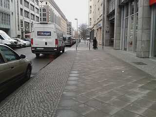
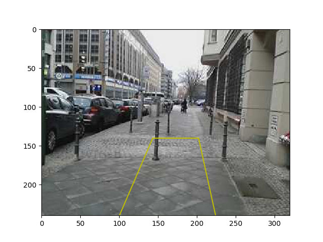
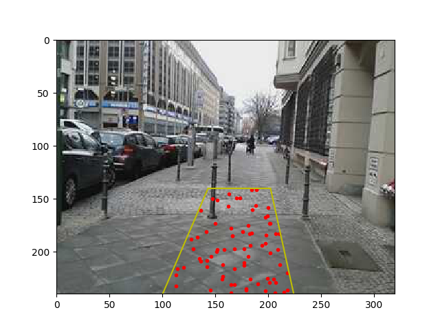
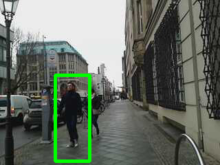
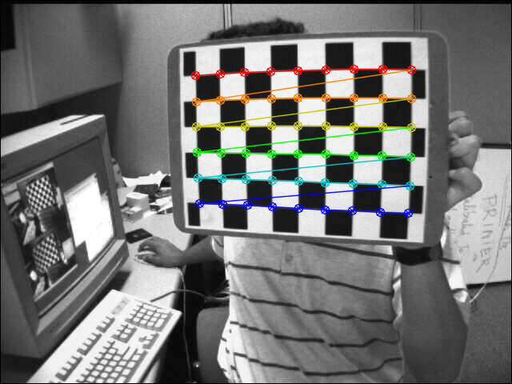
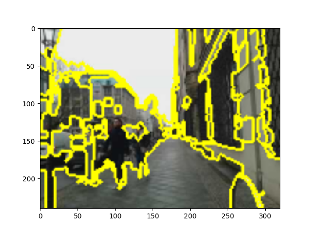

## Veri İşlemek

Telefon tarafından toplanan verileri nasıl kullanırız? 

```python
import pandas as pd

dir = "./data/mitte4/"
data = np.fromfile(dir + "cam.bin", dtype=np.uint8)
df = pd.read_csv(dir + "sizes.txt",header=None)
df['cum'] = df.cumsum()
df['cum2'] = df.cum.shift(-1)
df.columns = ['x','fr','to']
```

Herhangi bir video karesini çekip çıkarmak


```python
import io
from PIL import Image
frame = 30
arr = data[int(df.ix[frame]['fr']) : int(df.ix[frame]['to'])]
im = Image.open(io.BytesIO(arr))
im.save('out1.png')
```



Herhangi zaman anında gittiğimiz yön,

```python
dforient = pd.read_csv(dir + "orientations.txt",header=None,sep=' ')
frame = 50
print str(dforient.ix[frame][1])[:6] + " " + \
      str(dforient.ix[frame][2])[:6] + " " + \
      str(dforient.ix[frame][3])[:6] + " ",
```

```text
334.46 0.8803 84.372 
```

GPS

```python
dfgps = pd.read_csv(dir + "gps.txt",header=None,sep=",",\
                    names=['lat','lon','speed','acc','alt'])
print str(dfgps.ix[frame][0])[:6] + " " + \
      str(dfgps.ix[frame][1])[:6] + " " + \
      str(dfgps.ix[frame][2])[:6] + "   " 
```

```text
52.511 13.390 0.6519   
```

Dört köşesi üzerinden belirtilen bir dörtgeni ekrana basmak.

```python
import util
im = util.get_frame(dir, 105)
quad = np.array([[100,0],[143,100.],[202,100],[224,0]])
h = np.array(im).shape[0]
util.plot_quad(quad, h, 'y')
plt.imshow(im)
plt.savefig('out2.png')
```




Bazen bu dörtgenin içindeki pikselleri bulmak gerekebilir. Fakat tüm
pikselleri de bulmak fazla yük getirebilir, 100x100 boyutundaki "ufak"
bir dörtgen içinde bile 10000 piksel vardır, ki üç boyutlu HSV ya da
RGB için 30000 veri noktasından bahsediyoruz, en iyisi resim
kordinatları içinde tanımlı birörnek (uniform) bir dağılımdan sayılar
(kordinatlar) örneklemek, bu kordinatlardan dörtgen içine düşenleri
bulmak, ve boylece daha az sayıdaki kordinat kullanmak.

```python
np.random.seed(1)
N = 1000 # orneklenen kordinat sayisi
random_points = np.random.uniform(0, 320, (N, 2)).astype(np.int)
random_points = random_points[random_points[:,1] < 240]
mask = np.array([util.inside_quad(quad, p)[0] for p in random_points])
plt.plot(random_points[mask][:,0], h-random_points[mask][:,1], 'r.')
util.plot_quad(quad, h, 'y')
plt.imshow(im)
plt.savefig('out3.png')
```



Dörtgen içindeki kordinatların renk değerlerini alıp tüm bu değerlerin
histogramını hesaplayabiliriz.


```python
bins=(8, 8, 8)
nim = np.array(im)
nim_quad = nim[random_points[mask][:,1],random_points[mask][:,0]]
H, edges = np.histogramdd(nim_quad, bins=bins, normed=True, range=[(0,255),(0,255),(0,255)])
print 'H', H.shape, 'edges', len(edges)
```

```text
H (8, 8, 8) edges 3
```

Bu histogram çok boyutlu, yani üç boyutlu HSV verisi üzerinde (8,8,8)
kutuları yarattık, yani elimizde şimdi 8*8*8 tane kutu var. Bildiğimiz
gibi bir histogram bir olasılıksal dağılımı ayrıksal olarak temsil
eder. O zaman bu dağılıma herhangi bir HSV değerinin ne kadar olası olduğunu
"sorabiliriz". 

```python
def eval(x, H, edges):
    i=np.argmax(x[0]<edges[0])
    j=np.argmax(x[1]<edges[1])
    k=np.argmax(x[2]<edges[2])
    return H[i-1,j-1,k-1]

print eval([156,17,191], H, edges)
```

```text
1.23512073034e-06
```

## OpenCv

Daha bitmedi (!). Eger video kareleri uzerinde OpenCV kullanmak
istersek, mesela alttaki gayet basit bir gosterim kodu,

```python
import time, io, cv2
import numpy as np
from PIL import Image, ImageDraw
import util

dir = "./data/mitte4/"
for frame in range(100,150):
    im = np.array(util.get_frame(dir, frame, hsv=False))
    im2 = cv2.cvtColor(im, cv2.COLOR_RGB2BGR)
    cv2.imshow('frame',im2)
    k = cv2.waitKey(100)
```

Görüldüğü gibi bazı dönüşümler gerekti, kaydedilen görüntü RGB, fakat
OpenCV'nin ekrana basma kodu BGR istiyor. 

Video [stabilize
etmek](http://sayilarvekuramlar.blogspot.co.uk/2015/12/coklu-baks-ac-geometrisi-multiple-view.html)
istersek, şu ekleri yaparız,

```python
..
vs = util.VS()
for frame in ...
    im = np.array(util.get_frame(dir, frame, hsv=False))
    im2 = cv2.cvtColor(im, cv2.COLOR_RGB2BGR)
    im3 = vs.stabilize(im2)
    cv2.imshow('frame',im3)
    ...    
```

İşletip sonuçları görebiliriz.

Tek imajlar üzerinde, mesela kişi (ya da dik duran objeler) bulmak,

```python
import time, io, cv2
import numpy as np
from PIL import Image, ImageDraw
import util

def draw_detections(img, rects, thickness = 1):
    for x, y, w, h in rects:
        pad_w, pad_h = int(0.15*w), int(0.05*h)
        cv2.rectangle(img, (x+pad_w, y+pad_h), (x+w-pad_w, y+h-pad_h), (0, 255, 0), thickness)

frame = 195
im = np.array(util.get_frame(dir, frame, hsv=False))
im2 = cv2.cvtColor(im, cv2.COLOR_RGB2BGR)
hog = cv2.HOGDescriptor()
hog.setSVMDetector( cv2.HOGDescriptor_getDefaultPeopleDetector() )
found, w = hog.detectMultiScale(im2, winStride=(8,8), padding=(32,32), scale=1.05)
found_filtered = []
for ri, r in enumerate(found):
    for qi, q in enumerate(found):
        if ri != qi and inside(r, q):
            break
    else:
        found_filtered.append(r)
draw_detections(im2, found)
draw_detections(im2, found_filtered, 3)
cv2.imwrite('out4.png', im2)
```




Kamera Kalibrasyonu

Kameranın içsel parametrelerini (intrinsic matrix) bilmek 3 boyutta
tekrar oluşturma gibi pek çok uygulamada faydalıdır. Kalibrasyon
sonucu olarak bize bir matris verilecek, bu matrisin içeriği hakkında
anlatım bizim *Yapay Görüş* notlarımızda ya da
[şurada](http://docs.opencv.org/trunk/dc/dbb/tutorial_py_calibration.html)
bulunabilir.

Kalibrasyon için içinde bir satranç tahtası resmi olan birkaç tane
resim lazım. OpenCV dizini altında verilen örneklerden bir tanesine
bakalım, ve köşelerini otomatik olarak gösterelim,

```python
import numpy as np
import cv2
size = (9,6)
dir = '/home/burak/Downloads/opencv-master/samples/data'
img = cv2.imread(dir + "/left01.jpg")
cv2.imwrite('out5.png', img)
found, corners = cv2.findChessboardCorners(img, pattern_size)
cv2.drawChessboardCorners(img, size, corners, found)
cv2.imwrite('out6.png', img)
```


Kaç köşe olduğu `size` içinde. Köşeleri bulunca



Birden fazla imajla köşeleri bulup kalibre etmek

```python
def get_sample(filename, iscolor = cv2.IMREAD_COLOR):
    with open(dir + "/" + filename, 'rb') as f:
        filedata = f.read()
        return cv2.imdecode(np.fromstring(filedata, dtype=np.uint8), iscolor)

img_names = ['left01.jpg','left02.jpg', 'left03.jpg', 'left04.jpg',
             'left05.jpg', 'left06.jpg', 'left07.jpg', 'left08.jpg',
             'left09.jpg', 'left11.jpg', 'left12.jpg', 'left13.jpg',
             'left14.jpg']
    
square_size = 1.0
pattern_size = (9, 6)
pattern_points = np.zeros((np.prod(pattern_size), 3), np.float32)
pattern_points[:, :2] = np.indices(pattern_size).T.reshape(-1, 2)
pattern_points *= square_size

obj_points = []; img_points = []
h, w = 0, 0
img_names_undistort = []

for fn in img_names:
    img = get_sample(fn, 0)
    if img is None: continue
    h, w = img.shape[:2]
    found, corners = cv2.findChessboardCorners(img, pattern_size)
    if found:
        term = (cv2.TERM_CRITERIA_EPS + cv2.TERM_CRITERIA_COUNT, 30, 0.1)
        cv2.cornerSubPix(img, corners, (5, 5), (-1, -1), term)
    if not found: continue
    img_points.append(corners.reshape(-1, 2))
    obj_points.append(pattern_points)

rms, camera_matrix, dist_coefs, rvecs, tvecs = cv2.calibrateCamera(obj_points, img_points, (w, h), None, None, flags = 0)
print (dist_coefs)
print (camera_matrix)
```

```text
[[ -2.81086258e-01   2.72581009e-02   1.21665908e-03  -1.34204274e-04
    1.58514023e-01]]
[[ 532.79536562    0.          342.45825163]
 [   0.          532.91928338  233.90060514]
 [   0.            0.            1.        ]]
```

Bir satranç karesinin kenarının büyüklüğü için `square_size`
parametresine kesin bir ölçüm de verilebilir, mesela 30 milimetre için
30 gibi, o zaman hesaplanan kamera matrisiyle yapılan ölçümler gerçek
dünya ölçümleri verirler. Üstte 1 verilmiş, o zaman takip eden
hesaplar bize "satranç tahtası kare kenarı" biriminde sonuçlar
verir. Mesela bir hesap bize "bir obje 10 yüksekliğinde" diyorsa bu
"10 satranç kare kenarı yüksekliğinde" demek olacak.

Imajı Bölümlere Ayırma (Segmentation)

*Bilgisayar Bilimi, Felzenswalb Gruplaması* ders notlarımızda işlenen
çizit teorisini temel alan imaj bölümlere ayırma algoritması
`scikit-image` kütüphanesinde kodlanmış. Örnek altta,

```python
from skimage.segmentation import felzenszwalb
from skimage.segmentation import mark_boundaries
import util, cv2
dir = "./data/mitte4/"
frame = 195
im = np.array(util.get_frame(dir, frame, hsv=False))
im2 =cv2.resize(im,(160,120))
segments = felzenszwalb(im2, scale=500, sigma=0.5, min_size=20)
im3 = mark_boundaries(im2, segments)
im4 =cv2.resize(im3,(320,240))
plt.imshow(im4)
plt.savefig('out7.png')
```



Demo amaçlı olarak `mark_boundaries` çağrısı verilmiş, daha detaylı
piksel bazlı bölüm bilgisi `segments` içinde;

```python
print segments.shape
print 'bolum', segments[117,155]
```

```text
(120, 160)
bolum 7
```

Yani (117,155) pikseli 7. bölüme aitmiş. Eğer bu bölümdeki tüm
pikselleri istersem,

```python
print segments == 7
```

```text
[[False False False ..., False False False]
 [False False False ..., False False False]
 [False False False ..., False False False]
 ..., 
 [False False False ...,  True  True  True]
 [False False False ...,  True  True  True]
 [False False False ...,  True  True  True]]
```

gibi bir filtreleme matrisi, "maske (mask)" elde ederim, bu filtre ile
gereken diğer bilgilere erişebiliriz.

Felzenszwalb yöntemi görütü bölümlemesi bağlamında optimal; dışarıdan
tanımlanan parametreler için en optimal olan ayrımı buluyor. İşlem
karmaşıklığı O(N log N), yani lineere yakın, bu hızda video bile
işlenebilir. Tabii daha fazlası için, yani anlamsal olarak gruplama
için sadece imaj bilgisinden daha fazlası gerekebilir. Mesela bir
portrede bölümleme yapınca yüz ayrı saç ayrı olabilir, fakat burada
tüm kafayı illa ayrı bir bölüm olarak istiyorsak, bu anlamsal bir
gruplama demektir, o zaman görüntü hakkında bir önbilgi gerekecektir
(gerçi parametre ayarları ile tüm kafanın da kapsanması mümkün
olabilir).

Yardımcı kodlar [şurada](util.py).


