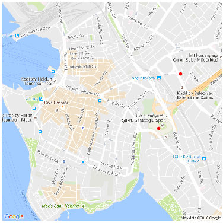

# Haritalama

Uygulama içinde ve eğer GPS bağlantısı kurulduysa Map düğmesine
basılarak o anda olunan yerin haritası alınabilir. Haritalar bir zip
dosyası içinde, örnek haritalar nomadicterrain/map/README.md icinde
zip dosya baglantilarinda. 

Bu dosyaları `SDCARD/Bass` dizini altına kopyalamak yeterli, dosyalara
işaret eden menü seçenekleri kodun içinde. Daha fazla harita eklemek
isteyenler kodda değişim yapmalı.

Dosya içindeki harita parçaları png dosyaları olarak kayıtlı, hangi
GPS kordinatının haritası oldukları dosya isminde kodlanmış halde,
kordinat haritanın orta noktasıdır.

Android / Java tekniği olarak faydalı olabilecek bazı kod bölümleri:

- ZIP içinden dosya okumak: Tüm haritalar zip içinde, zip içine bakıp
  oradaki dosya isimlerini almak, sonra istenilen tek dosyayı okuma
  tekniği var.

- Düzenli İfadeler (Regex): Harita orta noktası kordinatı harita dosya
  isminde kodlu olduğu için kordinatın geri alınması dosya ismini
  regex ile tarayıp içinden GPS enlem, boylam verisini almakla
  oluyor. Dosya isminde kordinat kodlama basitlik amaçlı yapıldı, eğer
  ayrı bir metin dosyasında kayıt olsaydı idare etmek zorlaşırdı. Ana
  amaç her zaman kod (veri) idaresinde kolaylık.

Haritalari nasil aldik? Google'in statik harita imajlari indirmek icin
guzel bir API'si var, "Static Maps API" deniyor.

https://developers.google.com/maps/documentation/static-maps/

Bu APİ'yi kullanmak için bir API anahtarı yaratmak lazım, "Get Key"
ile bu yapılabilir (bir proje ile alakalandırmak gerekiyor, bu proje

https://console.cloud.google.com

üzerinden yaratılabilir.

API alındıktan sonra, iki enlem/boylam arasına düşen tüm bölgeyi bir
dörtgen parçalara ayırabiliriz, ve bu parçaların köşe noktalarındaki
enlem/boylam merkezli belli büyüklükteki haritaları teker teker
indiririz. Alttaki örnek İstanbul'daki iki kordinat arasını 2x2 yani 4
bölgeye bölüyor, ve haritaları indiriyor (önce `istanbul` adında bir
alt dizin yaratın).


```python
import itertools, time
import pandas as pd, time
import numpy as np
import matplotlib.pyplot as plt
from math import sin, cos, sqrt, atan2, radians
from io import BytesIO
import Image, urllib, os.path

def get_map(lat, lon, region, zoom):
    api = "[API ANAHTARI BURAYA]"
    url = "http://maps.googleapis.com/maps/api/staticmap?center=" + \
    	  "%f,%f&size=800x800&zoom=%d&key=%s" % (lat,lon,zoom,api)
    print url
    lats = str(lat).replace(".","_")
    lons = str(lon).replace(".","_")
    fout = "%s/%s_map_%s_%s.png" % (region,region,lats,lons)
    if os.path.isfile(fout):
        print "Already downloaded..."
        return False
    buffer = BytesIO(urllib.urlopen(url).read())
    image = Image.open(buffer)
    image.save(fout)
    return True
    
def get_maps(c1,c2,px,py,region,zoom=15):    
    a= np.linspace(min(c1[0],c2[0]), max(c1[0],c2[0]), px)
    b= np.linspace(min(c1[1],c2[1]), max(c1[1],c2[1]), py)
    aa,bb = np.meshgrid(a,b)
    for x,y in itertools.izip(aa.flatten(),bb.flatten()):
        if get_map(x,y,region,zoom) == False: continue


if __name__ == "__main__":     
    c1 = (41.061257, 28.99161); c2 = (41.068375, 28.998614)
    get_maps(c1,c2,2,2,region="istanbul")

```

Haritayı Dizüstünde Kullanmak

Geliştirme ortamında üstteki uygulamanın kullandığı aynı harita, zip
dosyalarını üzerinden herhangi bir enlem / boylamı harita üzerinde
göstermek için kullanılabilir. Örnek olarak 40.987659,29.036428,
diğeri bir restoran 40.992186,29.039228. Grafik altta,

```python
import pandas as pd, io
from PIL import Image
import os, glob, re, zipfile
import pandas as pd
import numpy as np
import matplotlib.pyplot as plt

# enlem/boylam ve pikseller arasinda gecis icin
SCALEX = 23000. 
SCALEY = -35000.

def plot(res4,outfile):
    """
    Birinci noktayi baz alarak gerekli harita inajini bul, ve diger
    tum noktalari bu harita uzerinde grafikle
    """
    dir = '/home/burak/Documents/Dropbox/Public/data/'
    zfile = dir + 'istanbul.zip'
    imgcoord = []
    with zipfile.ZipFile(zfile, 'r') as z:
        for f in z.namelist():
            # the lat/lon middle of the map is encoded in the map's
            # filename 
            tmp = re.findall("map_(-*\d+)_(\d+)_(-*\d+)_(\d+)",f,re.DOTALL)[0]
            imgcoord.append([float(tmp[0] + "." + tmp[1]), float(tmp[2] + "." + tmp[3]), f])
    imgcoord2 = pd.DataFrame(imgcoord,columns=['lat','lon','file'])
    
    dists = imgcoord2.apply(lambda x: np.sqrt((x['lat']-res4[0][0])**2 + (x['lon']-res4[0][1])**2), axis=1)
    print dists.argmin()
    # the closest map is picked
    found = imgcoord2.ix[dists.argmin()]
    print found.file
    mapcenter = np.array(found[['lat','lon']])
    print mapcenter
    
    with zipfile.ZipFile(zfile, 'r') as z:
         im = Image.open(z.open(found.file))
         nim = np.array(im)
         c = nim.shape[0] / 2, nim.shape[0] / 2
         plt.axis('off')
         fig=plt.imshow(im)
         fig.axes.get_xaxis().set_visible(False)
         fig.axes.get_yaxis().set_visible(False)
         plt.imshow(im)
         for [lat,lon] in res4:
             dx,dy=((lon-mapcenter[1])*SCALEX,(lat-mapcenter[0])*SCALEY)
             xx = c[0]+dx
             yy = c[1]+dy
             if xx > nim.shape[0] or yy > nim.shape[1] or xx<0 or yy<0: continue
             plt.plot(xx,yy,'r.')
             plt.hold(True)                          
         plt.savefig(outfile, bbox_inches='tight', pad_inches = 0)


pts = np.array([[40.987659,29.036428],[40.992186,29.039228]])
plot(pts,'istanbul.png')
```

```text
151
istanbul_map_40_9890312632_29_0305433684.png
[40.989031263199998 29.0305433684]
```



## Diger Olcekler

Alttaki kullanımda Google Static Map API'sinin daha açık bir
kullanımını görelim, üstte zip dosyasından haritaları aldık, şimdi
direk Google'dan alalım, kaydedelim, ve o harita üzerinde ek
grafiklemeler yapalım.

```python
import pandas as pd, time
import numpy as np
import matplotlib.pyplot as plt
from math import sin, cos, sqrt, atan2, radians
from io import BytesIO
import Image, urllib, os.path

def get_map(center_lat, center_lon, marker_lat, marker_lon, region):
    zoom = 18
    api = "[API ANAHTARI BURAYA]"
    url = "http://maps.googleapis.com/maps/api/staticmap?center=" + \
    	  "%f,%f&size=800x800&zoom=%d&key=%s" % (center_lat,center_lon,zoom,api)
    url += "&markers="
    url += str(marker_lat) + "," + str(marker_lon)
    lats = str(center_lat).replace(".","_")
    lons = str(center_lon).replace(".","_")
    fout = "%s_%s_%s.png" % (region,lats,lons)
    buffer = BytesIO(urllib.urlopen(url).read())
    image = Image.open(buffer)
    image.save(fout)
    return fout

fout = get_map(40.977857, 29.089380, 40.977257, 29.089080, "ist")
print fout
```

```text
ist_40_977857_29_08938.png
```


Fonksiyona harita merkezinin kordinatı, tek bir işaret için (marker)
bir kordinat geçtik, ayrıca harita dosya isimlendirmesi için ek bir
parametre verdik. Aslında birden fazla işaret `markers` ile GM'den
istenebilir, fakat işaretleme işlemini haritayı aldıktan sonra bizim
çevrimdışı ortamda kendimizin yapabilmesi daha iyi olur, grafikleme
rutinleri kullanarak her türlü ek çizimi hızlı bir şekilde
yapabiliriz. GM'ye tek işaret yaptırıyoruz, kontrol amaçlı olarak.

Alttaki kodda verili kordinat listesini bir çizgi olarak nasıl
birleştirip grafikleyebiliriz bunu görüyoruz.

```python
from PIL import Image, ImageDraw, ImageFont
import re

def plot_line(mapfile, pts):
    SCALEX = 1.8e5; SCALEY = -2.5e5
    tmp = re.findall("(-*\d+)_(\d+)_(-*\d+)_(\d+)",mapfile,re.DOTALL)[0]
    nim = Image.open(mapfile)
    w,h = np.array(nim).shape
    c = (w/2,h/2)
    center_lat = float(tmp[0] + "." + tmp[1])
    center_lon = float(tmp[2] + "." + tmp[3])
    line = []
    for i,pt in enumerate(pts):
    	dx,dy=((pt[1]-center_lon)*SCALEX,(pt[0]-center_lat)*SCALEY)
    	line.append((c[0]+dx,c[1]+dy))
    d = ImageDraw.Draw(nim)
    d.line(line)
    nim.save('map1.png')
    
pts = [[40.977257, 29.089080], [40.977357, 29.089080], [40.977657, 29.089080],
       [40.977657, 29.089180], [40.977657, 29.089480], [40.977657, 29.089880],
       ]
plot_line(fout, pts)
```


Harita merkezi kordinatını harita dosya isminde kodladık, böylece
merkezin kaybolması mümkün değil, istediğimiz an bu bilgiyi
alabiliriz. Grafikleme için enlem/boylam kordinatlarının bu merkezden
olan farklarını bir piksel farkı ile çarpıyoruz, `SCALEX,SCALEY`
sabitleri bu işi hallediyor. Bu değerler deneme / yanılma ile bulundu,
farklı GM odaklama seviyesine göre farklı olacaklardır. 

Üstteki fonksiyonda çizgi için `ImageDraw.Draw.line` çağrısını
kullandık, `ImageDraw.Draw`'ın ek bazı çağrıları var, tek nokta, harf,
sayı, vs. pek çok ek grafikleme farklı renklerde bu çağrılar ile
yapılabilir.


