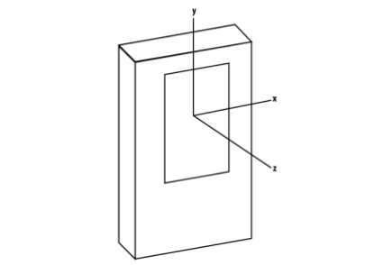

Android telefonun eksenleri şöyledir,



`orientations.txt` icinde x,y,z eksenleri sırasıyla 1,2,3 değerleri
içinde.

Eğer yeryüzüne göre telefonun nasıl durduğunu bulmak istiyorsak,
`SensorManager.getRotationMatrix()` kullanabiliriz. Bu algılayıcı bir
"türevsel" algılayıcı, yani aslında kendisi bir donanım değil ama
diğer donanımlardan gelen verileri birleştiriyor. Bu türevsel
algılayıcının birleştirdikleri ivmesel ve manyetik
algılayıcılar. İvmesel algılayıcıdan (acceloremeter) mesela yer
çekiminin telefonun duruşuna göre hangi yönde olduğu bilgisi gelir,
manyetik algılayıcı (magnetometer) kuzeyin hangi yönde olduğunu
gösterir, yani telefonun o andaki duruşunun global kordinatlara göre
net bir hesabını bu çağrıdan alabiliriz.


Bu ikisini birleştiren `SensorManager.getRotationMatrix()` bize her
telefon ekseninin yeryüzü eksenine göre nasıl durduğunu
gösterir. Yeryüzü eksenlerinden biri `x` ekvatora paralel gider
(üstteki resimde tam ekvator üzerinde ama daha kuzeyde, güneyde de
olunca yine oradaki enleme teğet bir çizgi hayal edilebilir). `y` ise
kuzeyi gösteriyor, `z` ise olduğumuz yerden direk gökyüzüne fırlayan
bir çizgi gibi düşünülebilir.

Altta sensorcam kullanarak kaydettiğim değerlerden biri
görülüyor. Telefonun arkasından dışa doğru giden -z yönünün dünyada
nereyi gösterdiğini bulmak için `[0.,0.,-1.]` ile çarpıyorum. Bu değer
ölçülürken telefonu yer düzlemine göre çapraz, ekranı bana dönük ve
yatay halde tutuyordum ve hafif güneydoğuya doğru dönmüş haldeydim.
 
```python
Rs = "0.36073056 0.67114913 -0.6476358 -0.38567874 0.73957986 0.5516099 0.849191 0.050796863 0.5256371"
R = np.array(Rs.split(" ")).astype(float).reshape((3,3))
R = np.array(R)
print R
print np.dot(R, np.array([[0.,0.,-1.]]).T)
```

```text
[[ 0.36073056  0.67114913 -0.6476358 ]
 [-0.38567874  0.73957986  0.5516099 ]
 [ 0.849191    0.05079686  0.5256371 ]]
[[ 0.6476358]
 [-0.5516099]
 [-0.5256371]]
```
Değerler -1,+1 arasında.

Yine aynı yönde, ama bu sefer telefon ekranı alta dönük halde, ve
telefon üstünü direk önüme (yani güneydoğuya) doğru tutuyordum, şimdi
ekran arkası nereyi gösteriyor?

```python
Rs = "0.82920504 0.5577966 0.03580483 0.5570639 -0.82996815 0.028858235 0.045813892 -0.0039838166 -0.9989421"
R = np.array(Rs.split(" ")).astype(float).reshape((3,3))
print np.dot(R, np.array([[0.,0.,-1.]]).T)
```

```text
[[-0.03580483]
 [-0.02885823]
 [ 0.9989421 ]]
```

Üstteki sonuçta telefon `z`'si dünya `z`'si ile aşağı yukarı aynı
yönde.

Kaynaklar

http://stackoverflow.com/questions/11068571/getting-direction-vector-in-android


