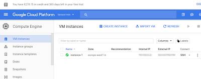
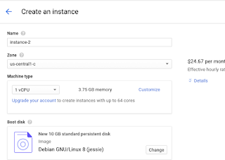

# Bulut Uzerinde Unix: GCloud

Bilgisayarı almak, taşımak, üzerinde işletim sistemi kurmak, sonra onu
İnternet'e açmak için uğraşmak.. Bunlar saç yoldurucu
olabilir. Amazon, Google gibi şirketler bu alanda uzun süredir servis
sağlıyorlar. İnternet üzerinde isteğe göre, istenen hacimde, istenen
işletim sistemini taşıyan bir makinayı yaratmak bulut servisleri ile
çok kolay. Amazon EC2 sisteminden önce bahsetmiştik. Eğer Amazon'un
servisi memnun etmiyorsa, Google seçilebilir. İlk hesap açımında $300
dolarlık hediye de veriyorlar - rekabet güzel şey! Amazon
müşterilerini kendilerine çekmeye uğraşıyorlar.

Bu yazıda komut satırından SSH ile erişilebilecek servis tarzı bir
makina yaratmayı işliyoruz.  Google bu servise "hesaplama motoru
(compute engine -CE-)" diyor. Makina yaratmak için önce hesap açmak
lazım. 

https://cloud.google.com

Kredi kartı, ya da banka bilgileri verildikten sonra (hediye miktarı
tüketilmeden para alınmayacak tabii) giriş tamamlanır. Ardından Google
servislerine komut satırı erişimi sağlayan SDK lazım,  

https://cloud.google.com/sdk/

Linux icin 

https://cloud.google.com/sdk/docs/quickstart-linux

Indirdikten sonra cd google-cloud-sdk, ve ./install.sh. 

Sonra gcloud init ile kurulum tamamlanır, sorulan sorulara evet deyin,
sisteme girme (login) sorusuna evet deyince tarayıcıya
aktarılıyorsunuz, google şifresi ile giriş yapınca bağlantı
kuruluyor. 

Yeni makina yaratmak gcloud komut satırı ile olabilir, ama en rahatı
başta GUI kullanmak. Bir proje yaratılıyor, sonra proje seçiliyor. Ana
konsoldan "Go to compute engine dashboard" ile CE'ye gidiliyor. Burada

Benim daha önce başlattığım makina burada görülüyor. Yeni makina için
"create instance" tıklanır, seçenekler hangi tür işletim sistemi
(bizde Debian), makina donanımı (machine type), belleği, mikroişlemci
sayısı, vs., makinanın hangi bölgede başlatılması istendiği (zone)
seçiliyor. Bölge mesela makina ABD'de mi, Asya'da mı, Avrupa'da mı
başlatılsın? Eğer müşteriye dönük bir uygalama servis edilecekse
müşteriye yakın makinalar daha iyi olur, cevap hızının optimal olması
için. 

Bu seçimler yapılırken sağ yanda tahmini aylık bedel
gösteriliyor. Makina yaratıldıktan sonra iki üstteki resimde SSH
seçeneği var, bu seçenekten "view gcloud command" ile bağlanmak için
gereken gcloud komut satırı komutu gösteriliyor. Bunu kopyala,
yapıştır ile yerel makinamizin Unix konsoluna verip, buluttaki
makinamiza ilk girişi yapabiliriz. 

Makinaların ana diski kalıcıdır (persistent), yani makinayı kapatıp
açınca disk üzerine yazılmış şeyler hatırlanır. Tabii sanal makina
silinirse, dosyalar da silinecektir. 


CE makinalarına statik IP adresi atanması mümkün, yani bu makina
üzerinde Web servisi (apache gibi) başlatılınca makina o IP üzerinden
erişilebilir hale gelir. DNS ile isim eşlemesi yapılınca, Google
bulutu üzerinden tam işlevli Web servisi sunmak mümkün olur.

Disk Eklemek

Bir makinayi yaratirken ek disk eklemeyi secebiliriz, bu diskin
olcegini de istedigimiz gibi ayarlariz. Eger disk icerigi bos (blank)
olsun dediysek, o zaman SSH ile giris yaptiktan sonra diski
formatlamiz gerekir. Suradan,

```
sudo lsblk
```

ile disklerin nerede olduguna bakariz, diyelim

```
NAME   MAJ:MIN RM  SIZE RO TYPE MOUNTPOINT
sda      8:0    0   10G  0 disk
|-sda1   8:1    0   10G  0 part /
sdb      8:16   0  200G  0 disk
```

cevabi geldi, ben 200 GB'lik disk eklemistim, sdb altindaymis. Formatlarim,

```
sudo mkfs.ext4 -m 0 -F -E lazy_itable_init=0,lazy_journal_init=0,discard /dev/
```

Simdi diski bir dizin uzerinden monte etmek (mount) lazim. Bir dizin
yaratirim, /mnt/hd2, ve

```
sudo mount -o discard,defaults /dev/sdb /mnt/hd2
```





