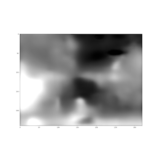
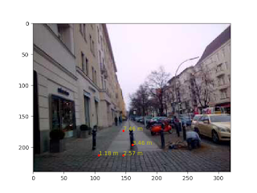

# Derin Öğrenimle 3D Uzaklık Bilgisi, Görüntü Bölümleri Bulmak

DO ile dış dünyadaki objelerin derinliğini, tek kamera kullanarak
ayrıca kameranın hareketini hesaplayabilen bir ağ yapısı surada
paylaşılmış. Yazarlardan biri David Lowe: bu araştırmacı DO'dan önce
de yapay görüş alanında ünlüydü, görüntülerden özellik çıkartmak
(feature extraction) alanında mesela SIFT buluşu vardır... Ilginç bir
hikaye: Lowe SIFT'i keşfeder ama bu keşif hakkındaki yazıyı hiçbir
bilimsel yayın kabul etmez, o da SIFT'i patentler.

Neyse, genç bir diğer bilimci Zhou'nun başlattığı ve diğerlerinin
katıldığı bu en son makalede ilginç bir diğer özellik DO'nun
eğitiminin tamamen denetimsiz (unsupervised) olması, yani veri için
etiket yok. DO hakkında yapılan eleştirilerden biri çok fazla etiketli
veriye ihtiyacı olması, denetimsiz çalışmaması. Bu yaklaşım
denetimsiz, ama aslında dolaylı olarak denetimli, çünkü etiketleri
eğitim sürecinin kendisi üretiyor. Denetimli eğitim bilindiği gibi,
mesela regresyon tekniğinde verili X için bir y'ye bir model
uyduruyoruz, y'ler etiket ya da hedef verileri oluyorlar. DO'lar model
uydurmayı çok boyutlu ve çok daha esnek şekilde yapabiliyorlar.

Denetimsizlik icin etiket üretimi perspektif geometri kullanarak
yapılıyor. Perspektif geometride  bir imajdan diğerine geçerken mesela
kamera duruşunun nasıl değiştiğini biliyorsak 1. imajı yamultup
(warping) 2. imaja çevirebiliriz, ya da ters yönde ters yamultma ile
geriye gidebiliriz. Bunu biliyoruz. Arkadaşlar iki ağ yapısı
kurmuşlar, biri derinlik için diğeri duruş için; Bir video'daki tüm
kareleri işlerken önceki, sonraki, mevcut imaj kullanıp duruş, sonraki
imaj kullanılarak mevcut resimdeki derinlik tahmin edilmeye
uğraşılıyor. Sonra her iki ağın çıktısı kullanılarak önceki imaja
doğru ters yamultma yapıyorsunuz, eğer yamultma iyi olmadıysa önceki
imaja uymayacaktır tabii ki ve bu "hata" bir gradyan inişle her iki ağ
üzerinde düzeltme amaçlı kullanılabilir. Geriye doğru yamultma
işleminin türevi alınabilir halde olması için özen gösterilmiş ki DO
ile eğitim yapılabilsin. Fikir müthiş. Yani perspektif geometri
üzerinden verinin kendisi dolaylı denetimli eğitim sağlamış oluyor. 

Egitim KITTI adli bir veri seti üzerinde yapılmış. KITTI saatlerce bir
arabanın yolda giderken kamerasından kaydedilmiş görüntülerini içerir.

Kod şurada

https://github.com/tinghuiz/SfMLearner

DO için Tensorflow kullanılmış, kurmak için

sudo pip install tensorflow==1.1

Eğitilmiş modeli models/download_model.sh ile indirebiliyoruz. Biz modeli modeli test ettik, şu imaj üzerinde, 

```python
from __future__ import division

import os, time

import numpy as np

import scipy.misc

import tensorflow as tf

from SfMLearner import SfMLearner

from utils import *

import matplotlib.pyplot as plt

mode = 'depth'

img_height=240; img_width=320

ckpt_file = 'models/model-145248'

I = scipy.misc.imread('ins.jpg')

I = scipy.misc.imresize(I, (img_height, img_width))

sfm = SfMLearner(batch_size=1,img_height=img_height, img_width=img_width)

sfm.setup_inference_graph(mode=mode)

saver = tf.train.Saver([var for var in tf.trainable_variables()])

with tf.Session() as sess:

    saver.restore(sess, ckpt_file)

    pred = sfm.inference(I[None,:,:,:], sess, mode=mode))

p = pred['depth'][0,:,:,0]

plt.imshow(normalize_depth_for_display(p))

plt.savefig('out2.png')
```

Sonuç

Daha aydınlık pikseller daha yakın demek. Ortadaki engel açık şekilde
görülüyor. Metre olarak biz bazı seçilmiş pikselleri kontrol ettik, 

Çoğu piksel iyi, alt soldaki daha iyi olabilirdi. Muhakkak bu
yaklaşımda ilerlemeler olacaktır, ayrıca zaten üstteki türden
resimleri kullanarak eğitim yapılsa sonuçlar daha iyi
olabilirdi. Yapılan az buz iş değil; tek resme bakılarak tüm
piksellerin derinlik bilgisini bulmak! 

Peki birkaç resme bakarak (video mesela) o resimlerdeki tüm objeleri
üç boyutta bulmak, takip etmek amacında neredeyiz? Bu bağlamda daha
gidecek yol var. Şimdilik en iyi seçenek DO (ya da diger, mesela
Felzenswalb) kullanarak iki boyutta görüntü bölmesi (segmentation)
yapmak, sonra bu iki boyuttaki görüntü parçalarını 3D takibi yapacak
filtrelere geçmek. Filtreler kalman ya da parçacık filtreleri
olabilir. Takip etme işlemi de zor bir iş yapıyor, bir zorluk takip
edilen objeler görüntüden çıkıyorlar, yeni objeler tekrar
giriyorlar. Bir digeri imaj parçalarının doğru filtre ile eşleşmesi
lazım, bu eşleşmeyi direk yapan yaklaşım var, olasılıksal yapan
yaklaşım var (imaj parçası 'tüm' filtrelere verilir, ama her filtrenin
bir hipoteze bağlı olma olasılığı vardır). Filtrelemede iyi bilinen
bir diğer  numara aynı ölçümün (bu durumda 2D imaj parçası) iki farklı
filtreye verilmesi, mesela bir filtre objenin sola doğru gitmesi, bir
diğeri üzerimize doğru gelmesi. Hangi filtre / hipotezin artığı /
hatası daha az ise, o baskın haldedir, ve onun hipotezi kabul
edilir. Ama arka planda olan filtreye hala ölçüm geçilmeye devam
edilir. Tüm bu işlemlerin pür DO yaklaşımı ile yapılması çok zor.

Pür 2D imaj bölmesinden bahsetmişken, bu alanda DO ile bir diğer
ilerleme SegNet. 

http://mi.eng.cam.ac.uk/projects/segnet/

SegNet anlamsal (semantic) bölme yapıyor, bir görüntüde yol, araba,
direk gibi temel bölümleri bulup onları etiketliyor. 

Microsoft'un COCO veri setini kullanarak (denetimli) şekilde resimde DO ile obje bulma çok ilerledi. COCO verisi etiketli, bol veri var, bir imajdaki objenin nerede olduğunu Amazon'un Mekanik Türk servisi üzerinden gerçek insanlara etiket verdirerek kaydetmişler. Bu yer  bir "maske" üzerinden DO'ya veriliyor, ayrıca ham imaj verisi de sağlanıyor. Bu veriyi kullanan ağ yapısı mesela DeepMask var.

Yaklaşımlar DO etrafında bir "yan sanayi" ya da "paylaşma kültürü"
oluşmaya başladı. Zaten makalelerin neredeyse hepsi artık açık bir
ortam olan arXiv'de yayınlanıyor (para ile makale servisi yapan
şirketler üzerinden değil),  ve DO özelinde ağların kendisi paylaşılıp
direk olduğu gibi kullanılıyor. Mesela obje bulma, görüntü işleme
yapan DO'lar imajın tamamını sınıflama amaçlı hazırlanmış VGG-16
modelini baz alıyorlar. Ve sadece ağ yapısını değil, eğitilmiş ağın
ağırlıklarını bile olduğu gibi kullananlar var. Bu önceden eğitilmiş
(pre-trained) model kullanma tekniği. Sonra kendi istediği yeni birkaç
katman ekleyebilir, ya da mevcut bir katmanı atıp yerine yenisini
koyabilir, vs. Sonra eğitimi mevcut ağırlıkların olduğu yerden "devam
ettiriyorlar", böylece mevcut modelden faydalanıyorlar.. Bu mantıklı
aslında çünkü VGG-16 imaj sınıflaması için eğitilmiş, o zaman
ağırlıklarının içinde imajı anlaması için gerekli bazı ayarlar oluşmuş
olmalıdır. Takip eden araştırmacılar bu ayarlardan istifade ediyorlar.

Kapatmadan önce bir noktadan daha bahsedelim; DO'nun sadece denetimli
olması bir kısıtlayıcı faktördü fakat bize göre eğer problem alanı
hakkında temel matematik bilgisi devreye sokulabilirse denetimli
problemler denetimsiz hale çevirilebilir. Mesela paylaşılan ilk
makalede bu temel bilgi perspektif geometridir. Arkadaşlar kamera
duruşu, yamultma, homografi, vs. gibi pek çok temel bilgi devreye
sokarak sonuca ulaşmışlar. DO alaninda bazen bir beklenti "pür
pikselleri vereyim her şeyi öğrensin" türünde olabiliyor. Fakat eğer
işimizi kolaylaştıracaksa, "hipotez alanını daralatacaksa" eldeki pek
çok diğer bilgiyi devreye sokabiliriz. Bilimin temeli modellemedir ne
de olsa. Yazının başındaki makalenin yazarlarından Kendall surada
benzer vurguyu yapmış.

EK:

Sehir ici etiketlenmis goruntuler icin Cityscapes veri seti ilginc.





