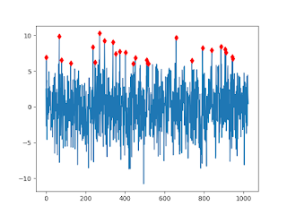

# Zaman Serilerinde Tepe Noktası Bulmak (Peak Detection)

Matlab / Octave kullananlar zaman serisi tepe noktası
analizinde peakutils adlı bir aracı kullanıyorlar. Bu kod Python'a
taşınmış,

https://github.com/atjacobs/PeakUtils

Kod içinden gerekli fonksiyonu çıkarttık,

```python
import numpy as np

def indexes(y, thres, min_dist):
    thres *= np.max(y) - np.min(y)
    dy = np.diff(y)
    peaks = np.where((np.hstack([dy, 0.]) < 0.)
                     & (np.hstack([0., dy]) > 0.)
                     & (y > thres))[0]

    if peaks.size > 1 and min_dist > 1:
        highest = peaks[np.argsort(y[peaks])][::-1]
        rem = np.ones(y.size, dtype=bool)
        rem[peaks] = False

        for peak in highest:
            if not rem[peak]:
                sl = slice(max(0, peak - min_dist), peak + min_dist + 1)
                rem[sl] = True
                rem[peak] = False

        peaks = np.arange(y.size)[~rem]

    return peaks
```

Parametreler tepe noktalarının arasında en az ne kadar mesafe, ayrıca
noktaların en az ne kadar genliğe (y yönünde) sahip olmaları
gerektiği. Eldeki bir veri üzerinde indexes(d,thres=0.3,min_dist=3)
çağrısı sonrası

Java için benzer bir çağrı, alttaki kütüphaneden,

https://github.com/JorenSix/TarsosDSP

```java
import java.util.*;

public static LinkedList<Integer> indexes(double[] data,
                                          int width,
                                          double threshold,
                                          double decayRate,
                                          boolean isRelative) {

    LinkedList<Integer> peaks = new LinkedList<Integer>();
    int maxp = 0;
    int mid = 0;
    int end = data.length;
    double av = data[0];
    while (mid < end) {
        av = decayRate * av + (1 - decayRate) * data[mid];
        if (av < data[mid])
            av = data[mid];
        int i = mid - width;
        if (i < 0)
            i = 0;
        int stop = mid + width + 1;
        if (stop > data.length)
            stop = data.length;
        maxp = i;
        for (i++; i < stop; i++)
            if (data[i] > data[maxp])
                maxp = i;
        if (maxp == mid) {
            if (overThreshold(data, maxp, width, threshold, isRelative,av)){
                peaks.add(new Integer(maxp));
            }
        }
        mid++;
    }
    return peaks;
}
```

```java
public static boolean overThreshold(double[] data, int index, int width,
                                    double threshold, boolean isRelative,
                                    double av) {

    int pre = 3;
    int post = 1;

    if (data[index] < av)
        return false;
    if (isRelative) {
        int iStart = index - pre * width;
        if (iStart < 0)
            iStart = 0;
        int iStop = index + post * width;
        if (iStop > data.length)
            iStop = data.length;
        double sum = 0;
        int count = iStop - iStart;
        while (iStart < iStop)
            sum += data[iStart++];
        return (data[index] > sum / count + threshold);
    } else
        return (data[index] > threshold);
}
```

Güzel. Fakat bu tepe noktası çağrıları toptan şekilde çalışıyor,
verinin tamamını alıyorlar, fonksiyon verinin tamamına bakiyor. Soru
şu: canlı zamanda, sürekli akan veri üzerinde tepe noktası nasıl
buluruz? En son N tane noktayı hatırlamak mümkün olsun diyelim (ama
verinin tamamı değil).

İlk akla gelebilecek basit çözüm bir genlik alt limiti ymin'i aşan
tepe noktasını seçmek, bu nokta ardından xmin kadar bekleriz, ylim'den
üstte yeni bir tepe nokta var ise, bunu da alırız, böyle devam
ederiz. Fakat basit çözüm biraz aceleci aslında, belki xmin sonrası
bulunan tepe noktasına çok yakın "daha iyi (yani daha yukarıda)" bir
nokta daha var, tipik olarak hemen bir önceki noktanın üzerine atlamak
istemiyoruz, daha yukarıdaki noktayı istiyoruz.

Bu durum için yine ilk akla gelen çözüm xmin'i arttırmak olabilir,
fakat global bir parametreyle bu şekilde oynamak çoğunlukla iyi sonuç
vermez, büyük ihtimalle analizin diğer yerlerinde başka yanlışlara yol
açar.

Çözüm yaklaşımı değiştirip veriler için bir kayan pencere
kullanmak. Tepe noktası "en son N öğenin içinde orta noktanın maksimum
olması demek" diye bir tanım getirebiliriz. Kayan pencere  için
CircularFifoQueue kullanılabilir, bu bir org.apache.commons sınıfı,
bir tür sınırlandırılmış kuyruk (queue). N öğe tutsun diye tanimlarsak
N öğe ardından verilen N+1'inci öğe için 1. öğe dışarı atılır. O zaman
tepe noktası bulan kod şöyle olabilir

```java
import java.io.*;
import java.util.*;
import java.util.Queue;
import org.apache.commons.collections4.queue.CircularFifoQueue;

public class TestPeak {

    public static class PeakFinder {
        double xmin = 0;
        double ymin = 0;
        int mid = 0;
        CircularFifoQueue idxs = null;
        CircularFifoQueue vals = null;
        // "null" olmayan degeri temsil etmek icin kullaniyoruz
        // elinde process'e verecek id'si olmayan cagrilar icin
        // kullanisli olabilir
        public static int DUMMY = 1; 
        public PeakFinder(int xmin, double ymin){
            this.xmin = xmin;
            this.ymin = ymin;
            idxs = new CircularFifoQueue(xmin);
            vals = new CircularFifoQueue(xmin);
            this.mid = (int)vals.size() / 2;
        }
        // process hem id hem deger aliyor, fakat id aslinda
        // tutulup oldugu gibi geri veriliyor, cagri yapana
        // yardimci olmasi icin bunu yapiyoruz, fonksiyonun ic
        // isleyisi icin onemli degil.
        public int process(double val, int idx) {
            vals.add(new Double(val));
            idxs.add(new Integer(idx));
            if (vals.size() < xmin) {
                return Integer.MIN_VALUE;
            }
            if (vals.get(mid) > this.ymin && vals.get(mid) == Collections.max(vals)) {
                return idxs.get(mid);
            }

            // Integer.MIN_VALUE null degeri yerine kullanildi, 
            // cunku int yerel tip, obje degil
            return Integer.MIN_VALUE;
        }
    }
        
    public static void main(String[] args) throws Exception{
        java.util.Random r = new java.util.Random();
        r.setSeed(0);
        double samples[] = new double[1024];
        for ( int n = 0; n < samples.length; n++ )
            {
                double noise = r.nextGaussian() * Math.sqrt(10);
                samples[n] = Math.sin( n * Math.PI / 18. ) + noise;
            }
            
        // uretilen veriyi dosyaya yazalim, ustteki Python kodu ayni veriyi
        // kullanacak.
        PrintWriter writer = new PrintWriter("out.txt");
        for (int i = 0; i < samples.length; i++) writer.println(samples[i]);
        writer.close();

        ArrayList res = new ArrayList();
        PeakFinder pf = new PeakFinder(6, 6.0);
        for ( int n = 0; n < samples.length; n++ ) {
            int idx = pf.process(samples[n], n);
            if (idx > Integer.MIN_VALUE) res.add(idx);
        }

        System.out.println(""+res );
    }
}
```

Sonuc,

Tekrarlamak gerekirse: tepe noktası "sağında ve solunda vadiler olan
orta noktadır" tanımı üzerinden  sonucu aldık. Pencereyi sürekli
kaydırıyoruz (daha doğrusu her yeni veriyi N tane sınırlı öğe
içerebilen bir kuyruğa sürekli sondan ekliyoruz), ve bu sırada orta
noktanın maksimum olup olmadığına bakıyoruz. 




