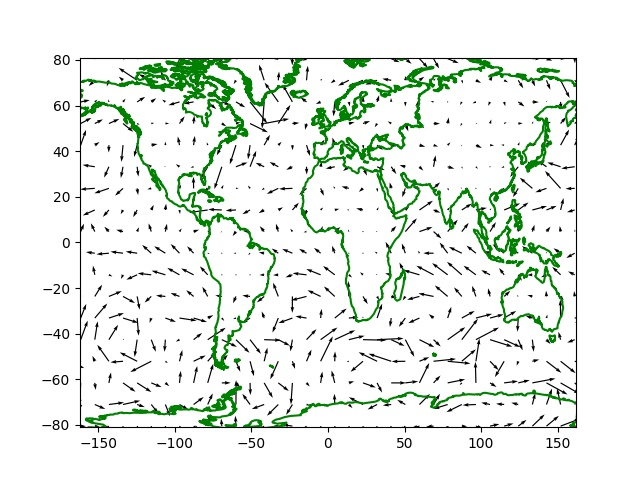

# Meteoroloji Verileri - ECMWF, NOAA, OpenWeatherMap

### OpenWeatherMap

Bu Web servisi kayıt olanlara bir API anahtarı verir ve belli sayıda
APİ çağrısı için kullanım bedavadır. Servisten o andaki sıcaklık,
rüzgar, nem vs gibi verileri alabiliriz, ayrıca bu veriler için
tahminler de aynı API üzerinden paylaşılıyor [2,3].

Kullanım şartlarına [1] baktığımızda bedava seçenek için,

```
60 calls/minute
1,000,000 calls/month
Current Weather
Minute Forecast 1 hour*
Hourly Forecast 2 days*
Daily Forecast 7 days*
National Weather Alerts*
Historical weather 5 days*
Climatic Forecast 30 days
```

servislerini görüyoruz, bir dakikada 60 çağrı, her ay 1 milyon çağrı
yapabiliyoruz bu durumda, bu çoğu geliştirici için yeterli
olmalı. Tabii OWM üzerinden başkalarına servis sağlamak isteyenler
daha fazla erişime ihtiyaç duyabilir, onlar için farklı planlar var.

Yazının geri kalanında bu anahtarı aldığınızı, ve anahtarın `.key`
adlı bir dosyada olduğunu farzediyoruz (dikkat, bu anahtar kodda olsa
`key='ASDFASDF'` gibi gözükecek bir şey, eğer dosya içine koyarsak son
satır -newline- olmadan dosyaya yazmak gerekir),

```python
import requests, json
lat,lon = 41.969901,29.070148
base_url = 'http://api.openweathermap.org/data/2.5/weather?'
weatherapi = open(".key").read()

payload = { 'lat': str(lat), 'lon': str(lon), 'units': 'metric', 'APPID': weatherapi }
r = requests.get(base_url, params=payload) 
res = []
for x in r.iter_lines():
    x = json.loads(x.decode())
    res.append (x['wind'])

print ('json',res)
print ('hiz', res[0]['speed'])
print ('yon', res[0]['deg'])
```

```text
json [{'speed': 8.92, 'deg': 214}]
hiz 8.92
yon 214
```

Üstte `lat,lon` enlem ve boylamlarındaki o andaki rüzgar hızı ve
yönünü aldık.

Not: Rüzgar acısı meterolojik, ya da coğrafik acı denen şekilde,
meteroloji dünyasında kuzeye göre rüzgarın nereden geldiği
raporlanıyor, acılar ona göre ayarlanıyor, kuzeyden güneye doğru esen,
yani tam güneyi gösteren açı sıfır, saat yönüne doğru
artıyor. Aritmetik acılar farklı tabii, orada saat yönü tersinde artış
ve tam sağ / doğu yönde sıfır. Aradaki değişim için,

```python
def geo2arit(geo):
    if geo==360: geo=0
    if (geo>=0.0) & (geo <90.0): return 270.0-geo
    elif (geo>=90.0) & (geo<180.0): return 180.0-(geo-90)
    elif (geo>=180.0) & (geo<270.0): return 90.0-(geo-180)
    elif (geo>=270.0) & (geo<360.0): return 360.0-(geo-270)
```

şeklinde bir çevirici kod yazılabilir.

```python
print (geo2arit(90))
print (geo2arit(0))
print (geo2arit(80))
```

```text
180.0
270.0
190.0
```

Daha fazla meteorolojik bilgi `'main'` anahtarı içinde,

```python
r = requests.get(base_url, params=payload) 
res = []
for x in r.iter_lines():
    x = json.loads(x.decode())
    res.append (x['main'])

for x in res: print (x)
```

```text
{'temp': 12.36, 'feels_like': 5.71, 'temp_min': 12.36, 'temp_max': 12.36, 'pressure': 1015, 'humidity': 76, 'sea_level': 1015, 'grnd_level': 1015}
```

Tahminler için farklı bir URL / API gerekiyor, mesela rüzgar yönü ve yağmur için,

```python
base_url = 'http://api.openweathermap.org/data/2.5/forecast?'
payload = { 'lat': str(lat), 'lon': str(lon), 'units': 'metric', 'APPID': weatherapi }
r = requests.get(base_url, params=payload)
wind = []
rain = []
for x in r.iter_lines():
    x = json.loads(x.decode())
    for i,xx in enumerate(x['list']):
        wind.append((xx['dt_txt'], xx.get('wind') ))
        rain.append((xx['dt_txt'], xx.get('rain') ))

print ('ruzgar')
for i in range(5): 	
    print (wind[i])

print ('yagmur')
for i in range(5): 	
    print (rain[i])
```

```text
ruzgar
('2021-01-07 12:00:00', {'speed': 10.21, 'deg': 211})
('2021-01-07 15:00:00', {'speed': 9.37, 'deg': 213})
('2021-01-07 18:00:00', {'speed': 5.15, 'deg': 250})
('2021-01-07 21:00:00', {'speed': 2.69, 'deg': 25})
('2021-01-08 00:00:00', {'speed': 4.66, 'deg': 55})
yagmur
('2021-01-07 12:00:00', None)
('2021-01-07 15:00:00', None)
('2021-01-07 18:00:00', None)
('2021-01-07 21:00:00', {'3h': 0.17})
('2021-01-08 00:00:00', {'3h': 1.08})
```

Nem ve sicaklik verilerini alalim, onları önceden rasgele seçilmiş
belli noktalar için alacağız, `util.coords` içinde. Bugünün verisini
alalım, erişim için OWM anahtarının alınmış olduğunu farzediyoruz,
bizimki `$HOME` altında `.nomterr.conf` adlı bir JSON dosyasında,
`weatherapi` anahtarına tekabül ediyor,

```python
base_url = 'http://api.openweathermap.org/data/2.5/weather?'

params = json.loads(open(os.environ['HOME'] + "/.nomterr.conf").read())

n = datetime.datetime.now()
ns = n.strftime("%Y-%m-%d")
hums = []
for i in range(len(coords)):
    print (i)
    payload = {'units': 'metric', 'lat': str(coords[i][0]), 'lon': str(coords[i][1]),'appid': params['weatherapi'] }
    r = requests.get(base_url, params=payload) 
    res = [json.loads(x.decode()) for x in r.iter_lines()]
    hums.append(str(res[0]['main']['humidity']))

hline = ns + "," + ",".join(hums) 
fout = open("trhumid.csv","a")
fout.write(hline)
fout.write("\n")
fout.close()
```


### ECMWF

Önce günlük, bedava kaynaklara bakalım. Kurulmasi gereken paketler,

```
ecmwf-data ecmwf-opendata magpye
```

Örnek kod, [7] adresinden,

```python
import ecmwf.data as ecdata
from magpye import GeoMap
from ecmwf.opendata import Client
client = Client("ecmwf", beta=True)
parameters = ['10u', '10v','2t']
filename = '/tmp/medium-2t-wind.grib'

client.retrieve(
    date=0,
    time=0,
    step=12,
    stream="oper",
    type="fc",
    levtype="sfc",
    param=parameters,
    target=filename
)

data = ecdata.read(filename)

t2m = data.select(shortName= "2t")
u = data.select(shortName= "10u")
v = data.select(shortName= "10v")
```

```python
print (u.values())

print (u.latitudes())

print (u.longitudes())
```

```text
[-4.91452026 -4.91452026 -4.91452026 ... -4.35202026 -4.35202026
 -4.35202026]
[ 90.  90.  90. ... -90. -90. -90.]
[-180.  -179.6 -179.2 ...  178.8  179.2  179.6]
```

Grafiklemek

Üstteki verileri grafiklemek istersek alınan enlem, boylam verisini
aradeğerleme kaynağı olarak kullanmak gerekli, aradeğerleme hedefi
bizim tanımladığımız izgara olacak, bu izgara üzerinde `quiver`
çağrısı işletilebilir,

```python
from scipy.interpolate import NearestNDInterpolator
import ecmwf.data as ecdata
from magpye import GeoMap
from ecmwf.opendata import Client
import pandas as pd
import simplegeomap as sm
import numpy as np
import matplotlib.pyplot as plt

client = Client("ecmwf", beta=True)
parameters = ['10u', '10v','2t']
filename = '/tmp/medium-2t-wind.grib'

client.retrieve(
    date=0,
    time=0,
    step=12,
    stream="oper",
    type="fc",
    levtype="sfc",
    param=parameters,
    target=filename
)

data = ecdata.read(filename)

t2m = data.select(shortName= "2t")
u = data.select(shortName= "10u")
v = data.select(shortName= "10v")

M,N = 40,20

lons = u.longitudes()
lats = u.latitudes()
udata = u.values()
xi = np.linspace(min(lons), max(lons), M)
yi = np.linspace(min(lats), max(lats), N)
Xi, Yi = np.meshgrid(xi, yi)
interp = NearestNDInterpolator(list(zip(lons,lats)), udata)
uzi = interp(Xi, Yi)

lons = v.longitudes()
lats = v.latitudes()
vdata = v.values()
xi = np.linspace(min(lons), max(lons), M)
yi = np.linspace(min(lats), max(lats), N)
Xi, Yi = np.meshgrid(xi, yi)
interp = NearestNDInterpolator(list(zip(lons,lats)), vdata)
vzi = interp(Xi, Yi)

fig, ax = plt.subplots()
sm.plot_continents(0,0,18,incolor='green', outcolor='white', fill=False,ax=ax)
ax.quiver(xi,yi,uzi,vzi)
plt.savefig('ecmwf1.jpg')
```



Hava verisi uzerinde yapay ogrenim ile tahminler yapmak isteyenler ham
veriyi almak icin alttaki siteye basvurabilir. 

https://www.ecmwf.int/

Bu bir Avrupa bilim organizasyonu, ayrica hava tahmini modellerini
isletip tahmin de uretiyorlar (Harvey kasirgasinin nereye vuracagini
ABD NOAA'dan daha iyi tahmin ettiler). Python ile veri indirmek
mumkun,

```
sudo pip install ecmwf-api-client
```

Burada "Register" ile kullanici bilgileri, email, vs. verilip
kaydolunur. Bir aktivasyon email'i sonra bir tane daha email geliyor,
ve kayit bitiyor.  Login yapilir. Simdi API'ye erismek icin anahtar
lazim,

https://api.ecmwf.int/v1/key/

Burada gosterilen 

```
{
    "url"   : "https://api.ecmwf.int/v1",
    "key"   : "[ANAHTAR]",
    "email" : "[email]"
}
```

formundaki anahtar `$HOME/.ecmwfapirc` dosyasina yazilir. 

Verilere erismeden once veri turune gore bazi lisans sayfalarinda bir
lisans kabuluna "evet" demek gerekiyor, mesela alttaki tur bir script
icin

```
from ecmwfapi import ECMWFDataServer

server = ECMWFDataServer()

server.retrieve({

    'dataset' : "tigge",
    'step'    : "24/to/120/by/24",
    'number'  : "all",
    'levtype' : "sl",
    'date'    : "20071001/to/20071003",
    'time'    : "00/12",
    'origin'  : "all",
    'type'    : "pf",
    'param'   : "tp",
    'area'    : "70/-130/30/-60",
    'grid'    : "2/2",
    'target'  : "data.grib"
    })
```

[5] lisansına evet demiş olmak lazım. Bir tane daha [6].

Eger lisans kabul edilmemisse hata mesaji hangi sayfaya gidilecegini soyler.

NOAA

[4] adresinde gunluk dosyalar var.

Yapay Ogrenim

Hava tahmini icin gunluk (saatlik, vs) hava verisi cok boyutlu bir
zaman serisi olarak gorulebilir, mesela her t aninda sicaklik, nem,
ruzgar hizi cok boyutlu bir zaman serisi olarak geliyor, egitim icin N
tane gorulen veri kullanilir, bu veri N+1, N+2, . anlarindaki gelecek
zaman serisini tahmin icin kullanilir. Bu sekilde hava tahmininin
ornegi alttaki kodlarda bulunabilir,

https://github.com/mouradmourafiq/tensorflow-lstm-regression/blob/master/lstm_weather.ipynb

Kaynaklar

[1] https://openweathermap.org/price

[2] https://openweathermap.org

[3] https://openweathermap.org/api

[4] https://www.ncdc.noaa.gov/orders/qclcd/

[5] http://apps.ecmwf.int/datasets/licences/tigge/

[6] http://apps.ecmwf.int/datasets/licences/general

[7] https://github.com/ecmwf/notebook-examples/blob/master/opencharts/medium-2t-wind.ipynb

