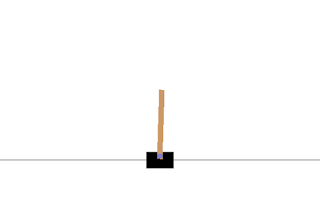

# OpenAI Gym, Pong, Derin Takviyeli Ogrenme (Deep Reinforcement Learning)

OpenAI Gym, Pong, Derin Takviyeli Ogrenme (Deep Reinforcement Learning)

Otomatik oyun oynamak ve alakali diger problemler icin son zamanlarda yapay zeka'nin alt dallarindan takviyeli ogrenme (reinforcement learning) revacta. Go sampiyonunu yenen Google Deepmind algoritmasi bir TO yaklasimi kullandi. TO ile algoritma bir oyundan gelen sadece ham pikselleri kullanarak oyunu kendi basina oynamayi ogrenebiliyor. En son oturumda kazanip kaybedildigi bir ceza ya da mukafat skoru ile algoritmaya bildirilir tabii, ve yuzlerce otomatik oyun sonrasi program oynamayi ogrenir.

Takviyeli ogrenim is dunyasi icin faydali olabilir, YZ etrafinda danismanlik servisi veren sirketler eskiden endustriyel muhendisligin semsiyesi altina dusen ve simplex, lineer programlama ile cozulen problemleri TO ile cozmeye basladilar. TO ile bir ilke gradyani (policy gradient) hazirlanir, ilkeler her adimda atilabilecek adimlari tanimlarlar; bir fabrikada bir aletin uzerindeki ayarlar, ya da hangi kaynaklara oncelik verilmesi gerektigi (hangi gun, kac isci, vs), bir anlamda bu ilkelerden gelebilecek aksiyonlar olarak gorulebilir, ve TO en "basarili" olacak ayarlari ogrenebilir.

Oyunlara donelim, simulasyon ortamlarindan OpenAI Gym uzerinden

sudo pip install  gym[atari]

ile unlu oyun Pong ortami kurulur. Oyundan gelen pikseller matris olarak arayuzden alinabiliyor. Alttaki ornekte Pong baslatiyoruz, alinan her kareyi bir imaj png dosyasina yaziyoruz, bu arada rasgele hareketle yapiyoruz, kayip ya da basari var ise donguden cikiyoruz. Her step cagrisi bizim attigimiz bir adimi oyuna bildiriyor, bilgisayar karsilik veriyor, ve oyunun son hali bize step donus parametreleri ile bildiriliyor. Bizim step ile kontrol ettigimiz sagdaki raket, bilgisayar soldakini kontrol ediyor. Pong'u fazla anlatmaya gerek yok herhalde, basit bir oyun, raketler yukari ya da asagi gidiyor, step ile verdigimiz hareket parametresi 0,1 etkisiz, 2,4 yukari, 3,5 asagi demek. Bilgisayar oynarken tabii ki bilgiyi "iceriden" aliyor, diger tahtanin, topun nerede oldugunu ic arayuz ile anliyor. Disaridan piksellere bakarak oynamaya ugrasmak cok daha zor bir is.

import gym, random, time
import pandas as pd
import numpy as np
from PIL import Image

env = gym.make("Pong-v0")
n_outputs = env.action_space.n
print 'kac hereket', n_outputs
env.reset()

# ilk kismi atla
for i in range(20): obs, reward, done, info = env.step(0)

while True:
    obs, reward, done, info = env.step(random.choice([0,1,2,3,4,5]))
    if np.abs(reward) > 0.0: break
    im = Image.fromarray(obs)
    im.save('out.png')
    time.sleep(0.4) # zaman arasi

Imaj kaydi yerine direk ekranda gostermek icin env.render() cagrisi da yapilabilir.

TO baglaminda ogrenim rutini ustteki donguyu yuzlerce, binlerce kez isletebilir, her oturum sonundaki basari / kayip ilke gradyani ile guncelleme icin kullanilir.

Detaylar icin su blog guzel.

Alinan imaj uzerinde bazi onislemler mumkun, mesela en ustteki skor bolumu oyun icin gerekli mi? Bunlar kirpilabilir. Ayrica renk gerekli olmayabilir, 3 renk kanali 1 kanala iner. Kucultme yapilarak 210x160 boyutu mesela 80x80'e indirilebilir. Bir diger onislem su: Karpathy (ustteki baglanti) ardi ardina gelen iki oyun karesinin farkini aliyor, boylece hareket bilgisini yakalamak istemis herhalde. Alternatif bir yaklasim Stanford Universite'sindeki RL dersinin yaklasimi, bu arkadaslar ardi ardina 4 karenin uzerinden bir maxpool hesabi yapiyorlar, yani 4 karede birbirine tekabul eden piksellerden en yuksek degeri olan nihai sonuca aliniyor. Boylece 4 kare 1 kareye indirgeniyor, bu hem hareketi verir, hem de egitim algoritmasinin 4 kat daha hizli islemesini saglar (kod yazinin altinda)

Kontrol Problemleri

Gym sadece gorsel ciktiyla sinirli degil, mesela sadece alttan tutarak dik tutmaya ugrastigimiz bir cubugu dusunelim, bunu belki cocukken yapmisizdir, agir olan dik bir cismi parmak uzerinde tutmaya ugrasmak. Tabii saga sola giderek dengelemeye ugrasilir, oldukca zor bir istir, vs. Gym icinde bu ortam da var,

import gym, time
import numpy as np

env = gym.make("CartPole-v0")
env.reset()
obs, reward, done, info = env.step(0)
print obs
print obs.shape
env.render()

deyince alttaki resim cikar,

Fakat aslinda step cagrilari bize Pong'da oldugu gibi resim degil, cubuk hakkinda 4 tane parametre donduruyor, render cagrisi bu parametreleri kullanarak bir temsili resim ortaya cikartmis. Ustteki durum icin parametreler

[ 0.02585672 -0.17299761  0.030009    0.29081285]

Parametrelerin ne oldugunun detayi surada. Soldan 3. cubugun durus acisi, -45 ile +45 arasinda, arti acilar saga dogru yatik demek, eksiler sola dogru. 

Eger cubugu dengede tutmayi ogrenmek istersek step ile alt kismi saga ya da sola kaydirabiliriz, cubuk sola dusecek gibi olsa mesela sola gidip dengeyi tekrar bulmaya ugrasiriz, vs. Sistem bize hangi durumda oldugunu ustteki 4 sayiyla soyler. Bu yeterli, Pong ile oldugu gibi tum ekrani gormemize gerek yok. Mukafat (ya da ceza) basarili gecen her adim icin verilir, oyun eger cubuk belli bir acidan fazla yatiksa biter, o zaman cubuk "dusmus" demektir. Ekran disina cikmak ayni sekilde oyunu bitirir.

CartPole kontrol problemlerini anlamak acisindan faydali bir ornek.  Kontrol Muhendisligi'nde bu tur durumlar yogun sekilde gorulur. 

Ekler

Pong icin tarif edilen her 4 karede bir imaj veren max pool kodu

import gym

from collections import deque

def greyscale(state):
    state = np.reshape(state, [210, 160, 3]).astype(np.float32)
    state = state[:, :, 0] * 0.299 + state[:, :, 1] * 0.587 + state[:, :, 2] * 0.114
    state = state[35:195]  # crop
    state = state[::2,::2] # downsample by factor of 2
    state = state[:, :, np.newaxis]
    return state.astype(np.uint8)

class MaxAndSkipEnv(gym.Wrapper):
    def __init__(self, env=None, skip=4):
        super(MaxAndSkipEnv, self).__init__(env)
        self._obs_buffer = deque(maxlen=2)
        self._skip       = skip

    def _step(self, action):
        total_reward = 0.0
        done = None
        for _ in range(self._skip):
            obs, reward, done, info = self.env.step(action)
            self._obs_buffer.append(obs)
            total_reward += reward
            if done:
                break

        max_frame = np.max(np.stack(self._obs_buffer), axis=0)
 max_frame = greyscale(max_frame)
        return max_frame, total_reward, done, info

    def _reset(self):
        self._obs_buffer.clear()
        obs = self.env.reset()
        self._obs_buffer.append(obs)
        return obs

Kullanmak icin tek bir imaj basalim

from PIL import Image

env = gym.make("Pong-v0")
m = MaxAndSkipEnv(env)
m._reset()
for i in range(20): obs, reward, done, info = env.step(0)
max_frame, total_reward, done, info = m._step(0)
im = Image.fromarray(max_frame[:,:,0], 'L')
im.save('out.png')

Daha fazla bilgi icin

http://sayilarvekuramlar.blogspot.com/2015/12/bilgisayar-bilim-yapay-zeka.html

