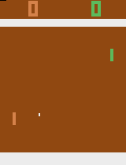
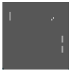

# OpenAI Gym, Pong, Derin Takviyeli Ogrenme (Deep Reinforcement Learning)

Otomatik oyun oynamak ve alakalı diğer problemler için son zamanlarda
yapay zeka'nın alt dallarından takviyeli öğrenme (reinforcement
learning) revaçta. Gö şampiyonunu yenen Google Deepmind algoritmasi
bir TO yaklaşımı kullandı. TO ile algoritma bir oyundan gelen sadece
ham pikselleri kullanarak oyunu kendi başına oynamayı
öğrenebiliyor. En son oturumda kazanıp kaybedildiği bir ceza ya da
mükafat skoru ile algoritmaya bildirilir tabii, ve yüzlerce otomatik
oyun sonrası program oynamayı öğrenir.

Takviyeli öğrenim iş dünyası için faydalı olabilir, YZ etrafında
danışmanlık servisi veren şirketler eskiden endüstriyel mühendisliğin
şemsiyesi altına düşen ve simplex, lineer programlama ile çözülen
problemleri TO ile çözmeye başladılar. TO ile bir ilke gradyanı
(policy gradient) hazırlanır, ilkeler her adımda atılabilecek adımları
tanımlarlar; bir fabrikada bir aletin üzerindeki ayarlar, ya da hangi
kaynaklara öncelik verilmesi gerektiği (hangi gün, kaç işçi, vs), bir
anlamda bu ilkelerden gelebilecek aksiyonlar olarak görülebilir, ve TO
en "başarılı" olacak ayarları öğrenebilir.

Oyunlara dönelim, simülasyon ortamlarından OpenAI Gym üzerinden

```
sudo pip install  gym[atari]
```

ile ünlü oyun Pong ortamı kurulur. Oyundan gelen pikseller matris
olarak arayüzden alınabiliyor. Alttaki örnekte Pong başlatıyoruz,
alınan her kareyi bir imaj png dosyasına yazıyoruz, bu arada rasgele
hareketle yapıyoruz, kayıp ya da başarı var ise döngüden
çıkıyoruz. Her step çağrısı bizim attığımız bir adımı oyuna
bildiriyor, bilgisayar karşılık veriyor, ve oyunun son hali bize step
dönüş parametreleri ile bildiriliyor. Bizim step ile kontrol ettiğimiz
sağdaki raket, bilgisayar soldakini kontrol ediyor. Pong'u fazla
anlatmaya gerek yok herhalde, basit bir oyun, raketler yukarı ya da
aşağı gidiyor, step ile verdiğimiz hareket parametresi 0,1 etkisiz,
2,4 yukarı, 3,5 aşağı demek. Bilgisayar oynarken tabii ki bilgiyi
"içeriden" alıyor, diğer tahtanın, topun nerede olduğunu iç arayüz ile
anlıyor. Dışarıdan piksellere bakarak oynamaya uğraşmak çok daha zor
bir iş.

```
import gym, random, time
import pandas as pd
import numpy as np
from PIL import Image

env = gym.make("Pong-v0")
n_outputs = env.action_space.n
print 'kac hereket', n_outputs
env.reset()

# ilk kismi atla
for i in range(20): obs, reward, done, info = env.step(0)

while True:
    obs, reward, done, info = env.step(random.choice([0,1,2,3,4,5]))
    if np.abs(reward) > 0.0: break
    im = Image.fromarray(obs)
    im.save('out.png')
    time.sleep(0.4) # zaman arasi
```

Imaj kaydi yerine direk ekranda gostermek icin env.render() cagrisi da
yapilabilir.







TO bağlamında öğrenim rutini üstteki döngüyü yüzlerce, binlerce kez
işletebilir, her oturum sonundaki başarı / kayıp ilke gradyanı ile
güncelleme için kullanılır.

Detaylar için şu blog güzel.

Alınan imaj üzerinde bazı önişlemler mümkün, mesela en üstteki skor
bölümü oyun için gerekli mi? Bunlar kırpılabilir. Ayrıca renk gerekli
olmayabilir, 3 renk kanalı 1 kanala iner. Küçültme yapılarak
210x160 boyutu mesela 80x80'e indirilebilir. Bir diğer önişlem şu:
Karpathy (üstteki bağlantı) ardı ardına gelen iki oyun karesinin
farkını alıyor, böylece hareket bilgisini yakalamak istemiş
herhalde. Alternatif bir yaklaşım Stanford Üniversite'sindeki RL
dersinin yaklaşımı, bu arkadaşlar ardı ardına 4 karenin üzerinden bir
maxpool hesabı yapıyorlar, yani 4 karede birbirine tekabül eden
piksellerden en yüksek değeri olan nihai sonuca alınıyor. Böylece 4
kare 1 kareye indirgeniyor, bu hem hareketi verir, hem de eğitim
algoritmasinin 4 kat daha hızlı işlemesini sağlar (kod yazının
altında)

Ayrica bkz [OpenAI, Çubuklu Araba, CartPole](/2017/09/openai-cubuklu-araba-cartpole.html)

Ekler

Pong için tarif edilen her 4 karede bir imaj veren max pool kodu

```
import gym

from collections import deque

def greyscale(state):
    state = np.reshape(state, [210, 160, 3]).astype(np.float32)
    state = state[:, :, 0] * 0.299 + state[:, :, 1] * 0.587 + state[:, :, 2] * 0.114
    state = state[35:195]  # crop
    state = state[::2,::2] # downsample by factor of 2
    state = state[:, :, np.newaxis]
    return state.astype(np.uint8)

class MaxAndSkipEnv(gym.Wrapper):
    def __init__(self, env=None, skip=4):
        super(MaxAndSkipEnv, self).__init__(env)
        self._obs_buffer = deque(maxlen=2)
        self._skip       = skip

    def _step(self, action):
        total_reward = 0.0
        done = None
        for _ in range(self._skip):
            obs, reward, done, info = self.env.step(action)
            self._obs_buffer.append(obs)
            total_reward += reward
            if done:
                break

        max_frame = np.max(np.stack(self._obs_buffer), axis=0)
 max_frame = greyscale(max_frame)
        return max_frame, total_reward, done, info

    def _reset(self):
        self._obs_buffer.clear()
        obs = self.env.reset()
        self._obs_buffer.append(obs)
        return obs
```

Kullanmak için tek bir imaj basalım

```
from PIL import Image

env = gym.make("Pong-v0")
m = MaxAndSkipEnv(env)
m._reset()
for i in range(20): obs, reward, done, info = env.step(0)
max_frame, total_reward, done, info = m._step(0)
im = Image.fromarray(max_frame[:,:,0], 'L')
im.save('out.png')
```

Aya İniş (LunarLander)

Test ortamlarindan biri aya inis yapacak bir uzay modulunu kontrol
etmek. Yanliz bu ortami kullanmak icin bazi ek kuruluslar lazim,

```
pip3 install gym[box2d]
pip3 install box2d
pip3 uninstall box2d-kengz
```

Simdi

```
import gym
env = gym.make('LunarLander-v2')
env.reset()
for _ in range(500):
  env.render()
  env.step(env.action_space.sample())
```

ortami gorebiliriz. 

