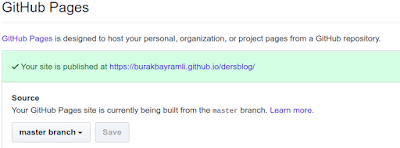

# HTML Ders Notları

HTML Ders Notları

LaTeX ile yazilmis olan ders notlari make4ht ile HTML'e cevirildi, ve alttaki adresten servis ediliyor.

https://burakbayramli.github.io/dersblog

HTML sayfalarini Github Pages ile servis ediyoruz. Github bilindigi gibi kaynak kod deposu Git uzerine kurulu, Pages servisi ile GH'da bir depoyu "servis edilebilir" olarak isaretleyince bu depo icindeki kod / sayfa [kullanici].github.io/[depo] uzerinden yayinlanabiliyor, yani depoya konan bir html dosyasi bu adres uzerinden erisilebilir hale geliyor. Bu isaretleme islemi depo | settings ve en alttaki kisimda sayfalarin hangi kod dalindan (branch) geldigini secince tamamlaniyor.

Google reklamlari kullanmak isteyenler icin iyi haber, Github bunun icin bir kisitlama getirmemis, yani reklam kodunu html icine koyunca reklam yayinlaniyor.

