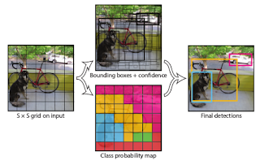
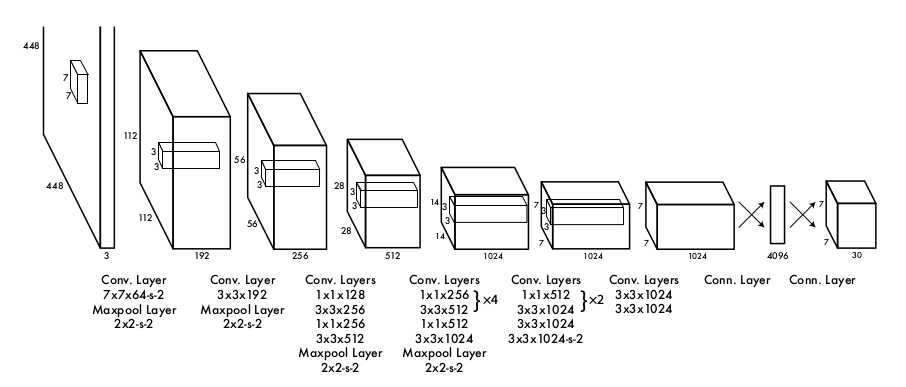
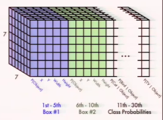
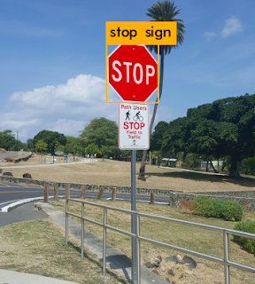
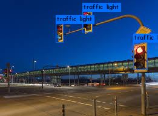

# YOLO - Evrişimsel Derin Ağlar ile Hızlı Obje Tanıma (Object Recognition)

Evrişimsel Derin Ağlar ile obje tanıma alanında hızlı gelişmeler
oluyor. Yapay görüş (computer vision) zaten derin öğrenmenin "geri
dönüşünün" ilk gözlendiği alandı, MNIST sayı tanıma problemindeki en
iyi hata oranı bir DYSA ile alınmıştı, ardından araçlar, yaklaşımlarda
ilerlemeler oldu, şimdi R-CNN, Mask R-CNN ile obje tanımakta
ilerlemeler kaydedildi. Evrişimsel derin yapı obje tanımada verimli
bir şekilde kullanılabilmeye başlandı.

Yeni ve çok hızlı işleyen bir başka yaklaşım YOLO. Kısaltma "sadece
bir kere bakarız (you only look once)" cümlesinden türetilmiş,
söylenmek istenen insanların tek bir karedeki görüntüde olan objeleri
hızlı bir şekilde bir bakışta bulabilmesi. YOLO'nun amacı bu hıza
erişmek.

https://pjreddie.com/darknet/yolo/

YOLO tasarımcılarına göre görüntü karesini solda sağa taramak (ve o
sırada ufak bir kutu içine düşen piksellere bakmak), ya da obje yeri
hakkında teklif üretmek (r-cnn) gerekli değil. Tüm kare ve o karedeki
tüm obje tipleri, yerleri hakkında global bir karar verilebilir.

Yöntem aslında basit: tüm görüntü önce S x S parçaya bölünür  (S=7
diyelim). Şimdi eğitim verisi hazırlanırken çerçevesi bilinen objeler
alınır, ve 7x7 parçaların bu obje çerçeveleri / kutularının içine
düşüp düşmediğine göre eğitim verisinde etiket hazırlanır.

Her tek görüntü için bir etiket yukarıdaki gibi bir tensor. Eğer
eğitim verisinde bir kutucuk bir obje çerçevesi merkezine düşüyorsa, o
kutucuğa tekabül eden üstteki P(Object), yani güven katsayısı için '1'
verilir. Diğer kutucuklar obje merkezine düşüp düşmediğine göre aynı
matris üzerinde 1 olurlar. Bir kutucuk en fazla B tane (üstte B=2)
obje tahmini yapabilir, üstte mavi bölge 1. yeşil bölge
2. için. Kutucuk ayrıca objenin tüm imaj içindeki kordinatsal yerini,
ve büyüklüğünü de aynı tensor içinde tahmin edecektir, bu matrisler
kesit kesit tensor içinde yanyana duruyorlar. Tabii eğitim verisinde
bilinen objelere göre biz tüm bu bilgileri hazırlayıp vereceğiz.

Yani denetimli bir eğitimden bahsediyoruz, elde görüntü, ve o
görüntüdeki objeler, onların yerleri, büyüklüğü bilgisi
olmalı. Regresyon hedefi olan objeler x,y,w,h,g değerleri ile temsil
ediliyor, x,y objenin parçaya göre yeri, w,h genişliği ve yüksekliği,
g ise obje hakkındaki bir güven değeri. Ayrıca bir diğer regresyon her
parçanın C tane obje tipi için bir kategorizasyon tahmini
yapması. Eğer B=2, C=20 ise, yani her parça iki tane objeyi tahmin
ediyor ve elimizde 20 tane kategori var ise S x S (B * 5 + C) formülü,
7 * 7 * (2 * 5 + 2) büyüklüğünde bir tensor var demektir. Bu tensor
tahmin hedefi bu arada, yani bir regresyonda y ~ x dediğimizde
kullanılan y.

Hedef için verilen kaynak tum imaj, daha doğrusu bu piksellerin
evrişimden geçirilmiş hali. Bu evrişim tabakası oldukca standart, ünlü
MNIST için kullanılan DYSA tabakalarından pek farklı değil.

DYSA yapısına bakarsak ardı ardına evrişim ve max havuz (pool)
katmanları görüyoruz.

Evrişim katmanlarındaki notasyon, mesela 7 x 7 x 64-s2 anlami 7 x 7
boyutunda 64 tane filtre uygulanıyor ve bu filtreler her uygulama
sonrası 2 hücre kenara kaydırılıyor (stride).

Mimaride tamamen bağlanmış (fully connected) katmandan bir önceki 7 x
7 x 1024 boyutlarındaki tensor, girdi imajının işlene işlene
oluşturulmuş son hali. Bu tensorda her imaj parçası 1024 kanallik bir
vektör haline gelmiştir. Mesela üstten 2. soldan 1. parçanın verisi bu
tensorda [1,0,:] ile erişiliyor olabilirdi, ve bu 1024 öğeli vektör o
parçayı temsil eden girdidir. Sonuç tensor'u ile regresyona sokulan bu
veridir.

Test anında, tahmin üretmek için yeni imaj verilir ve ilk önce 7 x 7
kutucuklarda elde edilecek obje olasılıklarına bakılır. 0/1 degerleri
ile egittik ama tahmin zamaninda 0.2, 0.6, 0.8 gibi degerler alacagiz,
bu standart bir durum, DYSA ile diger alanlarda da gorulur. Bu
olasılıklardan belli bir eşik değeri altında olanlar elenip en yüksek
olanlar tutulabilir, bu yüksek olanlar arasından tahmin tensoru
içindeki obje çerçevesinin yeri x,y ve yükseklik, genişlik, obje tipi
verilerine bakılır, bu verilerle obje artık gösterilebilir / tanınmış
olur.

Bu kadar. Üstteki bağlantıda kod ve önceden eğitilmiş bir DYSA'nın
ağırlık değerleri bulunabilir. Verilen kodu denedik, sonuçlar
iyi. Altta trafik lambası ve dur işareti üzerinde işlettiğimiz deneyin
sonuçları görülüyor. Sadece eğitilmiş YSA'nın ağırlıklarını indirdik,
kodu derledik ve başka hiçbir ek işlem yapmadan bu tanıma yapıldı.

YOLO yaklaşımını TensorFlow ile yapan bazı kodlar altta,

https://github.com/nilboy/tensorflow-yolo

https://github.com/hizhangp/yolo_tensorflow

Başka TF kodları da Github'da var.. YOLO C++ ile yazılmış, bu arkadaşlar TF Python ile aynı işi yapmışlar, kimisi üstteki aynı DYSA ağırlıklarını olduğu gibi kullanabildiğini iddia ediyor. TF bilindiği gibi Android üzerinde de işler, yani cep telefonunu tutup sak diye bir karedeki tüm objeleri tanıyabildiğimiz bir uygulama yazmak mümkün. Orijinal kod ile arkadaşlar saniyede 40 kareden daha fazlasını işleyebildiklerini söylüyorlar, o zaman canlı bir şekilde video da işlenebilir demektir.

Bağlantılar

http://machinethink.net/blog/object-detection-with-yolo/ - bilgilendirici bir yazı

https://youtu.be/NM6lrxy0bxs - YOLO tasarımcısının video'su

https://youtu.be/Cgxsv1riJhI - bir diger YOLO ustasindan video

