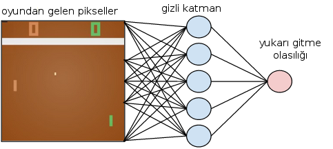

# Derin Takviyeli Öğrenme, İlke Gradyanları (Deep Reinforcement Learning, Policy Gradients )

Bilgisayar otomatik olarak oyun oynamayı öğrenebilir mi? Diyelim herhangi
bir bilgisayar oyunu, dama, satranç, ya da eğlence oyunlarından Pong. Eğer
elimizde bir simülasyon ortamı var ise, ve takviyeli öğrenme teknikleri ile
bu sorunun cevabı evet. Simülasyon ortamında bilgisayara karşı istediğimiz
kadar oynayıp RL teknikleri bir oyunu oynamayı öğrenebilir.

Daha önce [7] yazısında farklı bir yaklaşım gördük, bir değer fonksiyonu
vardı, bu fonksiyona tahtanın son halini veriyorduk, değer fonksiyonu bize
pozisyonun taraflar için ne kadar avantajlı olduğunu raporluyordu (tek bir
sayı). Bu fonksiyon bir kez, ve önceden kodlanmaktaydı, ve oyun oynayan
yapay zeka altüst (minimax) algoritması ile kendisi için en avantajlı karşı
taraf için en avantajsız pozisyonları bu fonksiyon ile değerlendirerek ve
arama yaparak buluyordu. Fakat değer fonksiyonu yaklaşımının bazı
dezavantajları var, birincisi fonksiyonun deterministik olması. Oyun
sırasında değişmiyor, önceden kodlanmış.

Daha iyi bir yaklaşım olasılıksal bir ilke $\pi_\theta(a,s)$ kodlamak,
atılan adımları örnekleme ile atmak, ve ilkeyi her oyun sonunda
güncellemek. Böylece oyun sırasında hem oyuncu yeni şeyler denemeye (açık
fikirli!) hazır oluyor, takılıp kalmıyor, oyun durumundan tam emin
olunamadığı durumlar icin bile hazır oluyor, ve kazandıran ilkeler daha
yoğun olasılıklara tekabül ettiği için yine iyi bir oyun oynama becerisine
kavuşuyor, ve kendini sürekli güncelliyor.

İlke $\pi_\theta(a,s)$, oyun konumu (state) $s$ ile, yapılacak hareket
(action) ise $a$ ile belirtilir. Pong örneğinde konum tüm oyunun o andaki
piksel görüntüsü olarak bize bildiriliyor olabilir, hareket ise raketin
yukarı mı aşağı mı gideceği; verili konum $s$ için $\pi_\theta(a|s)$
(kazanmak için optimallik bağlamında) mümkün tüm davranışların dağılımını
verecek.

Peki ilke fonksiyonunu nasıl güncelleriz? İlke gradyanı (policy gradient)
kavramı ile. İlke bir fonksiyondur, bir softmax fonksiyonu ile ya da yapay
sinir ağı ile temsil edilebilir. YSA'lar her türlü fonksiyonu temsil
edebildikleri için sofistike kabiliyetleri için daha tercih ediliyorlar
(daha önemlisi gradyanları otomatik alınabiliyor, bunun niye faydalı
olduğunu birazdan göreceğiz). 



Güncelleme nasıl olacak? Burada skor fonksiyonunu kavramı gerekli, optimize
etmek istediğimiz bir skor fonksiyonunun beklentisinin optimize edilmesi,
skor fonksiyonu tabii ki ilke fonksiyonuna bağlıdır, yani skor beklentisi
en iyi olacak ilkeyi arıyoruz. Bu beklentinin gradyanını istiyoruz, çünkü
ilkeyi tanımlayan $\theta$'yi skor bağlamında öyle güncelleyeceğiz ki eğer
aynı konumu tekrar gelmiş olsak, daha iyi hareketlerle daha iyi skora
erişelim. Aradığımız gradyan ($s,a$ yerine kısaca $x$ kullanalım, skor $Q$
olsun [2]),

$$ 
\nabla_\theta E_{x \sim \pi_\theta(x)} [Q(x)] 
$$

Üstteki ifadeyi açalım, beklentinin tanımı üzerinden,

$$ \nabla_\theta E_{x \sim \pi_\theta(s)} [Q(x)] = 
\nabla_\theta \sum_x \pi(x) Q(x)
$$

Gradyan içeri nüfuz edebilir,

$$ 
= \sum_x \nabla_\theta \pi_\theta(x) Q(x)
$$

$\pi(x)$ ile çarpıp bölersek hiç bir şey değişmemiş olur,

$$ 
= \sum_x \pi(x) \frac{\nabla_\theta \pi(x)}{\pi(x)} Q(x)
$$

Cebirsel olarak biliyoruz ki $\nabla_\theta \log(z) =
\frac{1}{z}\nabla_\theta$, o zaman,

$$ 
= \sum_x \pi(x) \nabla_\theta \log \pi(x)Q(x)
$$

Yine beklenti tanımından hareketle

$$ 
= E_x \big[ \nabla_\theta \log \pi(x) Q(x) \big]
$$

$x = (s,a)$ demistik, o zaman nihai denklem

$$ 
\nabla_\theta E_{x \sim \pi_\theta(s,a)} [Q(s,a)] 
= E_{s,a} \big[ \nabla_\theta \log \pi_\theta(s,a) Q(s,a) \big]
$$

Eşitliğin sağ tarafı bize güzel bir kabiliyet sunmuş oldu, orada bir
beklenti var, bu hesabı analitik olarak yapmak çok zor olabilir, fakat
beklentilerin örneklem alarak nasıl hesaplanacağını biliyoruz! Detaylar
için *İstatistik, Monte Carlo, Entegraller, MCMC* yazısı. O zaman
$v_t \sim Q(s,a)$ örneklemi alırız, yani oyunu baştan sonra kadar oynarız
ve skora bakarız, ve $\theta$ güncellemesi için [5],

$$ \Delta \theta_t = \alpha \nabla_\theta \log \pi_\theta (s_t,a_t) v_t$$

Oyun oynamak ile örneklemin alakası ne? Oynanan bir oyun mümkün tüm oyunlar
içinden alınan bir örneklem değil midir? Evet. Ayrıca DYSA durumunda da
olası her aksiyonun olasılığını hesaplıyoruz ve bu olasıklar üzerinden zar
atarak bir hareket seçiyoruz. Daha olası olan daha fazla seçiliyor tabii
ama az olası olan da bazen seçilebiliyor.

Tabii mesela Pong oyunu bir sürü adım $a_1,..,a_n$ sonrası bitiyor, bu
durumda en sondaki kazanç (ya da kaybı) o oyundaki tüm adımlara geriye
giderek uyguluyoruz. Güncelleme sonrası ilke fonksiyonumuz değişiyor, ve
bir oyun daha oynayarak aynı şeyi tekrarlıyoruz.

$\pi_\theta (s,a)$'nin ilke fonksiyonu olduğunu söyledik, bu fonksiyon DYSA
olabilir, ya da daha basit, sonlu sayıda seçenek üzerinden ayrıksal
olasılıkları depolayan softmax olabilir (bu durum için gradyan türetmesi
altta). DYSA durumunda üstteki formüle göre $\log \pi_\theta (s,a)$'un
gradyanının gerektiğini görüyoruz, otomatik türev uzerinden bu gradyan DYSA
paketinden rahatça alınabilir.

Pong oyunu kodunu göreceğiz, ama ondan önce daha basit çubuk dengeleme
problemine bakalım [1], kuruluş, oyun açıklaması için [3]. Bir simulasyon
ortamındayız, ve bu ortamda bize bir çubuk veriliyor, ve çubuğun konumu
dört tane sayı üzerinden bildirilir, ödül her adımda anında alınır (çubuk
düşmediyse, ekrandan çıkmadıysa o anda başarı).

```python
# cartpole_train.py - egitim
import tensorflow as tf, gym
import numpy as np

def reset_graph(seed=42):
    tf.reset_default_graph()
    tf.set_random_seed(seed)
    np.random.seed(seed)

def discount_rewards(rewards, discount_rate):
    discounted_rewards = np.zeros(len(rewards))
    cumulative_rewards = 0
    for step in reversed(range(len(rewards))):
        cumulative_rewards = rewards[step] + cumulative_rewards * discount_rate
        discounted_rewards[step] = cumulative_rewards
    return discounted_rewards

def discount_and_normalize_rewards(all_rewards, discount_rate):
    all_discounted_rewards = [discount_rewards(rewards, discount_rate) \
                              for rewards in all_rewards]
    flat_rewards = np.concatenate(all_discounted_rewards)
    reward_mean = flat_rewards.mean()
    reward_std = flat_rewards.std()
    return [(discounted_rewards - reward_mean)/reward_std for \
            discounted_rewards in all_discounted_rewards]

import tensorflow as tf

reset_graph()

n_inputs = 4
n_hidden = 4
n_outputs = 1

learning_rate = 0.01

initializer = tf.contrib.layers.variance_scaling_initializer()

X = tf.placeholder(tf.float32, shape=[None, n_inputs])

hidden = tf.layers.dense(X, n_hidden,
                         activation=tf.nn.elu,
                         kernel_initializer=initializer)

logits = tf.layers.dense(hidden, n_outputs)

outputs = tf.nn.sigmoid(logits)

p_left_and_right = tf.concat(axis=1, values=[outputs, 1 - outputs])

action = tf.multinomial(tf.log(p_left_and_right), num_samples=1)

y = 1. - tf.to_float(action)

cross_entropy = tf.nn.sigmoid_cross_entropy_with_logits(labels=y, logits=logits)

optimizer = tf.train.AdamOptimizer(learning_rate)

grads_and_vars = optimizer.compute_gradients(cross_entropy)
gradients = [grad for grad, variable in grads_and_vars]
gradient_placeholders = []

grads_and_vars_feed = []
for grad, variable in grads_and_vars:
    gradient_placeholder = tf.placeholder(tf.float32, shape=grad.get_shape())
    gradient_placeholders.append(gradient_placeholder)
    grads_and_vars_feed.append((gradient_placeholder, variable))
training_op = optimizer.apply_gradients(grads_and_vars_feed)

init = tf.global_variables_initializer()

saver = tf.train.Saver()        

env = gym.make("CartPole-v0")

n_games_per_update = 10
n_max_steps = 1000
n_iterations = 250
save_iterations = 10
discount_rate = 0.95
ffile = "/tmp/cartpole.ckpt"

sess = tf.Session()
sess.run(init)

for iteration in range(n_iterations):
    print("\rIteration: {}".format(iteration))
    all_rewards = []
    all_gradients = []
    for game in range(n_games_per_update):
        current_rewards = []
        current_gradients = []
        obs = env.reset()
        for step in range(n_max_steps):
            d = {X: obs.reshape(1, n_inputs)}
            action_val, gradients_val = sess.run([action, gradients], feed_dict=d)
            obs, reward, done, info = env.step(action_val[0][0])
            current_rewards.append(reward)
            current_gradients.append(gradients_val)
            if done: break
        all_rewards.append(current_rewards)
        all_gradients.append(current_gradients)

    all_rewards = discount_and_normalize_rewards(all_rewards,
                                                 discount_rate=discount_rate)
    feed_dict = {}
    for var_index, gradient_placeholder in enumerate(gradient_placeholders):
        tmp = [reward * all_gradients[game_index][step][var_index] \
               for game_index, rewards in enumerate(all_rewards) \
               for step, reward in enumerate(rewards)]
        mean_gradients = np.mean(tmp, axis=0)
        feed_dict[gradient_placeholder] = mean_gradients
    sess.run(training_op, feed_dict=feed_dict)
    if iteration % save_iterations == 0:
        saver.save(sess, ffile)
```

Eğitim fazla sürmüyor. Bittikten sonra alttaki kodla sonucu
görebiliriz. Çubuğun dengeli bir şekilde tutulabildiğini göreceğiz. 

```python
# cartpole_play.py - oyunu oyna
import tensorflow as tf
import matplotlib.animation as animation
import gym
import pandas as pd
import numpy as np
import matplotlib.pyplot as plt

def reset_graph(seed=42):
    tf.reset_default_graph()
    tf.set_random_seed(seed)
    np.random.seed(seed)

def render_cart_pole(env, obs):
    return env.render(mode="rgb_array")

def update_scene(num, frames, patch):
    patch.set_data(frames[num])
    return patch,

def render_policy_net(model_path, action, X, n_max_steps = 1000):
    frames = []
    env = gym.make("CartPole-v0")
    obs = env.reset()
    with tf.Session() as sess:
        saver.restore(sess, model_path)
        for step in range(n_max_steps):
            img = render_cart_pole(env, obs)
            frames.append(img)
            action_val = action.eval(feed_dict={X: obs.reshape(1, n_inputs)})
            obs, reward, done, info = env.step(action_val[0][0])
            if done:
                break
    env.close()
    return frames

import tensorflow as tf

reset_graph()

n_inputs = 4
n_hidden = 4
n_outputs = 1

learning_rate = 0.01

initializer = tf.contrib.layers.variance_scaling_initializer()

X = tf.placeholder(tf.float32, shape=[None, n_inputs])

hidden = tf.layers.dense(X, n_hidden,
                         activation=tf.nn.elu,
                         kernel_initializer=initializer)
logits = tf.layers.dense(hidden, n_outputs)
outputs = tf.nn.sigmoid(logits)  # probability of action 0 (left)
p_left_and_right = tf.concat(axis=1, values=[outputs, 1 - outputs])
action = tf.multinomial(tf.log(p_left_and_right), num_samples=1)

y = 1. - tf.to_float(action)
cross_entropy = tf.nn.sigmoid_cross_entropy_with_logits(labels=y, logits=logits)
optimizer = tf.train.AdamOptimizer(learning_rate)
grads_and_vars = optimizer.compute_gradients(cross_entropy)
gradients = [grad for grad, variable in grads_and_vars]
gradient_placeholders = []
grads_and_vars_feed = []
for grad, variable in grads_and_vars:
    gradient_placeholder = tf.placeholder(tf.float32, shape=grad.get_shape())
    gradient_placeholders.append(gradient_placeholder)
    grads_and_vars_feed.append((gradient_placeholder, variable))
training_op = optimizer.apply_gradients(grads_and_vars_feed)

init = tf.global_variables_initializer()
saver = tf.train.Saver()        

env = gym.make("CartPole-v0")

n_games_per_update = 10
n_max_steps = 1000
n_iterations = 250
save_iterations = 10
discount_rate = 0.95
ffile = "/tmp/cartpole.ckpt"

frames = render_policy_net(ffile, action, X, n_max_steps=500)
```

Pong oyunu kodu alttadır [6]. Bu eğitim paralellik özelliği olmayan normal
bilgisayarda uzun sürüyor (ben birkaç gün eğittim), fakat TensorFlow
çizitini arada sırada kaydedip kaldığı yerden devam edebildiği için parça
parça işletilebilir. Oyunun otomatik nasıl oynandığını görmek için alttaki
`env.render` satırını aktive etmek yeterli. Bilgisayarın kendi başına
öğrenip oynaması müthiş!

```python
# pong.py
import numpy as np
import gym
import tensorflow as tf

n_obs = 80 * 80          
h = 200                  
n_actions = 3            
learning_rate = 1e-3
gamma = .99              
decay = 0.99             
save_path='/home/burak/Downloads/scikit-data/models/pong/pong.ckpt'

env = gym.make("Pong-v0")
observation = env.reset()
prev_x = None
xs,rs,ys = [],[],[]
running_reward = None
reward_sum = 0
episode_number = 0

tf_model = {}
with tf.variable_scope('layer_one',reuse=False):
    xavier_l1 = tf.truncated_normal_initializer(mean=0,
                                                stddev=1./np.sqrt(n_obs),
                                                dtype=tf.float32)
    tf_model['W1'] = tf.get_variable("W1", [n_obs, h], initializer=xavier_l1)
with tf.variable_scope('layer_two',reuse=False):
    xavier_l2 = tf.truncated_normal_initializer(mean=0,
                                                stddev=1./np.sqrt(h),
                                                dtype=tf.float32)
    tf_model['W2'] = tf.get_variable("W2", [h,n_actions], initializer=xavier_l2)

def tf_discount_rewards(tf_r):
    discount_f = lambda a, v: a*gamma + v;
    tf_r_reverse = tf.scan(discount_f, tf.reverse(tf_r,[True, False]))
    tf_discounted_r = tf.reverse(tf_r_reverse,[True, False])
    return tf_discounted_r

def tf_policy_forward(x): #x ~ [1,D]
    h = tf.matmul(x, tf_model['W1'])
    h = tf.nn.relu(h)
    logp = tf.matmul(h, tf_model['W2'])
    p = tf.nn.softmax(logp)
    return p

def prepro(I):
    I = I[35:195] 
    I = I[::2,::2,0]
    I[I == 144] = 0 
    I[I == 109] = 0 
    I[I != 0] = 1   
    return I.astype(np.float).ravel()

tf_x = tf.placeholder(dtype=tf.float32, shape=[None, n_obs],name="tf_x")
tf_y = tf.placeholder(dtype=tf.float32, shape=[None, n_actions],name="tf_y")
tf_epr = tf.placeholder(dtype=tf.float32, shape=[None,1], name="tf_epr")

tf_discounted_epr = tf_discount_rewards(tf_epr)
tf_mean, tf_variance= tf.nn.moments(tf_discounted_epr, [0],
                                    shift=None, name="reward_moments")
tf_discounted_epr -= tf_mean
tf_discounted_epr /= tf.sqrt(tf_variance + 1e-6)

tf_aprob = tf_policy_forward(tf_x)
loss = tf.nn.l2_loss(tf_y-tf_aprob)
optimizer = tf.train.RMSPropOptimizer(learning_rate, decay=decay)
tf_grads = optimizer.compute_gradients(loss,
                                       var_list=tf.trainable_variables(),
                                       grad_loss=tf_discounted_epr)
train_op = optimizer.apply_gradients(tf_grads)

sess = tf.InteractiveSession()
tf.initialize_all_variables().run()

saver = tf.train.Saver(tf.all_variables())
load_was_success = True 
try:
    # mevcut TF ciziti varsa yuklemeye ugras, kaldigi yerden devam icin
    save_dir = '/'.join(save_path.split('/')[:-1])
    ckpt = tf.train.get_checkpoint_state(save_dir)
    load_path = ckpt.model_checkpoint_path
    saver.restore(sess, load_path)
except:
    print "no saved model to load. starting new session"
    load_was_success = False
else:
    print "loaded model: {}".format(load_path)
    saver = tf.train.Saver(tf.all_variables())
    episode_number = int(load_path.split('-')[-1])

while True:
    # oyunu seyretmek icin bir sure egitildikten sonra
    # alttaki satiri aktif hale getirebiliriz
    # env.render() 
    cur_x = prepro(observation)
    x = cur_x - prev_x if prev_x is not None else np.zeros(n_obs)
    prev_x = cur_x

    feed = {tf_x: np.reshape(x, (1,-1))}
    aprob = sess.run(tf_aprob,feed) ; aprob = aprob[0,:]
    action = np.random.choice(n_actions, p=aprob)
    label = np.zeros_like(aprob) ; label[action] = 1

    observation, reward, done, info = env.step(action+1)
    reward_sum += reward
    
    xs.append(x) ; ys.append(label) ; rs.append(reward)
    
    if done:
        running_reward = reward_sum if running_reward \
                         is None else running_reward * 0.99 + reward_sum * 0.01
        
        feed = {tf_x: np.vstack(xs), tf_epr: np.vstack(rs), tf_y: np.vstack(ys)}
        _ = sess.run(train_op,feed)
        
        if episode_number % 10 == 0:
            print 'ep {}: reward: {}, mean reward: {:3f}'.\
                format(episode_number, reward_sum, running_reward)
        else:
            print '\tep {}: reward: {}'.format(episode_number, reward_sum)
        
        xs,rs,ys = [],[],[] 
        episode_number += 1 
        observation = env.reset() 
        reward_sum = 0
        if episode_number % 50 == 0:
            saver.save(sess, save_path, global_step=episode_number)
            print "SAVED MODEL #{}".format(episode_number)
```

Softmax

Softmax sonlu sayıda seçenek üzerinden bir dağılım tanımlar,

$$ 
\pi_\theta(s,a) = \frac{e^{h(s,a,\theta)}}{\sum_b e^{h(s,b,\theta)} }
$$

ki $h(s,a,\theta) = \phi(s,a)^T\theta$. Şimdi ilke gradyanını softmax ile
nasıl işletiriz onu görelim. Softmax'in kodlaması için bir çözüm ayrıksal
olarak (bir matriste mesela) her $s,a$ kombinasyonu için gerekli
ağırlıkları tutmak. O zaman spesifik bir $\phi$ çağrısı sonrası $\theta$
ile bu katsayılar çarpılır ve sonuç alınır. $\theta$ ilkenin ne olduğunu,
onun özünü tanımlar. DYSA durumundan bir fark softmax için otomatik
türeve gerek olmadan direk türevi kendimiz hesaplayabiliriz [4]. Üstteki
formülün log gradyanı

$$ 
\nabla_\theta \log \pi_\theta = 
\nabla_\theta \log \frac{e^{h(s,a,\theta)}}{\sum_b e^{h(s,b,\theta)} }
$$

$$ = \nabla_\theta \big[ \log e^{h(s,a,\theta)} - \log \sum_b e^{h(s,b,\theta)}\big]$$

çünkü 

$$ \log(\frac{x}{y}) = \log x - \log y $$

Devam edelim

$$ = \nabla_\theta \big[ h(s,a,\theta) - \log \sum_b e^{h(s,b,\theta)} \big]$$

Gradyan her iki terime de uygulanır,

$$ 
= \phi(s,a) - \sum_b h(s,b,\theta)\frac{e^{h(s,b,\theta)}}{\sum_b e^{h(s,b,\theta)}} 
$$

$$ 
= \phi(s,a) - \sum_b h(s,b,\theta) \pi_\theta(b,s)
$$

$$ 
= \phi(s,a) - E_{\pi_\theta} \big[ \phi(s,\cdot) \big]
$$

İlginç ve ilk bakışta anlaşılabilen / akla yatacak (intuitive) bir sonuca
ulaştık. Log gradyanı içinde bulunduğumuz konum ve attığımız adım için
hesaplanan $\phi$'den mevcut atılabilecek tüm adımlar üzerinden hesaplanan
bir $\phi$ ortalamasının çıkartılmış hali. Yani "bu spesifik $\phi$
normalden ne kadar fazla?'' sorusunu sormuş oluyorum, ve gradyanın gideceği,
iyileştirme yönünü bu sayı belirliyor. Yani bir $\phi$ eğer normalden fazla
ortaya çıkıyorsa ve iyi sonuç alıyorsa (skorla çarpım yaptığımızı
unutmayalım), ilkeyi o yönde daha fazla güncelliyoruz ki bu başarılı
sonuçları daha fazla alabilelim.

Kaynaklar

[1] Géron, *Hands-On Machine Learning with Scikit-Learn and TensorFlow*

[2] Karpathy, *Deep Reinforcement Learning: Pong from Pixels*, 
    [http://karpathy.github.io/2016/05/31/rl/](http://karpathy.github.io/2016/05/31/rl/)

[3] Bayramlı, *OpenAI Gym, Pong, Derin Takviyeli Öğrenme*,
    [https://burakbayramli.github.io/dersblog/sk/2017/09/openai-gym-pong-derin-takviyeli-ogrenme.html](https://burakbayramli.github.io/dersblog/sk/2017/09/openai-gym-pong-derin-takviyeli-ogrenme.html)

[3] Bayramlı, *OpenAI, Çubuklu Araba, CartPole*,
   [https://burakbayramli.github.io/dersblog/sk/2017/09/openai-cubuklu-araba-cartpole.html](https://burakbayramli.github.io/dersblog/sk/2017/09/openai-cubuklu-araba-cartpole.html)

[4] Silver, *Monte-Carlo Simulation Balancing*,
    [http://www.machinelearning.org/archive/icml2009/papers/500.pdf](http://www.machinelearning.org/archive/icml2009/papers/500.pdf)

[5] Silver, *Reinforcement Learning*, 
    [http://www0.cs.ucl.ac.uk/staff/d.silver/web/Teaching.html](http://www0.cs.ucl.ac.uk/staff/d.silver/web/Teaching.html)

[6] Greydanus, *Solves Pong with Policy Gradients in Tensorflow*, 
    [https://gist.github.com/greydanus/5036f784eec2036252e1990da21eda18](https://gist.github.com/greydanus/5036f784eec2036252e1990da21eda18)

[7] Bayramlı, Bilgisayar Bilim, *Yapay Zeka ve Müsabaka*


