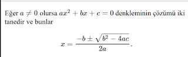

# MathJax: Web Sayfalarinda Javascript ile Matematik Formülleri

MathJax: Web Sayfalarinda Javascript ile Matematik Formülleri

LaTeX ile yazilan matematik formullerinin HTML icinde gosterilebilmesi icin MathJax Javascript kutuphanesi var. Gerekli JS dosyalari diger HTML, CSS dosyalari ile birlikte ayni dizinde olur, gerektikce servis makinasindan alinir, ve formul grafiginin uretilmesi icin islem zaten Javascript ile kullanicinin tarayicisinda yapilir.

Kurmak icin GH'dan kod alinir, 

https://github.com/mathjax/MathJax

Depo icinde gereken dosya / dizinler

config/

extensions/

jax/

MathJax.js

Bu dosyalar sayfalarla beraber web servis makinasindan servis edilecek. Simdi bu dosyalarla ayni seviyede olan bir HTML dosyasi icinde

<!DOCTYPE html>

<html>

<head>

<meta http-equiv="Content-Type" content="text/html; charset=UTF-8" />

</head>

<body>

Eğer $a \ne 0$ olursa  \(ax^2 + bx + c = 0\) denkleminin çözümü iki tanedir

ve bunlar $$x = {-b \pm \sqrt{b^2-4ac} \over 2a}.$$

</body>

</html>

Bu dosya tarayicida gosterilince 

MathJax yaklasimi guzel cunku ek bir "uretme komutu"na gerek duymuyor - kod HTML icinde, bildigimiz LaTeX olarak kaliyor, servis tarafinda neredeyse hic islem yapilmiyor, sayfayi gormek isteyen kisinin bilgisayari gerekli islemi yaparak formulu goruyor. 

