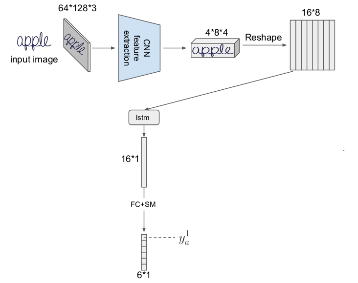
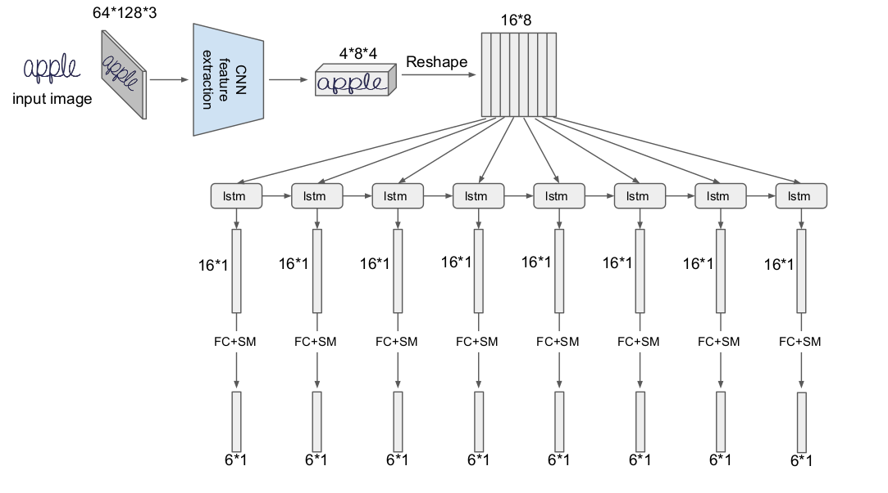
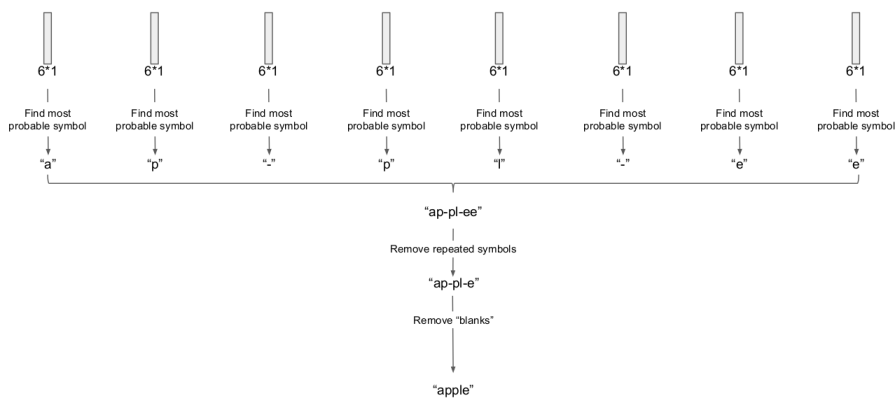
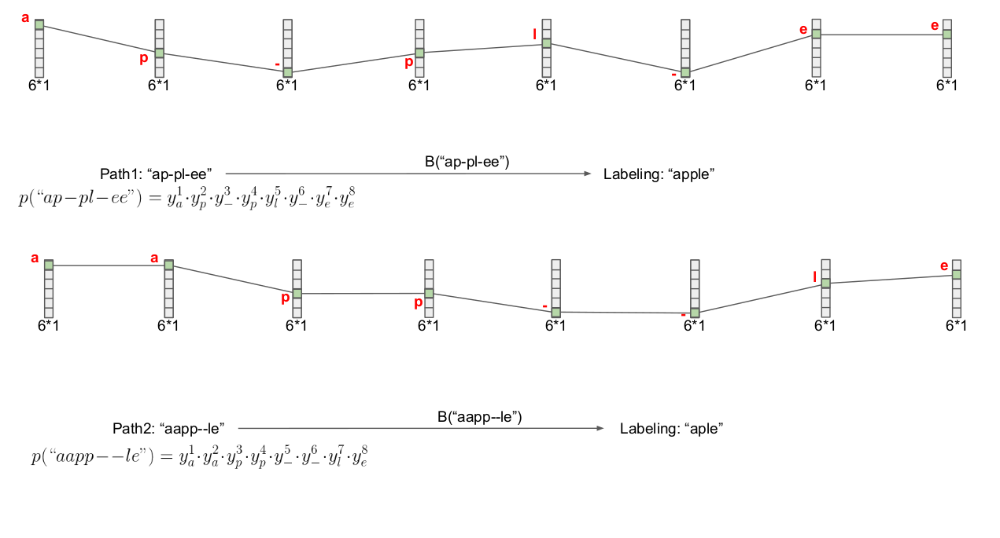
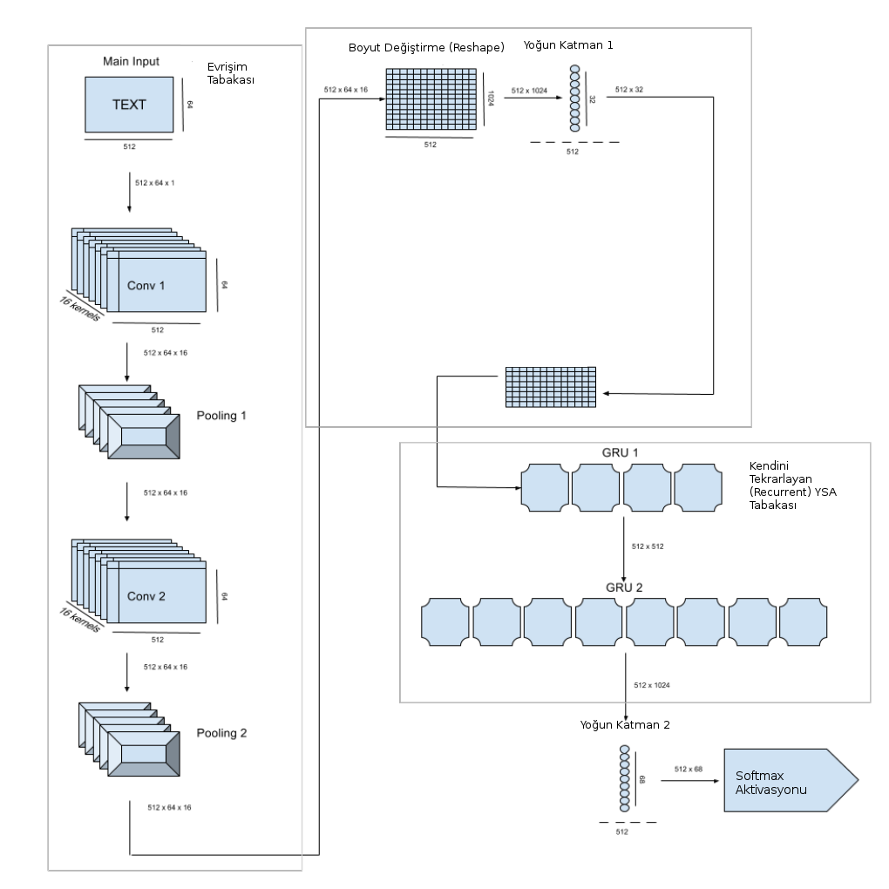
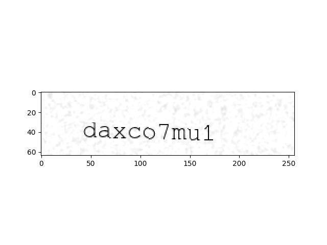

# Optik Karakter Tanıma, Yazı Tanıma (Optical Character Recognition -OCR-)

OCR, iki dizini birbiriyle uyuşturma problemi olarak görülebilir. Dizi
derken neden bahsetmek istediğimi anlatmaya uğrasayım. Çoğunlukla tanımak
istediğimiz görüntü bir kelime, bir sayı dizisidir, ve bu dizi ufak ya da
büyük bir kelime olabilir. Girdi ise boyutları önceden tanımlanan görüntüyü
temsil eden veri parçaları olacaktır, bu görüntü bir kelimeye
odaklanabilir, görüntü aktarılmadan önce o kelime bir kare içine alınmaya
çalışır.

Kelime görüntüsünü bir evrişim tabakası üzerinden mesela işlenmiş veriler
olarak parça parça, kesitler olarak alabiliriz. Ardından veri parçalarının
zamansal ilintilerini yakalayabilmek için onları bir LSTM katmanına
verebiliriz, ve her zaman adımındaki alfabe boyutundaki çıktılar, bir
vektör olarak, her hücrede belli bir harfin olma olasılığı olarak
ayarlanabilir. Eğer en son katmandan sonra uygun bir hata fonksiyonu
tanımlayabilirsek bilinen etiketli kelimeler, onların görüntüsünü içeren
eğitim verisi üzerinden tüm bu yapıyı eğitebiliriz.


Üstteki figürde İngilizce apple (elma) kelimesini görüyoruz. Girdi görüntü
(input image) genişliği 128, yüksekliği 64 ve üç kanal var, bu kanallar her
renk için R,G,B olabilir. İlk önce evrişimsel sinir ağı özellik çıkartma
(CNN feature extraction) katmanı ile özellik bulmaya uğraşılıyor, buradan
(4,8,4) boyutunda bir tensor elde ediliyor. Bu tensor (16,8) boyutuna
getiriliyor, bu yeni tensor'daki her kolon (biri yeşille işaretli) önceki
tensorda bir parçaya tekabül eder, yani kelime görüntüsünün bir parçasına.

Ardından şekillendirme (reshape) sonrası alınan yeni tensoru parça parça
LSTM tabakasına veriyoruz, ilk LSTM hücresi mesela alttaki gibi,



LSTM sonrası tamamen bağlanmış (fully-connected) tabaka ve softmax ile
alfabe tahmini üretiliyor. Bu örnekte alfabede 6 karakter var, bu sebeple
vektör (6,1) boyutlu, karakterler 'a','e','l','p','z','-'. En son '-'
karakteri "boş karakter'' demek, boş karakterin niye lazım olduğunu
göreceğiz. Vektördeki ilk hücre $y_a^1$ yani 'a', o noktada 'a'
karakterinin olma olasılığı. Diğerleri o birinci hücre için aşağı doğru
$y_e^1$, $y_l^1$, vs. diye devam edecek. Şimdi tüm LSTM hücrelerini iceren
resme bakalım,



Şimdi elimizde 8 tane 6 boyutlu softmax vektörü var. 

Bu noktada iki sorumuz var: ilki YSA eğitimi bağlamında nasıl bir kayıp
fonksiyonu bulalım ki uyan kelimeler için az, kötü uyanlar için yüksek
rakam üretsin, ikincisi farklı boyutlardaki iki vektörün birbirine uyması
ne demektir? Tüm bunlar tabii ki üstteki softmax vektörlerini nasıl dekode
edip bir kelime üretiriz sorusu ile yakın alakalı.

Uyum konusu önemli çünkü el yazısı, ya da font seçimi dolasıyla bazı
karakterler diğerlerinden daha fazla yer tutuyor olabilir. Aynı şey ses
tanıma için de geçerli, "merhaba'' derken kimisi "meeeerhaba'' demiş
olabilir, burada 'e' harfinden daha fazla ses verisi alınacaktır, ama o
noktada üzerinde olunan harf değişmemiştir.

Dekode için akla gelebilecek ilk yaklaşım her vektör için en yüksek
olasılıktaki hücreye tekabül eden karakteri seçmek (find the most probable
symbol), sonra bir ek işlem tabakasına giderek bazı elemeler, düzeltmeler
yaparak bir kelimeye erişmeye uğraşmak. Mesela en olasılı karakter seçimi
sonrası arka arka gelen tekrar eden harfleri çıkartırız, sonra boş
karakteri çıkartırız,



Tüm bunlar oldukca basit görünüyor. Fakat tüm bu işlemleri bir kayıp
fonksiyonu olarak kullanmak istersek işler karışıyor. Çünkü kelime bulmaya
uğraşırken softmax'lerde başlangıçtan sona pek çok farklı gidiş yolu var,
tüm kombinasyonları işlemek zor.



Ayrıca üstteki kısaltma algoritması en iyi sonucu da her zaman
vermeyebilir. Kombinasyon derken üstteki örnek için bile $6^8 = 1,679,616$
tane seçenekten bahsediyoruz. Daha büyük bir sözlük, ve daha fazla LSTM
adımı için bu sayı astronomik boyutlara varabilir.

Çözüm nedir? Seçenekler arasından uygun yolu bulup hesaplayan, ya da verili
bir etiket için olurluk (likelihood) hesabı yapan bir yaklaşım var, buna
bağlantısal zamansal bedel (connectionist temporal cost) adı veriliyor,
detaylar için [1,2,3]. CTC dinamik programlama kullanır, ayrıca yolu
hesaplarken Gizli Markov Modellerine benzer $\alpha,\beta$ fonksiyonları
yaratır, ve YSA öğrenimi bağlamında bu fonksiyonlar üzerinden gradyan
hesabı mümkün oluyor, ve farklı boyuttaki girdi / çıktı arasındaki uyuşma,
eğitim işte bu şekilde yapılıyor.

TensorFlow ile CTC

TF ile CTC hesabını görelim. Alttaki çıktının daha önce şemasını verdiğimiz
YSA'ya benzer bir yapının son adımından çıkan softmax olasılıkları olduğunu
düşünelim. Verinin satırları her LSTM adımı, her kolon alfabedeki farklı
bir karakter. 

```python
train_inputs_0 = np.asarray(
    [[0.633766, 0.221185, 0.0917319, 0.0129757, 0.0142857, 0.0260553],
     [0.111121, 0.588392, 0.278779, 0.0055756, 0.00569609, 0.010436],
     [0.0357786, 0.633813, 0.321418, 0.00249248, 0.00272882, 0.0037688],
     [0.0663296, 0.643849, 0.280111, 0.00283995, 0.0035545, 0.00331533],
     [0.458235, 0.396634, 0.123377, 0.00648837, 0.00903441, 0.00623107]],
    dtype=np.float32)
```

Bu yapı üzerinde için mesela `[0, 1, 2, 1, 0]` dizisini kontrol
etmemiz istense dizinin kaybı / hatası nedir?

```python
import tensorflow as tf

def sparse_tuple_from(sequences, dtype=np.int32):
    indices = []
    values = []
    for n, seq in enumerate(sequences):
        indices.extend(zip([n] * len(seq), range(len(seq))))
        values.extend(seq)
    indices = np.asarray(indices, dtype=np.int64)
    values = np.asarray(values, dtype=dtype)
    shape = np.asarray([len(sequences), np.asarray(indices).max(0)[1] + 1], dtype=np.int64)
    return indices, values, shape

train_seq_len = [5]
num_features = 6

tf.reset_default_graph()

targets = tf.sparse_placeholder(tf.int32)
logits1 = tf.placeholder(tf.float32, [None, num_features] )
logits2 = tf.reshape(logits1, [1, -1, num_features])
logits3 = tf.transpose(logits2, (1, 0, 2))
seq_len = tf.placeholder(tf.int32, [None])
loss = tf.nn.ctc_loss(targets, logits3, seq_len)
decoded, log_prob = tf.nn.ctc_greedy_decoder(logits3, seq_len)

with tf.Session() as sess:

     sess.run(tf.global_variables_initializer())

     train_targets = sparse_tuple_from([[0, 1, 2, 1, 0]])     
     feed_t = { logits1: train_inputs_0, 
                targets: train_targets, 
                seq_len: train_seq_len }
     res = sess.run(loss, feed_t)     
     print u'kayıp', res
```

```
kayıp [ 7.27719784]
```

Farklı veri, farklı çıktı,

```python
train_inputs_1 = np.asarray(
    [[0.30176, 0.28562, 0.0831517, 0.0862751, 0.0816851, 0.161508],
     [0.24082, 0.397533, 0.0557226, 0.0546814, 0.0557528, 0.19549],
     [0.230246, 0.450868, 0.0389607, 0.038309, 0.0391602, 0.202456],
     [0.280884, 0.429522, 0.0326593, 0.0339046, 0.0326856, 0.190345],
     [0.423286, 0.315517, 0.0338439, 0.0393744, 0.0339315, 0.154046]],
    dtype=np.float32)

with tf.Session() as sess:

     sess.run(tf.global_variables_initializer())

     train_targets = sparse_tuple_from([[0, 1, 1, 0]])     
     feed_t = { logits1: train_inputs_1, 
                targets: train_targets, 
                seq_len: train_seq_len }
     res = sess.run(loss, feed_t)     
     print u'kayıp', res
```

```
kayıp [ 8.08572388]
```

Şimdi ilginç bir veri, burada veri direk 2. karakter olsun diyor. O zaman
buna uyan çıktılar alçak (kayıp az), uymayanlar yüksek sonuç vermeli,

```python
train_inputs_2 = np.asarray(
    [[0.0, 0.0, 1.0, 0.0, 0.0, 0.0],
     [0.0, 0.0, 1.0, 0.0, 0.0, 0.0],
     [0.0, 0.0, 1.0, 0.0, 0.0, 0.0],
     [0.0, 0.0, 1.0, 0.0, 0.0, 0.0],
     [0.0, 0.0, 1.0, 0.0, 0.0, 0.0]],
    dtype=np.float32)

with tf.Session() as sess:

     sess.run(tf.global_variables_initializer())

     train_targets = sparse_tuple_from([[2, 2, 2]]) 
     feed_t = { logits1: train_inputs_2, 
                targets: train_targets, 
                seq_len: train_seq_len }
     res = sess.run(loss, feed_t)     
     print u'kayıp', res

     train_targets = sparse_tuple_from([[0, 1, 1, 0]]) 
     feed_t = { logits1: train_inputs_2, 
                targets: train_targets, 
                seq_len: train_seq_len }
     res = sess.run(loss, feed_t)     
     print u'kayıp', res
```

```
kayıp [ 7.21795845]
kayıp [ 10.21795845]
```

Dekode

TF CTC ile dekode işlemi de yapılabilir,

```python
with tf.Session() as sess:

     sess.run(tf.global_variables_initializer())

     feed_dec = { logits1: train_inputs_0, seq_len: train_seq_len }
     decoded_res = sess.run(decoded, feed_dec)     
     print 'dekode', decoded_res
     
     feed_dec = { logits1: train_inputs_1, seq_len: train_seq_len }
     decoded_res = sess.run(decoded, feed_dec)     
     print 'dekode', decoded_res
     
     feed_dec = { logits1: train_inputs_2, seq_len: train_seq_len }
     decoded_res = sess.run(decoded, feed_dec)     
     print 'dekode', decoded_res
```

```
dekode [SparseTensorValue(indices=array([[0, 0],
       [0, 1],
       [0, 2]]), values=array([0, 1, 0]), dense_shape=array([1, 3]))]
dekode [SparseTensorValue(indices=array([[0, 0],
       [0, 1],
       [0, 2]]), values=array([0, 1, 0]), dense_shape=array([1, 3]))]
dekode [SparseTensorValue(indices=array([[0, 0]]), values=array([2]), dense_shape=array([1, 1]))]
```

En son örnekte `values=array([2])` sonucu geldi, yani dekode işlemi
doğru bir şekilde tüm adımlar için tek bir seçim olan 2 seçimini yaptı. Bu
seçim arka arkaya tekrarlanmış olacaktı tabii ki bu sebeple bir kez
gösteriliyor, appleeee yerine apple demek gibi.

Ağ Yapısı ve Kod

Şimdi örnek veriyi, alfabeyi genişletelim ve ağ yapısını daha
derinleştirelim. Altta gösterilen ağ yapısı [4] tezi ve onun esinlendiği
[5] kütüphanesini baz alıyor. Nihai kodda teze göre bazı boyut
değişiklikleri var, okur bunu akılda tutarak diyagramları, işlemleri takip
edebilir. Mimaride ilk evrişim tabakasında arka arkaya iki evrişim ve max
pool operasyonları var, sonra bir boyut değiştirme sonrası tamamen
bağlanmış (fully connected) bir tabakaya sonuç geçiliyor, oradan çıkan
sonuç iki yönlü (bi-directional) GRU tabakasına veriliyor. Bu zamansal YSA
ilk başta görülen tek LSTM seviyesinden daha çetrefil yani. GRU hücreleri,
LSTM hücre yapısının biraz daha basitleştirilmiş halidir. Devam edelim,
buradan çıkan sonuçlar bir başka yoğun tabakaya oradan da softmax
aktivasyonuna veriliyor, kayıp fonksiyonu CTC.



```python
# -*- coding: utf-8 -*-
import os, util
import datetime
import numpy as np
from keras import backend as K
from keras.layers.convolutional import Conv2D, MaxPooling2D
from keras.layers import Input, Dense, Activation
from keras.layers import Reshape, Lambda
from keras.layers.merge import add, concatenate
from keras.models import Model
from keras.layers.recurrent import GRU
from keras.optimizers import SGD
from keras.utils.data_utils import get_file
from keras.preprocessing import image
import keras.callbacks

def ctc_lambda_func(args):
    y_pred, labels, input_length, label_length = args
    # the 2 is critical here since the first couple outputs of the RNN
    # tend to be garbage:
    y_pred = y_pred[:, 2:, :]
    return K.ctc_batch_cost(labels, y_pred, input_length, label_length)

def get_model(img_w,img_h,minibatch_size,pool_size):
    conv_filters = 20
    kernel_size = (2, 2)
    time_dense_size = 32
    rnn_size = 256

    input_shape = (img_w, img_h, 1)
    
    img_gen = util.TextImageGenerator(minibatch_size=minibatch_size,
                                      img_w=img_w,
                                      img_h=img_h,
                                      downsample_factor=(pool_size ** 2),
                                      absolute_max_string_len=12
    )
        
    act = 'relu'
    
    input_data = Input(name='the_input', shape=input_shape, dtype='float32')
    
    inner = Conv2D(conv_filters, kernel_size, padding='same',
                   activation=act, kernel_initializer='he_normal',
                   name='conv1')(input_data)
    
    inner = MaxPooling2D(pool_size=(pool_size, pool_size), name='max1')(inner)
    
    inner = Conv2D(conv_filters, kernel_size, padding='same',
                   activation=act, kernel_initializer='he_normal',
                   name='conv2')(inner)
    
    inner = MaxPooling2D(pool_size=(pool_size, pool_size), name='max2')(inner)
    
    conv_to_rnn_dims = (img_w // (pool_size ** 2), (img_h // (pool_size ** 2))
                        * conv_filters)

    inner = Reshape(target_shape=conv_to_rnn_dims, name='reshape')(inner)
    inner = Dense(time_dense_size, activation=act, name='dense1')(inner)
    
    gru_1 = GRU(rnn_size, return_sequences=True,
                kernel_initializer='he_normal', name='gru1')(inner)
    
    gru_1b = GRU(rnn_size, return_sequences=True,
                 go_backwards=True, kernel_initializer='he_normal',
                 name='gru1_b')(inner)

    gru1_merged = add([gru_1, gru_1b])

    gru_2 = GRU(rnn_size, return_sequences=True,
                kernel_initializer='he_normal', name='gru2')(gru1_merged)
    
    gru_2b = GRU(rnn_size, return_sequences=True,
                 go_backwards=True, kernel_initializer='he_normal',
                 name='gru2_b')(gru1_merged)

    inner = Dense(img_gen.get_output_size(),
                  kernel_initializer='he_normal',
                  name='dense2')(concatenate([gru_2, gru_2b]))
    
    y_pred = Activation('softmax', name='softmax')(inner)
    
    Model(inputs=input_data, outputs=y_pred).summary()

    labels = Input(name='the_labels',
                   shape=[img_gen.absolute_max_string_len],
                   dtype='float32')

    input_length = Input(name='input_length', shape=[1], dtype='int64')

    label_length = Input(name='label_length', shape=[1], dtype='int64')

    loss_out = Lambda(ctc_lambda_func, output_shape=(1,), name='ctc')([y_pred,
                                                                       labels,
                                                                       input_length,
                                                                       label_length])

    sgd = SGD(lr=0.02, decay=1e-6, momentum=0.9, nesterov=True, clipnorm=5)

    model = Model(inputs=[input_data,
                          labels,
                          input_length,
                          label_length], outputs=loss_out)

    model.compile(loss={'ctc': lambda y_true, y_pred: y_pred}, optimizer=sgd)

    test_func = K.function([input_data], [y_pred])

    return model, test_func
        

if __name__ == '__main__':
    pool_size = 3
    img_w = 256
    img_h = 64
    minibatch_size = 10
    img_gen = util.TextImageGenerator(minibatch_size=minibatch_size,
                                      img_w=img_w,
                                      img_h=img_h,
                                      downsample_factor=(pool_size ** 2),
                                      absolute_max_string_len=12
    )
    model, dummy = get_model(img_w,img_h,minibatch_size,pool_size)
    mfile = "/tmp/ocr.h5"
    if os.path.isfile(mfile):
        print 'Loaded', mfile
        model.load_weights(mfile)

    model.fit_generator(generator=img_gen.next_train(),
                        steps_per_epoch=1000,
                        epochs=1,
                        validation_steps=0,
                        callbacks=[img_gen],
                        initial_epoch=0)

    model.save(mfile)
    
```

Eğitim verisi ne olacak? Burada ilginç bir teknik kullanacağız, bir
kelimenin imajını üretebilen yazılımlar var, yani masaüstünde Paint ya da
Gimp ile bir imaj içine yazı yazmak gibi, bu kodlardan birini kullanıp,
hatta üretilen imajı deforme bile ederek tanıma algoritmasının işini
bilerek zorlaştırabiliriz, ve eğitime bu verileri sokarak, hiç ek eğitim
verisi diskte tutmadan eğitim operasyonunu istediğimiz şekilde
gerçekleştiririz. Bir örnek kelime imajı üretelim mesela,

```python
import util

img_w = 256
img_h = 64

img_gen = util.TextImageGenerator(minibatch_size=1,
                                  img_w=img_w,
                                  img_h=img_h,
                                  downsample_factor=4,
                                  absolute_max_string_len=12)

for x in img_gen.next_train(): break
img = x[0]['the_input'].reshape(img_w,img_h).T
print x[0]['source_str'],
plt.imshow(img,cmap='gray',interpolation="none")
plt.savefig('ocr_06.png')    
```

```
[u'daxco7mu1']
```

İmaj neye benziyor?



Eğitim verisini üreteç (generator) tekniği [6] üzerinden yaratıyoruz dikkat
edildiyse, üreteç eğitim verisini bir gezici arayüzü üzerinden eğitim
rutinine vermemizi sağlıyor. Üreteç, döngüsünde her dönüldüğünde ve çağıran
veri istendiğinde rasgele bir kelime üretir, bu kelimeyi imaja çevirip
etiketi ile birlikte çağrıyı yapana veriyor. Üreteç yapısını kullanmanın
güzel tarafı çağıran tarafın döngü sözdizimini kullanabilmesi. Üstte tek
bir kere dönüp çıktık (tek imaj istiyorduk), eğitim mekanizması istediği
kadar dönerek istediği kadar eğtim verisi alabilir.

Görüldüğü gibi imaj biraz aşağı doğru eğimli çıktı, bu iyi, çünkü gerçek
dünyada olan şartları tekrarlamak istiyoruz, belki bir cep telefonunun
çektiği resimdeki kelimeleri tanıyacağız ve telefonu mükemmel şekilde
tutmak mümkün değil, farklı açılardan kelimeleri tanıyabilmek çok iyi
olur. Ayrıca kullandığımız rutin suni "gürültü'' bile ekliyor, karlandırma
yapıyor mesela, hatta kelimenin imajın çok farklı yerlerinden
başlatabiliyor. 

Neyse, işte bu şekilde üretilen veri üzerinden eğitimi yapıp raporlanan
kaybı belli bir seviyeye indirdikten sonra (5,6 civarı mesela, fakat uzun
süre sonra 2 seviyesi de mümkün), YSA hazır demektir. Bizim önceden
eğittiğimiz YSA'yı yükleyelim,

```python
import train
mfile = '/tmp/ocr.h5'

pool_size = 3
img_w = 256
img_h = 64
minibatch_size = 1
model, test_func = train.get_model(img_w,img_h,minibatch_size,pool_size)
model.load_weights(mfile)
```

```
____________________________________________________________________________________________________
Layer (type)                     Output Shape          Param #     Connected to                     
====================================================================================================
the_input (InputLayer)           (None, 256, 64, 1)    0                                            
____________________________________________________________________________________________________
conv1 (Conv2D)                   (None, 256, 64, 20)   100         the_input[0][0]                  
____________________________________________________________________________________________________
max1 (MaxPooling2D)              (None, 85, 21, 20)    0           conv1[0][0]                      
____________________________________________________________________________________________________
conv2 (Conv2D)                   (None, 85, 21, 20)    1620        max1[0][0]                       
____________________________________________________________________________________________________
max2 (MaxPooling2D)              (None, 28, 7, 20)     0           conv2[0][0]                      
____________________________________________________________________________________________________
reshape (Reshape)                (None, 28, 140)       0           max2[0][0]                       
____________________________________________________________________________________________________
dense1 (Dense)                   (None, 28, 32)        4512        reshape[0][0]                    
____________________________________________________________________________________________________
gru1 (GRU)                       (None, 28, 256)       221952      dense1[0][0]                     
____________________________________________________________________________________________________
gru1_b (GRU)                     (None, 28, 256)       221952      dense1[0][0]                     
____________________________________________________________________________________________________
add_1 (Add)                      (None, 28, 256)       0           gru1[0][0]                       
                                                                   gru1_b[0][0]                     
____________________________________________________________________________________________________
gru2 (GRU)                       (None, 28, 256)       393984      add_1[0][0]                      
____________________________________________________________________________________________________
gru2_b (GRU)                     (None, 28, 256)       393984      add_1[0][0]                      
____________________________________________________________________________________________________
concatenate_1 (Concatenate)      (None, 28, 512)       0           gru2[0][0]                       
                                                                   gru2_b[0][0]                     
____________________________________________________________________________________________________
dense2 (Dense)                   (None, 28, 40)        20520       concatenate_1[0][0]              
____________________________________________________________________________________________________
softmax (Activation)             (None, 28, 40)        0           dense2[0][0]                     
====================================================================================================
Total params: 1,258,624
Trainable params: 1,258,624
Non-trainable params: 0
____________________________________________________________________________________________________
```

Şimdi üstteki örnek imajı tanımaya uğraşalım,

```python
import itertools

def labels_to_text(labels):
    ret = []
    for c in labels:
        if c == len(util.alphabet):  # CTC Blank
            ret.append("")
        else:
            ret.append(util.alphabet[c])
    return "".join(ret)


def decode_batch(test_func, word_batch):
    out = test_func([word_batch])[0]
    ret = []
    for j in range(out.shape[0]):
        out_best = list(np.argmax(out[j, 2:], 1))
        out_best = [k for k, g in itertools.groupby(out_best)]
        outstr = labels_to_text(out_best)
        ret.append(outstr)
    return ret

pred_result = decode_batch(test_func, x[0]['the_input'])[0]
print pred_result
```

```
qaxco7mu4
```

Fena değil.

Gerekli kurulum

```
sudo apt-get install python-pip
sudo apt-get install build-essential
sudo apt-get install libffi-dev
sudo apt-get install libcairo
sudo apt-get install libcairo2

sudo pip install keras
sudo pip install tensorflow
sudo pip install pandas
sudo pip install cffi
sudo pip install cairocffi
sudo pip install editdistance
sudo pip install cairo
sudo pip install pygtk
sudo pip install cairocffi
sudo pip install h5py
```

Kaynaklar

[1] Graves, *Supervised Sequence Labelling with Recurrent Neural Networks*, 
    [https://www.cs.toronto.edu/~graves/preprint.pdf](https://www.cs.toronto.edu/~graves/preprint.pdf)

[2] Graves, *How to build a recognition system (Part 2): CTC Loss*, 
    [https://docs.google.com/presentation/d/12gYcPft9_4cxk2AD6Z6ZlJNa3wvZCW1ms31nhq51vMk](https://docs.google.com/presentation/d/12gYcPft9_4cxk2AD6Z6ZlJNa3wvZCW1ms31nhq51vMk)

[3] Graves, *How to build a recognition system (Part 1): CTC Loss*, 
    [https://docs.google.com/presentation/d/1AyLOecmW1k9cIbfexOT3dwoUU-Uu5UqlJZ0w3cxilkI](https://docs.google.com/presentation/d/1AyLOecmW1k9cIbfexOT3dwoUU-Uu5UqlJZ0w3cxilkI)

[4] Troller, *Practical OCR system based on state of art neural networks*, 
    [https://support.dce.felk.cvut.cz/mediawiki/images/2/24/Bp_2017_troller_milan.pdf](https://support.dce.felk.cvut.cz/mediawiki/images/2/24/Bp_2017_troller_milan.pdf)

[5] Chollet, *Keras*, 
    [https://github.com/fchollet/keras/blob/master/examples/image_ocr.py](https://github.com/fchollet/keras/blob/master/examples/image_ocr.py)

[6] Bayramlı, *Fonksiyon Gezmek ve Yield*, 
    [https://burakbayramli.github.io/dersblog/sk/2011/02/fonksiyon-gezmek-ve-yield.html](https://burakbayramli.github.io/dersblog/sk/2011/02/fonksiyon-gezmek-ve-yield.html)


    

