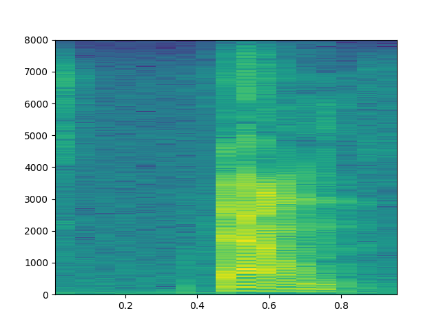
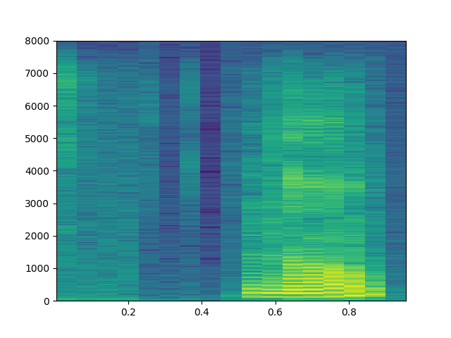

# Konuşma Tanıma (Speech Recognition)

Frekans Üzerinden Özellik Çıkartımı, RNN, LSTM, GRU

1 saniyelik ses dosyaları var, bu dosyalardaki ses kayıtları dört farklı
komutu içeriyor, İngilizce up, down, yes, no (yukarı, aşağı, evet, hayır)
komutları. Ses kayıtları aslında zaman serileridir, tek boyutlu bir veri,
mesela 1 saniyelik 16,000 sayı içeren bir vektör. Örnek bir 'down' kaydının
neye benzediğini görelim,

```python
import util
import scipy.io.wavfile, zipfile
import io, time, os, random, re

f = util.train_dir + '/down/004ae714_nohash_0.wav'
wav = io.BytesIO(open(f).read())
v = scipy.io.wavfile.read(wav)
print (v[1])
plt.plot(v[1])
plt.savefig('speech_01.png')
```

```
train 8537 val 949
[-130 -135 -131 ..., -154 -190 -224]
```


Yapay öğrenme bağlamında zaman serileri için daha önce [7] yazısında LSTM
yapısını görmüştük. Örnek olarak zaman serilerini sınıfladık, zaman
serisindeki tüm veriler LSTM'e verilmişti, o zaman bir şeride 150 kusur
veri noktası varsa, o kadar LSTM hücresi yaratılacaktı. Fakat içinde
binlerce öğe olan seriler için bu iyi olmayabilir. Çözüm seriyi bir şekilde
özetleyerek bu daha az olan veriyi LSTM'e vermek. Bu özetlere ses işleme
alanında parmak izi (fingerprint) ismi de verilmekte.

Ses verilerini frekans üzerinden özetlemek bilinen bir teknik, ses verisi
ufak pencerelere bölünür, bu pencereler üzerinde Fourier transformu
işletilir, ve oradaki frekans bilgileri, hangi frekansın ne kadar önemli
olduğu elde edilir. Spektogram bu bilgiyi renkli olarak göstermenin bir
yolu, üstteki ses için,

```python
plt.specgram(v[1], Fs=util.fs, NFFT=1024)
plt.savefig('speech_02.png')
```


Spektogramın örüntü tanıma için kullanılabileceğini anlamak için bir tane
daha farklı 'down' sesi, bir de 'no' sesinin spektogramına bakalım,

```python
f1 = util.train_dir + '/down/0f3f64d5_nohash_2.wav'
wav1 = io.BytesIO(open(f1).read())
v1 = scipy.io.wavfile.read(wav1)
plt.specgram(v1[1], Fs=util.fs, NFFT=1024)
plt.savefig('speech_03.png')

f2 = util.train_dir + '/no/01bb6a2a_nohash_0.wav'
wav2 = io.BytesIO(open(f2).read())
v2 = scipy.io.wavfile.read(wav2)
plt.specgram(v2[1], Fs=util.fs, NFFT=1024)
plt.savefig('speech_04.png')
```




Görüyoruz ki 'down' seslerinin spektogramları birbirine benziyor. Öğrenme
için bu yapıyı kullanabiliriz. Bu arada spektogram "grafiği'' y-ekseninde
frekansları, x-ekseni zaman adımları gösterir, grafikleme kodu her zaman
penceresindeki belli frekans kuvvetlerinin hangi frekans kutucuğuna
düştüğüne bakar ve o kutucukta o kuvvete göre renklendirme yapar. Şimdi bu
grafikleme amaçlı, ama bazıları bu grafiğe bakarak "ben çıplak gözle bunu
tanıyabiliyorum, o zaman görsel tanımayla üstteki imajla sesi tanıyacak bir
DYSA kullanayım'' diye düşünebiliyor. Bu işleyen bir metot, zaten DYSA'nın
görsel tanıma tarihi eski, orada bilinen bir sürü teknik var. Her neyse
bazıları üstteki görsel spektogram grafiği, yani R,G,B kanallı çıktı
üzerinde görsel tanıma yapmayı da seçebiliyor, fakat bu şart değil, bir
spektogram, bir veri durumunda iki boyutlu bir matriste gösterilebilir.
TensorFlow ile bu hesabı örnek rasgele bir veri üzerinde yapalım,

```python
import tensorflow as tf

init_op = tf.global_variables_initializer()
data = tf.placeholder(tf.float32, [1, 16000])
print (data)
stfts = tf.contrib.signal.stft(data, frame_length=400, 
                               frame_step=100, fft_length=512)

spec = tf.abs(stfts)
print (spec)

s = np.random.rand(1,16000) # rasgele bir zaman serisi uret
with tf.Session() as sess:
     sess.run(tf.global_variables_initializer())
     res = sess.run(spec, feed_dict={data: s })  
print (res)
```

```
Tensor("Placeholder_1:0", shape=(1, 16000), dtype=float32)
Tensor("Abs_1:0", shape=(1, 157, 257), dtype=float32)
[[[  99.39490509   65.10092163   12.84116936 ...,    5.39213753
      3.90902305    1.35875702]
  [ 100.60041809   66.32343292   12.92744541 ...,    4.64194965
      1.80256999    2.0458374 ]
  [ 104.70896149   70.13975525   15.93750095 ...,    3.21846962
      1.70909929    1.34316254]
  ..., 
  [  97.82588196   63.51060867   11.62135887 ...,    3.23712349
      1.94706416    0.41742325]
  [ 105.89834595   71.85715485   17.83632851 ...,    4.6476922
      2.42140603    1.37829971]
  [ 106.46664429   71.12073517   16.69457436 ...,    6.58148479
x      3.24354243    3.80913925]]]
```

Cok Katmanlı LSTM

LSTM, ya da diğer her RNN çeşidi çok katmanlı olarak kullanılabilir. 


Girdiler en alttaki LSTM hücrelerine geçiliyor, bu hücreler birbirlerine
konum aktarımı yaptıkları gibi bir sonraki LSTM katmanına girdi de 
sağlıyorlar, bu aktarım en üst tabakaya kadar gidiyor. Peki o zaman
sınıflama amaçlı olarak kullanılan "en son'' hücre hangisi olacaktır?
Bunun için tipik olarak katmanlı LSTM'de en üst ve en sondaki hücre
kullanılır. 

Her hücrede 200 nöron var, o zaman her katman (124,200) boyutunda çünkü
spektogramdan 124 zaman boyutu geldi, ve LSTM'in en sondaki hücreden alınan
vektör 200 boyutunda olacak, bu çıktı bir tam bağlanmış (fully-connected)
katmana verilerek buradan 4 tane etiket için olasılık üretilecek, ve tahmin
için kullanılan sonuçlar bunlar olacak. O sayılardan en büyük olanı en
olası olan ses komutudur.

Tüm modeli görelim,

```python
# model_lstm.py
import tensorflow as tf, util, os

class Model:
    def __init__(self):
                
        self.file = os.path.basename(__file__).replace(".pyc","").replace(".py","")
        
        self.mfile = "/tmp/" + self.file + ".ckpt"

        self.batch_size = 100
        
        self.num_epochs = 200

        self.dop_param = 0.0 # dropout olasiligi

        self.num_layers = 4
        
        self.num_cell = 200

        tf.reset_default_graph()

        self.dop = tf.placeholder(tf.float32) # dropout olasiligi (probability)
        
        self.data = tf.placeholder(tf.float32, [None, util.fs])

        print (self.data)
        
        self.stfts = tf.contrib.signal.stft(self.data, frame_length=256,
                                            frame_step=128, fft_length=256)

        print (self.stfts)
        
        self.fingerprint = tf.abs(self.stfts)
        
        print (self.fingerprint)

        self.y = tf.placeholder(tf.float32, shape=[None, len(util.labels)])
        cells = []
        for _ in range(self.num_layers):
            cell = tf.contrib.rnn.LSTMCell(self.num_cell)
            cell = tf.contrib.rnn.DropoutWrapper(cell, output_keep_prob=1-self.dop)
            cells.append(cell)
        cell = tf.contrib.rnn.MultiRNNCell(cells)
        output, states = tf.nn.dynamic_rnn(cell, self.fingerprint, dtype=tf.float32)
        print (output)
        for x in states: print (x)
        self.last = states[-1][0] # en ust sagdaki son hucre

        print (self.last)

        self.logits = tf.contrib.layers.fully_connected(inputs=self.last,
                                                        num_outputs=len(util.labels),
                                                        activation_fn=None)

        print (self.logits)
        
        self.softmax = tf.nn.softmax_cross_entropy_with_logits(logits=self.logits,
                                                               labels=self.y) 

        self.cross_entropy = tf.reduce_mean(self.softmax)

        self.train_step = tf.train.AdamOptimizer(0.001).minimize(self.cross_entropy)
        
        self.correct_prediction = tf.equal(tf.argmax(self.y,1),
                                           tf.argmax(self.logits,1))

        self.evaluation_step = tf.reduce_mean(tf.cast(self.correct_prediction,
                                                      tf.float32))


        self.saver = tf.train.Saver()
                
        
# training 0.91 validation 0.926238
```

Modelin girdi tensor'un boyutlarını nasıl değiştirdiği altta (üstteki resim
iki katman gösterdi, bizim modelde 4 katman var),

```python
import model_lstm
m = model_lstm.Model()
```

```
Tensor("Placeholder_1:0", shape=(?, 16000), dtype=float32)
Tensor("stft/rfft:0", shape=(?, 124, 129), dtype=complex64)
Tensor("Abs:0", shape=(?, 124, 129), dtype=float32)
Tensor("rnn/transpose:0", shape=(?, 124, 200), dtype=float32)
LSTMStateTuple(c=<tf.Tensor 'rnn/while/Exit_2:0' shape=(?, 200) dtype=float32>, h=<tf.Tensor 'rnn/while/Exit_3:0' shape=(?, 200) dtype=float32>)
LSTMStateTuple(c=<tf.Tensor 'rnn/while/Exit_4:0' shape=(?, 200) dtype=float32>, h=<tf.Tensor 'rnn/while/Exit_5:0' shape=(?, 200) dtype=float32>)
LSTMStateTuple(c=<tf.Tensor 'rnn/while/Exit_6:0' shape=(?, 200) dtype=float32>, h=<tf.Tensor 'rnn/while/Exit_7:0' shape=(?, 200) dtype=float32>)
LSTMStateTuple(c=<tf.Tensor 'rnn/while/Exit_8:0' shape=(?, 200) dtype=float32>, h=<tf.Tensor 'rnn/while/Exit_9:0' shape=(?, 200) dtype=float32>)
Tensor("rnn/while/Exit_8:0", shape=(?, 200), dtype=float32)
Tensor("fully_connected/BiasAdd:0", shape=(?, 4), dtype=float32)
```

Eğitim kodu,

```python
import pandas as pd, sys
import numpy as np, util
import tensorflow as tf
import scipy.io.wavfile, zipfile
import io, time, os, random, re

import model_lstm

m = model_lstm.Model()

sess = tf.Session()

sess.run(tf.global_variables_initializer())

saver = tf.train.Saver()

# eger model diskte varsa yukle
print (m.mfile)
print 'model file exists', os.path.isfile(m.mfile + ".index")
if os.path.isfile(m.mfile + ".index"):
     print ('restoring')
     saver.restore(sess, m.mfile)

train_files, val_files = util.init_files()
     
for i in range(m.num_epochs):
    train_x, train_y = util.get_minibatch(m.batch_size, train_files, val_files)
    d = { m.data:train_x, m.y:train_y, m.dop:m.dop_param}
    acc, _ = sess.run([m.evaluation_step, m.train_step], feed_dict=d)
    print (i, 'accuracy', acc )
    if i % 5 == 0:
         d = { m.data:train_x, m.y:train_y, m.dop:m.dop_param }
         tacc = sess.run(m.evaluation_step, feed_dict=d)
	 val_x, val_y = util.get_minibatch(m.batch_size,train_files, val_files,validation=True)
         d = { m.data:val_x, m.y:val_y, m.dop:0}
         vacc = sess.run(m.evaluation_step, feed_dict=d)
         print (i, 'training', tacc, 'validation', vacc)

# modeli diske yaz
saver.save(sess, m.mfile)
```

Eğitim sonrası modelin başarısı eğitim verisi üzerinde yüzde 91, doğrulama
verisinde yüzde 92. Kullanılan veri [6]'da.

Dropout

TF ile katmanlararası her noktada dropout kullanılabilir. Dropout ile bir
katmandan çıkan ya da ona giren bağlantıların bir kısmı yoksayılır, ve
model elde kalanlar ile iş yapmaya uğraşır, aşırı uygunluk problemlerinden
böylece kaçınılmış olur. Üstteki kodda hangi olasılıkla dropout
yapılacağının olasılığı bir yer tutucu (placeholder) ile TF çizitinin
parçası haline getirildi, niye? Böylece son üründeki kullanımda bu
parametre 0 yapılarak hiç dropout yapılmaması sağlanabiliyor. Eğitim
sırasında bu değer 0.5, 0.2, vs yapılabilir, o zaman dropout devrede
olur. Gerçi biz eğitim sırasında da 0 ile eğittik, yani dropout
kullanmadık, ama lazım olduğu yerler olabilir, referans açısından burada
dursun.

Uygulama

Mikrofondan 1 saniyelik ses parçalarını alıp onu model üzerinde işletip
dört komuttan birini seçen örnek kod `mic.py`'da
bulunabilir. Performans gerçek zamanlı kullanım için yeterliydi, DYSA ufak
bir şey değil aslında, kaç parametre olduğuna bakalım,

```python
print (util.network_parameters(), 'tane degisken var')
```

```
1227204 tane degisken var
```

1 milyon küsur parametreli bir DYSA , yani potansiyel olarak her saniye en
az bir milyon işlem yapılıyor demektir. Görünüşe göre hesap işliyor, TF
bazı optimizasyonlar yapmış belki, ve mikroişlemciler yeterince
hızlı. Teknoloji güzel şey.

CTC

Ses tanıma için bir diğer yaklaşım optik karakter tanıma yazısında görülen
CTC kullanımı [4,5]. Alttaki kodun kullandığı veri [1]'de, yaklaşımın
detayları [2]'de görülebilir. Bu ses verisi koca kelimeler, cümleleri
içeriyor, çok daha uzun veriler bunlar, ve kayıp fonksiyonu artık basit,
belli sayıda komut arasından seçim bazlı değil, büyük bir alfabeden gelen
öğelerin yanyana gelişini kontrol ediyor.

```python
from python_speech_features import mfcc
import numpy as np
import tensorflow as tf
from glob import glob
import time, re, os, random
import numpy as np
import librosa

num_epochs = 1000
num_hidden = 100
num_layers = 1
batch_size = 10
num_batches_per_epoch = 10
sample_rate=8000
num_features = 13
# Accounting the 0th index +  space + blank label = 28 characters
num_classes = ord('z') - ord('a') + 1 + 1 + 1
print ('num_classes %d' % num_classes)

SPACE_TOKEN = '<space>'
SPACE_INDEX = 0
FIRST_INDEX = ord('a') - 1  # 0 is reserved to space
mfile = "/tmp/speech.ckpt"

def convert_inputs_to_ctc_format(audio, fs, target_text):
    #print('convert_inputs_to_ctc_format target_text:' + target_text)
    inputs = mfcc(audio, samplerate=fs, numcep=num_features)
    # Transform in 3D array
    train_inputs = np.asarray(inputs[np.newaxis, :])
    train_inputs = (train_inputs - np.mean(train_inputs)) / np.std(train_inputs)
    train_seq_len = [train_inputs.shape[1]]

    # Get only the words between [a-z] and replace period for none
    original = ' '.join(target_text.strip().lower().split(' ')).\
               replace('.', '').\
               replace('?', '').\
               replace(',', '').\
               replace("'", '').\
               replace('!', '').\
               replace('-', '')
    #print('original:' + original)
    targets = original.replace(' ', '  ')
    targets = targets.split(' ')

    # Adding blank label
    targets = np.hstack([SPACE_TOKEN if x == '' else list(x) for x in targets])

    # Transform char into index
    targets = np.asarray([SPACE_INDEX if x == SPACE_TOKEN else ord(x) - FIRST_INDEX
                          for x in targets])

    # Creating sparse representation to feed the placeholder
    train_targets = sparse_tuple_from([targets])

    return train_inputs, train_targets, train_seq_len, original


def sparse_tuple_from(sequences, dtype=np.int32):
    indices = []
    values = []
    for n, seq in enumerate(sequences):
        indices.extend(zip([n] * len(seq), range(len(seq))))
        values.extend(seq)

    indices = np.asarray(indices, dtype=np.int64)
    values = np.asarray(values, dtype=dtype)
    shape = np.asarray([len(sequences),
                        np.asarray(indices).max(0)[1] + 1],
                       dtype=np.int64)

    return indices, values, shape

def read_audio_from_filename(filename, sample_rate):
    audio, _ = librosa.load(filename, sr=sample_rate, mono=True)
    audio = audio.reshape(-1, 1)
    return audio

def find_files(directory, pattern='.wav'):
    """Recursively finds all files matching the pattern."""
    files = []
    for root, directories, filenames in os.walk(directory):
        for filename in filenames: 
            path = os.path.join(root,filename)
            if pattern in path: files.append(path)    
    res = sorted(files)
    return res

def run_ctc():
    graph = tf.Graph()
    with graph.as_default():
        # e.g: log filter bank or MFCC features
        # Has size [batch_size, max_step_size, num_features], but the
        # batch_size and max_step_size can vary along each step
        inputs = tf.placeholder(tf.float32, [None, None, num_features])

        # Here we use sparse_placeholder that will generate a
        # SparseTensor required by ctc_loss op.
        targets = tf.sparse_placeholder(tf.int32)

        # 1d array of size [batch_size]
        seq_len = tf.placeholder(tf.int32, [None])

        # Defining the cell
        # Can be:
        cell = tf.contrib.rnn.LSTMCell(num_hidden, state_is_tuple=True)

        # Stacking rnn cells
        stack = tf.contrib.rnn.MultiRNNCell([cell] * num_layers,
                                            state_is_tuple=True)

        # The second output is the last state and we will no use that
        outputs, _ = tf.nn.dynamic_rnn(stack, inputs, seq_len, dtype=tf.float32)

        shape = tf.shape(inputs)
        batch_s, max_time_steps = shape[0], shape[1]

        # Reshaping to apply the same weights over the timesteps
        outputs = tf.reshape(outputs, [-1, num_hidden])

        # Truncated normal with mean 0 and stdev=0.1
        # Tip: Try another initialization
        W = tf.Variable(tf.truncated_normal([num_hidden,
                                             num_classes],
                                            stddev=0.1))
        # Zero initialization
        # Tip: Is tf.zeros_initializer the same?
        b = tf.Variable(tf.constant(0., shape=[num_classes]))

        # Doing the affine projection
        logits = tf.matmul(outputs, W) + b

        # Reshaping back to the original shape
        logits = tf.reshape(logits, [batch_s, -1, num_classes])

        # Time major
        logits = tf.transpose(logits, (1, 0, 2))

        loss = tf.nn.ctc_loss(targets, logits, seq_len)
        cost = tf.reduce_mean(loss)

        optimizer = tf.train.MomentumOptimizer(learning_rate=0.005,
                                               momentum=0.9).minimize(cost)

        # Option 2: tf.contrib.ctc.ctc_beam_search_decoder
        # (it's slower but you'll get better results)
        decoded, log_prob = tf.nn.ctc_greedy_decoder(logits, seq_len)

        # Inaccuracy: label error rate
        ler = tf.reduce_mean(tf.edit_distance(tf.cast(decoded[0], tf.int32),
                                              targets))

    files = find_files("/home/burak/Downloads/vctk-p225-small/wav48/p225")
        
    with tf.Session(graph=graph) as session:

        tf.global_variables_initializer().run()

        saver = tf.train.Saver()                

        for curr_epoch in range(num_epochs):
            train_cost = train_ler = 0
            for batch in range(num_batches_per_epoch):
                filename = random.choice(files)
                txtfile = filename.replace("wav48","txt")
                txtfile = txtfile.replace(".wav",".txt")
                txt = open(txtfile).read()
                audio = read_audio_from_filename(filename, sample_rate)
                out = convert_inputs_to_ctc_format(audio,sample_rate,txt)
                train_inputs, train_targets, train_seq_len, original = out

                feed = {inputs: train_inputs,
                        targets: train_targets,
                        seq_len: train_seq_len}

                batch_cost, _ = session.run([cost, optimizer], feed)
                train_ler += session.run(ler, feed_dict=feed)
                
                print ('batch_cost', batch_cost, 'train_ler', train_ler)

            # Decoding
            d = session.run(decoded[0], feed_dict=feed)
            str_decoded = ''.join([chr(x) for x in np.asarray(d[1]) + FIRST_INDEX])
            # Replacing blank label to none
            str_decoded = str_decoded.replace(chr(ord('z') + 1), '')
            # Replacing space label to space
            str_decoded = str_decoded.replace(chr(ord('a') - 1), ' ')

            print('Original: %s' % original)
            print('Decoded: %s' % str_decoded)
                
            if curr_epoch % 10 == 0: saver.save(session, mfile)
            

if __name__ == '__main__':
    run_ctc()
```

Kaynaklar

[1] Bayramlı, *VCTK Ses Tanima Verisi, Konusmaci 225*, [https://drive.google.com/uc?export=view&id=1zK-mgG6Q8N8OuOGpexbxVkES3DuQhGOk](https://drive.google.com/uc?export=view&id=1zK-mgG6Q8N8OuOGpexbxVkES3DuQhGOk)

[2] Remy, *Application of Connectionist Temporal Classification (CTC) for Speech Recognition*,[https://github.com/philipperemy/tensorflow-ctc-speech-recognition](https://github.com/philipperemy/tensorflow-ctc-speech-recognition)

[3] Graves, *Supervised Sequence Labelling with Recurrent Neural Networks*, [https://www.cs.toronto.edu/~graves/preprint.pdf](https://www.cs.toronto.edu/~graves/preprint.pdf)

[4] Graves, *How to build a recognition system (Part 1): CTC Loss*, [https://docs.google.com/presentation/d/1AyLOecmW1k9cIbfexOT3dwoUU-Uu5UqlJZ0w3cxilkI](https://docs.google.com/presentation/d/1AyLOecmW1k9cIbfexOT3dwoUU-Uu5UqlJZ0w3cxilkI)

[5] Graves, *How to build a recognition system (Part 2): CTC Loss*, [https://docs.google.com/presentation/d/12gYcPft9_4cxk2AD6Z6ZlJNa3wvZCW1ms31nhq51vMk](https://docs.google.com/presentation/d/12gYcPft9_4cxk2AD6Z6ZlJNa3wvZCW1ms31nhq51vMk)

[6] Bayramlı, *Ses Komut Verisi*, [https://drive.google.com/open?id=1BIGj3NtUZfSrXMaJ8hCqsz0UzS01MSrF](https://drive.google.com/open?id=1BIGj3NtUZfSrXMaJ8hCqsz0UzS01MSrF)

[7] Bayramlı, Bilgisayar Bilim, *Uzun Kısa-Vade  Hafıza Ağları*


