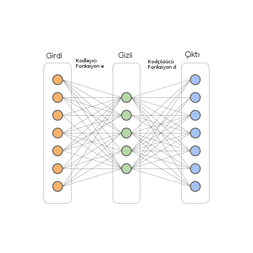
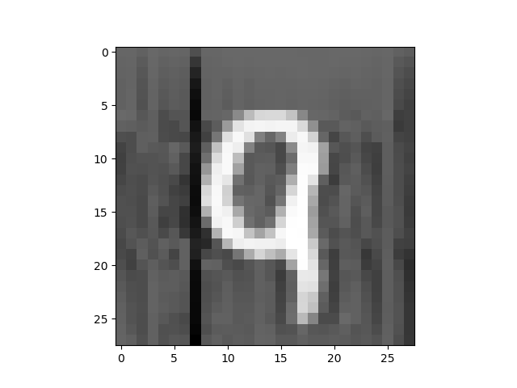
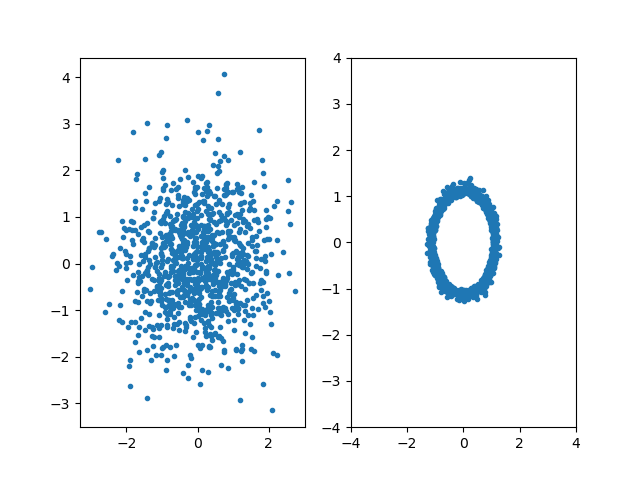
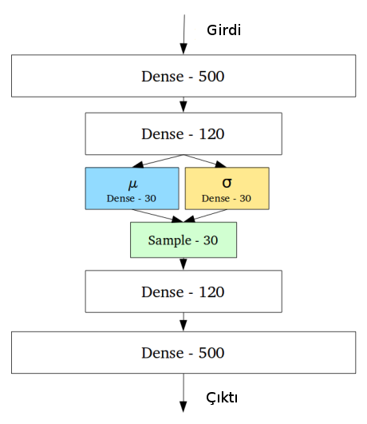
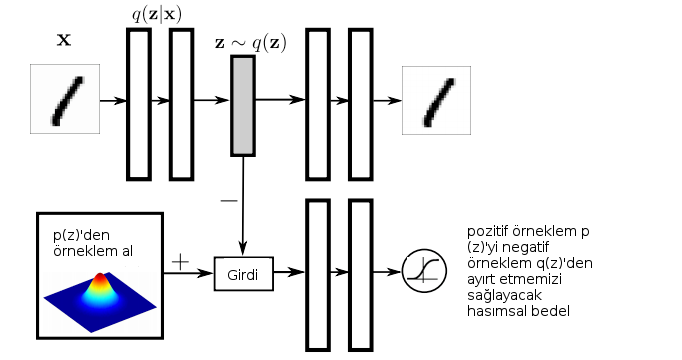
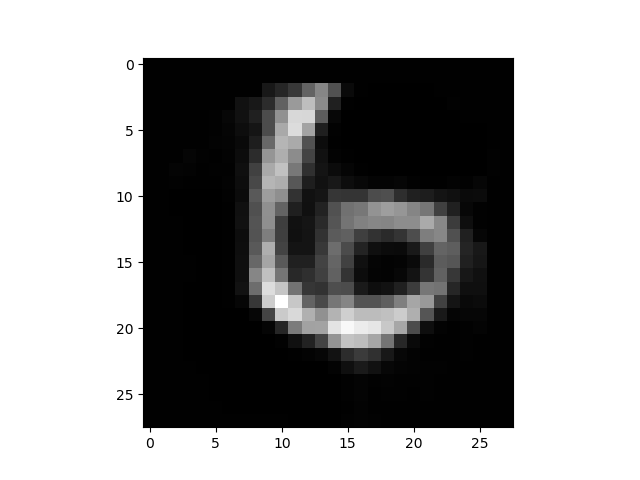
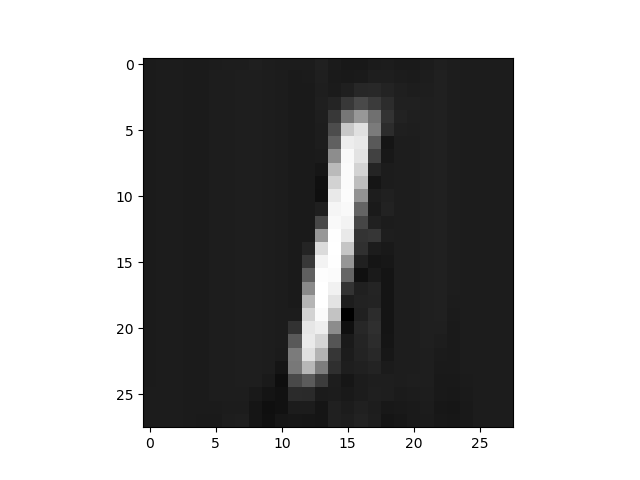

# Özkodlama (Autoencoding)

Özkodlamanın yaptığının bir tür "veriyi sıkıştırma" işlemi olduğu
söylenebilir. Yapay öğrenmede algoritmaların denetimli ve denetimsiz olarak
ikiye ayrıldığından bahsetmiştik, özkodlama denetimsiz çalışır yani ortada
etiket yoktur, daha doğrusu özkodlama verinin kendisini etiket olarak
kullanır.



Yani girdi olarak verilen veriyi çıktı olarak ta kullanırsak, YSA'yı
kendi çıktısını tekrar oluşturmayı öğrenmeye zorlamış oluruz, bu
YSA'yı veriyi özetlemeye doğru yöneltecektir, ve bu tekrar oluşturma
için ileri besleme sırasında veriyi dar bir noktadan geçmeye zorlarsak
(üstteki resimde görülüyor, 7 nöronluk girdi 5 nöronluk "daha dar" bir
katmandan geçmeye zorlanıyor), bu YSA'yı "sıkıştırma" yapmaya daha da
meyillendirecektir.

```python
from keras.layers import Input, Dense
from keras.models import Model

# gizli katman
encoding_dim = 32

def get_model():
    # girdi
    input_img = Input(shape=(784,))
    # kodlanmis temsil
    encoded = Dense(encoding_dim, activation='relu')(input_img)
    # kodcozulmus temsil
    decoded = Dense(784, activation='sigmoid')(encoded)
    
    # bu model girdiyi tekrar olusturulmus hale cevirir
    autoencoder = Model(input_img, decoded)

    # bu model girdiyi kodlanmis hale getirir
    encoder = Model(input_img, encoded)

    encoded_input = Input(shape=(encoding_dim,))
    # ozkodlayicinin son tabakasini al bu kodcozulmus katman
    decoder_layer = autoencoder.layers[-1]
    # kodcozucu model
    decoder = Model(encoded_input, decoder_layer(encoded_input))

    autoencoder.compile(optimizer='adadelta', loss='binary_crossentropy')
    return autoencoder, encoder, decoder

if __name__ == "__main__": 
 
    autoencoder, encoder, decoder = get_model()

    from keras.datasets import mnist
    import numpy as np
    (x_train, _), (x_test, _) = mnist.load_data()

    x_train = x_train.astype('float32') / 255.
    x_test = x_test.astype('float32') / 255.
    x_train = x_train.reshape((len(x_train), np.prod(x_train.shape[1:])))
    x_test = x_test.reshape((len(x_test), np.prod(x_test.shape[1:])))
    print (x_train.shape)
    print (x_test.shape)

    autoencoder.fit(x_train, x_train,
                    epochs=50,
                    batch_size=256,
                    shuffle=True,
                    validation_data=(x_test, x_test))

    autoencoder.save('mod-autoenc-1.h5')
    encoder.save('mod-enc-1.h5')
    decoder.save('mod-dec-1.h5')
```

Üstteki kodla modeli eğittikten sonra herhangi bir sayı resmini alıyoruz,
kodluyoruz, kodçözme yapıyoruz ve tekrar oluşturulmuş hali ekrana
basıyoruz,

```python
from keras.datasets import mnist
import mnist_autoenc

(x_train, _), (x_test, y_test) = mnist.load_data()
x_test = x_test.astype('float32') / 255.
autoencoder, encoder, decoder = mnist_autoenc.get_model()
encoder.load_weights("mod-enc-1.h5")
decoder.load_weights("mod-dec-1.h5")
```

```python
idx = 1090  # herhangi bir sayi resmini al
print y_test[idx]
tmp = x_test[idx, :, :].reshape(1,28*28)
encoded = encoder.predict(tmp)
print (encoded.shape)
decoded = decoder.predict(encoded).reshape(28,28)
print (decoded.shape)
plt.imshow(decoded)
plt.gray()
plt.savefig('autoenc_01.png')
```

```
9
(1, 32)
(28, 28)
```


9 resmini elde ettik. 

Biraz onceki resmin kodlanmis halini gosterelim,

```python
print (encoded)
```

```
[[ 13.18540382   9.90277767   2.81214857  14.67686176   3.90287089
    0.95043498   4.25797892  13.59305477   8.71218967   2.61786652
    8.67911053   5.27269077   3.68898463   6.26301765   0.           3.73920846
    4.90339994   6.61260319   8.80308342   5.41205883   0.           6.12768221
   11.42174625   3.13173342   3.79943371  11.27116108   6.003757
   10.82552242   8.44533443   4.84582376   5.63021088  11.27607727]]
```

32 boyutlu bir vektör içinde reel sayılar bunlar. Şimdi bu sayıları alıp
başka bir sınıflayıcı içinde kullanabilirdim. Öyle bir uygulama düşünelim
ki mesela müşterilerin yaşı, cinsiyeti bilgisi var, biz ayrıca herkesin
fotoğrafları üzerinden bir özkodlayıcı eğitiyoruz, ve müşterinin resmi
üzerinden elde edilen üstteki gibi bir temsili sıkıştırılmış gizli tabaka
verisini yaş, cinsiyet ile beraber bu ayrı sınıflayıcıya verip cevap
bekliyoruz. Bu sınıflayıcı "potansiyel yaz alışverişçisi mi / değil mi''
şeklinde bir sınıflama yapıyor olabilir mesela, belki kişilerin resminde bu
sınıflayıcıya yardım edecek bir şeyler vardır.. Bu ayrı sınıflayıcı bir YSA
olabilir, ama çoğu zaman basit lojistik regresyon bile kullanılabiliyor.
Ayrıca sadece bir değil, farklı veriler üzerinde işletilmiş pek çok
özkodlayıcıdan gelen özet bilgisini de yan yana aynı lojistik regresyona
verebiliriz.

Zaman Serisi Özkodlaması, RNN 

Eğer zamana bağlı bir veri yapısını özkodlamak istesek nasıl bir model
kullanırdık? Mesela birkaç boyutlu bir finans verisini (bir andaki hisse
fiyatı, satım miktarı çok boyutlu bir vektörde olabilirdi) modelliyor
olabilidiik. MNIST verisini bu şekilde kullanabiliriz aslında, 28 x 28
boyutlu veride sanki 28 tane 28 boyutlu veriyi zamana bağlı alıyormuşuz
gibi görebilirdik, sanki resimde soldan sağa doğru dikey şeritler alıp
teker teker bunları işlediğimizi düşünebiliriz. MNIST sayı görüntülerine bu
şekilde bakmak aslında çok anlamsız değil, mesela bir altı görüntüsünü
düşünürsek soldan sağa giderken kavisli yukarı doğru bir gidiş vardır, bu
gidişi zamana bağlı bir NN yakalayabilir. 

```python
from keras.layers import Input, Dense, concatenate
from keras.layers import LSTMCell, RNN
from keras.layers import Input, LSTM, RepeatVector
from keras.models import Model

latent_dim = 20; timesteps = 28; input_dim = 28; hist_dim = 5

def get_model():
    inputs = Input(shape=(timesteps, input_dim))

    encoded = LSTM(latent_dim,return_sequences=True)(inputs)
    decoded = encoded
    decoded = LSTM(input_dim, return_sequences=True)(decoded)

    seq_autoencoder = Model(inputs, decoded)

    encoder = Model(inputs, encoded)
    return seq_autoencoder, encoder

if __name__ == "__main__": 
  
    from keras.datasets import mnist
    import numpy as np
    (x_train, _), (x_test, _) = mnist.load_data()

    x_train = x_train.astype('float32') / 255.
    x_test = x_test.astype('float32') / 255.
    print (x_train.shape)
    print (x_test.shape)

    seq_autoencoder, encoder = get_model()

    seq_autoencoder.compile(optimizer='adadelta', loss='binary_crossentropy')

    seq_autoencoder.fit(x_train, x_train,
                        epochs=50,
                        batch_size=256,
                        shuffle=True,
                        validation_data=(x_test, x_test))

    seq_autoencoder.save('mod-rnn-autoenc-sim.h5')
    encoder.save('mod-rnn-enc-sim.h5')

```

```python
import mnist_autoenc_rnn_simple

seq_autoencoder, encoder = mnist_autoenc_rnn_simple.get_model()
seq_autoencoder.load_weights("mod-rnn-autoenc-sim.h5")
encoder.load_weights("mod-rnn-enc-sim.h5")
```

```python
decoded = seq_autoencoder.predict(tmp).reshape(28,28)
print (decoded.shape)
plt.imshow(decoded)
plt.gray()
plt.savefig('autoenc_03.png')
```



Varyasyonel Özkodlayıcılar (Variational Autoencoder -VAE-)

Standard özkodlayıcıların bir problemi kodlama yaptıkları daralmış
alandaki vektörlerin sürekli olmayabileceği, ve buradaki değerlerin
kolay bir şekilde interpolasyon yapılmasındaki bazı zorluklar.

VAE özkodlayıcılarda, kodlayıcı tabaka bir tamamen bağlanmış / yoğun
(dense) bir katmandan geçiyor ama bir değişiklik var; yoğun katman
$\mu,\sigma$ rasgele *değişkenleri* haline geliyor ve ondan bir sonraki
katman bu değişkenlerden örneklem alıyor! Bu dahiyene bir düşünce. Fakat
akla gelebilir - YSA yapısı deterministik bir yapıdır, örneklem, yani zar
atma rasgele (stochastic) bir hesap. Bu kavramı YSA mekanizmasına nasıl
dahil ediyoruz?


Çözüm örneklem operasyonunu gürültü, yani Gaussian $N(0,1)$ + $\mu$ çarpı
$\sigma$ olarak modellemek, bu şekilde sanki $N(\mu,\sigma)$'dan örneklem
alıyoruz, ama eğitilen, optimize edilen çarpma, toplama üzerinden
$\mu,\sigma$ değişkenleri, ve halen YSA mekanizması devrede ve bu
değişkenler deterministik değişkenler. Gürültü işin içinde var, ama gürültü
eh, Gaussian sıfır merkezli bir stardart sapmalı gürültü. Bir gürültü bir
diğerinden farklı değil, model için hepsi aynı gürültü.

Üstteki mantığın temelinde şu bilgi  var: Biliyoruz ki herhangi bir
dağılıma sahip rasgele değişken $z$'yi bir $g$ fonksiyonu kullanarak
$X=g(z)$ ile başka bir dağılıma çevirebiliyoruz. Altta örneği görülüyor,
soldaki resim Gaussian dağılımdan, sağdaki resim soldaki verilerin
$g(z) = z/10 + z/||z||$ ile başka bir dağılıma eşlenmiş hali ve bu yeni
dağılım bir çember şeklini oluşturmuş. VAE'nin rasgele dağılımlar
yaratabilmesinin arkasında yatan gizem bu işte. Eğitim ile VAE $g$'yi
öğrenmiş oluyor, ki bu bir determinstik fonksiyon.

```python
import random, numpy.linalg as lin, pandas as pd
x = np.random.randn(1000,2)
x = pd.DataFrame(x)
x['n'] = np.sqrt(x[0]*x[0] + x[1]*x[1])
x['g0'] = (x[0]/10.0) + x[0]/x['n']
x['g1'] = (x[1]/10.0) + x[1]/x['n']
plt.figure()
ax = plt.subplot(1, 2, 1)
plt.plot(x[0],x[1],'.')
ax = plt.subplot(1, 2, 2)
plt.plot(x['g0'],x['g1'],'.')
plt.xlim(-4,4)
plt.ylim(-4,4)
plt.savefig('autoenc_10.png')
```





```python
"""
Based on https://github.com/keras-team/keras/blob/master/examples/variational_autoencoder.py
"""
import keras
from keras.datasets import mnist
import numpy as np
from keras import backend as K
from keras.models import Sequential, Model
from keras.layers import Input, LSTM, RepeatVector
from keras.layers.core import Flatten, Dense, Dropout, Lambda
from keras.optimizers import SGD, RMSprop, Adam
from keras import objectives
import numpy as np

timesteps = 28; input_dim = 28;
batch_size = 1
latent_dim = 30

def create_lstm_vae(input_dim, 
    timesteps, 
    batch_size, 
    intermediate_dim, 
    latent_dim,
    epsilon_std=1.):

    x = Input(shape=(timesteps, input_dim,))
    print (x)
    
    # LSTM encoding
    h = LSTM(intermediate_dim)(x)
    print (h)

    # VAE Z layer
    z_mean = Dense(latent_dim)(h)
    z_log_sigma = Dense(latent_dim)(h)
    
    def sampling(args):
        z_mean, z_log_sigma = args
        epsilon = K.random_normal(shape=(batch_size, latent_dim),
                                  mean=0., stddev=epsilon_std)
        return z_mean + z_log_sigma * epsilon

    z = Lambda(sampling, output_shape=(latent_dim,))([z_mean, z_log_sigma])
    print (z)
    
    # decoded LSTM layer
    decoder_h = LSTM(intermediate_dim, return_sequences=True)
    decoder_mean = LSTM(input_dim, return_sequences=True)

    h_decoded = RepeatVector(timesteps)(z)
    print (h_decoded)
    h_decoded = decoder_h(h_decoded)
    print (h_decoded)

    # decoded layer
    x_decoded_mean = decoder_mean(h_decoded)
    print (x_decoded_mean)
    
    # end-to-end autoencoder
    vae = Model(x, x_decoded_mean)

    # encoder, from inputs to latent space
    encoder = Model(x, z_mean)

    # generator, from latent space to reconstructed inputs
    decoder_input = Input(shape=(latent_dim,))
    print (decoder_input)

    _h_decoded = RepeatVector(timesteps)(decoder_input)
    print (_h_decoded)
    _h_decoded = decoder_h(_h_decoded)
    print (_h_decoded)

    _x_decoded_mean = decoder_mean(_h_decoded)
    generator = Model(decoder_input, _x_decoded_mean)
    
    def vae_loss(x, x_decoded_mean):
        xent_loss = objectives.mse(x, x_decoded_mean)
        kl_loss = - 0.5 * K.mean(1 + z_log_sigma - K.square(z_mean) - K.exp(z_log_sigma))
        loss = xent_loss + kl_loss
        return loss

    
    vae.compile(optimizer='rmsprop', loss=vae_loss)
    
    return vae, encoder, generator


if __name__ == "__main__":
    
    (x_train, _), (x_test, _) = mnist.load_data()
    x_train = x_train.astype('float32') / 255.
    #x_train = x_train[:200]
    x_test = x_test.astype('float32') / 255.
    #x_test = x_test[:200]
    print (x_train.shape)
    print (x_test.shape)    
    x = x_train
    vae, enc, gen = create_lstm_vae(input_dim, 
        timesteps=timesteps, 
        batch_size=batch_size, 
        intermediate_dim=latent_dim,
        latent_dim=latent_dim,
        epsilon_std=1.)

    vae.fit(x, x, validation_data=(x_test, x_test), epochs=30)

    vae.save('mnist_lstm_vae.h5')
    enc.save('mnist_lstm_enc.h5')
    gen.save('mnist_lstm_gen.h5')
    

    #preds = vae.predict(x, batch_size=batch_size)


```

```python
import mnist_lstm_vae

vae, enc, gen = mnist_lstm_vae.create_lstm_vae(mnist_lstm_vae.input_dim, 
    timesteps=mnist_lstm_vae.timesteps, 
    batch_size=mnist_lstm_vae.batch_size, 
    intermediate_dim=mnist_lstm_vae.latent_dim,
    latent_dim=mnist_lstm_vae.latent_dim,
    epsilon_std=1.)
vae.load_weights('mnist_lstm_vae.h5')
enc.load_weights('mnist_lstm_enc.h5')
```

```python
import random
idx = 400 # herhangi bir imaji sec
print (tmp.shape)
x_test_tmp = x_test[idx]
res = vae.predict(x_test_tmp.reshape((1, 28, 28)))

plt.figure()
ax = plt.subplot(1, 2, 1)
pixels = res.reshape((28, 28))
plt.imshow(pixels)
plt.gray()
ax = plt.subplot(1, 2, 2)
plt.imshow(x_test_tmp)
plt.gray()

plt.savefig('autoenc_04.png')
```


Gördüğümüz gibi zamansal işlem yaptık ama VAE çok iyi sonuç verdi. Hatta
test imajını daha netleştirdi!

Hasımsal Özkodlayıcı (Adverserial Autoencoder -AA-)

Üretici Hasımsal Ağlar (Generative Adverserial Networks -GAN-) kavramının
özkodlayıcılara uygulanmış hali AA olur. 



Burada bir kodlayıcı / kodçözücü yapısı var (üst blok) bu yapıdan kodlanmış ara
tabaka $z \sim q(z)$ "kötü'' örnekler çekilip $p(z)$'den gelen "iyi'' örnekler
ile birleştiriliyor ve ayırdedici yine bu iki grup arasında ayırım yapmayı
öğreniyor. Bu durumda üst bloktaki kodçözücü GAN'deki üretici gibi olur, ona
dönüşür bir bakıma, çünkü öyle iyi üretim yapmaya çalışacaktır ki $p(z)$
gürültüsü ile onun aldığı kodlanmış tabaka verisi ayiredilemez hale gelmelidir.
Tabii ki üst soldaki kodlayıcı bu ara tabakaya o şekilde temsili veri üretmeye
çalışacaktır, bu arada kodlayıcı / kodçözücü yapısı da eğitilmiş olur. Yani $z$
bir anlamda alt soldaki gerçek gürültüye yaklaşır, bu gürültüden sayı üretebilir
hale geliriz, bu klasik GAN, ayrıca bu "kodlanmış'' gürültüyü üreten kodlayıcı
/ kodçözücü tabaka da ayrı bir şekilde kendini optimize eder ve kodlama işini
yapar hale gelir.

```python
# import os
# os.environ["THEANO_FLAGS"] = "mode=FAST_COMPILE,device=cpu,floatX=float32"

# This line allows mpl to run with no DISPLAY defined
from keras.layers import Dense, Reshape, Flatten, Input, merge
from keras.models import Sequential, Model
from keras.optimizers import Adam
from legacy import l1l2
import keras.backend as K
import pandas as pd, os
import numpy as np
from adversarial_model import AdversarialModel
from adversarial_utils import fix_names, n_choice, normal_latent_sampling
from adversarial_optimizers import AdversarialOptimizerSimultaneous
from keras.layers import LeakyReLU, Activation
import numpy as np
from keras.datasets import mnist

def mnist_process(x):
    x = x.astype(np.float32) / 255.0
    return x

def mnist_data():
    (xtrain, ytrain), (xtest, ytest) = mnist.load_data()
    return mnist_process(xtrain), mnist_process(xtest)


def model_generator(latent_dim, input_shape,
                    hidden_dim=512,
                    reg=lambda: l1l2(1e-7, 0)):
    return Sequential([
        Dense(hidden_dim, name="generator_h1",
              input_dim=latent_dim,
              W_regularizer=reg()),
        LeakyReLU(0.2),
        Dense(hidden_dim,
              name="generator_h2",
              W_regularizer=reg()),
        LeakyReLU(0.2),
        Dense(np.prod(input_shape),
              name="generator_x_flat",
              W_regularizer=reg()),
        Activation('sigmoid'),
        Reshape(input_shape, name="generator_x")],
        name="generator")


def model_encoder(latent_dim, input_shape,
                  hidden_dim=512,
                  reg=lambda: l1l2(1e-7, 0)):
    x = Input(input_shape, name="x")
    h = Flatten()(x)
    h = Dense(hidden_dim, name="encoder_h1", W_regularizer=reg())(h)
    h = LeakyReLU(0.2)(h)
    h = Dense(hidden_dim, name="encoder_h2", W_regularizer=reg())(h)
    h = LeakyReLU(0.2)(h)
    mu = Dense(latent_dim, name="encoder_mu", W_regularizer=reg())(h)
    log_sigma_sq = Dense(latent_dim, name="encoder_log_sigma_sq", W_regularizer=reg())(h)
    z = merge([mu, log_sigma_sq], mode=lambda p: p[0] + K.random_normal(K.shape(p[0])) * K.exp(p[1] / 2),
              output_shape=lambda p: p[0])
    return Model(x, z, name="encoder")


def model_discriminator(latent_dim, output_dim=1, hidden_dim=512,
                        reg=lambda: l1l2(1e-7, 1e-7)):
    z = Input((latent_dim,))
    h = z
    h = Dense(hidden_dim, name="discriminator_h1", W_regularizer=reg())(h)
    h = LeakyReLU(0.2)(h)
    h = Dense(hidden_dim, name="discriminator_h2", W_regularizer=reg())(h)
    h = LeakyReLU(0.2)(h)
    y = Dense(output_dim, name="discriminator_y", activation="sigmoid", W_regularizer=reg())(h)
    return Model(z, y)


def train(adversarial_optimizer):
    # z \in R^100
    latent_dim = 100
    # x \in R^{28x28}
    input_shape = (28, 28)

    # generator (z -> x)
    generator = model_generator(latent_dim, input_shape)
    # encoder (x ->z)
    encoder = model_encoder(latent_dim, input_shape)
    # autoencoder (x -> x')
    autoencoder = Model(encoder.inputs, generator(encoder(encoder.inputs)))
    # discriminator (z -> y)
    discriminator = model_discriminator(latent_dim)

    # assemple AAE
    x = encoder.inputs[0]
    z = encoder(x)
    xpred = generator(z)
    zreal = normal_latent_sampling((latent_dim,))(x)
    yreal = discriminator(zreal)
    yfake = discriminator(z)
    aae = Model(x, fix_names([xpred, yfake, yreal], ["xpred", "yfake", "yreal"]))

    # print summary of models
    generator.summary()
    encoder.summary()
    discriminator.summary()
    autoencoder.summary()

    # build adversarial model
    generative_params = generator.trainable_weights + encoder.trainable_weights
    model = AdversarialModel(base_model=aae,
                             player_params=[generative_params, discriminator.trainable_weights],
                             player_names=["generator", "discriminator"])
    model.adversarial_compile(adversarial_optimizer=adversarial_optimizer,
                              player_optimizers=[Adam(1e-4, decay=1e-4), Adam(1e-3, decay=1e-4)],
                              loss={"yfake": "binary_crossentropy", "yreal": "binary_crossentropy",
                                    "xpred": "mean_squared_error"},
                              player_compile_kwargs=[{"loss_weights": {"yfake": 1e-2, "yreal": 1e-2, "xpred": 1}}] * 2)

    # load mnist data
    xtrain, xtest = mnist_data()

    # callback for image grid of generated samples
    def generator_sampler():
        zsamples = np.random.normal(size=(10 * 10, latent_dim))
        return generator.predict(zsamples).reshape((10, 10, 28, 28))

    # callback   for image grid of autoencoded samples
    def autoencoder_sampler():
        xsamples = n_choice(xtest, 10)
        xrep = np.repeat(xsamples, 9, axis=0)
        xgen = autoencoder.predict(xrep).reshape((10, 9, 28, 28))
        xsamples = xsamples.reshape((10, 1, 28, 28))
        samples = np.concatenate((xsamples, xgen), axis=1)
        return samples

    # train network
    # generator, discriminator; pred, yfake, yreal
    n = xtrain.shape[0]
    y = [xtrain, np.ones((n, 1)), np.zeros((n, 1)), xtrain, np.zeros((n, 1)), np.ones((n, 1))]
    ntest = xtest.shape[0]
    ytest = [xtest, np.ones((ntest, 1)), np.zeros((ntest, 1)), xtest, np.zeros((ntest, 1)), np.ones((ntest, 1))]
    history = model.fit(x=xtrain, y=y, validation_data=(xtest, ytest), nb_epoch=100, batch_size=32)


    # save model
    encoder.save("aae-norm-encoder.h5")
    generator.save("aae-norm-generator.h5")
    discriminator.save("aae-norm-discriminator.h5")

if __name__ == "__main__":
    train(AdversarialOptimizerSimultaneous())
```

```python
import aae_normal
latent_dim = 100
input_shape = (28, 28)
encoder = aae_normal.model_encoder(latent_dim, input_shape)
encoder.load_weights('aae-norm-encoder.h5')
generator = aae_normal.model_generator(latent_dim, input_shape)
generator.load_weights('aae-norm-generator.h5')
```

```python
idx = 100 # herhangi bir imaji sec
print (x_test[idx, :].shape)
res = encoder.predict(x_test[idx, :].reshape(1,28,28))
print (res.shape)
pixels = generator.predict(res)
pixels = pixels.reshape((28, 28))
plt.imshow(pixels)
plt.gray()
plt.savefig('autoenc_05.png')
```



```python
# import os
# os.environ["THEANO_FLAGS"] = "mode=FAST_COMPILE,device=cpu,floatX=float32"

# This line allows mpl to run with no DISPLAY defined
from keras.layers import Dense, Reshape, Flatten, Input, merge
from keras.models import Sequential, Model
from keras.optimizers import Adam
from legacy import l1l2
import keras.backend as K
from keras.datasets import mnist
import numpy as np, os, pandas as pd
from adversarial_model import AdversarialModel
from adversarial_utils import fix_names, n_choice, normal_latent_sampling
from adversarial_optimizers import AdversarialOptimizerSimultaneous
from keras.layers import LeakyReLU, Activation, LSTM, GRU, RepeatVector

def mnist_process(x):
    x = x.astype(np.float32) / 255.0
    return x

def mnist_data():
    (xtrain, ytrain), (xtest, ytest) = mnist.load_data()
    return mnist_process(xtrain), mnist_process(xtest)

activation='relu'

def model_generator(latent_dim, input_shape,
                    hidden_dim=100,
                    reg=lambda: l1l2(1e-7, 0)):
    return Sequential([
        Dense(np.prod(input_shape), activation=activation,
              name="generator_h1", input_dim=latent_dim,
              W_regularizer=reg()),
        Reshape(input_shape, name="generator_x"),
        GRU(latent_dim,return_sequences=True),
        GRU(28,return_sequences=True),
        ],
        name="generator")


def model_encoder(latent_dim, input_shape,
                  hidden_dim=100,
                  reg=lambda: l1l2(1e-7, 0)):
    x = Input(input_shape, name="x")
    h = GRU(hidden_dim, return_sequences=True)(x)
    h = GRU(hidden_dim)(h)
    h = Dense(hidden_dim, activation=activation,
              name="encoder_h3",
              W_regularizer=reg())(h)    
    
    mu = Dense(latent_dim, name="encoder_mu", W_regularizer=reg())(h)
    
    log_sigma_sq = Dense(latent_dim, name="encoder_log_sigma_sq",
                         W_regularizer=reg())(h)
    
    z = merge([mu, log_sigma_sq],
              mode=lambda p: p[0] + K.random_normal(K.shape(p[0])) * K.exp(p[1] / 2),
              output_shape=lambda p: p[0])
    
    return Model(x, z, name="encoder")


def model_discriminator(latent_dim, output_dim=1, hidden_dim=100,
                        reg=lambda: l1l2(1e-7, 1e-7)):
    z = Input((latent_dim,))
    h = z
    h = Dense(hidden_dim, name="discriminator_h1", W_regularizer=reg())(h)
    h = LeakyReLU(0.2)(h)
    h = Dense(hidden_dim, name="discriminator_h2", W_regularizer=reg())(h)
    h = LeakyReLU(0.2)(h)
    y = Dense(output_dim, name="discriminator_y", activation="sigmoid", W_regularizer=reg())(h)
    return Model(z, y)


def example_aae(adversarial_optimizer):
    # z \in R^100
    latent_dim = 200
    # x \in R^{28x28}
    input_shape = (28, 28)

    # generator (z -> x)
    generator = model_generator(latent_dim, input_shape)
    # encoder (x ->z)
    encoder = model_encoder(latent_dim, input_shape)
    # autoencoder (x -> x')
    print (encoder.inputs)
    e = encoder(encoder.inputs)
    g = generator(e)
    autoencoder = Model(encoder.inputs, g)
    # discriminator (z -> y)
    discriminator = model_discriminator(latent_dim)

    # assemple AAE
    x = encoder.inputs[0]
    z = encoder(x)
    xpred = generator(z)
    zreal = normal_latent_sampling((latent_dim,))(x)
    yreal = discriminator(zreal)
    yfake = discriminator(z)
    aae = Model(x, fix_names([xpred, yfake, yreal], ["xpred", "yfake", "yreal"]))

    # print summary of models
    generator.summary()
    encoder.summary()
    discriminator.summary()
    autoencoder.summary()

    # build adversarial model
    generative_params = generator.trainable_weights + encoder.trainable_weights
    model = AdversarialModel(base_model=aae,
                             player_params=[generative_params, discriminator.trainable_weights],
                             player_names=["generator", "discriminator"])
    model.adversarial_compile(adversarial_optimizer=adversarial_optimizer,
                              player_optimizers=[Adam(1e-4, decay=1e-4), Adam(1e-3, decay=1e-4)],
                              loss={"yfake": "binary_crossentropy", "yreal": "binary_crossentropy",
                                    "xpred": "mean_squared_error"},
                              player_compile_kwargs=[{"loss_weights": {"yfake": 1e-2, "yreal": 1e-2, "xpred": 1}}] * 2)

    # load mnist data
    xtrain, xtest = mnist_data()

    # callback for image grid of generated samples
    def generator_sampler():
        zsamples = np.random.normal(size=(10 * 10, latent_dim))
        return generator.predict(zsamples).reshape((10, 10, 28, 28))

    # callback   for image grid of autoencoded samples
    def autoencoder_sampler():
        xsamples = n_choice(xtest, 10)
        xrep = np.repeat(xsamples, 9, axis=0)
        xgen = autoencoder.predict(xrep).reshape((10, 9, 28, 28))
        xsamples = xsamples.reshape((10, 1, 28, 28))
        samples = np.concatenate((xsamples, xgen), axis=1)
        return samples
    
    # train network
    # generator, discriminator; pred, yfake, yreal
    n = xtrain.shape[0]
    y = [xtrain, np.ones((n, 1)), np.zeros((n, 1)), xtrain, np.zeros((n, 1)), np.ones((n, 1))]
    ntest = xtest.shape[0]
    ytest = [xtest, np.ones((ntest, 1)), np.zeros((ntest, 1)), xtest, np.zeros((ntest, 1)), np.ones((ntest, 1))]
    history = model.fit(x=xtrain, y=y, validation_data=(xtest, ytest), nb_epoch=50, batch_size=32)

    # save model
    encoder.save("aae-lstm-encoder.h5")
    generator.save("aae-lstm-generator.h5")
    discriminator.save("aae-lstm-discriminator.h5")

if __name__ == "__main__":
    example_aae(AdversarialOptimizerSimultaneous())
```

```python
import aae_lstm
latent_dim = 200
input_shape = (28, 28)
encoder = aae_lstm.model_encoder(latent_dim, input_shape)
encoder.load_weights('aae-lstm-encoder.h5')
generator = aae_lstm.model_generator(latent_dim, input_shape)
generator.load_weights('aae-lstm-generator.h5')
```

```python
idx = 1030 # herhangi bir imaji sec
res = encoder.predict(x_test[idx, :].reshape(1, 28,28))
pixels = generator.predict(res)
pixels = pixels.reshape((28, 28))
plt.imshow(pixels)
plt.gray()
plt.savefig('autoenc_08.png')
```



Kaynaklar

[1] [https://blog.keras.io/building-autoencoders-in-keras.html](https://blog.keras.io/building-autoencoders-in-keras.html)

[2] *Adverserial Autoencoder Keras*, 
    [https://github.com/bstriner/keras-adversarial/blob/master/examples/example_aae.py](https://github.com/bstriner/keras-adversarial/blob/master/examples/example_aae.py)

[3] [https://towardsdatascience.com/intuitively-understanding-variational-autoencoders-1bfe67eb5daf](https://towardsdatascience.com/intuitively-understanding-variational-autoencoders-1bfe67eb5daf)

[4] [https://hsaghir.github.io/data_science/denoising-vs-variational-autoencoder/](https://hsaghir.github.io/data_science/denoising-vs-variational-autoencoder/)

[5] Doersch, Tutorial on Variational Autoencoders, 
    [https://arxiv.org/pdf/1606.05908.pdf](https://arxiv.org/pdf/1606.05908.pdf)

[6] Goodfellow, Adversarial Autoencoders, 
    [https://arxiv.org/pdf/1511.05644.pdf](https://arxiv.org/pdf/1511.05644.pdf)

[7] What is Adversarial Autoencoder?, 
    [https://www.quora.com/What-is-Adversarial-Autoencoder](https://www.quora.com/What-is-Adversarial-Autoencoder)

[8] [http://www.inference.vc/adversarial-autoencoders/](http://www.inference.vc/adversarial-autoencoders/)


