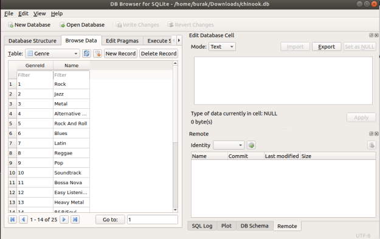

# sqlite, Basit, Hızlı Diske Değer Yazma Okuma

Bir Python uygulaması için  basit, hızlı bir şekilde diske
yazılabilen, ve istendiği zaman anahtar bazlı, tüm dosyayı hafızaya
getirmeden hızlı şekilde okunabilen bir yapıya ihtiyaç vardı. Çözüm
için önce Python'un sözlük (dictionary) yapısının diske yazılmasına
izin veren çözümler akla geliyor, ki muhakkak o çerçevede pek çok
çözüm var. Fakat bir çözüm var ki Python kurulumunun zaten içinde, tek
bir dosyaya yönlendirilebilen depolaması mevcut, ve her yazımın diske
gitmesini, ve hızlı okunabilmesini sağlıyor.

Bu yazılım sqlite3'ten başkası değil. Eğer az SQL yazmayı göze
alırsak, ki bu dili tüm bilişimciler bilir, sqlite3 üstteki tüm
ihtiyaçlara cevap verir.

Kurmak

```
pip install pysqlite3
```

Test edelim,

```python
import sqlite3

db = sqlite3.connect('/tmp/mydb.db')

import random

cursor = db.cursor()

cursor.execute('''CREATE TABLE users(id INTEGER PRIMARY KEY, name TEXT,
                  phone TEXT, email TEXT, password TEXT)
                  ''')

db.commit()

cursor = db.cursor()

name1 = 'Andres'
phone1 = '3366858'
email1 = 'user@example.com' + str(random.random())
password1 = '12345'

print (email1)

cursor.execute('''INSERT INTO users(name, phone, email, password)
                  VALUES(?,?,?,?)''', (name1,phone1, email1, password1))

db.commit()
```

Taban tek bir dosya, hangisi olacağını biz tanımladık, gayet basit.
Üstteki insert komutunu ardı ardına işletelim ve arada sırada
/tmp/mydb.db dosyasına bakalım. Bu dosya içinde yaratılan farklı
isimleri göreceğiz. Dosya büyüklüğünü kontrol etmek ise yaramayabilir
çünkü sqlite taban dosyasını her yazimda degil, belli aralıklarla
büyütüyor. 

Arada satır sayısını alttaki ile kontrol edebiliriz,

```
cursor = db.cursor()
cursor.execute('''SELECT count(*) FROM users''')
print (cursor.fetchone())
```

Taban iş bitince `db.close` ile kapatılır. Fakat düzgün kapatılmasa
bile commit ile yazılanlar kaybolmayacaktır, yani süreç çökse, tekrar
tabana dönsek en son yazdığımız satırı orada bulacağız. 

Bu tüm ihtiyaçları karşılıyor, farklı bir süreçte işleyen büyük bir
taban değil, kurulmasına bile gerek yok zaten Python sürümünde var,
ayrıca diske yazım var, hızlı okuma (herşeyi hafızaya getirmeden)
destekleniyor.

Vurgulamak gerekirse tanimlanan veri taban ismindeki bir dosya yok
ise, ilk kullanimda otomatik olarak yaratiliyor. Bu isleri cok
rahatlatiyor.

Diğer bazı komutlar, bir ek veri sonrası,

```python
import sqlite3
conn = sqlite3.connect('/tmp/mydb.db')

c = conn.cursor()
name2 = 'XXX'
phone2 = 'YYYYY'
email2 = 'xxxx@example.com' + str(random.random())
password1 = '12345'
c.execute('''INSERT INTO users(name, phone, email, password) VALUES(?,?,?,?)''', (name2,phone2,email2,'xxxx'))
conn.commit()
```

Alınan verileri döngü içinde gezmek,

```python
c = conn.cursor()
rows = c.execute('''SELECT * FROM users''')
for row in rows:
    print (row)

```

```text
(1, 'Andres', '3366858', 'user@example.com0.5546258413014995', '12345')
(2, 'XXX', 'YYYYY', 'xxxx@example.com0.09226623997325056', 'xxxx')
```

Tabandaki tüm tabloları görmek için 

```python
c = conn.cursor()
rows = c.execute('''SELECT * FROM sqlite_master WHERE type='table' ''')
for row in rows: print (row)
```

Chinook Tabani

Orta ölçekte bir veri tabanı örneği olarak Chinook tabanı var. [Chinook_Sqlite.zip](Chinook_Sqlite.zip)
dosyasını açın, ve [load_chinook.py](load_chinook.py) dosyasını işletince
bu yüklemeyi yapılacaktır.

GUI

```
sudo apt-get install sqlitebrowse
```

```
sqlitebrowse
```

ile işletirsek, şu şekilde bir görsel program başlayacak.




