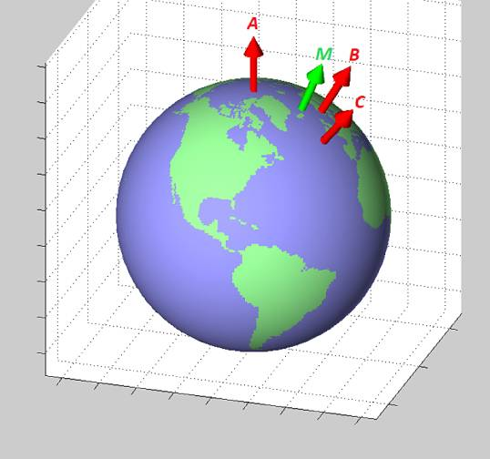

# Genel Coğrafi Kordinat Kodları, HTML5, Javascript, Python

### Mesafe hesabı yapmak

İki enlem, boylam kordinatı arasında mesafe hesabı için geopy kullanılabilir.

```python
import geopy.distance
dist = geopy.distance.vincenty((51.238689, 4.406747),(51.232246, 4.444266))
print (dist)
print (dist.km)
```

İkinci ifade float tıpınde mesafeyi verir, kilometre bazlıdır.

Ya da

```python
from pygeodesy.sphericalNvector import LatLon

p1 = LatLon(lat1, lon1)
p2 = LatLon(lat2, lon2)

p1.distanceTo(p2)
```

### İki nokta arasında birinciden ikinciye olan açısal yön (bearing),

```python
def get_bearing(lat1,lon1,lat2,lon2):
    dLon = lon2 - lon1;
    y = math.sin(dLon) * math.cos(lat2);
    x = math.cos(lat1)*math.sin(lat2) - math.sin(lat1)*math.cos(lat2)*math.cos(dLon);
    brng = np.rad2deg(math.atan2(y, x));
    if brng < 0: brng+= 360
    return brng
```

Sonuç 0 derece kuzey olmak üzere 0-360 derece arasında saat yönüne
doğru artacak şekilde açı.

Bir kordinattan "10 km doğuya, batıya, vs. adım atınca nereye
geliriz?" sorusunun cevabı için

```python
import geopy
import geopy.distance
# baslangic noktasi
start = geopy.Point(48.853, 2.349)
# mesafe 1 km
d = geopy.distance.VincentyDistance(kilometers = 1)
# derece olarak adim atilacak yon, 0 derece kuzey, 90 dogu, ..
reached = d.destination(point=start, bearing=0)
print (reached.latitude)
print (reached.longitude)
```

Ya da

```python
from pygeodesy.sphericalNvector import LatLon
clat,clon=39.06084392603182, 34.274201977299
DIST = 1000
p1 = LatLon(clat,clon)
EARTH_RAD = 6371
upright = p1.destination (DIST, bearing=45, radius=EARTH_RAD)
lowleft = p1.destination (DIST, bearing=225, radius=EARTH_RAD)
print ( upright )
print ( lowleft )
```

```text
45.090707 N, 043.281808 E
32.450607 N, 026.747624 E
```

Örnekte Anadolu ortasından başlayıp 45 derece kuzeydoğuya ve 225
derece güneybatıya 1000 km adım atınca nereye geldiğimizi görüyoruz.

### Orta Nokta

Bir GPS kordinat listesinin orta noktasını bulmak için, su [bağlantıdan](https://www.navlab.net/nvector/#example_7),
enlem, boylam bir üç boyutlu vektör haline getiriliyor, ve Kartezyen bazlı bu
vektörlerin ortalaması doğru ortalamayı veriyor. Kodun temel aldığı makale [1].



Grafiğe bakarsak yeryüzünde üç noktayı temsil eden A,B,C vektörleri
bulunmuş bu vektörlerin her biri üç acı üzerinden temsil edilecek, ve
eğer üç boyuttaki vektörlerin ortalamasını alırsak rahatlıkla M
vektörünü bulabiliriz, çünkü vektörleri işaretlerinden tutun onların
kapsamları aritmetiksel işlemler için uygundur. Kıyasla biri -90/+90
arasında diğeri -180/+180 arasında gidip gelen iki sayının
aritmetiksel ortalamasının yeryüzünün her noktasında doğru sonucu
vermesi zordur. Biri -90 sınırının bir tarafı diğeri öteki tarafında
olan iki noktayı düşünebiliriz mesela..

Kodlama alttaki gibi olabilir,

```python
import numpy as np
import numpy.linalg as lin

E = np.array([[0, 0, 1],[0, 1, 0],[-1, 0, 0]])

def lat_long2n_E(latitude,longitude):
    res = [np.sin(np.deg2rad(latitude)),
           np.sin(np.deg2rad(longitude)) * np.cos(np.deg2rad(latitude)),
           -np.cos(np.deg2rad(longitude)) * np.cos(np.deg2rad(latitude))]
    return np.dot(E.T,np.array(res))

def n_E2lat_long(n_E):
    n_E = np.dot(E, n_E)
    longitude=np.arctan2(n_E[1],-n_E[2]);
    equatorial_component = np.sqrt(n_E[1]**2 + n_E[2]**2 );
    latitude=np.arctan2(n_E[0],equatorial_component);
    return np.rad2deg(latitude), np.rad2deg(longitude)

def average(coords):
    res = []
    for lat,lon in coords:
        res.append(lat_long2n_E(lat,lon))
    res = np.array(res)
    m = np.mean(res,axis=0)
    m = m / lin.norm(m)
    return n_E2lat_long(m)
        

n = lat_long2n_E(30,20)
print (n)
print (n_E2lat_long(np.array(n)))

# fransa ve libya ortasi
coords = [[30,20],[47,3]]
m = average(coords)
print (m)
```

Üstteki işlemleri yapan bir paket te var, 

```python
from pygeodesy.sphericalNvector import LatLon
b = LatLon(45, 1), LatLon(45, 2), LatLon(46, 2), LatLon(46, 1)
nvecs = np.array([a.toNvector() for a in b])
print (nvecs)
mid = nvecs.mean().toLatLon()
print (mid.lat, mid.lon)
```

```text
[Nvector(0.707, 0.01234, 0.70711) Nvector(0.70668, 0.02468, 0.70711)
 Nvector(0.69424, 0.02424, 0.71934) Nvector(0.69455, 0.01212, 0.71934)]
45.50109067812444 1.5
<class 'pygeodesy.sphericalNvector.LatLon'>
(0.700656, 0.018347, 0.713264)
```

### Nokta Bir Alan İçinde mi

Elde köşeleri bilinen bir üçgen, kare ya da dışbükey poligon var
diyelim, mesela Bermuda Üçgeni! Elimizdeki bir noktanın o alan içine
düşüp düşmediğini nereden bileceğiz?  Burada iyi bir yaklaşım
`pygeodesy` paketi, bu paket üstteki n-vektör yaklaşımını kullanıyor,
yani sağlam. Bir örnek altta, dörk köşesi verilmiş alan içine `45.1,
1.1` noktasının düşüp düşmediğini soruyoruz,

```python
from pygeodesy.sphericalNvector import LatLon

p = LatLon(45.1, 1.1)
b = LatLon(45, 1), LatLon(45, 2), LatLon(46, 2), LatLon(46, 1)
print (p.isenclosedBy(b))
```

### DMS ve Ondalik Formatlar Gecisi

Bazen `000  00' 05.31''W` ve `51  28' 40.12'' N` şeklinde enlem ve
boylam verisi görebiliriz. Bu format yeri saat, dakika, saniye
üzerinden göstermektedir. Çevirmek için `pygeodesy` içinde gerekli
fonksiyonlar var,

```python
from pygeodesy import parse3llh, fstr

x = parse3llh('000  00' 05.31''W, 51  28' 40.12'' N')
print (fstr(x, prec=6))
```

```text
51.477811, -0.001475, 0.0
```

İlk iki sayı enlem ve boylamdır.

### HTML5 ve Javascript ile Yer Bulmak

Javascript icinden yer bulmak mumkun, bu cep telefonunda da isliyor,
Google'in Wifi, Telekom, GPS uzerinden yer bulan arayuzu ile
baglantili zannederim. Kalitesini kontrol etmedim, ama alttaki kod
isler ve yer rapor eder. Isletince tarayici 'yer bilgisine erisim'
icin izin isteyecek. Izin verince (allow), bilgi sayfada basilacak ve
kullanim ornegi olsun diye bir de URL baglantilardan birine parametre
olarak eklenecek.

```
<html>
  <script>
    var lat = "lat";
    var lon = "lon";
    function getLocation() {
       navigator.geolocation.getCurrentPosition(setPosition);
    }
    function setPosition(position) {
      lat = position.coords.latitude;
      lon = position.coords.longitude;
      document.getElementById("locpos").innerHTML = lat + " " + lon;
      document.getElementById("url1").href="/bir/baglanti/" + lat + ";" + lon;
    }
</script>
<body onload="init()">

  <div class="navmenu">
    <nav>
      <div id="locpos">
        <p></p>
      </div>
      <ul>
        <li><a id="grab" href="#" onclick='getLocation()'>Yer Bul</a></li>
        <li><a id="url1" href="/bir/baglanti/32324">Baglanti</a></li>
        <li><a id="vsvs" href="">Vs..</a></li>
      </ul>
    </nav>
  </div>

</html>
```

### İsimden Kordinat Bulmak

Bölge ve ülke ismi vererek dünyadaki pek çok yeri bulmak için `geonames`
sitesi kullanılabilir, http://www.geonames.org adresine gidilip bilgiler
girilince sonuçlar listeleniyor.

Script üzerinden bu bilgiyi nasıl çekeriz? Site URL parametresi olarak
girdi kabul ediyor, eğer sonuçlardan ilkini çekip çıkartabilirek onu
kordinat sonucu olarak alabiliriz. Mesela Ağrı Dağları için

http://www.geonames.org/search.html?q=Agri+Mountain&country=TR

Script uzerinden

```python
from pygeodesy import parse3llh, fstr
import urllib.request as urllib2, re

def geoname(keyword, ccode):
    url = "http://www.geonames.org/search.html?q=%s&country=%s" % (keyword,ccode)    
    url = url.replace(" ","+")
    print (url)
    r = urllib2.urlopen(url).read()
    content = r.decode('utf-8')
    res = re.findall("Latitude.*?<td nowrap>(.*?)</td><td nowrap>(.*?)</td>",content, re.DOTALL)
    if len(res)==0: return False,99999,999999
    lats = res[0][1]; lons = res[0][0]
    lats = lats[1:] + lats[0]
    lons = lons[1:] + lons[0]
    geos = lats + "," + lons
    x = parse3llh(geos)
    res = fstr(x, prec=6).split(",")
    return True,float(res[0]),float(res[1])

print (geoname("Agri Mountain","TR"))
```

Sonuc

```
(True, 39.702222, 44.297778)
```

olarak çıkacak. İlk değer bir statü değeri, eğer veri işlemede problem
çıkarsa problem bu şekilde iletilebilir.

Geocoder

Eğer üstteki yaklaşım fazla çetrefil gibi gözüküyorsa, `geocoder` adlı
bir paket var,

```python
import geocoder

g = geocoder.osm("Plymouth, MN")
print (g.latlng)
g = geocoder.osm("Istanbul, Turkey")
print (g.latlng)
g = geocoder.osm("Canakkale")
print (g.latlng)
```

```text
[45.0065149, -93.46651]
[41.0091982, 28.9662187]
[40.0549886, 26.9278292]
```

### Imajdan Kordinat Toplamak

Diyelim ki elimizde JPG üzerinde bir harita var, üzerinde bir sınır
gösterilmiş, ve oradan sınır verilerini toplamak istiyoruz. Alttaki
basit GUI kodu şunu yapar 1) Parametre olarak geçilen resmi gösterir,
2) O resim üzerinde yapılacak fare tıklamalarının x,y piksel
kordinatlarını ekrana basar. Bu sayede çıplak gözle sınıra bakarız,
üzerine tıklarız, ve kordinatlarını "geriye mühendislik" ile toplamış
oluruz.

```python
from PIL import ImageDraw, Image, ImageTk
import sys, tkinter

window = tkinter.Tk(className="bla")
image = Image.open(sys.argv[1])
print ('size',image.size[0],image.size[1])

image = image.resize((int(1000), int(700)), Image.ANTIALIAS)
canvas = tkinter.Canvas(window, width=image.size[0], height=image.size[1])
canvas.pack()
image_tk = ImageTk.PhotoImage(image)

canvas.create_image(image.size[0]//2, image.size[1]//2, image=image_tk)

def callback(event):
    print ("[%d,%d]," % (event.x, event.y))

canvas.bind("<Button-1>", callback)
tkinter.mainloop()
```

Gerekli paketi kurmak için `sudo apt install python3-tk` yeterli.

Tabii nihai kordinatlar için ek bir adım daha gerekli, piksel
değerlerini alıp enlem, boylama çevirmek; bu hesap için enlem
boylamını bildiğimiz iki piksel değeri yeterli. Alttaki gibi bir kodla
bu transformasyon yapılabilir. Referans iki kordinat değeri `refc`,
ona tekabül eden iki piksel x,y değeri `refp` içinde, ve toplanan
tüm piksel değerleri bir liste olarak `clicks` içinde.

```python
def platlon(refc, refp, clicks):
    mlat = (refc[1,0]-refc[0,0]) / (refp[1,1]-refp[0,1])
    mlon = (refc[1,1]-refc[0,1]) / (refp[1,0]-refp[0,0])
    cs = [ [ refc[0,0]+(y-refp[0,1])*mlat, refc[0,1]+(x-refp[0,0])*mlon ] for x,y in data ]
    return cs
```

Kaynaklar

[1] Kenneth Gade (2010), A Non-singular Horizontal Position Representation,
    The Journal of Navigation, Volume 63, Issue 03, pp 395-417, July 2010.


