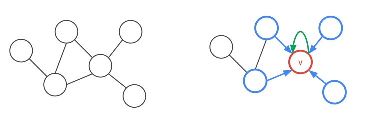
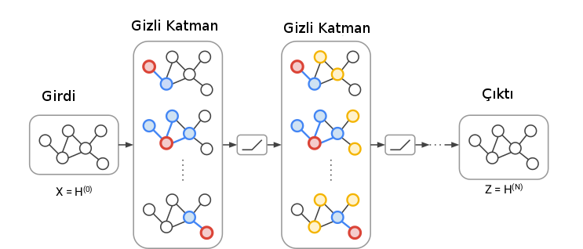

# Evrişimsel Çizit Ağları (Graph Convolutional Networks)

Gerçek dünyadaki pek çok veriyi çizit olarak temsil etmek doğal; arkadaşlık
verisi, bilgi temsili. Çizitler bildiğimiz gibi düğümler ve o düğümler
arasındaki bağlantılardan oluşur, bilgi temsili örneğinde mesela A kişisi B
okulunda okudu için A ve B düğümleri arasında "okudu'' bağlantısı konur,
ve yine bu kişinin C şehrinde "yaşamış'' olduğu yine bir bağlantı ile
temsil edilebilir. Bu şekilde tüm çizit kurulabilir, ve sonra çizitin
özetsel bir halini hesaplattırabiliriz (temsili gömme verisi yaratmak
mümkün), sonra bu "öğrenilmiş'' özet üzerinden eksik bilgileri çizite
sormak mümkün olabilir. Acaba A kişisi D işinde "çalışmış mıdır?''. Bu
eksik bir bağlantı, belki veride yok ama olması gerekiyor, eldeki özetten
bu bilgi tamamlanabilir. 

Matematiksel olarak bir düğüm verisinin etrafındaki komşu düğümlerin bir
fonksiyonu olarak modellenir.



Yaklaşıma evrişimsel denmesinin sebebi tüm 1. derece komşuluk ilişkilerinin
aynı ağırlıklar ile hesaplanıyor olması. Bu isim yaklaşımın ismi derin
yapay sinir ağlarındaki evrişimsel operatörlere benzemesinden geliyor, bir
evrişimsel operatörü veri üzerinde gezdirdiğimiz zaman o gezdirme
yapılırken operatörün hep aynı ağırlıkları kullanıldığı varsayarız / o
şekilde kodlarız.

$$ h_v = ReLU(W_{loop}h_v + \sum_{u \in N(v)} W h_u ) $$

$W_{loop}$ düğümlerin kendilerine olan bağlantısını (loop) modelliyor, buna
etraftaki bağlantılar ekleniyor. Fakat bir DYSA'da evrişimsel (ve diğer)
tabakalar, katmanlar vardır, GCN'de katmanlar nerede? Katmanlar bir düğümün
hesabı için kaç komşuluk seviyesi geriye gitmesi üzerinden
hesaplanıyor. Eğer bir düğüm için komşunun komşusuna gidiyorsak bu ilişki
ağın ikinci katmanını oluşturur.



Üstteki figürde gördüğümüz gibi ilk seviye komşuluklar mavi komşular ve
kırmızı düğüm arasında, bu birinci katman (her kırmızı düğüm için komşuluk
aynı ağırlıklarla). İkinci katmanda komşunun komşusu sarı düğümler de dahil
ediliyor, ve bunlar da farklı (ama yine her ikinci seviye komşuluk için
aynı) ağırlıklarla hallediliyor.

GCN'lerin diğer çizit işleyen yaklaşımlara göre bir diğer avantajı hem
bağlantı yapısını, hem de düğümler üzerindeki referans bilgisini de (mesela
kişileri temsil eden düğümlerde yaş, cinsiyet gibi bilgiler)
kullanabilmesi. 

[2] konudaki yayınlardan biri, örnek olarak bilimsel yayınların
birbirini referansını analiz etmişler, ayrıca tavsiye sistemleriyle kendi
yaklaşımlarını yarıştırmışlar, sonuçlar oldukca iyi [3].

Kod

```python
from __future__ import division
from __future__ import print_function

import time
import os
import numpy as np
import pickle as pkl
import networkx as nx
import scipy.sparse as sp
import tensorflow as tf
import numpy as np
import scipy.sparse as sp
from sklearn.metrics import roc_auc_score
from sklearn.metrics import average_precision_score

flags = tf.app.flags
FLAGS = flags.FLAGS

class OptimizerAE(object):
    def __init__(self, preds, labels, pos_weight, norm):
        preds_sub = preds
        labels_sub = labels

        tmp = tf.nn.weighted_cross_entropy_with_logits(logits=preds_sub, targets=labels_sub, pos_weight=pos_weight)
        self.cost = norm * tf.reduce_mean(tmp)
        self.optimizer = tf.train.AdamOptimizer(learning_rate=FLAGS.learning_rate)  # Adam Optimizer

        self.opt_op = self.optimizer.minimize(self.cost)
        self.grads_vars = self.optimizer.compute_gradients(self.cost)

        tmp = tf.cast(tf.greater_equal(tf.sigmoid(preds_sub), 0.5), tf.int32)
        self.correct_prediction = tf.equal(tmp, tf.cast(labels_sub, tf.int32))
        self.accuracy = tf.reduce_mean(tf.cast(self.correct_prediction, tf.float32))

def parse_index_file(filename):
    index = []
    for line in open(filename):
        index.append(int(line.strip()))
    return index


def load_data(dataset):
    names = ['x', 'tx', 'allx', 'graph']
    objects = []
    for i in range(len(names)):
        objects.append(pkl.load(open("data/ind.{}.{}".format(dataset, names[i]))))
    x, tx, allx, graph = tuple(objects)
    test_idx_reorder = parse_index_file("data/ind.{}.test.index".format(dataset))
    test_idx_range = np.sort(test_idx_reorder)

    test_idx_range_full = range(min(test_idx_reorder), max(test_idx_reorder)+1)
    tx_extended = sp.lil_matrix((len(test_idx_range_full), x.shape[1]))
    tx_extended[test_idx_range-min(test_idx_range), :] = tx
    tx = tx_extended

    features = sp.vstack((allx, tx)).tolil()
    features[test_idx_reorder, :] = features[test_idx_range, :]
    adj = nx.adjacency_matrix(nx.from_dict_of_lists(graph))

    return adj, features

def weight_variable_glorot(input_dim, output_dim, name=""):
    init_range = np.sqrt(6.0 / (input_dim + output_dim))
    initial = tf.random_uniform([input_dim, output_dim], minval=-init_range,
                                maxval=init_range, dtype=tf.float32)
    return tf.Variable(initial, name=name)

_LAYER_UIDS = {}

def get_layer_uid(layer_name=''):
    if layer_name not in _LAYER_UIDS:
        _LAYER_UIDS[layer_name] = 1
        return 1
    else:
        _LAYER_UIDS[layer_name] += 1
        return _LAYER_UIDS[layer_name]


def dropout_sparse(x, keep_prob, num_nonzero_elems):
    noise_shape = [num_nonzero_elems]
    random_tensor = keep_prob
    random_tensor += tf.random_uniform(noise_shape)
    dropout_mask = tf.cast(tf.floor(random_tensor), dtype=tf.bool)
    pre_out = tf.sparse_retain(x, dropout_mask)
    return pre_out * (1./keep_prob)


class Layer(object):
    def __init__(self, **kwargs):
        allowed_kwargs = {'name', 'logging'}
        for kwarg in kwargs.keys():
            assert kwarg in allowed_kwargs, 'Invalid keyword argument: ' + kwarg
        name = kwargs.get('name')
        if not name:
            layer = self.__class__.__name__.lower()
            name = layer + '_' + str(get_layer_uid(layer))
        self.name = name
        self.vars = {}
        logging = kwargs.get('logging', False)
        self.logging = logging
        self.issparse = False

    def _call(self, inputs):
        return inputs

    def __call__(self, inputs):
        with tf.name_scope(self.name):
            outputs = self._call(inputs)
            return outputs


class GraphConvolution(Layer):
    def __init__(self, input_dim,
                 output_dim, adj,
                 dropout=0.,
                 act=tf.nn.relu, **kwargs):
        super(GraphConvolution, self).__init__(**kwargs)
        with tf.variable_scope(self.name + '_vars'):
            self.vars['weights'] = weight_variable_glorot(input_dim,
                                                          output_dim,
                                                          name="weights")
        self.dropout = dropout
        self.adj = adj
        self.act = act

    def _call(self, inputs):
        x = inputs
        x = tf.nn.dropout(x, 1-self.dropout)
        x = tf.matmul(x, self.vars['weights'])
        x = tf.sparse_tensor_dense_matmul(self.adj, x)
        outputs = self.act(x)
        return outputs


class GraphConvolutionSparse(Layer):
    def __init__(self, input_dim,
                 output_dim, adj,
                 features_nonzero,
                 dropout=0., act=tf.nn.relu, **kwargs):
        super(GraphConvolutionSparse, self).__init__(**kwargs)
        with tf.variable_scope(self.name + '_vars'):
            self.vars['weights'] = weight_variable_glorot(input_dim,
                                                          output_dim,
                                                          name="weights")
        self.dropout = dropout
        self.adj = adj
        self.act = act
        self.issparse = True
        self.features_nonzero = features_nonzero

    def _call(self, inputs):
        x = inputs
        x = dropout_sparse(x, 1-self.dropout, self.features_nonzero)
        x = tf.sparse_tensor_dense_matmul(x, self.vars['weights'])
        x = tf.sparse_tensor_dense_matmul(self.adj, x)
        outputs = self.act(x)
        return outputs


class InnerProductDecoder(Layer):
    def __init__(self, input_dim, dropout=0., act=tf.nn.sigmoid, **kwargs):
        super(InnerProductDecoder, self).__init__(**kwargs)
        self.dropout = dropout
        self.act = act

    def _call(self, inputs):
        inputs = tf.nn.dropout(inputs, 1-self.dropout)
        x = tf.transpose(inputs)
        x = tf.matmul(inputs, x)
        x = tf.reshape(x, [-1])
        outputs = self.act(x)
        return outputs

class Model(object):
    def __init__(self, **kwargs):
        allowed_kwargs = {'name', 'logging'}
        for kwarg in kwargs.keys():
            assert kwarg in allowed_kwargs, 'Invalid keyword argument: ' + kwarg

        for kwarg in kwargs.keys():
            assert kwarg in allowed_kwargs, 'Invalid keyword argument: ' + kwarg
        name = kwargs.get('name')
        if not name:
            name = self.__class__.__name__.lower()
        self.name = name

        logging = kwargs.get('logging', False)
        self.logging = logging

        self.vars = {}

    def _build(self):
        raise NotImplementedError

    def build(self):
        """ Wrapper for _build() """
        with tf.variable_scope(self.name):
            self._build()
        variables = tf.get_collection(tf.GraphKeys.GLOBAL_VARIABLES, scope=self.name)
        self.vars = {var.name: var for var in variables}

    def fit(self):
        pass

    def predict(self):
        pass


class GCNModelAE(Model):
    def __init__(self, placeholders, num_features, features_nonzero, **kwargs):
        super(GCNModelAE, self).__init__(**kwargs)

        self.inputs = placeholders['features']
        self.input_dim = num_features
        self.features_nonzero = features_nonzero
        self.adj = placeholders['adj']
        self.dropout = placeholders['dropout']
        self.build()

    def _build(self):
        self.hidden1 = GraphConvolutionSparse(input_dim=self.input_dim,
                                              output_dim=FLAGS.hidden1,
                                              adj=self.adj,
                                              features_nonzero=self.features_nonzero,
                                              act=tf.nn.relu,
                                              dropout=self.dropout,
                                              logging=self.logging)(self.inputs)

        self.embeddings = GraphConvolution(input_dim=FLAGS.hidden1,
                                           output_dim=FLAGS.hidden2,
                                           adj=self.adj,
                                           act=lambda x: x,
                                           dropout=self.dropout,
                                           logging=self.logging)(self.hidden1)

        self.z_mean = self.embeddings

        self.reconstructions = InnerProductDecoder(input_dim=FLAGS.hidden2,
                                      act=lambda x: x,
                                      logging=self.logging)(self.embeddings)


def sparse_to_tuple(sparse_mx):
    if not sp.isspmatrix_coo(sparse_mx):
        sparse_mx = sparse_mx.tocoo()
    coords = np.vstack((sparse_mx.row, sparse_mx.col)).transpose()
    values = sparse_mx.data
    shape = sparse_mx.shape
    return coords, values, shape


def preprocess_graph(adj):
    adj = sp.coo_matrix(adj)
    adj_ = adj + sp.eye(adj.shape[0])
    rowsum = np.array(adj_.sum(1))
    degree_mat_inv_sqrt = sp.diags(np.power(rowsum, -0.5).flatten())
    adj_normalized = adj_.dot(degree_mat_inv_sqrt).\
                     transpose().\
                     dot(degree_mat_inv_sqrt).tocoo()
    return sparse_to_tuple(adj_normalized)


def construct_feed_dict(adj_normalized, adj, features, placeholders):
    # construct feed dictionary
    feed_dict = dict()
    feed_dict.update({placeholders['features']: features})
    feed_dict.update({placeholders['adj']: adj_normalized})
    feed_dict.update({placeholders['adj_orig']: adj})
    return feed_dict


def mask_test_edges(adj):
    adj = adj - sp.dia_matrix((adj.diagonal()[np.newaxis, :], [0]), shape=adj.shape)
    adj.eliminate_zeros()
    assert np.diag(adj.todense()).sum() == 0

    adj_triu = sp.triu(adj)
    adj_tuple = sparse_to_tuple(adj_triu)
    edges = adj_tuple[0]
    edges_all = sparse_to_tuple(adj)[0]
    num_test = int(np.floor(edges.shape[0] / 10.))
    num_val = int(np.floor(edges.shape[0] / 20.))

    all_edge_idx = range(edges.shape[0])
    np.random.shuffle(all_edge_idx)
    val_edge_idx = all_edge_idx[:num_val]
    test_edge_idx = all_edge_idx[num_val:(num_val + num_test)]
    test_edges = edges[test_edge_idx]
    val_edges = edges[val_edge_idx]
    train_edges = np.delete(edges, np.hstack([test_edge_idx, val_edge_idx]), axis=0)

    def ismember(a, b, tol=5):
        rows_close = np.all(np.round(a - b[:, None], tol) == 0, axis=-1)
        return (np.all(np.any(rows_close, axis=-1), axis=-1) and
                np.all(np.any(rows_close, axis=0), axis=0))

    test_edges_false = []
    while len(test_edges_false) < len(test_edges):
        idx_i = np.random.randint(0, adj.shape[0])
        idx_j = np.random.randint(0, adj.shape[0])
        if idx_i == idx_j:
            continue
        if ismember([idx_i, idx_j], edges_all):
            continue
        if test_edges_false:
            if ismember([idx_j, idx_i], np.array(test_edges_false)):
                continue
            if ismember([idx_i, idx_j], np.array(test_edges_false)):
                continue
        test_edges_false.append([idx_i, idx_j])

    val_edges_false = []
    while len(val_edges_false) < len(val_edges):
        idx_i = np.random.randint(0, adj.shape[0])
        idx_j = np.random.randint(0, adj.shape[0])
        if idx_i == idx_j:
            continue
        if ismember([idx_i, idx_j], train_edges):
            continue
        if ismember([idx_j, idx_i], train_edges):
            continue
        if ismember([idx_i, idx_j], val_edges):
            continue
        if ismember([idx_j, idx_i], val_edges):
            continue
        if val_edges_false:
            if ismember([idx_j, idx_i], np.array(val_edges_false)):
                continue
            if ismember([idx_i, idx_j], np.array(val_edges_false)):
                continue
        val_edges_false.append([idx_i, idx_j])

    assert ~ismember(test_edges_false, edges_all)
    assert ~ismember(val_edges_false, edges_all)
    assert ~ismember(val_edges, train_edges)
    assert ~ismember(test_edges, train_edges)
    assert ~ismember(val_edges, test_edges)

    data = np.ones(train_edges.shape[0])

    adj_train = sp.csr_matrix((data, (train_edges[:, 0],
                                      train_edges[:, 1])),
                              shape=adj.shape)
    adj_train = adj_train + adj_train.T

    return \
        adj_train, train_edges, val_edges, \
        val_edges_false, test_edges, \
        test_edges_false
```

```python
from __future__ import division
from __future__ import print_function

import tensorflow as tf
import scipy.sparse as sp
import util
import time
import numpy as np
from sklearn.metrics import roc_auc_score
from sklearn.metrics import average_precision_score

flags = tf.app.flags
FLAGS = flags.FLAGS

flags.DEFINE_float('learning_rate', 0.01, 'Initial learning rate.')
flags.DEFINE_integer('epochs', 200, 'Number of epochs to train.')
flags.DEFINE_integer('hidden1', 32, 'Number of units in hidden layer 1.')
flags.DEFINE_integer('hidden2', 16, 'Number of units in hidden layer 2.')
flags.DEFINE_float('weight_decay', 0., 'Weight for L2 loss on embedding matrix.')
flags.DEFINE_float('dropout', 0., 'Dropout rate (1 - keep probability).')

flags.DEFINE_string('model', 'gcn_ae', 'Model string.')
flags.DEFINE_string('dataset', 'citeseer', 'Dataset string.')
flags.DEFINE_integer('features', 1, 'Whether to use features (1) or not (0).')

model_str = FLAGS.model
dataset_str = FLAGS.dataset

adj, features = util.load_data(dataset_str)

adj_orig = adj
adj_orig = adj_orig - sp.dia_matrix(
    ( adj_orig.diagonal()[np.newaxis, :], [0]), shape=adj_orig.shape
)
adj_orig.eliminate_zeros()

adj_train, train_edges, val_edges,\
val_edges_false, test_edges,\
test_edges_false = util.mask_test_edges(adj)

adj = adj_train

if FLAGS.features == 0:
    features = sp.identity(features.shape[0])  # featureless

adj_norm = util.preprocess_graph(adj)

placeholders = {
    'features': tf.sparse_placeholder(tf.float32),
    'adj': tf.sparse_placeholder(tf.float32),
    'adj_orig': tf.sparse_placeholder(tf.float32),
    'dropout': tf.placeholder_with_default(0., shape=())
}

num_nodes = adj.shape[0]

features = util.sparse_to_tuple(features.tocoo())
num_features = features[2][1]
features_nonzero = features[1].shape[0]

model = util.GCNModelAE(placeholders, num_features, features_nonzero)

pos_weight = float(adj.shape[0] * adj.shape[0] - adj.sum()) / adj.sum()
norm = adj.shape[0] * adj.shape[0] / float((adj.shape[0] * adj.shape[0] - adj.sum()) * 2)

tmp = tf.reshape(tf.sparse_tensor_to_dense(placeholders['adj_orig'],validate_indices=False), [-1])
opt = util.OptimizerAE(preds=model.reconstructions,labels=tmp,
                       pos_weight=pos_weight,norm=norm)

sess = tf.Session()
sess.run(tf.global_variables_initializer())

cost_val = []
acc_val = []

def get_roc_score(edges_pos, edges_neg, emb=None):
    if emb is None:
        feed_dict.update({placeholders['dropout']: 0})
        emb = sess.run(model.z_mean, feed_dict=feed_dict)

    def sigmoid(x):
        return 1 / (1 + np.exp(-x))

    # Predict on test set of edges
    adj_rec = np.dot(emb, emb.T)
    preds = []
    pos = []
    for e in edges_pos:
        preds.append(sigmoid(adj_rec[e[0], e[1]]))
        pos.append(adj_orig[e[0], e[1]])

    preds_neg = []
    neg = []
    for e in edges_neg:
        preds_neg.append(sigmoid(adj_rec[e[0], e[1]]))
        neg.append(adj_orig[e[0], e[1]])

    preds_all = np.hstack([preds, preds_neg])
    labels_all = np.hstack([np.ones(len(preds)), np.zeros(len(preds))])
    roc_score = roc_auc_score(labels_all, preds_all)
    ap_score = average_precision_score(labels_all, preds_all)

    return roc_score, ap_score


cost_val = []
acc_val = []
val_roc_score = []

adj_label = adj_train + sp.eye(adj_train.shape[0])
adj_label = util.sparse_to_tuple(adj_label)

for epoch in range(FLAGS.epochs):

    t = time.time()

    feed_dict = util.construct_feed_dict(adj_norm, adj_label, features, placeholders)
    feed_dict.update({placeholders['dropout']: FLAGS.dropout})

    outs = sess.run([opt.opt_op, opt.cost, opt.accuracy], feed_dict=feed_dict)

    avg_cost = outs[1]
    avg_accuracy = outs[2]

    roc_curr, ap_curr = get_roc_score(val_edges, val_edges_false)
    val_roc_score.append(roc_curr)

    print("Epoch:", '%04d' % (epoch + 1), "train_loss=", "{:.5f}".format(avg_cost),
          "train_acc=", "{:.5f}".format(avg_accuracy), "val_roc=", "{:.5f}".format(val_roc_score[-1]),
          "val_ap=", "{:.5f}".format(ap_curr),
          "time=", "{:.5f}".format(time.time() - t))

print("Optimization Finished!")

roc_score, ap_score = get_roc_score(test_edges, test_edges_false)
print('Test ROC score: ' + str(roc_score))
print('Test AP score: ' + str(ap_score))
```

Peki bu metotu keşfedenler çizitleri evrişimsel kavramlarla bağlantılamak
istemişler? Bunun sebebi büyük bir ihtimalle mevcut DYSA hesaplayan kodlama
altyapısından faydalanmak istemeleri. DYSA hesaplamak için Tensorflow gibi
kütüphanelerden oluşan kuvvetli bir kod altyapısı var artık, eğer
problemimizi bu kütüphanelerin çözebileceği formlara sokabilirsek pek çok
yan faydayı bedava elde edebilmiş oluruz. 

Üstteki kodu `train.py`'dan işletince sonucu göreceğiz, AUC yüzde 90
civarında olmalı.

Kaynaklar

[1] Titov, *Extracting and Modeling Relations with Graph Convolutional Networks*, [http://www.akbc.ws/2017/slides/ivan-titov-slides.pdf](http://www.akbc.ws/2017/slides/ivan-titov-slides.pdf)

[2] Kipf, *Variational Graph Auto-Encoders*, [https://arxiv.org/abs/1611.07308](https://arxiv.org/abs/1611.07308)

[3] Kipf, *Implementation of Graph Auto-Encoders in TensorFlow*, [https://github.com/tkipf/gae](https://github.com/tkipf/gae)


