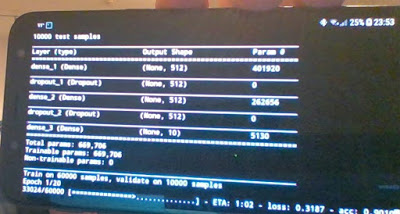

# Android Uzerinde Linux - Termux, Samsung J6

Android işletim sisteminin temeli Linux işletim sistemidir, en azından
çekirdek seviyesinde bu böyle. Peki madem böyle niye Ubuntu'da, ya da
diğer Debian bazlı sistemlerde olduğu gibi `apt-get`, `python`,
`ruby`, komutlari ile ya da Flask gibi uygulamalari kurup,
geliştirmeyi direk Android telefonu üzerinde yapamıyoruz? Hatta cep
telefonları artık iyice kuvvetlendi, dizüstü bilgisayarı atsak, sadece
cep telefonu üzerinde geliştirme yapsak?

Bunların yapılamamasının sebebi Linux temelli olsa da Android'de her
şeyi Java bazlı işletebilmek için katman üzerine katman koyarak Linux
baz sisteminden uzaklaşılmış olması. Fakat bazıları bayağı uğraşarak
Linux temelli geliştirmeyi Android'e taşımışlar. Google Play'den
indirilebilecek bir uygulama Termux.

Termux'a bir "app" demek basit kaçar aslında, daha çok bir başlangıç
kabuğu denebilir, Termux bize telefon içinde bir komut satırı verir,
bu satırda `apt install` ya da `pkg install` ile ek uygulamaları
Ubuntu'da olduğu gibi kurarız. Mesela apt-install python
gibi. Termux'u yazanlar bir sürü Linux bazlı programı bu şekilde
Android için hazır hale getirmişler. Liste tüm programları kapsamıyor,
ama şaşırtıcı derecede faydalı programlar var. C++ icin clang, ya da
Tex icin texlive hatta emacs! Ben denedim, yeterince buyuk ekran var
ise cep telefon üzerinde emacs rahatca kullaniliyor. Tabii Samsung bu
baglamda DevX sistemi ile / gibi dışarıdan bir Bluetooth klavyesi
bağlayıp görüntüyü bir büyük ekrana yansıtacak türden kullanım
dusunuyor, ki bu tür kullanım başta değindiğimiz pür cep telefon bazlı
geliştirmedir.

Python sistemı daha önce bahsedildiği gibi mevcut, `pkg install
python3` ardından, `pip install virtualenv` deriz, ve `python3` için
bir sanal ortam yaratabiliriz. Cep telefonu üzerinde virtualenv'e
girmek bazılarımızı şaşırtabilir. Fakat işliyor.


Sanal ortama girince burada `pip install` ile `ipython`, `numpy`,
`scipy` kurabiliriz. Bazı paketlerde sorun çıkabilir, mesela `zmq`
için bizde bir sorun çıktı ki bu sorun jupyter ile de yasanabilir,
once `pgk install libzmq libzmq-dev python-dev libcrypt-dev`
kurulur. Ardından, eğer zmq import edilmesi problem veriyorsa, komut
satırına çıkıp ana dizinde bir `.bash_profile` dosyası yaratıp onun
içine alttakini yazarız,

`export LD_PRELOAD=$LD_PRELOAD:"/data/data/com.termux/files/usr/lib/libzmq.so"`

exit ile Termux'dan çıkıp tekrar girersek, artık zmq çalışıyor olacak.

Paketler pandas, matplotlib icin ek bazi kurma islemleri

`pkg install clang freetype-dev libpng-dev python2-dev`

Matpotlib icin `$HOME/.config/matplotlib/matplotlibrc` icinde `backend : agg`
yazmak lazim, komut satirindan cikip tekrar girin, sonra

`LDFLAGS=" -lm -lcompiler_rt -lpython" pip install cython pandas matplotlib`

Eger Python 2 ortami icin kurulum yapiliyorsa ustteki  -lpython2.7 yapilabilir.

Geri Sürüm Paket

"Dışarısı" ile Dosya Paylaşmak

Termux kendi izole alanında işliyor. Eğer Android ana dizinlerine
Termux komut satırından erişmek istersek,  `termux-setup-storage`
deriz, izin isteyen diyalog kutusu gelince ona 'allow (izin ver)'
deriz. Artık ana dizinde bir `storage` adlı bir alt dizin olacak, bu
alt dizine bakınca içinde downloads, movies, music gibi Anroid'in
bilinen dizinlerini göreceğiz. Bu dizinlere yazılan her dosya dışarıda
da gözükecektir. Ya da ters yönde oraya yazılan Termux'da okunur.

`ssh` var, dışarı bağlanılıp envai türden iş yapılabilir. Kimisi web
geliştirmeyi DevX üzerinden direk telefonda yapıyor, flask, django
var, mikroservis ya da apache başlatılabilir, yerel servis yerel
tarayıcı ile ziyaret edilip sayfalar, servis tarafı kodu test
edilebilir.

Veri tabanlarına bağlanmak için PostgreSql var. `pkg install
postgresql-dev python-dev make clang`, ve python seviyesinde pip
install `psycopg2`. Yok yok.

Tüm Termux dizinlerini yedeklemek için [1].

Latex

`pkg install texlive` ile kapsamlı bir TeX kurulabileceğini
gördük. Ama ekler için TeX paket sistemi ile kuruluş mümkün, tlmgr
ınstall [paket]. Ama ayrı ayrı her paket kurmak yerine daha rahatı

```
tlmgr install collection-fontsrecommended
tlmgr install collection-latexextra
tlmgr install collection-mathscience
```

isletmek.

Scipy

Bu paket çok kritik, mesela `statsmodels` için lazım. Fakat `pip
install` ile kurulumda problem çıkıyor. Termux'ta paket

```
pkg install scipy
```

ile kurulabilir. Fakat böyle yapınca kurulum global python için
oluyor, virtualenv ortamlarında nasıl görülecek? Bunu basit bir
sembolik bağlantı ile halledebiliriz, global python'a girip import
scipy ve print (scipy) derseniz kütüphane yeri gösterilecek. Bu adresi
alıp mesela `env3/lib/site-packages` altında `ln -s` ile bağlantılarsanız
(ki scipy dizini orada görülsün) scipy işleyecektir.

Şimdi bir pürüz ortaya çıkabilir; Eğer pip ınstall keras ile kuruluş
yapmaya çalışırsak bazen bu ve benzeri paketler scipy'in zaten kurulu
olduğunun farkedemeyebiliyorlar. Bu durumda bu
paketleri `--no-dependencies` seçeneği ile kurmak lazım. Tabii böyle
olunca gerçekten ihtiyaç olan paketleri kurmadan atlayacaktır, keras
durumunda bu paketleri teker teker elle kurmak lazım. Mesela

```
pip install theano --no-dependencies
pip install keras-applications --no-dependencies
pip install keras-preprocessing --no-dependencies
```

Tum bunlardan sonra keras ayni sekilde kurulur.

Keras icin arka plan hesap motorunu theano sectirmek icin kodun en
basinda alttaki kullanilabilir.

```
import os; os.environ['KERAS_BACKEND'] = 'theano'
```

Arka plan motor Tensorflow da olabilir, ona girmiyorum, çünkü Termux
ile problem çıktı. Fakat Keras işliyorsa (theano üzerinden) bu yeterli
olabilir. Altta basit örnek bir YSA'yı Keras ile telefonum üzerinde
eğitirken görüyoruz.




Pillow

Her paketin sanki Termux'a has bir kurulus sekli var :) Pillow
kurulumu hata verirse,

`pkg install python python-dev libjpeg-turbo-dev libcrypt-dev ndk-sysroot clang`

```
LDFLAGS="-L/system/lib/" CFLAGS="-I/data/data/com.termux/files/usr/include/" pip install Pillow
```

h5py

Keras'in modellerini kaydettigi h5 formati icin `pkg
install libhdf5-dev` ve `pip install h5py`.

Samsung

Fakat Termux yine de izole bir ortam. Docker'vari daha geniş kapsamlı
Linux işletmek için Samsung kolları sıvadı ve Linux on Galaxy adlı bir
proje üzerinde çalışıyorlar. Bu şekilde telefon, tablet sahibi
geliştiricileri kendilerine çekmeye uğraşıyorlar, ekonomik kısmı
mantıklı.

*Not*: Google Playstore'daki Termux artık desteklenmiyor, fakat hala
içinde `ssh` olan iskelet bir komut satırı kuruluşu yapılabiliyor.
Alttaki yazının bazı kısımları hala geçerli.


Kaynaklar

[1] <a href="https://wiki.termux.com/wiki/Backing_up_Termux">Backing up Termux</a>


