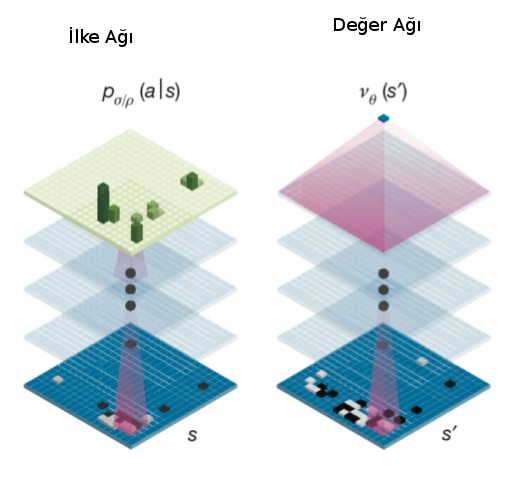

# Derin Öğrenme ile Go Oyununu Oynamak, DeepMind AlphaGo Zero

Yapay Zeka alanındaki heyecan verici ilerlemelerden biri Google DeepMind
şirketinin AlphaGo programının 17 kez Go şampiyonu olmuş Lee Sedol'u
yenmesiydi. Fakat DeepMind orada durmadı, mimariyi geliştirerek AlphaGo'yu
100-0 yenecek AlphaGo Zero'yu geliştirdi! Yeni mimarinin ilginç tarafı
YZ'nin hiç dış veriye ihtiyaç duymadan eğitilmiş olması. AGZ sıfır
kabiliyet ile başlıyor (clean slate), ve kendisiyle oynaya oynaya Go
şampiyonlarını yenecek hale geliyor.  Bu ve ek ilerlemeleri bu yazıda
paylaşıyoruz.

Mimari

Genel olarak AG ve AGZ'nin benzer bazı özellikleri var. Bunlardan ilki
Monte Carlo Ağaç Aramasının (Monte Carlo Tree Search -MCTS-) bir derin YSA
ile genişletilerek kabiliyetinin ilerletilmiş olması. MCTS konusunu
işledik, herhangi bir tahta pozisyonundan başlayarak simülasyon yapılır, ve
kazanç / kayıp verisi yukarı alınarak karar mekanizması için
kullanılır. Fakat simülasyon yapılırken ve her tahta pozisyonundan hamle
seçenekleri üretilirken ne kadar derine inilecek? Oyun bitene kadar
inilirse bu özellikle Go gibi bir oyunda çok derin ve geniş bir ağaç ortaya
çıkartabilir, bilgisayarlar performans açısından böyle bir ağaçla
zorlanırlar. Çözüm belli bir tahtaya bakarak o oyunun kazanılıp
kazanılmayacağı hakkında "sezgisel'' bir karar verebilmek. Bu işi örüntü
tanıma üzerinden YSA çok güzel yapabilir. Önceden (kendisiyle oynarken)
elde edilen oyun verisine bakarak, tahta pozisyonları ve o oyunun kazanılıp
kazanılmadığı verisiyle eğitilen "değer YSA'sı'' artık yeni bir tahtayı
görünce o durumun kazanç şansının olup olmadığını -1,+1 arasında bir değer
ile hesaplayabilir. Bu durumda MCTS'in herhangi bir dalda oyunu sonuna
kadar simüle etmesine gerek yoktur, belli bir seviye sonra durup YSA'ya
kazanç şansını sorar, bu değeri kullanır.

İkinci özellik bir ilke / siyaset / strateji YSA'sı kullanmak, ilke YSA'sı
bir tahtayı girdi olarak alıp, yapılabilecek tüm hamleler için bir kazanç
olasılığı üretebilir, ilke YSA'sin çıktısı potansiyel olarak tüm tahta
hücreleri olabilir [1,3]. MCTS bu çıktıları kazanma olasılığı daha yüksek
olan hamle ağaç dallarını simüle etmek için kullanacaktır.

Yazının geri kalanında 9x9 Go boyutlarını referans alacağız, AG ve AGZ
19x19 oyunu üzerinde işliyor. 



Bir not düşelim, YSA "bir tahtayı girdi alıyor'' dedik ama girdi verisi
oldukca zenginleştirilmiş halde, sadece (9,9) boyutunda tek bir tahta
değil, (9,9,17) boyutunda yani 17 katmanlı bir veri "balyası''. Bu balyayı
hazırlamak için herhangi bir oyun anında tahtaya bakılır, her renk için
(siyah/beyaz) 8 katman yaratılır, bu katmanlardan biri o rengin o andaki
tahtadaki pozisyonu, diğer 7'si hemen önceki 7 adımdaki aynı rengin
pozisyonları, aynı şekilde diğer renk için 8 katman, ve ek bir katman
sıranın kimde olduğu. Tüm bunlar istiflenerek toplam 17 katman
yaratılır. Herhangi bir anda oyunun durumu bu tensor üzerinden
belirtilir. Verinin bu şekilde zenginleştirilmesinin sebebi herhalde
zamansal bağlantıları yakalamaya uğraşmak. 


AlphaGo Zero

AGZ'nin yaptığı ilerlemeler ise şunlar [3]: AlphaGo değer ve ilke için iki
ayrı ağ kullanıyordu. AGZ'de değer ve ilke YZ'leri birleştirilerek tek bir
YSA ile iki çıktı üretilmesi sağlanıyor, bu yapıya esprili bir şekilde
"iki başlı canavar (two-headed monster)'' ismi de veriliyor. Bu mimari
biraz garip gelebilir, çünkü çoğu uygulamada genellikle tek bir çıktı
kullanılır, mesela bir resimde kedi olup olmadığını tahmin edecek bir YZ
tek bir ikisel çıktı ile bunu yapabilir, ya da resmin belli kategorilere
ait olup olmadığı tek bir vektör çıktısı ile, bu vektörde obje olasılıkları
vardır. Fakat biraz düşününce iki farklı çıktılı yapının niye işlediğini
anlayabiliriz, sonuçta YZ bir fonksiyonu yaklaşık olarak temsil etmeye
çabalar, eğitim sırasında kafa \#1 fonksiyonu bir tahmin üretir, ve eğitim
o kafanın yaptığı tahmine sonuç veren parametreleri günceller, aynı şekilde
kafa \#2 için düzeltme yapılır.


İkinci bir AGZ ilerlemesi artıksal ağ (residual network) adı verilen bir
derin YSA yapısı kullanmak. Artıksal ağlar pür evrişimsel ağların daha
gelişmiş hali, bu yapılarda evrişimsel ağda bölge atlaması yapılarak
sonraki bölgelere direk / kısayol bağlantıları koyuluyor [6]. Örnek bir
yapı altta,


Üçüncü ilerleme ise AGZ'nin kendisine karşı oynayarak kendini eğitmesi (AG
için başkaların oynadığı oyunların kayıtları kullanıldı). DeepMind
bilimcileri araştırmaları sırasında şunu anladılar: hangi baz mimariyle
başlarsak başlayalım, MCTS onu daha iyileştirir. Bu durumda herhangi bir YZ
alınır ki başta ağırlık değerleri rasgele yani hiç bir doğru karar vermez,
ama bu YZ, MCTS ile daha iyi performans gösterecektir, bu sırada oyundan
eğitim verisi toplanır ve bu veri YZ'yi iyileştirmek için ağa uygulanır, ve
işlem başa dönerek devam edilir. Bu sayede en kötü performanstan en iyisine
doğru ilerlemek mümkündür.

Eğitim verisinde hedefin ne olduğunu daha iyi vurgulamak gerekirse, değer
kafası için bu tek bir değer, ilke kafası için tüm 9x9 tahta
pozisyonlarında hangi hamlenin yapılmış olduğu, o hücre 1 diğerleri 0
değerinde olacak. Bu şekilde eğitilen YSA, ilke tahmini üreteceği zaman tüm
hücrelerde olasılık değerleri üretecektir.

Alttaki kod [4]'u baz almıştır. Eğitmek için `train.py` kullanılır,
eğitim sırasında en son YSA belli aralıklarla sürekli kaydedilecektir,
eğitim sonunda ya da yeterince eğitilince işlem durulabilir, ve
`gnugo_play.py` kaydedilen aynı modeli kullanarak GnuGo [1] programına
karşı oynatılabilir. YSA olarak biz ResNet yerine daha basit bir yapı
kullandık,

```python
import simplenet
simplenet.PolicyValue.create_network()
```

```
Tensor("input_1:0", shape=(?, 17, 9, 9), dtype=float32)
Tensor("conv2d/BiasAdd:0", shape=(?, 17, 9, 64), dtype=float32)
Tensor("batch_normalization/batchnorm/add_1:0", shape=(?, 17, 9, 64), dtype=float32)
Tensor("conv2d_2/BiasAdd:0", shape=(?, 17, 9, 128), dtype=float32)
Tensor("batch_normalization_2/batchnorm/add_1:0", shape=(?, 17, 9, 128), dtype=float32)
------------- value -------------------
Tensor("conv2d_3/BiasAdd:0", shape=(?, 17, 9, 2), dtype=float32)
Tensor("activation_3/Relu:0", shape=(?, 17, 9, 2), dtype=float32)
Tensor("flatten/Reshape:0", shape=(?, 306), dtype=float32)
policy_output Tensor("activation_4/Softmax:0", shape=(?, 82), dtype=float32)
------------- policy -------------------
Tensor("conv2d_4/BiasAdd:0", shape=(?, 17, 9, 1), dtype=float32)
Tensor("activation_5/Relu:0", shape=(?, 17, 9, 1), dtype=float32)
Tensor("flatten_2/Reshape:0", shape=(?, 153), dtype=float32)
Tensor("dense_2/BiasAdd:0", shape=(?, 256), dtype=float32)
Tensor("activation_6/Relu:0", shape=(?, 256), dtype=float32)
Tensor("dense_3/BiasAdd:0", shape=(?, 1), dtype=float32)
Tensor("dense_3/BiasAdd:0", shape=(?, 1), dtype=float32)
Out[1]: <tensorflow.python.keras._impl.keras.engine.training.Model at 0x7fa2dd30de50>
```

```python
import numpy as np, resource, sys
from operator import itemgetter

sys.setrecursionlimit(1500)
resource.setrlimit(resource.RLIMIT_STACK, [0x10000000, resource.RLIM_INFINITY])
sys.setrecursionlimit(0x100000)

class TreeNode(object):
    """MCTS agacindaki bir dugum. Her dugum kendi Q degerini, onceki
    olasiligi P'yi, ve kac kez ziyaret edildigi sayisiyla duzeltilmis
    onsel skoru u'yu biliyor.
    """
    def __init__(self, parent, prior_p):
        self._parent = parent
        self._children = {} 
        self._n_visits = 0
        self._W = 0 
        self._Q = 0
        self._u = prior_p
        self._P = prior_p

    def printing(self):
        print(self._children)
        for _, child in self._children.iteritems():
            child.printing()

    def expand(self, action_priors):
        for action, prob in action_priors:
            if action not in self._children:
                self._children[action] = TreeNode(self, prob)

    def select(self):        
        """Cocuklar arasinda maksimum aksiyon Q + u(P)'yi vereni sec
        """
        return max(self._children.iteritems(),
                   key=lambda act_node: act_node[1].get_value())

    def update(self, leaf_value, c_puct):
        """Dugumu altindaki cocuklardan gelen irdeleme uzerinden guncelle

        Arguments:
        
        leaf_value -- mevcut oyuncu perspektifinden alt agacin degeri
        
        c_puct -- (0, inf) arasinda bir sayi, bu dugumun skoru
        uzerinde Q ve P'nun etkisini izafi olarak ayarlar

        Returns:
        None

        """
        self._n_visits += 1
        self._W += leaf_value
        self._Q = self._W / self._n_visits
        if not self.is_root():
            self._u = c_puct * self._P * np.sqrt(self._parent._n_visits) / (1 + self._n_visits)

    def update_recursive(self, leaf_value, c_puct):
        if self._parent:
            self._parent.update_recursive(leaf_value, c_puct)
        self.update(leaf_value, c_puct)

    def get_value(self):
        return self._Q + self._u

    def is_leaf(self):
        return self._children == {}

    def is_root(self):
        return self._parent is None


class MCTS(object):
    def __init__(self, value_fn, policy_fn, c_puct=5, n_playout=1600):
        self._root = TreeNode(None, 1.0)
        self._value = value_fn
        self._policy = policy_fn
        self._c_puct = c_puct
        self._n_playout = n_playout

    def _playout(self, state, self_play):
        node = self._root
        if not node.is_leaf() and self_play:
            tmp = [0.03 for _ in range(len(node._children.items()))]
            etas = np.random.dirichlet(tmp,1)[0]
            j = 0
            for action, child_node in node._children.iteritems():
                child_node._P = 0.75*child_node._P + 0.25*etas[j]
                j += 1

        while True:
            if node.is_leaf():
                action_probs = self._policy(state)
                # Check for end of game.
                if len(action_probs) == 0:
                    break
                if node.is_root() and self_play:
                    tmp = [0.03 for _ in range(len(action_probs))]
                    etas = np.random.dirichlet(tmp,1)[0]
                    j = 0
                    new_action_probs = []
                    for action, prob in action_probs:
                        prob = 0.75*prob + 0.25*etas[j]
                        new_action_probs.append((action, prob))
                        j += 1
                    action_probs = new_action_probs
                node.expand(action_probs)
                break
            # Greedily select next move.
            action, node = node.select()
            state.do_move(action)

        # Alt dugumunun degerini YSA'yi kullanarak hesapla
        leaf_value = self._value(state)

        node.update_recursive(leaf_value, self._c_puct)


    def get_move(self, state, temperature, self_play):
        for n in range(self._n_playout):
            state_copy = state.copy()
            self._playout(state_copy, self_play)

        if temperature > 0:
            childrens = self._root._children.items()
            actions, next_states = map(list, zip(*childrens))
            tmp = [next_state._n_visits for next_state in next_states]
            exponentiated_n_visits = np.power(tmp,1./temperature)
            pi = np.divide(exponentiated_n_visits, np.sum(exponentiated_n_visits))
            child_idx = range(len(childrens))
            child_idx = np.random.choice(child_idx, p = pi)
            return actions[child_idx]
        else : # when temperature is infinitesimal
            return max(self._root._children.iteritems(),
                       key=lambda act_node: act_node[1]._n_visits)[0]

    def update_with_move(self, last_move):
        if last_move in self._root._children:
            self._root = self._root._children[last_move]
            self._root._parent = None
        else:
            self._root = TreeNode(None, 1.0)

class MCTSPlayer(object):
    def __init__(self, value_function, policy_function, c_puct=5, n_playout=1600, evaluating=True, self_play=False):
        self.mcts = MCTS(value_function, policy_function, c_puct, n_playout)
        self.move_count = 0
        self.evaluating = evaluating
        self.self_play = self_play
        if self.evaluating:
            temperature = 0.
        else:
            temperature = 1.
        self.temperature = temperature
        self.is_human = False # for playing a game in play.py

    def get_move(self, state, self_play=False):
        sensible_moves = [move for move in state.get_legal_moves()]
        if len(sensible_moves) > 0:
            move = self.mcts.get_move(state, self.temperature, self.self_play)
            if not self_play:
                self.mcts.update_with_move(move)
            self.move_count += 1
            if not self.evaluating :
                if self.move_count == 2:
                    self.temperature = 0.
            return move

        self.move_count += 1
        if not self.evaluating:
            if self.move_count == 2:
                self.temperature = 0.
        return go.PASS_MOVE

```

```python
import os, glob, pickle, go
import json, re, util
import numpy as np
from shutil import copy
from mcts import MCTSPlayer
from util import flatten_idx, pprint_board
from tensorflow.contrib.keras import optimizers as O
from tensorflow.contrib.keras import callbacks as C
from tensorflow.contrib.keras import backend as K
import resnet
import simplenet

def self_play_and_save(player, opp_player):
    
    state_list = []
    pi_list = []
    player_list = []

    state = go.GameState(size=9, komi=0)

    player_color = go.BLACK
    current = player
    other = opp_player

    step = 0
    while not state.is_end_of_game:
        move = current.get_move(state, self_play=True)

        childrens = current.mcts._root._children.items()

        actions, next_states = map(list, zip(*childrens))
        _n_visits = [next_state._n_visits for next_state in next_states]
        if not move == go.PASS_MOVE:
            if step < 25: # temperature is considered to be 1
                distribution = np.divide(_n_visits, np.sum(_n_visits))
            else:
                max_visit_idx = np.argmax(_n_visits)
                distribution = np.zeros(np.shape(_n_visits))
                distribution[max_visit_idx] = 1.0
        else: # to prevent the model from overfitting to PASS_MOVE
            distribution = np.zeros(np.shape(_n_visits))
            
        pi = zip(actions, distribution)
        pi_list.append(pi)

        state_list.append(state.copy())

        current.mcts.update_with_move(move)
        state.do_move(move)
        other.mcts.update_with_move(move)
        current, other = other, current
        step += 1

    winner = state.get_winner()
    print (('winner', winner))
    # oyun bitti kimin kazandigini biliyoruz, mesela siyah kazandiysa
    # odulleri hamle bazinda +1,-1,+1,.. olacak sekilde ata, beyaz
    # kazandiysa -1,+1,-1 seklinde. Siyah olunca +1 cunku oyuna hep siyah
    # basliyor.
    if winner == go.BLACK:
        reward_list = [(-1.)**j for j in range(len(state_list))]
    else : # winner == go.WHITE:
        reward_list = [(-1.)**(j+1) for j in range(len(state_list))]
    return state_list, pi_list, reward_list

def self_play_and_train(cmd_line_args=None):

    # iki farkli ag yarat, egitim bunlardan ilkini gunceller.
    # belli bir sure sonra oteki YSA ilkinin kaydettigi veriden guncellenir,
    # ve ikisi tekrar esit hale gelir, bu boyle devam eder.
    policy = simplenet.PolicyValue(simplenet.PolicyValue.create_network())
    opp_policy = simplenet.PolicyValue(simplenet.PolicyValue.create_network())

    def lr_scheduler(epoch):
        if epoch == 5000:
            K.set_value(model.optimizer.lr, .001)
        elif epoch == 7000:
            K.set_value(model.optimizer.lr, .0001)
        return K.get_value(model.optimizer.lr)

    change_lr = C.LearningRateScheduler(lr_scheduler)
    sgd = O.SGD(lr=.01, momentum=0.9)
    policy.model.compile(loss=['categorical_crossentropy','mean_squared_error'],
                         optimizer=sgd)        

    batch_size = 50
    n_pick = 10 # her oyundan kac veri noktasi alalim
        
    for epoch in range(1000):

        state_list2 = []
        pi_list2 = []
        reward_list2 = []        
        
        while True: # batch_size kadar veri toplayincaya kadar oyna
            try:
                player = MCTSPlayer(policy.eval_value_state,
                                    policy.eval_policy_state,
                                    n_playout=50, evaluating=False,
                                    self_play=True)
                
                opp_player= MCTSPlayer(opp_policy.eval_value_state,
                                       opp_policy.eval_policy_state,
                                       n_playout=50, evaluating=False,
                                       self_play=True)
                
                state_list, pi_list, reward_list = self_play_and_save(
                    opp_player, player
                )

                # oyunda atilan tum adimlar, sonuclar state_list,
                # pi_list, reward_list listesi icinde. Simdi rasgele
                # n_pick tane veri noktasi her oyun kaydindan cekip
                # cikartilir.
                idxs = [np.random.choice(range(10,len(state_list)),replace=False) \
                        for i in range(n_pick)]
                
                print ()
                
                for idx in idxs:
                    state_list2.append(state_list[idx])
                    pi_list2.append(pi_list[idx])
                    reward_list2.append(reward_list[idx])
                    
                if len(state_list2) >= batch_size: break
            except:
                print ('exception')
                continue

        pout = np.zeros((batch_size, 9*9+1))
        vout = np.zeros((batch_size, 1))
        Y = [pout, vout]
        X = np.zeros((batch_size, 17, 9, 9))

        for i in range(len(state_list2)):
            vout[i,:] = reward_list2[i]
            X[i, :] = util.get_board(state_list2[i])
            pout[i,:] = util.to_pi_mat(pi_list2[i])
                                                
        policy.model.fit(X, Y)

        if epoch % 5 == 0:
            print ('saving')
            policy.save()

        if epoch % 50 == 0:
            print ('birincinin en son kayitli agirliklarindan bu agi guncelle')
            opp_policy.load()

if __name__ == '__main__':
    self_play_and_train()
```

```python
from tensorflow.contrib.keras import regularizers as R
from tensorflow.contrib.keras import models as M
from tensorflow.contrib.keras import layers as L
from tensorflow.contrib.keras import backend as K
from util import flatten_idx, random_transform, idx_transformations
import numpy as np, util, random

mfile = "/tmp/alphago-zero.h5"

class PolicyValue:
    def __init__(self, model):
        self.model = model

    def save(self):
        self.model.save_weights(mfile)
        
    def load(self):
        self.model.load_weights(mfile)
        
    def eval_policy_state(self, state):
        x = util.get_board(state).reshape(1, 17, 9, 9)
        probs1 = self.model.predict(x)[0][0]
        probs2 = probs1[1:].reshape(9,9)
        res_probs = [(action,probs2[action]) \
                     for action in state.get_legal_moves() if action]
        res_probs.append((None, probs1[0]))
        return res_probs

    def eval_value_state(self, state):
        x = util.get_board(state).reshape(1, 17, 9, 9)
        return self.model.predict(x)[1][0][0]
            
    @staticmethod
    def create_network(**kwargs):
        model_input = L.Input(shape=(17, 9, 9))
        print (model_input)
        
        convolution_path = L.Convolution2D(
            input_shape=(),
            filters=64,
            kernel_size=3,
            activation='linear',
            padding='same',
            kernel_regularizer=R.l2(.0001),
            bias_regularizer=R.l2(.0001))(model_input)
        print (convolution_path)
        convolution_path = L.BatchNormalization(
            beta_regularizer=R.l2(.0001),
            gamma_regularizer=R.l2(.0001))(convolution_path)
        print (convolution_path)
        convolution_path = L.Activation('relu')(convolution_path)

        convolution_path = L.Convolution2D(
            input_shape=(),
            filters=128,
            kernel_size=3,
            activation='linear',
            padding='same',
            kernel_regularizer=R.l2(.0001),
            bias_regularizer=R.l2(.0001))(convolution_path)
        print (convolution_path)
        convolution_path = L.BatchNormalization(
            beta_regularizer=R.l2(.0001),
            gamma_regularizer=R.l2(.0001))(convolution_path)
        print (convolution_path)
        convolution_path = L.Activation('relu')(convolution_path)


        print ('------------- value -------------------' )
        # policy head
        policy_path = L.Convolution2D(
            input_shape=(),
            filters=2,
            kernel_size=1,
            activation='linear',
            padding='same',
            kernel_regularizer=R.l2(.0001),
            bias_regularizer=R.l2(.0001))(convolution_path)
        print (policy_path)
        policy_path = L.BatchNormalization(
                beta_regularizer=R.l2(.0001),
                gamma_regularizer=R.l2(.0001))(policy_path)
        policy_path = L.Activation('relu')(policy_path)
        print (policy_path)
        policy_path = L.Flatten()(policy_path)
        print (policy_path)
        policy_path = L.Dense(
                (9*9)+1,
                kernel_regularizer=R.l2(.0001),
                bias_regularizer=R.l2(.0001))(policy_path)
        policy_output = L.Activation('softmax')(policy_path)
        print ('policy_output', policy_output)

        print ('------------- policy -------------------')
        
        # value head
        value_path = L.Convolution2D(
            input_shape=(),
            filters=1,
            kernel_size=1,
            activation='linear',
            padding='same',
            kernel_regularizer=R.l2(.0001),
            bias_regularizer=R.l2(.0001))(convolution_path)
        print (value_path)
        value_path = L.BatchNormalization(
                beta_regularizer=R.l2(.0001),
                gamma_regularizer=R.l2(.0001))(value_path)
        value_path = L.Activation('relu')(value_path)
        print (value_path)
        value_path = L.Flatten()(value_path)
        print (value_path)
        value_path = L.Dense(
                256,
                kernel_regularizer=R.l2(.0001),
                bias_regularizer=R.l2(.0001))(value_path)
        print (value_path)
        value_path = L.Activation('relu')(value_path)
        print (value_path)
        value_path = L.Dense(
                1,
                kernel_regularizer=R.l2(.0001),
                bias_regularizer=R.l2(.0001))(value_path)
        print (value_path)
        value_output = L.Activation('tanh')(value_path)
        print (value_path)

        return M.Model(inputs=[model_input], outputs=[policy_output, value_output])
```

İki YSA kendisine karşı oynarken aynı ağırlıklara sahip iki farklı YSA ile
başlıyoruz, ve oyun sonuçlarını kullanarak sadece birini
güncelliyoruz. Eğer her toptan demeti (minibatch) ile her iki YSA'yı
güncelleseydik birbirlerinden farklılaşmaları zorlaşabilirdi. Ama döngünün
daha ileri bir noktasında esitleme yapariz yine de, ilk YSA'yı
güncellenenin ağırlıklarını diskten okuyarak güncelliyoruz, ve böyle devam
ediyor. AGZ tasarımcıları "en iyi'' olan ağırlıklara geçmeden yeni YSA'nın
diğerini yüzde 55'ten fazla yenmesi şartını koymuşlar, tam donanımla
testleri yapanlar bunu takip ederse iyi olur.

Üstteki mimari birkaç saat eğitim sonrası GnuGo (kendi YZ'si olan bir dış
Go programı) başlangıç, orta seviyelerini yenebiliyor. Okuyucular, grafik
kartlı güçlü bir mimaride, ya üstteki YSA'yı derinleştirerek (daha fazla
evrişim filtresi ekleyerek), ya da `resnet.py` ile, ve `n_play`'i
arttırarak daha fazla simülasyonla sonuçları daha da iyileştirmeye
uğraşabilirler.

Kodlar

[resnet.py](resnet.py), [train.py](train.py), [gnugo_play.py](gnugo_play.py),
[mcts.py](mcts.py)

Kaynaklar

[1] Bayramlı, 
    *Go Oyunu, GnuGo*, 
    [https://burakbayramli.github.io/dersblog/sk/2018/02/go-gnugo.html](https://burakbayramli.github.io/dersblog/sk/2018/02/go-gnugo.html)

[2] Silver, *Mastering the game of Go with deep neural networks and tree search*, [https://www.nature.com/articles/nature16961](https://www.nature.com/articles/nature16961)

[3] Weidman, *The 3 Tricks That Made AlphaGo Zero Work*, [https://hackernoon.com/the-3-tricks-that-made-alphago-zero-work-f3d47b6686ef](https://hackernoon.com/the-3-tricks-that-made-alphago-zero-work-f3d47b6686ef)

[4] Yi, *A reproduction of Alphago Zero in 'Mastering the game of Go without human knowledge'*, [https://github.com/sangyi92/alphago_zero](https://github.com/sangyi92/alphago_zero)

[5] *AlphaGo Zero Cheat Sheet*, [https://applied-data.science/static/main/res/alpha_go_zero_cheat_sheet.png](https://applied-data.science/static/main/res/alpha_go_zero_cheat_sheet.png)

[6] Kristiadi, *Residual Net*, [https://wiseodd.github.io/techblog/2016/10/13/residual-net/](https://wiseodd.github.io/techblog/2016/10/13/residual-net/)


