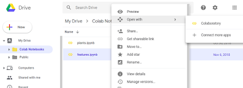

# GPU, TPU Saglayan Not Defter Ortami - Google Collab

Derin Öğrenme için GPU kullanmak isteyenler fakat bulut servisinde
sıfırdan yeni makina yaratmak istemeyenlere Google Collab ilginç
gelebilir. Collab servisi bir tür "Google Drive üzerinden
başlatılabilen  jupyter not defter / çekirdek servisi". Bir önemli
özelliği arka planda, jupyter çekirdeğinin GPU ve hatta Google'ın
TPU'larını kullanabilmesi. Sanki GPU'su, Python'u kurulmuş bir
makinada oturuyoruz, o makinada jupyter hazır, bize tek kalan yeni bir
not defteri başlatmak ve bu defterde kodlama yapmak.

Servise girmek için bir mevcut bir ipynb (not defteri) dosyasını kendi
dizinlerimize alabiliriz, oradan dosyaya sağ tıklama ve menüden Google
Collaboratory seçeneğini seçeriz, ve GC'ye gireriz.

Ya da GD'de yeni herhangi bir dosya yaratırken yapıldığı gibi herhangi
boş bir alanda sağ tıklama oradan GC seçimi ve Untitled.ipynb gibi bir
dosya ismiyle ortama girilebilir.

Girilince bu ortamda keras, tensorflow'un zaten kurulu olduğunu
görürüz. Yeni paket kurmak ta mümkün, bir hücre içinde ünlem sonrası
pip install ile (ünlem ile komut satırına çıkılıyor bilindiği gibi)
bunu yapınca pip çıktısını verdi, ama paket zaten kurulu dedi. Hiç
kurulmamış paketi kurar. Tabii kurulum geçicidir, yarın GC'de aynı not
defterine girince tekrar aynı kurumu yapmak gerekir.

Peki GC benim özel Google Drive'imda duran dosyalarıma erisebilir
mi? Bu mumkun. Bir hücrede

```python
from google.colab import drive
drive.mount('/content/gdrive')
```

işletilir, bu hücrenin altına sonuç olarak bir bağlantı basılacak. Bu
bağlantıya tıklanınca ikinci bir tarayıcı tab'inde bazı güvenlik
soruları sonrası bir üretilmiş bir şifre gösteriliyor, bu kodu alıp
not defterine dönüyoruz, şimdi aynı hücrede bir girdi kutusu var, o
kutuya yazıyoruz. Kontrol yapılıyor ve artık üst seviye GD dizininiz
ne ise, mesela benim için My Drive, oraya artık /content/gdrive ile
erişmek mümkün. Yani My Drive/benim/dizin/dosya.txt erişimi lazımsa,
not defterindeki Python kodu /content/gdrive/benim/dizin/dosya.txt ile
o dosyaya erişilebilir.

Bu arada üstte belirtilen dizine dosya yazmak ta mümkün; mesela bir
zip açıp içindeki dosyaları okuyup bir takım işlemler yapıp bir pickle
üretip yine geri GD'ye yazabiliriz. Sonra bitmiş dosyayı tek bir
tıklamayla dizüstüne indiririz!

GPU yerine TPU kullanmak için menüden Runtime | Change runtime type
seçilebilir. TPU bilindiği gibi Google'ın tasarladığı ve özel yapay
zeka için tasarlanmış bir ciptir.

Not defteri ortamı okkalı bir ortam. Hafıza vs bağlamında pek bir
sınırlamaya raslamadım. Fakat GPU hafızası biraz sınırlanmış olabilir,
ama orada da ayarlarla oynayarak büyütme mümkün olabilir. 



