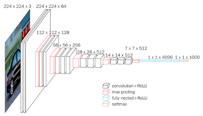

# Önceden Eğitilmiş Modeller (Pre-trained Models), Aktarımlı Öğrenme (Transfer Learning), Çiçek Tanıma

Çiçekleri resimlerinden tanımamızı sağlayacak bir yapay zeka programı
yazmak istiyoruz. Fakat biliyoruz ki derin öğrenmede daha fazla veri
daha iyidir, ama elde fazla veri yok. Veri alttaki gibi olabilir, bu
veride 17 çeşit çiçeğin 80'er tane resmi var.

http://www.robots.ox.ac.uk/~vgg/data/flowers/17/

Ornek bazi resimler (ustteki iki dandofil, alttaki iki snowdrop)

Madem elde fazla veri yok, acaba başka bir amaç için eğitilmiş ama
yine de obje / resim tanımak için hazırlanmış başka bir modeli alıp
onun ağırlıklarını bir şekilde kullanamaz mıyız? Evet bu
yapılabilir. ImageNet yarışmasında  bir resmi 1000 tane sınıfa
atayabilen VGG16 modeli var mesela. ImageNet verisi milyonlarca resim
icerir, her sinif basina yuzlerce resim mevcuttur. Bu veri uzerinde
egitilmis VGG16'nin  bilinen bir evrişimsel (convolutional) derin
yapısı var, yarışmada üst-5 sınıflamasında (gerçek etiket tahmin
edilen en üst 5 etiketlerden biri mi) 92.5% elde etmiş, ve bu sonucu
alan ağırlıklar biliniyor. 

Güzel haber şu, Keras kütüphanesi bu tür ünlü YSA yapılarını ve ağırlıklarını paketine dahil etmiş. 

```
from keras.applications.vgg16 import VGG16

base_model = VGG16(weights="imagenet")

base_model.summary()
```

diyerek VGG16'nin İmageNet ağırlıklarını alabiliriz  mesela. Üstteki
kod şunu gösterir, 

```
_________________________________________________________________

Layer (type)                 Output Shape              Param #   

=================================================================

input_1 (InputLayer)         (None, 224, 224, 3)       0         

_________________________________________________________________

block1_conv1 (Conv2D)        (None, 224, 224, 64)      1792      

_________________________________________________________________

block1_conv2 (Conv2D)        (None, 224, 224, 64)      36928     

_________________________________________________________________

block1_pool (MaxPooling2D)   (None, 112, 112, 64)      0         

_________________________________________________________________

block2_conv1 (Conv2D)        (None, 112, 112, 128)     73856     

_________________________________________________________________

block2_conv2 (Conv2D)        (None, 112, 112, 128)     147584    

_________________________________________________________________

block2_pool (MaxPooling2D)   (None, 56, 56, 128)       0         

_________________________________________________________________

block3_conv1 (Conv2D)        (None, 56, 56, 256)       295168    

_________________________________________________________________

block3_conv2 (Conv2D)        (None, 56, 56, 256)       590080    

_________________________________________________________________

block3_conv3 (Conv2D)        (None, 56, 56, 256)       590080    

_________________________________________________________________

block3_pool (MaxPooling2D)   (None, 28, 28, 256)       0         

_________________________________________________________________

block4_conv1 (Conv2D)        (None, 28, 28, 512)       1180160   

_________________________________________________________________

block4_conv2 (Conv2D)        (None, 28, 28, 512)       2359808   

_________________________________________________________________

block4_conv3 (Conv2D)        (None, 28, 28, 512)       2359808   

_________________________________________________________________

block4_pool (MaxPooling2D)   (None, 14, 14, 512)       0         

_________________________________________________________________

block5_conv1 (Conv2D)        (None, 14, 14, 512)       2359808   

_________________________________________________________________

block5_conv2 (Conv2D)        (None, 14, 14, 512)       2359808   

_________________________________________________________________

block5_conv3 (Conv2D)        (None, 14, 14, 512)       2359808   

_________________________________________________________________

block5_pool (MaxPooling2D)   (None, 7, 7, 512)         0         

_________________________________________________________________

flatten (Flatten)            (None, 25088)             0         

_________________________________________________________________

fc1 (Dense)                  (None, 4096)              102764544 

_________________________________________________________________

fc2 (Dense)                  (None, 4096)              16781312  

_________________________________________________________________

predictions (Dense)          (None, 1000)              4097000   

=================================================================

Total params: 138,357,544
```

VGG16'nin yapısını bu çıktıda görüyoruz.

ImageNet ağırlıkları Internet'ten indirilip $HOME/.keras/models altına
koyuluyor, ve bir sonraki çağrıda tekrar indirilmesi gerekmiyor. 

Önceden eğitilmiş modeli kullanmak ise yarar çünkü her ne kadar VGG16
resimleri 1000 sınıfa ayirmak için yazılmış olsa da sonuçta pek çok
katmanı var ve bu katmanlar sınıflamayı öğrenirken genel olarak "bir
resim nasıl temsil edilir" işini de öğrenmiş oluyorlar. Ayrıca çok
büyük bir veri seti üzerinde eğitildiği için bu işi iyi öğrenmiş
olacağını farzediyoruz. O zaman mevcut modeli şu şekilde
kullanabiliriz: 1. yöntem yeni eğitim verisindeki (çiçek resimleri)
her noktayı teker teker VGG16'ya "tahmin" amaçlı veririz, ama çıktıyı
en son katmandan değil sona yakın katmanlardan birinden alırız; bu
katmandaki ağırlıklar bir resmi temsiliyet açısından oldukca iyi
konumda olmadırlar (öyle ki bu ağırlıklar birkaç katman sonrasındaki
tahminlerin yüzde 92 üstünde başarı elde etmesini sağlamışlar), bu
ağırlıkları bizim yeni resmi temsil eden bir "özellik vektörü" olarak
kullanırız (fikir alttaki bağlantıdan). 

https://gogul09.github.io/software/flower-recognition-deep-learning

Bu vektörleri yeni eğitim verisindeki tüm resimler için kullanıp yeni
bir eğitim / test verisi yaratırız, ve bu veri üzerinde artık Lojistik
Regresyon bile kullanabiliriz. Öyle ya özellik vektörü düz bir veri
haline geldi, artık basit regresyon iyi bir sonuç vermeli. Tabii basit
regresyonun etiketleri ImageNet etiketlerinden farklı olacak, bizde 17
etiket var, ImageNet'te 1000. 

Bahsettigimiz katman numarasi için Keras ile 

```
base_model = VGG16(weights="imagenet")

model = Model(input=base_model.input, output=base_model.get_layer('fc1').output)
```

yeterli. Artik model.predict(..) dersek bir resim icin 4096 boyutlu
özellik vektörü üretilir. 

Tekniği çiçek resimlerinde deneyelim. Üstteki bağlantıdaki verinin zip
halini kullanıyoruz, 

https://drive.google.com/file/d/1N5VbewVJZjAhBPlFFavmG44HvZeE9Zs5/view?usp=sharing

Kod

```
from keras.applications.vgg16 import VGG16, preprocess_input

from keras.applications.xception import Xception, preprocess_input

from keras.preprocessing import image

from keras.models import Model

from keras.models import model_from_json

from keras.layers import Input

import re, collections, zipfile

import pandas as pd

import numpy as np

base_model = VGG16(weights="imagenet")

model = Model(input=base_model.input, output=base_model.get_layer('fc1').output)

with zipfile.ZipFile('[DIZIN]/17flowers.zip', 'r') as z:

     im_files_orig = list(z.namelist())

     im_files = [x for x in im_files_orig if ".jpg" in x and "image_" in x]


class_names = ["daffodil", "snowdrop", "lilyvalley", "bluebell", "crocus",

    "iris", "tigerlily", "tulip", "fritillary", "sunflower", 

    "daisy", "coltsfoot", "dandelion", "cowslip", "buttercup",

    "windflower", "pansy"]

features = []

labels   = []

with zipfile.ZipFile('[DIZIN]/17flowers.zip', 'r') as z:

    for i,flower in enumerate(class_names):

        label = class_names[i]

        for f in im_files[(i*80):(i+1)*80]:

            x = image.load_img(z.open(f), target_size=(224, 224))

            x = image.img_to_array(x)

            x = preprocess_input(np.expand_dims(x.copy(), axis=0))

            feature = model.predict(x)

            flat = feature.flatten()

            features.append(flat)

            labels.append(label)

labels_dict = {}

for x in labels:

     if x not in labels_dict: labels_dict[x] = len(labels_dict)

labels2 = [labels_dict[x] for x in labels]

from sklearn.model_selection import train_test_split

x_train, x_test, y_train, y_test = train_test_split(features, labels2, random_state=42, test_size=0.05)
```

```
from sklearn.linear_model import LogisticRegression, SGDClassifier

clf = LogisticRegression()

clf.fit(x_train, y_train)


rank_1 = 0

rank_5 = 0

for (lab, feat) in zip(y_test, x_test):

  predictions = clf.predict_proba(np.atleast_2d(feat))[0]

  predictions = np.argsort(predictions)[::-1][:5]

  if lab == predictions[0]:

    rank_1 += 1

  if lab in predictions:

    rank_5 += 1


rank_1 = (rank_1 / float(len(y_test))) * 100

rank_5 = (rank_5 / float(len(y_test))) * 100


print (rank_1)

print (rank_5)
```

Bu teknikle elde edilecek sonuç tek tahmin üst-1 için yüzde 88, üst-5
için yüzde 100. Gayet iyi. Eğer eğitim için sadece eldeki verileri
kullansaydık bu sonuç erişmek mümkün olmazdı. 

2. Yöntem

Akla gelebilir, eğer fc1 katmanındaki ağırlıkları lojistik regresyon
için kullandıysak, o katmandan dallanıp yeni bir derin ağ yaratıp bu
ağın son katmanını 17 sınıf için tanımlasak ve bu ağı Keras üzerinden
eğitsek olmaz mı? 

Olur. Burada bazı numaralar, sadece son katmanların eğitilmesi için önceki katmanları "dondurmak", böylece o ağırlıklar hiç değişmez, sadece son katman değişir. Ya da üstte fc1'den özellik aldığımıza göre fc1'e kadar (dahil olmak üzere) dondururuz, sonra fc2 ve son etiket tahmin katmanını serbest bırakırız. Şuna benzer bir kod olabilir,


```
for i in range(len(base_model.layers-2)): ]
    model.layers[i].trainable = False

num_classes = 17

predictions = Dense(num_classes, activation = 'relu')(output = base_model.get_layer('fc2').output )

model = Model(input = base_model.input, output = predictions)

model.compile(optimizer='adam', loss='categorical_crossentropy', metrics=['accuracy'])
```

Tabii eğitim için veri balyası (batch) üreten bir kod eklenecek,
bunlar üstteki eğitim şekline verilecek, vs. vs. Bu okuyucuya odev
olsun.

Hangi yaklaşımın daha uygun olacağı uygulamaya göre değisebilir.

VGG-16 yerine imaj tanıma için eğitilmiş farklı bir YSA da
kullanabilirdik. Mesela Keras'ta ünlü bir diğer model ResNet50
modelidir.

Soru

İmageNet 1000 kategorisinde neler var? 17 çiçek resmiyle alakası ne?

Cevap

1000 kategoride bir sürü günlük hayattan obje var, ev, köpek, kedi,
araba, vs. Çiçek resmi de vardır herhalde, ama bizim 17 kategorideki
çiçekler olmayabilir. Ama o 1000 kategori üzerinden milyonlara resme
bakarak öğrenilmiş bir YSA, başlangıç noktası olarak 17 kategorili
yeni çiçek resimleri için faydalı olur. 




