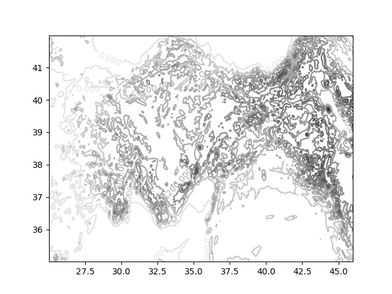

# Yükseklik (Elevation) Verileri

Hangi servis ile yükseklik verisi alınır? Google Elevation servisi
var, belli miktarda kullanım için bedava, sonrası için fiyatlı. Google
Console'dan proje yaratıp projede elevation servisini aktif hale
getirmek lazım, bundan sonra proje API kodunu kullanıp ES çağrılabilir.

### Google

```python
from urllib.request import urlopen
import polyline, json

elev_query = "https://maps.googleapis.com/maps/api/elevation/json?" + \
	      "locations=enc:%s&key=%s"
#key = "[ANAHTAR DEGERI]"
locs = [[40.994252, 29.037847],[40.991771, 29.061873]]
locs = polyline.encode(locs)
url = elev_query % (locs, key)
html = urlopen(url)
json_res = json.loads(html.read().decode('utf-8'))
print (json_res)
```

```text
{'status': 'OK', 'results': [{'resolution': 610.8129272460938,
'location': {'lng': 29.03785, 'lat': 40.99425}, 'elevation':
9.726478576660156}, {'resolution': 610.8129272460938, 'location':
{'lng': 29.06187, 'lat': 40.99177}, 'elevation': 58.94558334350586}]}
```

### Velroutes (Bedava)

Bir diğer seçenek veloroutes.org adresi; burada arkadaş bedava servis
veriyor; onun sayfalarından "kazıyarak" istenen veriyi alabiliriz,


```python
from urllib.request import urlopen
import re

url = "http://veloroutes.org/elevation/?" + \
      "location=41.40000%2C28.15000&units=m"
html = urlopen(url)
res = html.read().decode('utf-8')
p = "Elevation for .*? <span style=\"font-size\:20px\">(\d*)</span> meters"
rres = re.findall(p,res)
print (float(rres[0]))    
```

```text
215.0
```

Daha Çetrefil Kullanım

Alttaki örnekte bir kordinat alanıda 7 x 7 büyüklüğünde bir ızgara yaratıyoruz,
o ızgara öğe kordinatları için yükseklik verisini alıyoruz, ve RBF tekniği [1]
ile aradeğerleme (interpolation) yaparak yüksekliği yaklaşık şekilde temsil
ediyoruz. 


Veri alındı, şimdi RBF,

```python
from scipy.interpolate import Rbf

latlow = 36; lathigh = 37
lonlow = 29; lonhigh = 30

def get_elev_data(coords):
    ...


D = 7
x = np.linspace(lonlow,lonhigh,D)
y = np.linspace(latlow,lathigh,D)
xx,yy = np.meshgrid(x,y)
xxf = xx.reshape(D*D)
yyf = yy.reshape(D*D)
sampleCoords = []
for yyy,xxx in zip(yyf,xxf):
    sampleCoords.append([yyy,xxx])
sampleCoords = np.array(sampleCoords)
print (sampleCoords.shape)

zr =  np.array(get_elev_data(sampleCoords))

yr = sampleCoords[:,0]
xr = sampleCoords[:,1]

rbfi = Rbf(xr,yr,zr,function='multiquadric')
```

```text
(49, 2)
```

Şimdi RBF kullanarak daha yüksek çözünürlü bir ızgara için yüksekliği
aradeğerleme ile hesaplatabiliriz, altta 15 x 15 büyüklüğünde bir ızgara
için bunu yapıyoruz,

```python
D = 15
x = np.linspace(lonlow,lonhigh,D)
y = np.linspace(latlow,lathigh,D)
xx,yy = np.meshgrid(x,y)
yhat = rbfi(xx,yy)

fig, ax = plt.subplots()
CS = ax.contour(xx,yy,yhat)
plt.clabel(CS, inline=1, fontsize=10)
plt.savefig('elev1.png')
```


### DEM, GeoTiff

Yüksekliği gösteren ısı / renk haritaları görmüşüzdür, daha yüksek
yerler daha kırmızımsı, daha alçaklar daha koyu gibi.. O zaman piksel
yükseklik gösteriyorsa ve pikselleri depolayan teknoloji iyi durumdaysa,
aynı işi yükseklik verisi kodlamak için de kullanabiliriz. DEM,
GeoTiff formatı bunu yapar. Dünya verisi [2]'de, Zipped DEM GeoTiff
indirilir, okumak için [3]. Örnek (İtalya'da bir yer)

```python
from geotiff import GeoTiff 
import matplotlib.pyplot as plt

tiff_file = "/tmp/alwdgg.tif"

area_box = ((10, 45), (11, 46))

g = GeoTiff(tiff_file, crs_code=4326, as_crs=4326,  band=0)
arr = g.read_box(area_box)
arr = np.flip(arr,axis=0)
print (arr.shape)

X = np.linspace(area_box[0][0],area_box[1][0],11)
Y = np.linspace(area_box[0][1],area_box[1][1],11)
X,Y = np.meshgrid(X,Y)

CS=plt.contour(X,Y,arr)
plt.clabel(CS, fontsize=10, inline=1)
plt.savefig('elev2.png')
```

```text
(11, 11)
```


`area_box` içinde alt sol köse ve üşe sağ köşe verildi, bir kutu oluşturuldu,
ve kutu içine düşen yükseklik verisi `read_box` ile alındı.

[2] verisinin çözünülürlüğü en yüksek olduğu yerde "1 dakika" olarak
verilmiş, yani aşağı yukarı 1 km x 1 km karelerinin yükseklik verisi
alınabilir. Dosyanin büyüklüğü 20 MB'dan daha az. [3] kullanımı önemli
çünkü bazı alternatif GeoTiff okuma yöntemleri GDAL kurulmasının
gerektirir, [3] kütüphanesi hafif, direk DEM dosyalarının içeriğini
okuyabilir.

### GLOBE

Bir yöntem daha. GLOBE veri seti [4], tam ismiyle Global Land
One-kilometer Base Elevation, NOAA kurumu tarafından
paylaşılıyor. Kabaca verideki frekansa bakılırsa kilometre kare başına
bir yükseklik noktası olduğu söylenebilir. Çok detaylı grafikleme için
yeterli olmayabilir fakat geniş alanların yükseklik haritası için
yeterli.

Bu verinin iyi bir tarafı verinin Numpy matrisi olarak direk
okunabilmesi. [4] bağlantısındaki haritaya bakılınca dünya A,B,C,D vs
parçalarına bölünmüş, her bölümün yükseklik verisi ayrı bir
dosyada. Tüm verileri tek bir zip dosyası olarak indirebiliriz, 300 MB
civarı, A,B,C,D bölge dosyaları bu zip içinde, "All Tiles in One .zip
file" seçeneği. Çoğu yükseklik matrisi 10800 kolon, 4800 satır
olacaktır, bazıları daha az, altta her bölgenin boyutları var.

Python

Zip dosyasını açalım, alttaki kod `g10g` bölgesini okuyup haritalıyor,
[5] kodu örnek alındı. 


```python
gltiles = {
    "a10g": [50, 90, -180, -90, 1, 6098, 10800, 4800],
    "b10g": [50, 90, -90, 0, 1, 3940, 10800, 4800],
    "c10g": [50, 90, 0, 90, -30, 4010, 10800, 4800],
    "d10g": [50, 90, 90, 180, 1, 4588, 10800, 4800],
    "e10g": [0, 50, -180, -90, -84, 5443, 10800, 6000],
    "f10g": [0, 50, -90, 0, -40, 6085, 10800, 6000],
    "g10g": [0, 50, 0, 90, -407, 8752, 10800, 6000],
    "h10g": [0, 50, 90, 180, -63, 7491, 10800, 6000],
    "i10g": [-50, 0, -180, -90, 1, 2732, 10800, 6000],
    "j10g": [-50, 0, -90, 0, -127, 6798, 10800, 6000],
    "k10g": [-50, 0, 0, 90, 1, 5825, 10800, 6000],
    "l10g": [-50, 0, 90, 180, 1, 5179, 10800, 6000],
    "m10g": [-90, -50, -180, -90, 1, 4009, 10800, 4800],
    "n10g": [-90, -50, -90, 0, 1, 4743, 10800, 4800],
    "o10g": [-90, -50, 0, 90, 1, 4039, 10800, 4800],
    "p10g": [-90, -50, 90, 180, 1, 4363, 10800, 4800] }

z = np.fromfile('all10g/all10/g10g',dtype='<i2')

lat_min, lat_max, lon_min, lon_max, elev_min, elev_max, cols, rows = gltiles['g10g']

z = np.reshape(z,(round(z.__len__()/cols), cols))

z[z==-500]=0

lon = lon_min + 1/120*np.arange(cols)
lat = lat_max - 1/120*np.arange(round(z.size/cols))

downsample = 2
lat_select = np.arange(0,len(lat),downsample)
lon_select = np.arange(0,len(lon),downsample)

y = lat[lat_select]
x = lon[lon_select]

xg, yg = np.meshgrid(x, y)

zm = z[np.ix_(lat_select,lon_select)]

plt.contour(xg,yg,zm)
plt.savefig('gltiles1.png')
```


Eğer belli bir bölgeyi çekip çıkartmak istiyorsak biraz daha ek işlem
gerekli. Mesela sol alt köşe 35,25 sağ üst köşe 42,46 olacak şekilde
(TR bölgesi) bir dikdörtgenin içine düşen yükseklikleri istiyoruz. Bu
durumda `lat`, `lon` vektörleri içindeki o alana düşen kordinat
indislerini bulup, onlara göre `zm` matrisi içindeki o veriyi almak
gerekir.

Burada bize yardımcı olabilecek bir kod türü aslında görüntü işlem
kodlarıdır. Eğer yükseklik verisini gri görüntüdeki piksel değerleri
gibi görürsek görüntü işlem kütüphanelerinin küçültme, büyültme, bölge
çekip çıkartma gibi pek çok yardımcı fonksiyonlarını kullanabiliriz [7].

```python
from PIL import Image

lon = lon_min + 1/120*np.arange(cols)
lat = lat_max - 1/120*np.arange(rows)

latidx = np.where( (lat > 35) & (lat < 42) )[0]
print (latidx[0], latidx[-1])
lonidx = np.where( (lon > 25) & (lon < 46) )[0]
print (lonidx[0], lonidx[-1])

zm[zm<0] = 0
img = Image.fromarray(zm)

img2 = img.crop((lonidx[0],latidx[0],lonidx[-1],latidx[-1]))

W = 500; H = 300
new_img = img2.resize((W,H), Image.BICUBIC)

arr = np.array(new_img)
x = np.linspace(lon[lonidx[0]],lon[lonidx[-1]],W)
y = np.linspace(lat[latidx[0]],lat[latidx[-1]],H)
xx,yy = np.meshgrid(x,y)

CS=plt.contour(xx,yy,arr,cmap=plt.cm.binary)
plt.clabel(CS, fontsize=10, inline=1)
plt.savefig('gltiles2.jpg')
```



Javascript

Alttaki kod [8] kod deposunu baz almıştır, komut satırında `node` ile işletilebilir,

```javascript
'use strict';
var path= require('path');
var fs= require('fs');

var resolution= 120;

var dataFiles= [
    // ...
    { name: 'g10g', latMin:     0, latMax:     50, lngMin:      0, lngMax:     90, elMin:   -407, elMax:    8752, columns:    10800, rows:   6000 }
    // ...
];

var baseDir = './all10';

function findFile( lng, lat ) {
    for ( var i in dataFiles ) {
        var df= dataFiles[i];
        if (df.latMin <= lat && df.latMax > lat && df.lngMin <= lng && df.lngMax > lng) {
            return df;
        }
    }
}

function fileIndex( lng, lat, fileEntry, resolution ) {
    var column= Math.floor(lng * resolution);
    var row= Math.floor(lat * resolution);

    var rowIndex= row - fileEntry.latMin * resolution;
    var columnIndex= column - fileEntry.lngMin * resolution;
    var index= ((fileEntry.rows - rowIndex - 1) * fileEntry.columns + columnIndex) * 2;
    return index;
};

function openFile( name ) {
    return fs.openSync(baseDir + '/' + name , 'r');
}

function readNumberFromFile(name,position) {

    var buffer= new Buffer(2);

    var fd = openFile(name);
    if ( fs.readSync(fd, buffer, 0, 2, position) !== 2 ) return new Error('Could not fetch value from file');

    var int16= buffer.readInt16LE(0);
    
    // return 0 for oceans
    return int16 === -500 ? 0 : int16;
}

function getElevation( lng, lat, onError ) {
    var fileEntry= findFile(lng, lat);
    var result= readNumberFromFile(fileEntry.name, fileIndex(lng, lat, fileEntry, resolution));

    return result;
};

var res = getElevation(29,37);

console.log(res);
```

Eğer Javascript ortamında GLOBE veri dosyalarını okuyup işlemek istiyorsak,

```javascript
var url = "/vs/vs/all10/g10g";    
fetch(url).then(res => res.arrayBuffer())
    .then(arrayBuffer => {
        byteArray = new Uint8Array(arrayBuffer);
    })
    .then(function(done) {
        console.log('done');
        // Alttaki indis degeri enlem,boylam icin fileIndex
        // cagrisindan alinabilir, ornek 37,29 icin olan degerler bunlar
        console.log(byteArray[33681360]);
        console.log(byteArray[33681361]);
        var buffer = new ArrayBuffer(2);
        var Uint8View = new Uint8Array(buffer);
        Uint8View[0] = byteArray[33681360];
        Uint8View[1] = byteArray[33681361]
        var Uint16View = new Uint16Array(buffer);
        console.log(Uint16View[0]);     
    })
    .catch(error => {
        console.log('error');           
    });
```

gibi bir kalıp takip edebiliriz.

Muhakkak her dosya parçası, `a10g`, `b10g` 100 MB civarı, bunları
Internet'ten indirmek zaman alır. Fakat belki yerel web uygulaması
yazdık, ya da bahsedilen dosyalar parçalara bölündü ve parça parça
alınıp önbelleğe alıyoruz, üstteki koda bu tür uzatmalar yapılabilir.

Bir diğer seçenek (belki bu en iyisi) kapsam isteği (range request)
kavramını kullanmak. Kİ ile çoğu statik web servisinin ne kadar büyük
olursa olsun servis ettiği dosyalara noktasal erişim elde
edebiliyoruz.  Kİ web standartının bir parçası, yani çoğu web servisi
(Apache gibi) bu tür erişimi sağlayacaktır, böylece dosya `data.bin`
diyelim, 1 GB olsa bile kapsam isteği ile 1000'inci ve 1010'uncu
baytları arasındaki ufak bölgeyi çekip çıkartabiliyoruz.

GLOBE verisine erişim için bu çok faydalı çünkü zaten üstte görüldüğü
gibi o veriye de baytsal indis vererek erişim yapıyoruz. O zaman o
erişimi kapsam isteği haline çevirirsek bellege büyük dosyalar almadan
direk erişim yapabiliriz. Alttaki kod bunu gösteriyor,

```javascript
function init() {

    var url = "/static/elev/data/g10g2";
    // g10g dosyalari dort parcaya bolundu, bu durumda 33681360-33681361
    // erisimi ikinci ufak parcada 1281360-1281361 erisimine tekabul eder
    // aslinda dort parcaya bolmeye gerek yoktu direk g10g uzerinde de
    // erisim yapabilirdik fakat Github dosya limiti icin boyle yapmak gerekti
    fetch(url, {
        headers: {
            'content-type': 'multipart/byteranges',
            'range': 'bytes=1281360-1281361',
        },
    }).then(response => {
        if (response.ok) {
	    return response.arrayBuffer();
        }
    }).then(response => {
	var a = new Uint8Array(response);
        console.log(a[0]);
        console.log(a[1]);
	var res = new Uint16Array(response);
        console.log(res[0]);
    });
    
}
```

Bu kod çıktı olarak 756 (metre) değerini basacaktır.

Not: GLOBE verileri, mesela `a10g`, `b10g` gibi nasıl alt parçalara
ayrılır?  Dosyaların büyüklüğüne bakarız, eğer 200000 diyorsa mesela,
dört parçaya bölmek için Unix komut satırında `split` kullanılabilir,
`split -b 50000 a10g` çağrısı `xaa`, `xab`, .. şeklinde dört tane
dosya yaratacaktır.

Kaynaklar

[1] <a href="https://burakbayramli.github.io/dersblog/stat/stat_175_rbf/dairesel_baz_fonksiyonlari__radial_basis_functions_rbf__yukseklik_verisi_daglar.html">RBF</a>

[2] <a href="https://www.eea.europa.eu/data-and-maps/data/world-digital-elevation-model-etopo5">World digital elevation model (ETOPO5)</a>

[3] <a href="https://github.com/KipCrossing/geotiff">geotiff</a>

[4] <a href="https://www.ngdc.noaa.gov/mgg/topo/gltiles.html">GLOBE</a>

[5] <a href="https://github.com/developmentseed/landsat-util">landsat-util</a>

[6] <a href="../../2021/11/yukseklik-kontur-folium-harita.html">Yükseklik Verisini Kontur olarak Folium Haritasında Göstermek</a>

[7] <a href="https://burakbayramli.github.io/dersblog/sk/2023/06/imaj-isleme-teknikleri.html">İmaj / Görüntü İşleme Teknikleri</a>

[8] <a href="https://github.com/rl3/nodejs-globe-elevation">nodejs-globe-elevation</a>

[9] <a href="https://github.com/burakbayramli/nomadicterrain/blob/main/static/elev/elev.js">Github</a>

