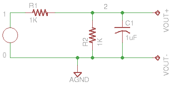

# Devre Simulasyonu - Gnucap

Elektronik devrelerin nasıl işleyeceğini önceden görmek için bir
simülasyon programı, `gnucap`. Kurmak için `apt-get install
gnucap`. Fazla büyük bir program değil. Bir örnek

http://thoughtmountain.com/gnucap_demo.html

Örnek şu devreyi kodlamış,



```python
print (open("demo1.ckt").read())
```

```text

.TITLE Ornek #1

Vin 0 1 AC 1
R1  1 2 1K
R2  0 2 1K
C1  0 2 1UF

.OPTION OUT=80
.PRINT OP Iter(0) V(2)

.PLOT AC  VDB(2)(-20,0)

.AC 5 1K OCT

```

Simülasyonu işletmek için,

```python
!gnucap -b demo1.ckt
```

```text
Gnucap 2009.12.07 RCS 26.136
The Gnu Circuit Analysis Package
Never trust any version less than 1.0
Copyright 1982-2009, Albert Davis
Gnucap comes with ABSOLUTELY NO WARRANTY
This is free software, and you are welcome
to redistribute it under the terms of 
the GNU General Public License, version 3 or later.
See the file "COPYING" for details.
 
VDB(2)-20.              -15.             -10.              -5.               0.
        +-----------------+----------------+-----------------+----------------+
 5.     |                 .                .             *   .                |
 10.    |                 .                .             *   .                |
 20.    |                 .                .             *   .                |
 40.    |                 .                .             *   .                |
 80.    |                 .                .            *    .                |
 160.   |                 .                .          *      .                |
 320.   |                 .                .  *              .                |
 640.   |                 .     *          .                 .                |
 1.28K  |     *           .                .                 .                |
        +-----------------+----------------+-----------------+----------------+

```

Çıktıyı sayısal olarak bir dosyaya yönlendirmek için `.PLOT` komutu
`.PRINT` ile değiştirilir, ve komut satırında çıktı bir dosyaya yönlendirilir, 

```python
print (open("demo2.ckt").read())
```

```text

.TITLE Ornek #2

Vin 0 1 AC 1
R1  1 2 1K
R2  0 2 1K
C1  0 2 1UF

.OPTION OUT=80
.PRINT OP Iter(0) V(2)

.PRINT AC  VDB(2)(-20,0)

.AC 5 1K OCT

```

```python
!gnucap -b demo2.ckt > out.txt
```

Sonuç dosyasına bakalım,

```python
print (open("out.txt").read())
```

```text
Gnucap 2009.12.07 RCS 26.136
The Gnu Circuit Analysis Package
Never trust any version less than 1.0
Copyright 1982-2009, Albert Davis
Gnucap comes with ABSOLUTELY NO WARRANTY
This is free software, and you are welcome
to redistribute it under the terms of 
the GNU General Public License, version 3 or later.
See the file "COPYING" for details.
 
#Freq       VDB(2)    
 5.        -6.0217    
 10.       -6.0249    
 20.       -6.0377    
 40.       -6.0886    
 80.       -6.2866    
 160.      -6.9989    
 320.      -9.054     
 640.      -13.047    
 1.28K     -18.368    

```


