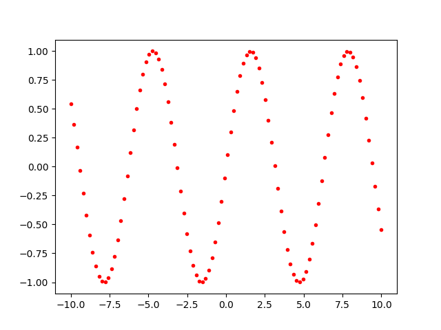
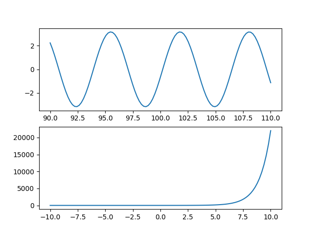
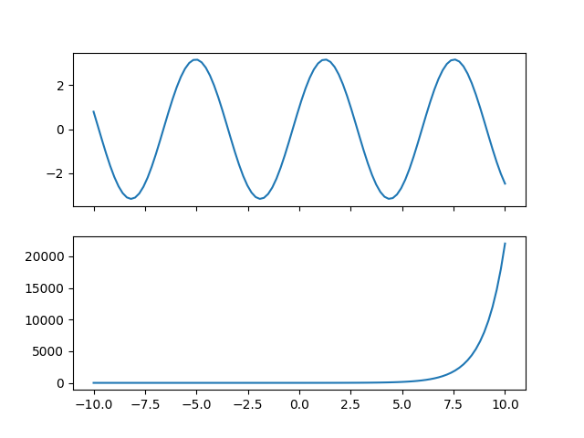
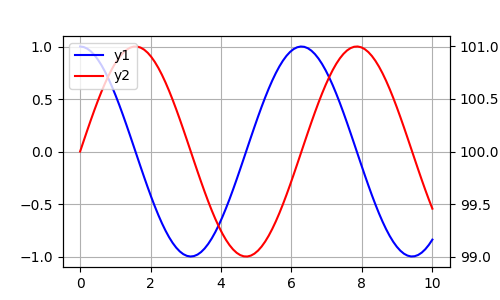
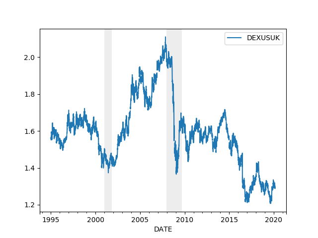
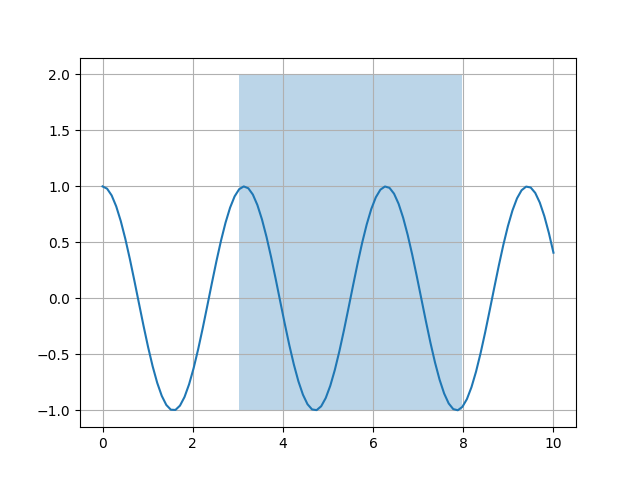
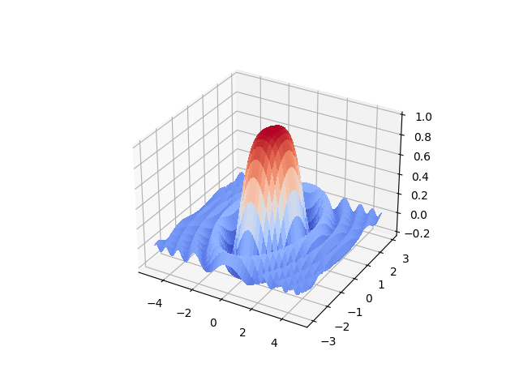

# Grafiklemek, Matplotlib, Pandas

Basit X-Y grafikleri, ikili, üçlü, iki eksenli, üç boyutlu grafikleri
bu yazıda işleyeceğiz.

### Giriş

En basit grafik,

```python
import matplotlib.pyplot as plt

x = np.linspace(-10,10,100)
y  = np.sin(x)
plt.plot(x,y)
plt.savefig('graf_01.png')
```


Önceki metot tüm noktaları birleştiriyor. Eğer birleştirilmesini
istemesek nokta nokta olarak her veri öğesinin basılmasını istesek
`plot` içinde `.` kullanırdık.  


```python
plt.plot(x,y,'r.')
plt.savefig('graf_02.png')
```




Renkleri de aynı komutta belirtilebiliyoruz. Üstteki `r` kırmızı (red) için. 

### Eksenler

Çoğu zaman aynı imajda birden fazla grafik olmasını isteyebiliyoruz,
karşılaştırma amacıyla, vs. Alt alta iki grafik için çabuk bir şekilde

```python
x2 = x+100
y1 = np.cos(x2) + 3*np.sin(x2)
y2 = np.exp(x)

fig, axs = plt.subplots(2)
axs[0].plot(x2,y1)
axs[1].plot(x,y2)
plt.savefig('graf_03.png')
```




Üstteki örnekte x ekseni farklı, çünkü değerlerin skalası farklı o
şekilde grafiklemek istedik. Fakat bazen de aynı x skalası üzerinden
farklı grafikler basmak isteyebiliriz, 

```python
y1 = np.cos(x) + 3*np.sin(x)
y2 = np.exp(x)

fig, axs = plt.subplots(2,sharex=True)
axs[0].plot(x,y1)
axs[1].plot(x,y2)
plt.savefig('graf_04.png')
```




Eğer Pandas üzerinden grafikleme yapılıyorsa onun `plot(ax=..)`
komutuna dışarıdan `axs[0]`, `axs[1]` vs verilebiliyor.

Pandas ile bu arada çoğu grafikleme iyice basit hale geliyor, mesela
bir `DataFrame` içinde iki kolon olsun, basmak için direk `DataFrame`
üzerinde `plot` çağırmak yeterli,

```python
import pandas as pd
x = np.linspace(0,10,100)
df = pd.DataFrame(index=x)
df['y1'] = np.cos(x)
df['y2'] = np.sin(x)
df.plot()
plt.savefig('graf_05.png')
```


Grafikler direk çizildi, her kolon için ayrı grafik olmak üzere,
renklendirildi, ve kolon isimleri bile grafiğin içine yazıldı!

Eğer üstteki gibi bir grafiği ama y ekseninde farklı skala olacak
şekilde basmak istesek ne yapardık? Mesela bir grafik sıcaklık, diğeri
nem miktarı, bunlar farklı skalalarda olabilir ama trendlerini aynı
grafikte aynı x skalası üzerinden (mesela tarih) görmek faydalı olabilir. 

```python
import pandas as pd
x = np.linspace(0,10,100)
plt.figure(figsize=(5,3))
df['y1'] = np.cos(x)
df['y2'] = np.sin(x) + 100.0
ax1 = df.y1.plot(color='blue', grid=True, label='y1')
ax2 = df.y2.plot(color='red', grid=True, label='y2',secondary_y=True)
h1, l1 = ax1.get_legend_handles_labels()
h2, l2 = ax2.get_legend_handles_labels()
plt.legend(h1+h2, l1+l2, loc=2)
plt.savefig('graf_06.png')
```




Belli bölgeleri belli x değerleri için tüm y eksen bazında daha farklı
renkte göstermek isteyebiliriz, mesela finansta ekonomik krizler zaman
serisi üzerinde bu şekilde gösterilir. Örnek olarak ABD / Britanya
Pound döviz kuru üzerinde görelim, ve iki krizi zamanını işaretleyelim,


```python
import pandas as pd

df = pd.read_csv('DEXUSUK.csv',index_col=0,parse_dates=True)
df = df[df.index > '1995-01-01']
df.plot()
c = 'gainsboro' # acik gri rengi
plt.axvspan('01-03-2001', '27-10-2001', color=c, alpha=0.5, lw=0)
plt.axvspan('22-12-2007', '09-05-2009', color=c, alpha=0.5, lw=0)
plt.savefig('graf_07.png')
```




`add_subplot(222)`?

Matplotlib (ve Matlab) ana grafik ekranini bolerek ufak grafikleri bu
bolumlere koyma yetenegine sahip. Bu orneklere bakarken, belki de 332,
222 gibi sayilar kullanildigini gormussunuzdur. Mesela

```
fig = plt.figure()
ax1 = fig.add_subplot(321,title="baslik")
ax1.plot(data1)
```

gibi. Burada 321'in anlami sudur: Ana ekran 3 satir ve 2 kolon olmak
uzere, yani 3x2 olarak bolunecek, ve ustteki grafik 1'inci bolume
konacak.

1., 2. tabii ki sol ustten baslanip saga dogru gidince artan sayilar,
yani hucrelerin indisi.

O zaman 321'in 32 kismi diger tum alt grafikler icin
tekrarlanacak. Yeni grafikler 322, 323, 324, vs gibi gidecekler.

Farkli Bir Kolon Isaretleme Teknigi

Üstteki `avxspan` ile indeks bazlı aralıkları işaretleyebiliyoruz. Eğer
herhangi bir kolon bazlı dikey işaretleme yapmak istesek bir diğer yöntem
`fill_between` ile.

```python
x = np.linspace(0,10,100)
y = np.cos(2*x)
crisis = (x > 3) & (x < 8).astype(int)
plt.plot(x,y)
plt.grid(True)
plt.fill_between(x, -1, 2, crisis, alpha=0.3)
plt.savefig('graf_08.png')
```



Böylece `crisis` (kriz) kolonuna dayanarak eğer orada 1 var ise o alanı
dikey olarak işaretliyoruz, sıfır ise hiçbir şey gösterilmiyor. 

### Üç Boyut

Diyelim ki 3 boyutlu bir fonksiyon hesaplatacağız, fonksiyon alanı ise
x kordinatı -5 ve 5 arasında, y kordinatı -3, 3 arasında olacak. O
zaman bu aralıktaki her noktanın kombinasyonu bizen lazım. Bu
kombinasyon `[-5,-3], [5.1,-3],..,[-5,-3.1]` diye gidecekti. Fonksiyon
`meshgrid` 2 kordinat vektörü alır ve geriye 2 kordinat matrisi
döndürür.

`meshgrid` fonksiyonunun yaptığı bu kombinasyonu rahat erişilir hale
getirmekten ibaret. meşhgrid çağrısından geri gelecek X ve Y
matrislerinde `X[1]` ve `Y[1]`'e baktığımızda (her iki tarafta aynı
indisi kullandığımızda yani) kombinasyonlardan birini anında
alabileceğiz. Örnek

```python
x = np.arange(-5, 5, 0.1)
y = np.arange(-3, 3, 0.1)
xx, yy = np.meshgrid(x, y)
zz = np.sin(xx**2+yy**2)/(xx**2+yy**2)
```

Not: Bu kodda `meshgrid`'den gelen xx ve yy üzerinde direk indis
kullanılıyormuş gibi gözükmüyor, fakat arka planda aslında
kullanılıyor. xx ile yy üzerinde aritmetik işlemler kullanılınca, bu
otomatik olarak her xx ve yy elemanın teker teker, aynı indiste
olanlarının beraber işleme sokulması demektir, +, -, ** gibi işlemler
perde arkasında buna göre kodlanmıştır.


```python
from matplotlib import cm

fig = plt.figure()
ax = fig.gca(projection='3d')
surf = ax.plot_surface(xx, yy, zz, cmap=cm.coolwarm,linewidth=0, antialiased=False)
plt.savefig('graf_09.png')
```




