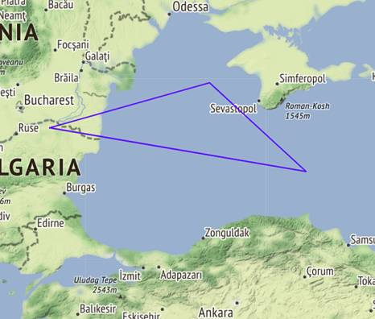
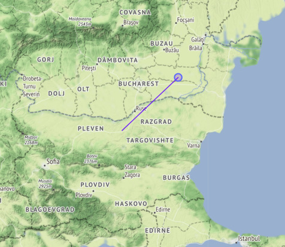
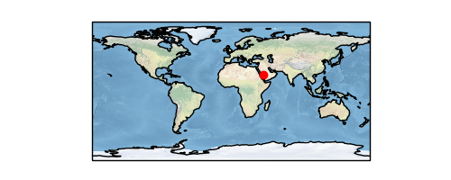
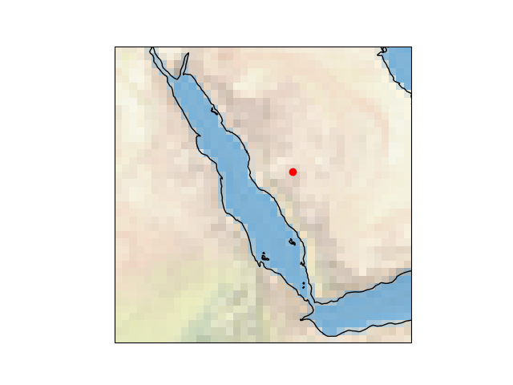
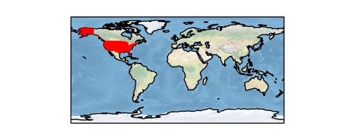
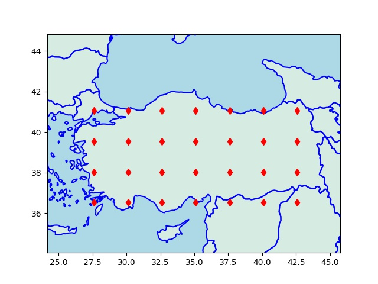
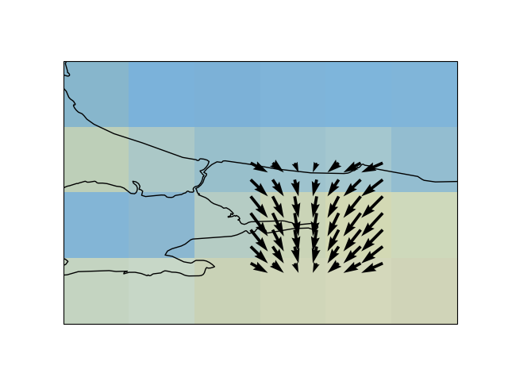
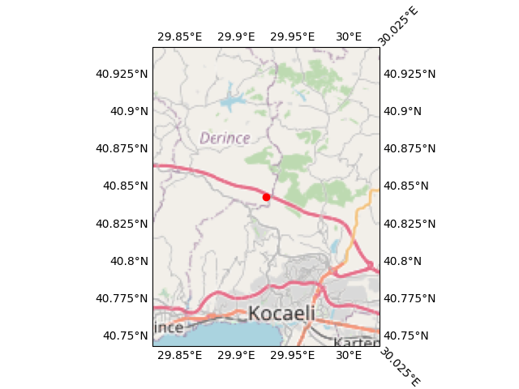
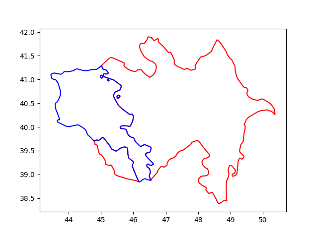

# Haritalamak

### Folium

Bu haritalama sistemi ile dünyanın herhangi bir yerini alıp, istenen
odaklama seviyesinde göstermek, üzerini işaretlemek mümkün, ayrıca
haritanın üzerinde isteğe göre çizgiler, çemberler vs çizilmesine izin
veren çağrılar var. Folium arka planda bir Javascript kütüphanesi
Leaflet kullanır, bu sebeple haritaları HTML olarak kaydediyorsunuz,
bu HTML içine bakıldığında Leaflet çağrıları orada görülüyor.  Leaflet
son derece basit, hızlı işleyecek şekilde yazılmış, verisini arka
planda direk OpenStreetMap dosyalarını okuyarak alıyor, onların
gerekli yerlerini, hangisini alacağını arka planda
hallediyor. Programcıya tek kalan harita merkezini, ek bazı görsel
ayarları yapmak.

Not: Elde edilen HTML haritası etkileşimli (interactive) çalışıyor.
Büyütme, küçültme, haritayı sağa sola kaydırma bu HTML sayfasında
kullanıcı tarafından yapılabilir hala. Yani tek ölü bir görüntü dosyası
almıyorsunuz.

Kurmak icin `pip install folium`

En basit kullanim belli noktalara yuvarlak isaretler koymak,

İşaretler

Harita üzerine konan işaretler içine tıklanabilir URL bağlantıları konabilir.
Ayrıca bu işaretler fare ile üzerinde durunca bir araç ipucu (tooltip)
gösterebilir.

```python
m = folium.Map(location=[45.372, -121.6972], zoom_start=12, tiles="Stamen Terrain")
tooltip = "Click me!"
folium.Marker(
    [45.3288, -121.6625], popup="<i>Mt. Hood Meadows</i>", tooltip=tooltip
).add_to(m)
m.save("/tmp/index.html")
```

Üstteki kodda görülen `popup` içine `a href` ifadesi de konulabilir,
böylece fare üstünde olunca önce ipucu, ona tıklanınca çıkan bölgede
tıklanabilir bir URL bağlantısı olacaktır. Biz ayrıca bu bağlantıyı
`target='_blank' rel='noopener noreferrer'` ile yarattık, böylece
tıklama bizi tarayıcıda ayrı bir tab'e götürüyor.

Kapalı Alanlar, Poligon

```python
import folium
m = folium.Map(location=[lat1,lon1], tiles='Stamen Terrain', zoom_start=7)
coordinates=[(43,35),(44,27),(45,32)]
folium.Polygon(locations=coordinates,weight=2,color = 'blue').add_to(m)
m.save("/tmp/index.html")
```



Eğer kapalı alan yerine sadece başlangıç ve bitiş kordinatları arasında bir
parçalı çizgi çizilsin istiyorsak

```python
folium.PolyLine(locations=coordinates, color="blue").add_to(map)
```

gibi bir çağrı gerekirdi.

Başlık Eklemek

```python
import folium

lat1,lon1 = 43.4521793912598, 25.597125946810632
lat2,lon2 = 44.572754823623114, 27.250000972553345
m = folium.Map(location=[lat1,lon1], tiles='Stamen Terrain', zoom_start=7)
folium.CircleMarker(location=(lat2,lon2),
                            fill_color='blue', radius=10, rotation=1.5).add_to(m)

title_html = "<h3>Title</h3>"
m.get_root().html.add_child(folium.Element(title_html))
m.save("/tmp/index.html")
```



`lat1,lon1` merkezli bir harita çizdik, odak seviyesi 7, ve `lat1,lon1` den
başlayıp `lat2,lon2` de biten bir çizgi çektik, ve çizgi sonuna ufak bir daire
koyduk.


Ek bilgiler [5],[6],[7] de bulunabilir,

### Cartopy

Kullanisli bir paket; fakat isletim sistemi seviyesinde GEOS paketinin
kurulmasi gerekli, bu bazi barindirilan, idareli bulut sistemlerinde
problem cikartabilir, cunku bu tur servislerde direk isletim sistemine
erisim her zaman mumkun olmayabiliyor.

```
sudo apt install libproj-dev proj-data proj-bin libgeos-dev

pip install cartopy

pip uninstall shapely

pip install shapely --no-binary shapely
```

Dünya haritası üzerinde bir nokta

```python
import cartopy.crs as ccrs
import cartopy
fig = plt.figure(figsize=(5, 2))
ax = fig.add_subplot(1, 1, 1, projection=ccrs.PlateCarree())
ax.set_global()
ax.stock_img()
ax.coastlines()
ax.plot(42.0, 21.53, 'ro', transform=ccrs.PlateCarree())

plt.savefig('har1.png')
```



Eger daha yakindan gostermek istersek, ilgilendigimiz bolge uzerinden
bir kutu yaratabiliriz,

```python
import cartopy.crs as ccrs
import cartopy

fig = plt.figure()
ax = fig.add_subplot(1, 1, 1, projection=ccrs.PlateCarree())
ax.set_global()
ax.stock_img()
ax.coastlines()
ax.plot(42.0, 21.53, 'ro', transform=ccrs.PlateCarree())
ax.set_extent([30, 50, 10, 30])
plt.savefig('har3.png')
```




Ülke ismi bazlı tüm ülkeyi renklendirmek,

```python
import matplotlib.pyplot as plt
import cartopy.io.shapereader as shpreader
import cartopy.crs as ccrs
import cartopy.feature as cfeature

def area(ax, iso, clr) :
    shp = shpreader.natural_earth(resolution='10m',category='cultural',
                                  name='admin_0_countries')
    reader = shpreader.Reader(shp)
    for n in reader.records() :
        if n.attributes['ADM0_A3'] == iso: 
            ax.add_geometries(n.geometry, ccrs.PlateCarree(), facecolor=clr) 
    return ax

fig = plt.figure(figsize=(5, 2))
ax = fig.add_subplot(1, 1, 1, projection=ccrs.PlateCarree())
ax = plt.axes(projection=ccrs.PlateCarree())
ax.stock_img()
ax.coastlines()
area(ax, "USA", "red")
plt.savefig('har2.png')
```




### Izgara Yaratmak

İki köşesi tanımlanan bir dikdörtgen üzerinden bir izgara tanımlayabiliriz,

```
import simplegeomap as sm, numpy as np, matplotlib.pyplot as plt

from pygeodesy.sphericalNvector import LatLon
res1 = LatLon(36.52259447316748, 27.612981046240638) # sol alt
res2 = LatLon(41.05628025861666, 42.58542464923075) # sag ust

41.40662366577505, 27.255002668187043

lowlat = np.min([res1.lat,res2.lat])
lowlon = np.min([res1.lon,res2.lon])
hilat = np.max([res1.lat,res2.lat])
hilon = np.max([res1.lon,res2.lon])

x = np.linspace(lowlon,hilon,7)
y = np.linspace(lowlat,hilat,4)

xx,yy = np.meshgrid(x,y)
```

Eğer bir merkez nokta etrafında tek bir mesafe uzaklığı baz alıp bir ızgara
yaratmak istiyorsak,

```python
p1 = LatLon(clat,clon)
EARTH_RAD = 6371
upright = p1.destination (dist, bearing=45, radius=EARTH_RAD)
lowleft = p1.destination (dist, bearing=225, radius=EARTH_RAD)
latmin = np.min([lowleft.lat, upright.lat])
latmax = np.max([lowleft.lat, upright.lat])
lonmin = np.min([lowleft.lon, upright.lon])
lonmax = np.max([lowleft.lon, upright.lon])
x = np.linspace(lonmin,lonmax,N)
y = np.linspace(latmin,latmax,N)
xx,yy =  np.meshgrid(x,y)
latints = np.unique(x.astype(np.int))
lonints = np.unique(y.astype(np.int))
```

Bu kod 45 derece kuzeydoğu 225 derece güneybatıya `dist` mesafesi
kadar adım atıp o noktaları sağ üst, sol alt köşe olarak kabul etti ve
bu dikdörtgeni baz alıp bir `N*N` noktalı bir ızgara yarattı. Ayrıca o
ızgara noktalarındaki tüm kordinatların enlem, boylam değerlerinin tam
sayı bazlı bir listesini de hesapladı, bu bilgi pek çok uygulamada
lazım olabiliyor (mesela tam sayı enlem/boylam bazlı bazı bilgiler
önbellekte, tabanda tutulmuş olabilir, ve üstteki tam sayılar ile
bu bölgesel bilgiler tabandan alınabilir).



Oklar, Quiver

Cartopy haritaları üzerinde klasik matplotlib komutlarını hala
kullanabiliriz, enlem, boylam kordinatları y ve x eksenleri haline
geliyor, ve gerisi bildiğimiz gibi. Mesela ok çizmek için kullanılan
`quiver` hala geçerli, mesela o ızgara noktalarındaki rüzgar yönü
verisi elimizde olsaydı, bunu harita üzerinde
grafikleyebilirdik. Altta bu veri `sin` ve `cos` üzerinden uyduruk
şekilde yaratıldı,

```python
fig = plt.figure()
ax = fig.add_subplot(1, 1, 1, projection=ccrs.PlateCarree())
ax.set_global()
ax.stock_img()
ax.coastlines()
u = np.sin(xx.flatten()*2)
v = np.cos(yy.flatten()*3)
ax.quiver(xx.flatten(), yy.flatten(), u, v)
ax.set_extent([28, 31, 40, 42])
plt.savefig('har5.png')
```



Eğer ana enlem, boylamları kordinate eksenleri üzerinde görmek
istersek, basmadan önce

```
gl = ax.gridlines(crs=ccrs.PlateCarree(), draw_labels=True, linewidth=0)
```

uygulayabiliriz.

Katmanlar

Üstteki karayı ve denizleri gösteren renklendirme sonradan uygulanan
bir katmandır. Cartopy bu şekilde pek çok farklı bilgiyi katman olarak
haritalara uygulayabilir. Mesela yol, sehir bilgileri de birer katman
olarak alttaki gibi alınabilir,

```python
import cartopy.crs as ccrs
import cartopy
import cartopy.io.img_tiles
lat,lon=40.84343206497589, 29.926342357515754
fig = plt.figure()
imagery = cartopy.io.img_tiles.OSM()
ax = fig.add_subplot(projection=imagery.crs)
zoom = 10
ax.add_image(imagery, zoom)
ax.plot(lon, lat, 'ro', transform=ccrs.PlateCarree())
EXT = 0.1
ax.set_extent([lon-EXT, lon+EXT, lat-EXT, lat+EXT])
gl = ax.gridlines(crs=ccrs.PlateCarree(), draw_labels=True, linewidth=0)
plt.savefig('har6.png')
```



### SHP ile Kendimiz Sınır Çizelim

Bazen Cartopy ve hatta Folium bile uygulamamıza biraz yük
getirebiliyor, mesela Cartopy kurulumu için arka planda GDAL
gerekebilir, bu kütüphane arka planda işletim sistemi ek kurulumu
gerektirir, ve bulut ortamında uygun olmayabilir. Folium hafif olsa da
arka planda bağlantı gerektiriyor, çünkü zoom yapınca ek bilgiler
servisten alınıyor.

Eğer bize gayet basit, ülke sınırlarını bir kerede ağ bağlantısı
olmadan pat diye çizebilecek bir kod gerekiyorsa, bu bilgileri taşıyan
dosya bazlı veri tabanları kullanabiliriz. PyShp ile SHP bazlı bu
tabanlara ulaşmak mümkündür. Mesela ülke sınırları [8]'de var,
`TM_WORLD_BORDERS-0.3.zip` indirilir, açılır, `/tmp` altında `.shp` ve
`.dbf` dosyaları olsun (ikisi de lazım),

```python
import shapefile
sf = shapefile.Reader("/tmp/TM_WORLD_BORDERS-0.3.shp", encoding = "ISO8859-1")
```

Kaç ülke var burada,

```python
r = sf.records()
countries = sf.shapes()
print (len(countries))
```

```text
246
```

Bu ülkelerden indis 2'de olana bakalım,

```python
idx = 2
country = countries[idx]
name = r[idx]
print (name)
```

```text
Record #2: ['AJ', 'AZ', 'AZE', 31, 'Azerbaijan', 8260, 8352021, 142, 145, 47.395, 40.43]
```

Azerbeycan burada.

Peki ülkenin sınırları nerede? 

```python
print (len(country.points))
print (country.parts)
```

```text
871
[0, 108, 118, 131, 859]
```

Ülke sınır noktaları `points` ile alınıyor, bir enlem/boylam
listesidir, kabaca bir polygonun köşe noktalarıdır. Fakat ülkeler
bazen tek kesintisiz bir parça olmayabiliyor, adalar, ya da diğer
ülkelerin içinde ufak parçalar vs var ise, bunları farklı poligon
öbekleri olarak temsil etmek lazım. Üstteki `points` içinde tüm
parçalar için noktalar var, hangi öbeğin nerede başlayıp bittiğini
bilmek gerekiyor sadece, `parts` içinde bu bilgi var [9]. Mesela
1'inci parça 0'dan başlayıp 107 indisine (dahil olmak üzere) uzanıyor,
108 nokta var. Sonraki 108'den başlayıp 117'ye gidiyor, vs.

Bu mantığı bir fonksiyon içine koyalım, ve indis 2 ve indis 4'teki
ülkeleri grafikleyelim,


```python
def plot_country(idx,color='r'):
   country = countries[idx]
   name = r[idx]
   print (name)
   bounds = list(country.parts) + [len(country.points)]
   print (bounds)
   for previous, current in zip(bounds, bounds[1:]):    
       geo = [[x[0],x[1]] for x in country.points[previous:current]]
       if len(geo) < 1: continue
       geo = np.array(geo)
       if geo.shape[0] > 0:
           plt.plot(geo[:,0],geo[:,1],color)

plot_country(2,'r')
plot_country(4,'b')

plt.savefig('harita-az-arm.png')
```

```text
Record #2: ['AJ', 'AZ', 'AZE', 31, 'Azerbaijan', 8260, 8352021, 142, 145, 47.395, 40.43]
[0, 108, 118, 131, 859, 871]
Record #4: ['AM', 'AM', 'ARM', 51, 'Armenia', 2820, 3017661, 142, 145, 44.563, 40.534]
[0, 12, 395, 408, 418]
```



Azerbeycan ve Ermenistan'ı grafiklemiş olduk.

Not: Üstte `plot` çağrısının çizgisel kullanımına çağrı yapıldı,
bazılarımızın bildiği gibi `plot(10,20,'.')` x=10,y=20 kordinatlarına
bir nokta koyar, ama bir x kordinat ve y kordinat *listesi* `plot`
çağrısına geçilirse, bu tür çağrı verili noktalar arasına düz çizgiler
çek demektir.

Bir diğer ek, eğer o çizgilerle çevirdiğimiz bölgelerin içini bir
renkle doldurmak isteseydik, mesela elimizde bir göl için poligon
noktaları varsa, `plt.plot` yerine `plt.fill` kullanırdık, bu
çağrıya geçilen üçüncü parametre renk ile objenin içi doldurulur.

Kaynaklar

[1] https://rabernat.github.io/research_computing_2018/maps-with-cartopy.html

[2] https://scitools.org.uk/cartopy/docs/latest/gallery/global_map.html#sphx-glr-gallery-global-map-py

[3] https://github.com/SciTools/cartopy/issues/1303

[4] Renk isimleri - https://matplotlib.org/3.1.0/gallery/color/named_colors.html

[5] https://python-visualization.github.io/folium/quickstart.html

[6] https://stackoverflow.com/questions/39093250/is-it-possible-to-draw-lines-with-arrowheads-in-a-folium-map

[7] https://www.geeksforgeeks.org/stamen-toner-stamen-terrain-and-mapbox-bright-maps-in-python-folium/

[8] https://thematicmapping.org/downloads/world_borders.php

[9] Sileika, Pro Python System Administration

[10] [Yükseklik (Elevation) Verileri](2019/04/elevation.html)
