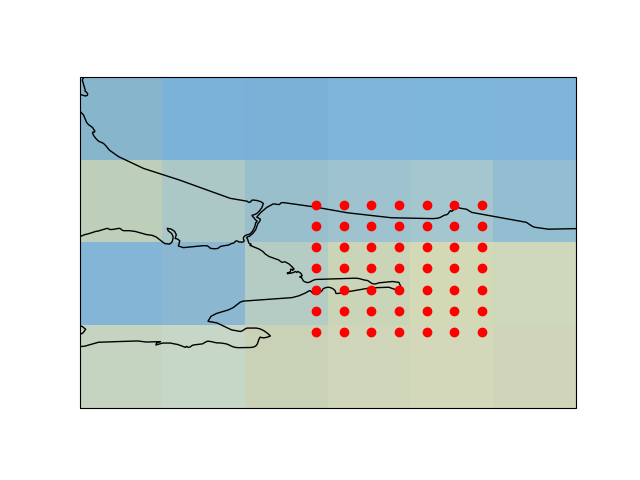

# Haritalamak

Harita grafiklemek için eski `basemap` artık kullanılmıyor, yeni paket
`cartopy`. Kurmak icin 

```
sudo apt install libproj-dev proj-data proj-bin libgeos-dev

pip install cartopy

pip uninstall shapely

pip install shapely --no-binary shapely
```

Dünya haritası üzerinde bir nokta

```python
import cartopy.crs as ccrs
import cartopy
fig = plt.figure(figsize=(5, 2))
ax = fig.add_subplot(1, 1, 1, projection=ccrs.PlateCarree())
ax.set_global()
ax.stock_img()
ax.coastlines()
ax.plot(42.0, 21.53, 'ro', transform=ccrs.PlateCarree())

plt.savefig('har1.png')
```


Eger daha yakindan gostermek istersek, ilgilendigimiz bolge uzerinden
bir kutu yaratabiliriz,

```python
import cartopy.crs as ccrs
import cartopy

fig = plt.figure()
ax = fig.add_subplot(1, 1, 1, projection=ccrs.PlateCarree())
ax.set_global()
ax.stock_img()
ax.coastlines()
ax.plot(42.0, 21.53, 'ro', transform=ccrs.PlateCarree())
ax.set_extent([30, 50, 10, 30])
plt.savefig('har3.png')
```


Ülke ismi bazlı tüm ülkeyi renklendirmek,

```python
import matplotlib.pyplot as plt
import cartopy.io.shapereader as shpreader
import cartopy.crs as ccrs
import cartopy.feature as cfeature

def area(ax, iso, clr) :
    shp = shpreader.natural_earth(resolution='10m',category='cultural',
                                  name='admin_0_countries')
    reader = shpreader.Reader(shp)
    for n in reader.records() :
        if n.attributes['ADM0_A3'] == iso: 
            ax.add_geometries(n.geometry, ccrs.PlateCarree(), facecolor=clr) 
    return ax

fig = plt.figure(figsize=(5, 2))
ax = fig.add_subplot(1, 1, 1, projection=ccrs.PlateCarree())
ax = plt.axes(projection=ccrs.PlateCarree())
ax.stock_img()
ax.coastlines()
area(ax, "USA", "red")
plt.savefig('har2.png')
```


Bir kordinat etrafında belli büyüklükte bir alan üzerinde ızgara
yaratmak ve bu izgaradaki kordinat noktalarını haritada göstermek için
ne yaparız? Paket `geopy` kurulmuş olmalı,


```
import geopy.distance
import numpy as np

def goto_from_coord(start, distance, bearing):
    s = geopy.Point(start[0],start[1])
    d = geopy.distance.geodesic(kilometers = distance)
    reached = d.destination(point=s, bearing=bearing)
    return [reached.latitude, reached.longitude]

lat,lon=40.84343206497589, 29.926342357515754

dist = 60
res1 = goto_from_coord((lat,lon),dist,45)
print (res1)
res2 = goto_from_coord((lat,lon),dist,225)
print (res2)

lowlat = np.min([res1[0],res2[0]])
lowlon = np.min([res1[1],res2[1]])
hilat = np.max([res1[0],res2[0]])
hilon = np.max([res1[1],res2[1]])

x = np.linspace(lowlon,hilon,7)
y = np.linspace(lowlat,hilat,7)

xx,yy = np.meshgrid(x,y)
print (xx.flatten())

import cartopy.crs as ccrs
import cartopy

fig = plt.figure()
ax = fig.add_subplot(1, 1, 1, projection=ccrs.PlateCarree())
ax.set_global()
ax.stock_img()
ax.coastlines()
ax.plot(xx.flatten(), yy.flatten(), 'r.', transform=ccrs.PlateCarree())
ax.set_extent([28, 31, 40, 42])
plt.savefig('har4.png')
```



Nasıl kodladığımızı açıklayalım, önce merkez noktadan sağ üste (45
derece yönde) 60 km, ve sol alt yönde (225 derece) aynı uzaklıkta
birer adım atıyoruz, bu dörtgenin iki ucu. Bu üç noktalardan `lingrid`
sonra `meshgrid` ile ızgarayı oluşturuyoruz. 

Cartopy haritaları üzerinde klasik matplotlib komutlarını hala
kullanabiliriz, enlem, boylam kordinatları y ve x eksenleri haline
geliyor, ve gerisi bildiğimiz gibi. Mesela ok çizmek için kullanılan
`quiver` hala geçerli, mesela o ızgara noktalarındaki rüzgar yönü
verisi elimizde olsaydı, bunu harita üzerinde
grafikleyebilirdik. Altta bu veri `sin` ve `cos` üzerinden uyduruk
şekilde yaratıldı,

```python
fig = plt.figure()
ax = fig.add_subplot(1, 1, 1, projection=ccrs.PlateCarree())
ax.set_global()
ax.stock_img()
ax.coastlines()
u = np.sin(xx.flatten()*2)
v = np.cos(yy.flatten()*3)
ax.quiver(xx.flatten(), yy.flatten(), u, v)
ax.set_extent([28, 31, 40, 42])
plt.savefig('har5.png')
```


Kaynaklar

https://rabernat.github.io/research_computing_2018/maps-with-cartopy.html

https://scitools.org.uk/cartopy/docs/latest/gallery/global_map.html#sphx-glr-gallery-global-map-py

https://github.com/SciTools/cartopy/issues/1303

Renk isimleri - https://matplotlib.org/3.1.0/gallery/color/named_colors.html


