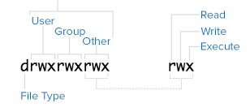

# chmod

Bir dosyanın izinlerini Unix [yazısında](unix.html) işledik. Bu
değerleri nasıl değiştiririz?

En basit yol `+` ve `-` isaretleri kullanmak, mesela

`echo 'birseyler' >> out.txt`

ile yeni bir dosya yaratalım. Sonra

```
ls -al out.txt 
-rw-r--r-- 1 burak burak 10 Jul 27 23:36 out.txt
```

İzinler benim için yazılabilir ve okunabilir gözüküyor. İzin öbekleri şöyleydi,



Bu öbekler `chmod` için kullanıcı için `u`, group için `g`, diğerleri
için 'o` ile de erişilebilir. O zaman, mesela diğerleri için yazma
hakkı vermek istersem,

```
chmod o+w out.txt
```

diyebilirim. Simdi `ls` ne diyor?

```
ls -al out.txt 
-rw-r--rw- 1 burak burak 10 Jul 27 23:36 out.txt
```

Diğerleri için yazma izni eklenmiş.

Fakat bu işi yapmanın daha hızlı bir yolu var. Öbekleri hatırlarsak,
üçlü harfler idi, fakat bu harflerin yerleri belli, ve belli yerdeki
bir harf ya aktif ya da değil. Bu durumu ikisel sayı olarak daha rahat
temsil edebiliriz, mesela kullanıcı için `rwx` demek yerine 111
diyebilirim, ve bu ikisel sayının tek bir onlu sayı olarak karşılığı
var, bu 7. Grup ve kullanıcı için de aynı tercümeyi yaparsam, üç tane
onlu sayı ile tüm izinleri bir kerede set edebilmek mümkündür. 


| İkisel | Onlu     |
| -------|----------|
| 000    |  0       |
| 001    |  1       |
| 010    |  2       |
| 011    |  3       |
| 011    |  3       |
| 100    |  4       |
| 101    |  5       |
| 110    |  6       |
| 111    |  7       |

Mesela kullanıcı ve gruba her izni veriyorum, ama diğerlerine sadece
okuma izni vermek istiyorum, bu 111, 111 ve 100 demektir, üç tane önlü
sayı yanyana 774.

```
chmod 774 out.txt
ls -al out.txt 
-rwxrwxr-- 1 burak burak 10 Jul 27 23:36 out.txt
```

Usta adminler üstteki sayıları kullanırlar, sık kullanılan çoğunu da
ezbere bilirler, ya da kafadan ikisel / onlu tercüme yaparlar.


