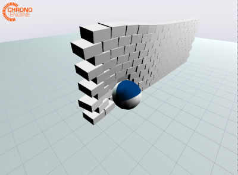

# 3D Fizik Simulasyonu, Chrono

Daha önce 2 boyut için [gördüğümüz](kati-govde-fizik-simulasyon-rigid-body-physics-pymunk.html)
simülasyon yazılımının 3 boyutta karşılığı Chrono. Ubuntu üzerinde derlemek
için bazı bilgiler,

http://api.projectchrono.org/4.0.0/tutorial_install_chrono.html

Kurmak için önce

```
sudo apt-get install libeigen3-dev
```

Eigen sadece header .h dosyaları, derlenen bir şey yok.

Chrono derlemeden önce kurulması gereken Ubuntu programları,

```
sudo apt-get install libirrlicht-dev swig freeglut3-dev libgl1-mesa-dev libx11-dev
```

Simdi Chrono paketinin kendisine gelelim,

Chrono

```
git clone https://github.com/projectchrono/chrono.git

cd chrono

mkdir build_dir

cd build_dir

cmake -DENABLE_MODULE_IRRLICHT=TRUE \
      -DENABLE_MODULE_PYTHON=TRUE \
      -DENABLE_MODULE_POSTPROCESS=TRUE \
      -DCMAKE_BUILD_TYPE=Debug ..

make
```

Artık `chrono/build_dir/bin` altında görülen bir sürü program
işletilebilir. Mesela

```
./demo_IRR_bricks
```



Üstteki simülasyon ağır bir topu bir tuğla duvara doğru itiyor. Bu
itişi farklı kuvvetler ile yapabiliriz, ve fiziksel sonuçlarını
simülasyon içinde gözleyebiliriz.

Eğer kendi kodladığımız, kendi başına ayrı bir projeyi Chrono
kullanacak şekilde derlemek istiyorsak, `chrono/template_project`
altına gidebiliriz (ya da oradaki kodları herhangi bir yere
kopyalayıp, vs), ve Chrono'nun `/opt/chrono` da kurulmuş olduğunu
varsayalim,

```
cmake -DCMAKE_BUILD_TYPE=Debug \
      -DChrono_DIR=/opt/chrono/build_dir/cmake \
      /opt/chrono/template_project
```

işletiriz. Bu işlem bir `Makefile` üretmiş olmalı. onu `make` ile
derleriz, ve `template_project/build/myexe` olarak bir işletilebilir
program üretilmiş olmalı. 

Motorlar

Chrono'da pek cok fiziksel kavram var, mesela
[motorlar](http://api.projectchrono.org/tutorial_demo_motors.html),
`demo_IRR_motors.cpp` kodunda bunu gorebiliriz.


