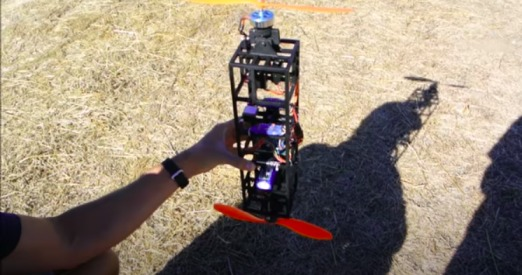
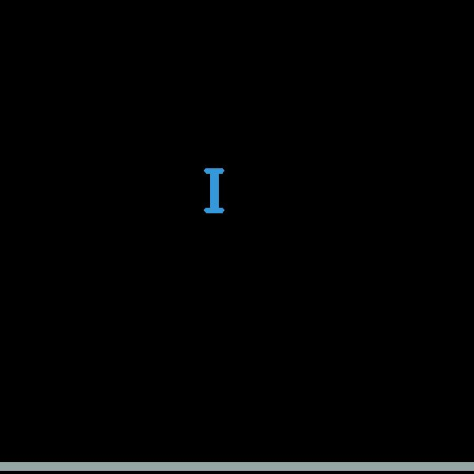

# 2 Boyutlu Fiziksel Simulasyon (Rigid Body 2d Physics Simulation), pymunk

Belli şekildeki objelerin gerçek dünyada nasıl davranacağını merak
ediyorsak simülasyon çözümüne başvurabiliriz. 2 boyutta bu tür
simülasyonlar `pymunk` ile rahatça yapılabilir. Bu fizik motoru arka
planda chipmunk adlı C++ ile yazılmış başka bir yazılıma arayüz
sağlıyor. Kurmak için

```
pip install pymunk
```

`pymunk` ile küresel, diktörtgen kenarlı, vs türünden objeler
yaratabiliriz, hatta pek çok farklı parçaları birbirine yapıştırmak ta
mümkündür. Sert zemin yaratılabilir. Objeleri çarpıştırmak, ya da
istediğimiz objelere istediğimiz taraflarından dış kuvvet uygulamak
mümkün. "Yere düşen" objeler gerçek dünyada tahmin edilebilecek
şekilde davranırlar, yerçekim ayarlanabilir.

Test etmek için üst ve alt kısımlarından kuvvet uygulanan bir çubuk örneği,

[Bar 1](bar1.py)

Bu çubuğu bir dualkopter gibi düşünebiliriz, alt ve üst pervaneler
var, alt üst ok tuşları ile uygulanan kuvvet arttırılıp
azaltılabiliyor, ve sağ sol ok tuşları ile kuvvetin acısı
değiştiriliyor, [1] örneğindeki durumun simülasyonu gibi
düşünülebilir.



Fakat dikkat edersek kopter hassas. Güç uygulandığı anda sağa sola
yalpalanması çok kolay. Burada problem [1]'deki durumun iyi simüle
edilmemiş olması. Simülasyon kuvveti tek noktaya uyguluyor, fakat [1]
kopterine bakarsak, pervaneler objenin gövdesinden daha geniş, ve
aerodinamik kurallarına göre pervanenin sağladıği kuvvet kapsadığı tüm
alan için geçerlidir. O zaman yeni bir simülasyon ile iki ufak çubuğu
alttan üstten daha büyük olan gövdeye yapıştırarak, ve kuvveti tüm
ufak çubuk alanına uygularız. Böylece gövdeden daha geniş olan pervane
alanı simule edilmiş olur.

Bu ikinci simülasyonun daha dengeli olduğu görülecektir. 

```python
import pymunk, pygame, random, sys, numpy as np, pyglet
from pymunk.pygame_util import DrawOptions

width = 600
height = 600

class Dualcopter:
    def __init__(self, position, space):
        self.mass = 1
        self.shape = pymunk.Poly.create_box(None, size=(10, 50))
        self.moment = pymunk.moment_for_poly(self.mass, self.shape.get_vertices())
        self.body = pymunk.Body(self.mass, self.moment)
        top = pymunk.Segment(self.body, (-10, 25), (10, 25), 3)  # 2        
        bottom = pymunk.Segment(self.body, (-10, -25), (10, -25), 3)  # 2        
        self.shape.body = self.body
        self.shape.body.position = position
        space.add(self.shape, self.body, top, bottom)

class Ground:
    def __init__(self, space):
        self.body = pymunk.Body(0, 0, body_type=pymunk.Body.STATIC)
        self.shape = pymunk.Poly.create_box(self.body, (width, 10))
        self.shape.body.position = (width//2, 10)
        space.add(self.shape, self.body)

def main():

    pygame.init()
    screen = pygame.display.set_mode((width, height))
    pygame.display.set_caption("The ball drops")
    clock = pygame.time.Clock()

    draw_options = DrawOptions(screen)

    space = pymunk.Space()
    space.gravity = 0, -100
    x = random.randint(120, 380)
    ground = Ground(space)
    copter = Dualcopter((x, 550), space)
    thrust_angle = 0
    thrust = 0

    i = 0
    while True:
        i += 1
        print ('================')
        print ('velocity', copter.shape.body.velocity)
        print ('angle', copter.shape.body.angle)
        print ('rv', copter.shape.body.rotation_vector)
        #if i%20==0: pygame.image.save(screen, "/tmp/out-%d.jpeg" % i)
        for event in pygame.event.get():
            if event.type == pygame.QUIT:
                sys.exit(0)
            elif event.type == pygame.KEYDOWN:
                print ('thrust',thrust,'angle',thrust_angle)
                if event.key == 274:
                    print ('down')
                    thrust -= 20
                elif event.key == 273:
                    print ('up')
                    thrust += 20
                elif event.key == 275:
                    print ('right')
                    thrust_angle += 10
                elif event.key == 276:
                    thrust_angle -= 10
                    print ('left')

        T = thrust / 6.0
        copter.shape.body.apply_force_at_local_point((0, T), (-10, -25))
        copter.shape.body.apply_force_at_local_point((0, T), (-5, -25))
        copter.shape.body.apply_force_at_local_point((0, T), (5, -25))
        copter.shape.body.apply_force_at_local_point((0, T), (10, -25))

        F = (T*np.sin(np.deg2rad(thrust_angle)), T*np.cos(np.deg2rad(thrust_angle)))
        copter.shape.body.apply_force_at_local_point(F, (-10, 25))
        copter.shape.body.apply_force_at_local_point(F, (-5, 25))
        copter.shape.body.apply_force_at_local_point(F, (5, 25))
        copter.shape.body.apply_force_at_local_point(F, (10, 25))

        screen.fill((0, 0, 0))
        space.debug_draw(draw_options)
        space.step(1/50.0)
        pygame.display.update()
        clock.tick(50)


if __name__ == '__main__':
    sys.exit(main())
```




Kaynaklar

[1] Mcclay, [Dualcopter](https://youtu.be/b14_XQ5nd2A)

[2] Nielsen, [Drone Drop](https://gist.github.com/DuaneNielsen/25972133ec77c6cd5494217bbe3e3066)

