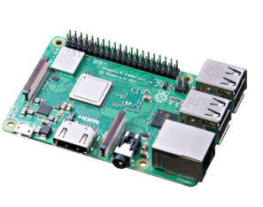
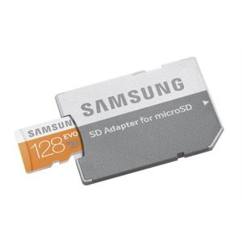
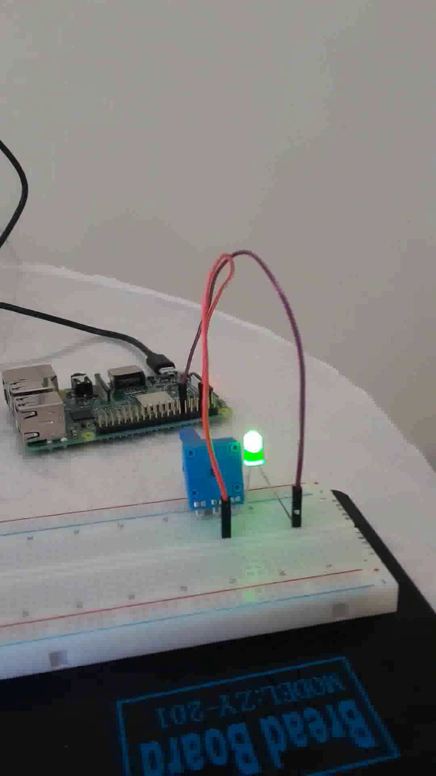

# Raspberry Pi

Elektronik aletleri kontrol etmek, medya idare merkezi (şarkı, film
göstermek) , hatta ufak masaüstü bilgisayarı olarak bile
kullanılabilecek bir ufak ama kuvvetli bir bilgisayar; Raspberry
Pi. Pi'nin paketten çıktığı haliyle her türlü giriş birimi (klavye,
fare) ya da çıkış (monitör, Wifi, Bluetooth) için desteği
vardır. İşletim sistemi basit bir SD karttan hızla yüklenebilir, Linux
bazlıdır, ve masaüstü kullanımına hazırdır,



### Kuruluş

RPi kurmak için Mikro SD kart gerekli, isletim sistemi bu karttan
okunuyor. Eğer satın alınan paketten içinde RPi işletim sistemi olan
bir SD çıkmadıysa (bazı paketlere dahil ediliyor) bir diğer
bilgisayardan bunu kullanıcının yapması lazım. Ayrı pürüz benim
bilgisayarda Mikro SD değil SD okuyucu olmasıydı (daha büyük bir
kart), o sebepe kart alırken SD / MicroSD çeviricisi gerekti,



Dizüstündeki Ubuntu'ya bunu taktık. Ubuntu'da `Disks` programı ile
takılan disk bulunur ve FAT için formatlanır. Şimdi RPi işletim
sistemi imajını SD'ye "yakma" zamanı geldi. [2]'den "Raspberry Pi
İmager for Ubuntu" indirilir, bir deb dosyası,

```
sudo apt-get install qml-module-qt-labs-settings
```

problem verirse,

```
sudo apt --fix-broken install
```

düzeltir. Ardından alınan deb üzerinde,

```
sudo dpkg -i imager_1.4_amd64.deb
```

Şimdi

```
rpi-imager
```

ile program başlatılır. Çıkan listede "İşletim Sistemi Seç (Choose
OS)" için ilk görülen Raspberry Pi seçilebilir. "SD Kart Seç (Choose
SD Card)" için daha önce formatlamış olduğumuz kart seçilir. Tamam
dedikten sonra bu işlem 1 GB üzerinde bir indirme yapacak, yani hızlı
ve yeterince kapasitesi olan bir Internet bağlantımız olması iyi olur.

Güç Kaynağı

Her Pi için gerekli güç kaynağı parametreleri [4]'te. Bizim aldığımız
3B+ modeli için 5.1 V ve 2.5 A diyor, ve giriş Mikro USB. Mikro USB
çoğu Samsung cep telefonunun güç girişi, bende birkaç tane şarj edici
vardı, fakat bazıları farklı amper seviyelerinde idi. Bir tanesi 5.0 V
ve 2.0 Amper diyor, bunu taktık, çalıştı. [4]'un bahsettiği gibi
RPi'nin ne kadar akım çektiği ona bağlı olan diğer donanımlara
bağlıdır. 

İlk Sistem Başlatımı

Ufak olan SD kartını büyük olandan çıkartıp Pi'ye takarız. RPi
donanımı olağan haliyle HDMI ekranlara bağlanabilir, ve işletim
sistemi USB'ye takılan klavye, fare gibi araçları tanır. Fakat
çoğumuzda bu tür giriş araçları olmayabilir, mesela kablolu klavye, ve
başta, RPi ilk kez yüklenirken, başlarken bazı girişlerin olması
lazım. Ne yapacağız?

Burada çözüm en minimal gereci almak, mesela üzerinde touchpad olan
(yani sanal fare) kablosuz klavye ama kablosuz bağlantı dongle ile,
yani RPi'nin USB soketine bağlanan bir ufak özel alıcı var, klavye
direk bu alıcı ile iletişime geçiyor, böylece Bluetooth vs işleriyle
Rpi üzerinden kurcalamaya gerek kalmıyor. Alıcıyı takıyorsunuz, pat
diye klavye ve üzerindeki fare tanınıyor.  Bu olduktan sonra artık
klavyeden giriş yapıp daha çetrefil işleri yapabiliriz.

Bundan sonrası / daha da iyisi, SSH ile erişim.  Eğer sisteme
girebildiysek ve ekranda Pi gözüküyorsa şimdi SSH ile başka
bilgisayardan bağlanmaya gelelim, böylece ekrana ihtiyaç olmayacak,
basit bir Wifi bağlantısı ile Pi'ye komut satırında girebileceğiz.
Çoğumuzda Android üzerinden cep telefon Internet bağlantısını
paylaşma, hotspot özelliği var. Bağlantıyı paylaşalım, ve Pi'mizi bu
Wifi noktasına bağlayalım. İnternet'e bağlanabildiğimizi kontrol
edelim, tarayıcı ile herhangi bir site. Şimdi Pi'nin şifresini set
edelim, menüden `Pi | Preferences | RPi Configuration | System`
ile.

Ardından `Pi | Preferences | RPi Configuration | Interfaces` üzerinde
SSH seçeneğini `Enable` haline getirelim [3]. Şimdi komut satırına
gidelim, ve `ifconfig` diyelim. Bu bize network donanımlarının bağlı
olduğu adresleri gösterir. Aradığımız IP adresi çoğunlukla `192.168..`
diye giden bir adres. Simdi ikinci (ve aynı Wifi noktasına bağlı)
dizüstü bilgisayara gidelim ve

```
ssh pi@192.168.... 
```

diyelim. Giriş yapılmış olmalı. Eğer işimizi ilerisi için daha da
kolaylaştırmak istersek, [şifresiz giriş](../../2005/10/bir-makinaya-ssh-ile-sifresiz-giris.html)
ayarlarını yapabiliriz.

Wifi üzerinden bu bağlantı işliyor çünkü aynı hotspot'a bağlandıysak
aynı network'un içindeyiz demektir ve aynı network içinde makinalar
birbirlerini bulabilirler.

Eğer başlangıçta masaüstü başlatılmasın istiyorsak `raspı-config` deriz
ve alttaki seçimleri yapınca 

[ekran 1](https://www.digikey.com/-/media/MakerIO/Images/blogs/2018/How%20to%20Boot%20to%20Command%20Line%20and%20SSH%20on%20Raspberry%20Pi/Fig-3.jpg)
[ekran 2](https://www.digikey.com/-/media/MakerIO/Images/blogs/2018/How%20to%20Boot%20to%20Command%20Line%20and%20SSH%20on%20Raspberry%20Pi/Fig-4.jpg)
[ekran 3](https://www.digikey.com/-/media/MakerIO/Images/blogs/2018/How%20to%20Boot%20to%20Command%20Line%20and%20SSH%20on%20Raspberry%20Pi/Fig-5.jpg)

bir sonraki başlatımda sadece konsol bazlı bir RPi işliyor olacaktır.
Eğer RPi sadece otomatik kontrol ya da servis bazlı amaçlar için
kullanılıyorsa, bellek sarfiyetini azaltma bakımından bu seçim faydalı
olur.

### Taşınabilir RPi

Çok az miktarda elektronik aletle, mesela kampta vs, seyahat etmek
isteyenler, cep telefonuna bir SSH müşteri programı kurup onun
üzerinden RPi'ye komut satırından bağlanabilir. RPi tam tekmilli bir
Linux olduğu için istenen her ağır işlem burada gerçekleştirilir, HDMİ
özellikli taşınabilir ufak monitörler var, bu bağlanır, enerji kaynağı
olarak herhangi bir taşınabilir pil, powerbank, RPi işletebiliyor. Pi
üzerindeki SSD 64, 256 GB bile olabilir, disk problemi olmaz. Ayrıca
Pi çok rahat şekilde (Ubuntu olduğu için) her türlü harici diske
erisebilir. Kablosuz klavye ile RPi'ye bağlanabiliyoruz, bu durumda
neredeyse dizüstü bilgisayara eşdeğer bir sistem elde edebilmiş
oluruz.

Mobil sistem şöyle olabilir demek ki, Android Hotstpot ile İnternet
bağlantısını paylaşır, bunu yaparken DHCP üzerinden IP adresi de
yaratmaktadır, bu adresi `ifconfig -a` ile bulup (192.168.x.x gibi
olur çoğunlukla) ona ya SSH ile bağlanabiliriz. Powerbank ile RPi
isletilebilir, bundan bahsettik, zaten telefonun pili de benzer
sekilde doldurulabilmektedir.

Android uzerinde Termux `ssh` var ise, ve bir X-Server programi [6]
isliyorsa, Termux'tan `ssh -X` ile RPi'a baglaninca gorsel X
programlari Android uzerinde gorebiliriz.


### Donanım Programcılığı

Pin Kontrolu, Ilk Program

RPi'i ustte anlatildigi gibi kurunca donanim uzerinde gorulen pinlerin
durumunu raporlayabilen, onlara erisebilen programlara sahip
oluyoruz. Mesela

```
pinout
```

komutu elimizdeki Pi'nin pin halini gösterir.

Bende mesela

```
   3V3  (1) (2)  5V    
 GPIO2  (3) (4)  5V    
 GPIO3  (5) (6)  GND   
 GPIO4  (7) (8)  GPIO14
   GND  (9) (10) GPIO15
GPIO17 (11) (12) GPIO18
GPIO27 (13) (14) GND   
GPIO22 (15) (16) GPIO23
   3V3 (17) (18) GPIO24
GPIO10 (19) (20) GND   
 GPIO9 (21) (22) GPIO25
GPIO11 (23) (24) GPIO8 
   GND (25) (26) GPIO7 
 GPIO0 (27) (28) GPIO1 
 GPIO5 (29) (30) GND   
 GPIO6 (31) (32) GPIO12
GPIO13 (33) (34) GND   
GPIO19 (35) (36) GPIO16
GPIO26 (37) (38) GPIO20
   GND (39) (40) GPIO21
```

Bu raporun sonu bu arada, üstünde daha grafiksel bir görüntü de var.

Pi'ye USB portları aşağı dönük halde baktığımızı düşünmek gerekiyor, o
zaman sağda üstten üçüncü pin GND yani toprak oluyor.

Python'dan erisim icin `virtualenv` Python 3 ortamina gecelim, ve


```
pip install RPi.GPIO
pip install gpiozero
```

kuralim. Ilk program

```
from gpiozero import LED
from signal import pause

red = LED(17)

red.blink()

pause()
```

500 Ohm civarı bir direnç ile seri halde bir LED'i GND ile GPİO17
pinine takalım, ve üstteki programı çalıştıralım. LED'in yanip
söndüğünü göreceğiz.



PIN'lere voltaj gidip gitmedigini gormek icin

```
gpio readall
```

faydalı olabilir.

Kaynaklar

[1] https://www.raspberrypi.org/documentation/installation/noobs.md

[2] https://www.raspberrypi.org/downloads/

[3] https://www.raspberrypi.org/documentation/remote-access/ssh/

[4] https://www.raspberrypi.org/documentation/hardware/raspberrypi/power/README.md

[5] https://www.thedigitalpictureframe.com/ultimate-guide-systemd-autostart-scripts-raspberry-pi/

[6] https://play.google.com/store/apps/details?id=x.org.server&hl=en_GB

