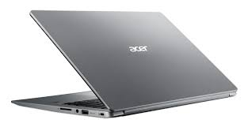

# Ubuntu 18, Acer Swift

Acer 400 dollar'dan daha az fiyatlı sağlam makina. 4 cekirdekli, 128
GB SSD (solid state disk). Ubuntu kurmak için USB diskten
yüklenebilir.



Ubuntu İmaj

Sistemi kurabilmek için bir USB flash disk üzerine onu "yakmak" lazım.

https://releases.ubuntu.com/18.04/

adresinden `ubuntu-18.04.4-desktop-amd64.iso.torrent` dosyasını
indirdim, ve Torrent ile imajı aldım. Yakma işlemi için

https://help.ubuntu.com/community/BurningIsoHowto

adresine danıştık, benim bir önceki sistemim de Ubuntu olduğu için
Startup Disk Creator programını başlattık, oradan indirilen iso, ve
hedef olarak USB dışkı seçtik ve yakma işlemini gerçekleştirdik. 

BIOS

Bir USB flash diskten yükleme yapmak için Bios hazırlanmalı,

Önce bilgisayarı tamamen kapatın, güç düğmesini 5+ saniye basılı tutun

Bilgisayarı başlatın bu sırada [F2] basılı tutun, BIOS'a girin

[Sag] [Sag] [Sag] ok tusu ile "Security" tab'ine gidin

[Enter]'e basin supervisor password girisi yapin

[Sag] ile Boot tab'ine

[Enter] [Asagi] [Enter] ile 'disable Secure Boot' secin

[F10] [Enter] ile Save and Exit

Tekrar başlayınca USB flash diskten yükleme yapılacak.

Kuruluş sırasında basit olduğu için 'önceki sistemi tamamen silme'
seçeneğini tercih edin. Böylece bir önceki Windows silinecek ve sadece
sistemde Ubuntu olacak.

Kuruluş Sonrası

Paketten çıkan masaüstü idarecisi (desktop manager) program Unity
kullanışlı... Fakat iş alanı (workspace) ayarı biraz garip, diğer
alanlara program yollanabiliyor, işleyen programlar listesinden diğer
alandaki program seçilince alan değişiyor. Fakat bir alanda iken
Alt-Tab ile geçiş yapınca diğer alana geçiş var. Bunu bilinen hale
çevirmek için

```
gsettings set org.gnome.shell.app-switcher current-workspace-only true
```

Böylece Alt-Tab sadece aynı iş alanındaki programlara geçiş yapar.

Çalışma alanları arasında gidip gelmek için sol üst köşede
`Activities` seçilir, ekranın sağında bir seçim alanı çıkıyor, buradan
alan değişimi olabiliyor.

Soldaki program listesi hem hızla tek tıklama ile başlatmak için hem
de işleyen programları görmek için kullanılıyor. Bu karışıklığa sebep
olabilir, eğer bir programdan bir tane işleyen varsa, ikinci başlatmak
için ne yapacağız? Eğer CTRL basılı tutup tıklarsak ikinci (ya da 3.,
vs) program başlatılır. 

Tuş üzerinden mouse tıklaması yapmak için bu makinada bazı kodlar
farklı, bizde CAPS => Ctrl, sağ tıklama => Ctrl, sol tıklama => Alt
Gr, ve Windows tuşu olur, bunun için `.bashrc` içinde

```
setxkbmap -option ctrl:nocaps

xmodmap -e "keycode 133 = Pointer_Button1"
xmodmap -e "keycode 108 = Pointer_Button1"
xmodmap -e "keycode 105 = Pointer_Button3"
xkbset m
```

Farklı bilgisayarlardaki tus kodlarını almak için `xev` kullanılabilir.

Dikkat: Touchpad üzerinden sağ tıklama için taam alt köşeden basmak
lazım. Pek kullanışlı denemez, tuşlarla daha iyi.

Ubuntu kurulusu ile pek cok yazilim gelir, Transmission gibi. Alttaki
paketler ilk işlettiğimiz `apt-get install` listesi,


```
git chromium-browser emacs xkbset virtualenv texlive-latex-extra
texlive-latex-recommended texlive-base pygmentize vlc mplayer xvkbd
htop make libportaudio2 portaudio19-dev python3-dev cmake calibre
fbreader evince net-tools openssh-server
```

Emacs ile F tuşlarını kullananlar için, bu tuşlar Acer tarafından
kullanılmakta, ses, ışık ayarı gibi... Eğer iptal etmek ile uğraşmak
istemiyorsanız, Emacs içinde FN tuşu ile beraber F1, F2, vs. basmak
normal F1, F2 etkisi yapar.

Emacs'i her zaman bir Python [virtualenv](../../2018/08/virtualenv-python-izole-sanal-calsma.md)
ortamından başlatmak iyi fikirdir, böylece komut satırında işletilen
`python` çağrısı ortamda kurulan paketlere erisebilmiş olur. Bizim
mesela bir `emacs.sh` script var, program böyle başlatılıyor, orada
hem `virtualenv` girişi yapılır, ardından Emacs başlatılır,

```
source /home/burak/Documents/env3/bin/activate 
/usr/bin/emacs25 &
```

Bu script icin de bir `alias` yaratabiliriz,

```
alias em="cd $HOME/Documents/kod; bash emacs.sh"
```

Bizim Emacs ayarlari [surada](https://github.com/burakbayramli/kod/tree/master/site-lisp).


Eğer masaüstüne işletilebilir script için ikon koymak istersek,

```
sudo apt-get install gnome-panel
```

ve

```
gnome-desktop-item-edit --create-new ~/Desktop
```

işletiriz. Bu bize bir diyalog kutusu getiriyor, orada işler kod için
mutlak ismi verilir, `/bin/bash /home/user/vs/vs/script.sh` gibi,
tanım vs girildikten sonra masaüstünde ikon yaratılır. Dikkat masaüstü
ikonları çift tıklama gerektirir, Unity hızlı erişim barındakiler tek
tıklama ile başlıyor.

Pencereler Arası Geçiş (Uygulamalar Değil)

Bu Ubuntu sürümünde Unity masaüstü programı her nedense Alt-Tab ile
pencereler arası geçişi programlar arası geçise değiştirmiş, yani iki
tane tarayıcı, iki tane terminal pencereniz varsa, geçiş sadece iki
şey arasında oluyor. Bunu eski haline getirmek için `Settings |
Devices | Keyboard`, ve `Keyboard shortcuts` listesinde `Switch
applications` iptal edilir (tıkla, sil düğmesi ve set butonu),
ardından `Switch windows` tıklanır ve ona Alt-Tab ataması yapılır.

Tuşlar ile program kapatmak için ALt-F4 alışkanlık oldu, yine üstteki
listeden Alt-F4 için başka bir program var, onu iptal ederiz, onun
yerine program bitirme için Alt-F4 atamasını yaparız (tüslama seçimi
üzerine tıklanır, Alt-F4 tıklanır bu kaydedilmiş olur).


Evince

PDF dosyalarını gösteren bu program her farklı dosya için sol tarafta
bir menü ortaya ciakrtiyor, kapatılsa bile bir sonraki dosya için
aynısını yapıyor. Her PDF aynı şekilde çıksın istiyorsanız bir PDF'i o
hale getirin, boyut vs ayarlayın, sonra sağ üst köşeden `File Options |
Save Current State Aş Default` seçin

Ubuntu Paket Problemleri

Eğer kuruluş sırasında coğrafik yer TR olarak seçildiyse yazılım
paketlerin alınacağı yer olarak `tr.archive.ubuntu.com` adresi
seçilmiş olabilir. Eğer bu servise bağlanmakta problem çıkarsa
Software Updater programına girip ilk tab'deki servislerin hangi
ülkeden olduğu değitirilebilir. Yakın olarak Netherlands, Germany, vs
bazı seçenekler.

Kaynaklar

[1] [AskUbuntu](https://askubuntu.com/questions/1092758/how-to-make-ubuntu-18-04-gnome-workspace-prohibit-alt-tab-to-windows-on-other)

[2] [AskUbuntu](https://askubuntu.com/questions/64222/how-can-i-create-launchers-on-my-desktop)

[3] [Ubuntu 18.04 on Acer Swift SF114-32](http://michaelb.org/ubuntu-18-04-on-acer-swift/)
