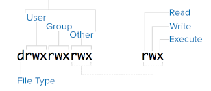

# Unix'e Giriş

İşletim sistemlerinin kralı tartışmasız Unix. Geliştirilmesi 70'li
yıllarda başlayan ve C programlama diline yakın oluşuyla daha da
yayılan bu sistem çekirdeksel olarak şu anda cep telefonlar dahil
olmak üzere milyarlarca makina üzerinde işliyor.

### Süreçler

Unix'i Unix yapan pek çok kavram var. Kullanıcıya pek gözükmeyen sahne
arkasındaki programları denetleyen, işleten çekirdek seviyesinde
yaptıkları var, dosya / dizin bazında kullanıcıya gözüken kısmı var.

Unix'te süreç kavramı önemli. Her işleyen program bir süreç içinde
işler, diğerlerinden ayrı çevre değişkenleri, yerel hafıza bloğu
vardır (global hafızaya özel programlama ile erişilebilir). O anda
bilgisayarınızdaki işleyen süreçleri görmek için `ps -eaf`
işletebiliriz, mesela bende

```
burak    15316 15314  0 11:21 pts/0    00:00:05 mplayer -quiet -playlist http://
burak    15400     1  2 11:24 tty2     00:01:43 /usr/bin/emacs25
burak    16320     1  1 11:47 tty2     00:00:49 /usr/lib/firefox/firefox -new-wi
burak    16487 16320  0 11:47 tty2     00:00:26 /usr/lib/firefox/firefox -conten
root     17133     2  0 11:54 ?        00:00:01 [kworker/u8:2+ev]
```

listesi var. Hakikaten şu anda Emacs içindeyim, arka planda Firefox
işliyor, vs. Bunların hepsi görülüyor. Bu süreçler yokedilebilir, vs.,
bkz [Faydalı Unix Komutları](../../2012/04/faydali-unix-komutlari.md).

Süreç listesini daha renkli olarak htop komutu ile görebiliriz (bağlantı altta). 

### Komut Satırı, Kabuk

Unix'te çoğu işlem komut satırı etrafında döner, en azından usta
admin, kullanıcılar onu tercih eder. Programları başlatmak, idare
etmek, gözetlemek için tercih edilir, script yazabilme ve onları
işletebilme açısından komut satırı hep faydalı olmuştur. Görsel
tıklamayı hatırlamak yerine istenen aksiyonu temsil eden birkaç harfi
hatırlamak ve klavyede yazmak her zaman daha hızlıdır, bu açıdan 'bir
resim bin kelimeye bedeldir' sözü Unix'te tepetaklak olmuştur, 'birkaç
harf bin resme bedeldir' demek daha doğru olur.

Komut satırını başlattığımızda, mesela Ubuntu Linux'ta Terminal
programı ile, bir süreç başlatılmıştır, ve bu süreç bir işler
programın çağrılması ile olmuştur. Komut satırı başlatıyorum ve süreç
listesine bakıyorum,

```
burak    14899 14890  0 11:20 pts/0    00:00:00 bash
```

görülüyor. Komut satırı, "kabuk (shell)" programı bu işte. Tabii komut
satırları tek tip değil, pek çok farklı program var, üstteki `bash`,
ona has özellikleri var, ama `sh` de var, ya da `tsch` var,
vs. Terminale gidip

```
echo $SHELL
```

deyince

```
/bin/bash
```

cevabı alıyorum. Kabuk tipi orada tanımlı. Bu arada `SHELL` bir çevre
değişkeni (environment variable), bir anlamda içinde olduğumuz sürecin
"çevresini" tanımlıyor, bu açıdan uygun isim. Çevre değişkenleri her
kabuk için farklı olabilir, birinden set ettiğimiz değişkeni
diğerinden göremeyebiliriz, `ALI=veli` deyin, `echo $ALI` bir `veli`
sonucunu verir, bir diğer bash ekranına gidin, aynı komut boş sonuç
verecektir.

Her `bash` penceresinin başlangıç değerleri her kullanıcı için ana /
ev (home) dizindeki `.bashrc` içinde set edilir. Dikkat, farklı kabuk
kullananlar için bu başlangıç dosyası farklı olur, mesela `csh` için
`.csh`.

Global ayarlar `.bashrc` den önce işletilen (bash icin) `/etc/profile`
icindedir. Her kullanıcı başlangıçta yapılmasını istediği şeyleri
kendi `.bashrc`'si içine koyabilir, admin her kullanıcı için
işlemesini istediği şeyler varsa onları `/etc/profile` içine koyar.

Ev dizini her kullanıcı için ana dizindir, `echo $HOME` ile ne
olduğunu görebilirsiniz, tek `cd` komutu çoğu kabukta otomatik olarak
sizi ev dizine götürür. Ubuntu'da bu benim icin `/home/burak` mesela.

Program Başlatmak

Kabuktan program başlattığımızda, mesela günün tarihi veren `date`
ile, satırda

```
$ date
```

dedik ve sonuç

```
Mon Jul 27 14:21:08 EEST 2020
```

geldi, bu komutu işlettiğimizde arka planda birkaç şey oldu. `date`
dedik ama hangi date? Bu programın işler kodunun olduğu dosya nerede?
Soru cevabı `which date` ile alınabilir, cevap olarak `/bin/date`
geldi bizde. Hakikaten orada bir `date` programı var,

```
$ ls -al /bin/date
-rwxr-xr-x 1 root root 100568 Jan 18  2018 /bin/date
```

Pek çok "sistem komutu" `/bin/` altındadır bu arada. Peki sadece
`date` deyince sistem `/bin/date` işletmesini gerektiğini nasıl bildi?
Burada `PATH` kavramı var, kabuk çevre değişkenleri içinde `PATH` adlı
dizin listesi program işletince nerelere bakılması gerektiğini tanımlar,

```
$ echo $PATH
/usr/local/sbin:/usr/local/bin:/usr/sbin:/usr/bin:/sbin:/bin...
```

Görüldüğü gibi `/bin` dizini listede (sonda), ve `bash` işletilmesi
istenen programı arayıp bu son dizinde buldu. `PATH` değişkeni
başlangıç ayar dosyasında set edilir, `bash` için `.bashrc` ve
`/etc/profile`.

Eğer karışıklığı meydan bırakmayacak şekilde bir programı direk
işletmek istersek bunu komut satırında `/bin/date` yazarak
yapabilirdik. Hatta script yazarken tavsiye edilen yaklaşım budur. 

Üstteki `ls` sonucunun soldaki kısmı kafa karıştırmış olabilir,
`-rwxr-xr-x` ne demek? Alttaki resimle anlatmaya uğraşalım,



En soldaki harf `d` ise baktığımız şey bir dizindir, `-` ise dosyadır.

Dikkat edersek kullanıcı (user) harfleri üç tane, grup (group) üç
tane, diğerleri (other) üç tane. Bu harf üçlüleri, sırasıyla, o an
olduğumuz kullanıcı, dahil olduğumüz grup ve diğerlerinin bu dosya
üzerindeki izinlerini gösterir.

Hangi kullanıcı olduğumuzu `id` ile hemen bulabiliriz.

Her harf öbeği `rwx` olabilir, tabii bu harflerden bazıları iptal
olabilir, mesela `-w-` olabilir. Harfler sırasıyla okuma (read), yazma
(write) ve işletme (execute) haklarını temsil eder. Yani üstteki
`/bin/date` için gördüğümüz `-rwxr-xr-x` kullanıcı (dosyanın sahibi
olan kişi) için `rwx` diyor, yani tüm hakları vermiş, ama grup için
`r-x` demiş, yani grup için yazma hakkı vermemiş.

Grup bu tür izinleri idare etmenin bir kolay yolu bir bakıma, her Unix
kullanıcısı admin tarafından birden fazla gruba atanmış
olabilir. Hangi gruba dahil olunduğunu her kullanıcı `groups` komutunu
işleterek bulabilir. Grup atamaları `/etc/groups` dosyası içinde
tutulur. Basit bir metin dosyasıdır, ama tabii ki herkes göremez,
`sudo ls -al /etc/group` deyin,

```
-rw-r--r-- 1 root root 936 Jul 20 15:46 /etc/group
```

Dosya sahibi (admin) hariç başka kimsenin dosyaya yazma hakkı
olmadığını görüyoruz.

İzinleri değiştirmek icin [chmod](chmod.html) kullanılır.

Pek çok şey kabuk etrafında döner dedik, program başlatmak bunlardan
en önemlisi. Bir program ismini yazarak onu komut satırından
başlatırız, ama o programı arka plana atarak ta işletebiliriz. Burada
`&` işareti devreye girer, mesela `xclock` desem grafik saat programı
başlar ama onu başlattığım komut satırının "bloklanmış" olduğunu
görebilirim çünkü başlatan program başlatılanın bitmesini
bekliyor. Programı üst sağ köşesindeki kapatma düğmesinden kapatırsam,
ya da başlatan kabuktan Ctrl-C ile durdurursam, ya da başka bir
pencereden `kill -9` ile, o zaman kabuğa geri dönüldüğünü
görürüm. Eğer bu bloklamanın olmasını istemiyorsak, en başta `xclock
&` işletebilirdik, bu `xlock` programını arka plana atar, hemen geri
döner, bekleme olmaz, böylece ana kabukta hala başka komutlar
işletebilir halde oluruz.

Ama dikkat, her süreç başlattığı sürecin ebeveyni haline gelir, `&`
ile başlatsak bile başlatan ebeveyn durumundadır, eğer başlatan süreç
ölürse, başlatılan da ölür. Mesela bir konsol komut satırı başlattım,
oradan `emacs &` ile editörü başlattım, konsolu kapatırsam, emacs
programı da kapanacaktır. O zaman başlatanda "evlatlık reddi" yapmak
lazım, yani `emacs & disown`. O zaman aradaki bağlantı kopar, başlatan
ölürse başlatılan ölmez.

### Başlangıç Ayarları

Komut satırı metin bazlı bir ortam olduğu için eğer bazı komutları sürekli
klavyede giriyorsak onları kısa temsil eden bir kısayol (alias) yaratmak
faydalı olabilir. Mesela sürekli `ssh user1@192.168.44.33` ile bir makinaya
ssh girişi yapıyorum, bu komutu

```
alias myssh='ssh user1@192.168.44.33`
```

ile özetleyebilirim. Artık `myssh` yazınca belirtilen `ssh` komutu
işler. Bir alias sonrası gelen seçenekler, ek komutlar alias açılımı
sonuna eklenir, eğer `myssh -X` diyorsam bu komut `ssh user1@192.168.44.33 -X`
olarak açılacaktır.

Peki ya alias *ortasına* bir ek parametre geçmek istesem? Diyelim ki standard
bir `fınd /usr -name '*.txt'` komutu uyguladım, fakat aramanın başladığı
dizini `/usr` değil bir değişken üzerinden tanımlamak istiyorum. Bu durumda
düz alias işlemez, ama bir bash fonksiyonu işler,

```
function myfind() {
  find "$@" -name '*.txt'
}
```

Bu kısayolu `myfind /tmp` şeklinde kullanabilirim, verdiğim parametre `fınd`
komutunun `"$@"` kısmına enjekte edilecektir. 


