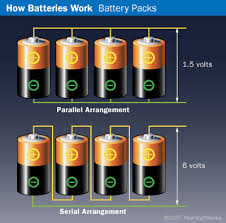

# Piller

Güç, Enerji, Kapasite

Bir pilin, yakıtın verebileceği güç, onun kapasitesinden bahsedildiğini
duyarız. Bu bağlamda aslında akıldaki soru çoğunlukla ne tür bir aleti bir güç
kaynağı ile işletebileceğim (anlık çıktı) ve bunu ne kadar süreyle
yapabileceğimdir.

Güç, Watt ile ölçülür, ki bu birim zamanda transfer edilen enerji (joule /
saniye). Mesela birisi için güçlü diyebiliriz, birini dövmek aslında enerji
transferi, enerji kısa bir zamanda bir kişiden bir diğerine transfer
oluyor. Peki bu kişi, mesela boksör, ne kadar süre bunu yapabilir? Bu
kapasite. Bir pil ne kadar dayanır? Aynı fikir. Kapasiteyi Watt-saat ile
ölçebiliriz, bir saatte sürekli 1 Watt verilince ortaya çıkan güç bloğu bu.
Piller için Watt voltaj çarpı ampere eşittir (birim zamandaki bir akış amper
içinde var, hesap bozulmuyor).

Fakat güç, kapasite fikirlerini pillere uygulamak isteyince karışıklık
olabiliyor. Bir pile bakıyoruz, çoğunlukla mAh diye bir birimden bahsediyor, bu
birim mili amper-saat demek. Ama Volt lazım, o nerede? 10Ah @ 12V pilin
kapasitesi 10Ah @ 5V pilin kapasitesinden büyüktür [12].

Bahsedilmeyen şey bazen tahmin edilebiliyor. Mesela lithium pill hücreleri için
voltajın 3.6V or 3.7V olduğu biliniyor, bunu alıp çarpımı yaparsak ve 1000 ile
bölersek Watt-saat kapasiteye erisebiliriz. O zaman mesela bir 10,000mAh
etiketli pil görürsek kapasite 10000 x 3.6 /1000 = 36 Watt-saat diyebiliriz.

Başka bir örnek, bir kamp lambası aldım, Fenix CL20R markası. İçindeki pil
1600mAh imiş. Voltaj nerede? Ürünün sitesine bakıyorum, içindeki pilin 7 tane
AAA piline eşit olduğu yazıyor. Her pil 1.5 V ise seri şekilde bağlanınca 10.5 V
olur. Voltajı bulduk.

Bu lambanın farklı ışık seviyeleri var, her birinde ne kadar uzun dayanır acaba?

Işık seviyesi lumen ile ölçülür. Yine ürün sitesine,

300 lumen (6 saat)

130 lumen (12 saat)

40 lumen (20 saat)

1 lumen (200 saat)

diyor. Bana Watt lazım [13]. 

Bir LED lamba 80-100 lumens/W imiş. 300 lumen varsa, 3 W.  O zaman, 1600
mah * 7 * 1.5 volt / 1000 = 16.8 Wh. Bizde 3W lumens var, ne kadar dayanir?
16.8 / 3 = 5.6 saat. Doğru duruyor.

Seri, Paralel Pil Bağlantıları

Pilleri seri şekilde bağlamak toplam voltajı artırır. Dört tane 1.5 Voltluk pili
seri şekilde bağlayınca toplam 6 Volt elde ederiz. Tabii ki eğer aynı devreye,
aynı dirence uygulanan voltaj artınca akımda da artış olur. Fakat pilin toplam
akım kapasitesinde, yani mAh ile belirtilen sayıda, artış olmaz (bu arada seri
şekilde bağlı pillerin aynı mAh'a sahip olması gerekir).

Paralel bağlı pillerde ise akım kapasitesinde artış olur, fakat voltajda artış
olmaz. Dikkat akım seviyesi aynı kalır, sadece aynı akımı daha uzun süre
çekebiliriz [9, 10, 11].



LiPo Pilleri

Bu tür piller yüksek amper üretebilirler. Etikletlenmeleri kafa
karıştırabilir, mesela 4S-2200 20C diyor, bu ne demek. Bu etiketli pil
2200 mAh üretir. Burada 20C yük boşaltımı (discharge) demek, pilin
maksimum akım verme kapasitesini bulmak için 20C icindeki 20 sayısını
2200 ile çarpıyoruz, 20 x 2200 = 44000 milliamper = 44 amper
buluyoruz. Bu hesap bize bu pilin güvenli bir şekilde sürekli maksimum
44 amper verebileceğini söylüyor. Tabii dolaylı olarak bu da demektir
ki 44 amperi bu şekilde sürekli olarak alsak pil ancak 3 dakika civarı
dayanır, çünkü enerji kapasitesini biliyoruz, 2200 mah, ki bu
miliamper saat, 2200 x 60 miliamper dakika eder, o zaman

```python
print ((2200 * 60) / 44000, 'dakika')
```

```text
3.0 dakika
```

Benzer mantıkla 4S-2200 30C pili 66 ampere kadar gereksinim duyan
uygulamalar için kullanılabilir.

Kaynaklar

[1] https://www.tested.com/art/makers/846909-hobby-rc-analyzing-lipo-battery-discharge-rates/

[9] https://www.endesa.com/en/discover-energy/blogs/volts-watts-amps-what-are-they-how-do-they-differ

[10] https://www.quora.com/What-is-the-difference-between-volts-and-amps

[11] https://batteryuniversity.com/learn/article/serial_and_parallel_battery_configurations


