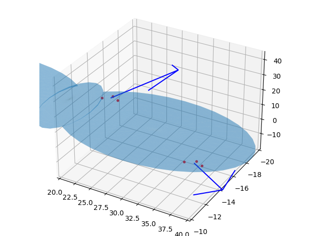

# 3D Baskıya Hazır CAD Tasarımlarına Erişmek, Numpy-STL

3 boyutlu baskı (3d printing) için tasarım dosyaları için STL formatı
var. Bir objeyi mesela Tinkercad ile tasarlayıp objeyi STL formatında
kaydedebiliriz, bu dosya 3 boyutlu baskıya hazırdır.

Örnek bir objeye bakalım [1], bir pervane bu, `propeller1.stl`
olarak kaydedelim,

Bu objeye Python'dan erişmek istersek, `numpy-stl` kullanılabilir.

```
pip install numpy-stl
```

Şimdi

```python
from stl import mesh
from mpl_toolkits import mplot3d

# Create a new plot
figure = plt.figure()
axes = mplot3d.Axes3D(figure)

# Load the STL files and add the vectors to the plot
your_mesh = mesh.Mesh.from_file('propeller1.stl')
axes.add_collection3d(mplot3d.art3d.Poly3DCollection(your_mesh.vectors))

# Auto scale to the mesh size
scale = your_mesh.points.flatten()
axes.auto_scale_xyz(scale, scale, scale)

# Show the plot to the screen
plt.savefig('prop.png')
```


Daha detaylı işlemler için dokümana [2] bakılabilir,

STL Veri Yapisi

Şekil dosyaları bir objeyi kapsayan ve birbirini tamamlayan üçgenler
üzerinden tanımlanıyor. Bu yassı iki boyutlu üçgenleri temsil etmek için
üç tane 3D nokta bir de yüzeyin hangi yöne işaret ettiği (bir normal vektör
üzerinden) yeterli oluyor.

Mesela biraz önceki şekilde üzerinden

```python
from stl import mesh
from mpl_toolkits import mplot3d

your_mesh = mesh.Mesh.from_file('propeller1.stl')

print (len(your_mesh.vectors))
ns = your_mesh.get_unit_normals()
print (ns.shape)
print (your_mesh.vectors[0])
```

```text
7668
(7668, 3)
[[ 42.881 -14.357   0.562]
 [ 43.095 -15.066   0.752]
 [ 41.793 -14.443   0.463]]
```

Görüldüğü gibi 7668 tane üçgen ve normal vektör var. Üçgenlerden sıfırıncı
olana baktık ve üstteki 3x3 matris geldi, bu matrislerden ilk satır üçgenin
bir köşesi, böyle gidiyor. Aynı üçgene tekabül eden normal vektör yine aynı
indiste, onu `your_mesh.get_ünit_normals()[0]` ile alabilirdik.

Ucgenler hakkinda bir fikir olmasi icin iki tanesini, normalleriyle beraber
grafikleyelim,


```python
fig = plt.figure()
axes = mplot3d.Axes3D(fig)

axes.add_collection3d(mplot3d.art3d.Poly3DCollection(your_mesh.vectors,alpha=0.3))
scale = your_mesh.points.flatten()
axes.auto_scale_xyz(scale, scale, scale)


def plot_vector(fig, orig, v, color='blue'):
   ax = fig.gca(projection='3d')
   orig = np.array(orig); v=np.array(v)
   ax.quiver(orig[0], orig[1], orig[2], v[0], v[1], v[2],color=color)
   ax = fig.gca(projection='3d')  
   return fig

SCALE = 30
tidx = 2314
tc = your_mesh.vectors[tidx][0]
axes.plot (tc[0],tc[1],tc[2],'r.')
tc = your_mesh.vectors[tidx][1]
axes.plot (tc[0],tc[1],tc[2],'r.')
tc = your_mesh.vectors[tidx][2]
axes.plot (tc[0],tc[1],tc[2],'r.')

o = np.mean(your_mesh.vectors[tidx],axis=0)
n = your_mesh.get_unit_normals()[tidx]
plot_vector(fig, o, n*SCALE)

tidx = 314
tc = your_mesh.vectors[tidx][0]
axes.plot (tc[0],tc[1],tc[2],'r.')
tc = your_mesh.vectors[tidx][1]
axes.plot (tc[0],tc[1],tc[2],'r.')
tc = your_mesh.vectors[tidx][2]
axes.plot (tc[0],tc[1],tc[2],'r.')

o = np.mean(your_mesh.vectors[tidx],axis=0)
n = your_mesh.get_unit_normals()[tidx]
plot_vector(fig, o, n*SCALE)

axes.set_xlim(20,40);axes.set_ylim(-10,-20)

plt.savefig('prop2.png')
```




Kaynaklar

[1] https://www.tinkercad.com/things/h3gtFbihOx3-helice-2-pales-arrondies-propeller-2-rounded-blades

[2] https://pythonhosted.org/numpy-stl/
