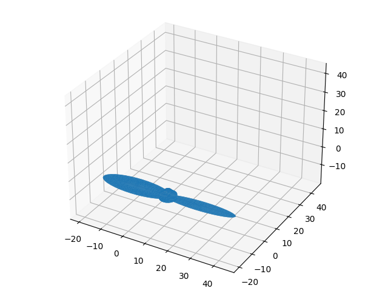

# 3D Baskıya Hazır CAD Tasarımlarına Erişmek, Numpy-ŞTL

3 boyutlu baskı (3d printing) için tasarım dosyaları için ŞTL formatı
var. Bir objeyi mesela Tinkercad ile tasarlayıp objeyi ŞTL formatında
kaydedebiliriz, bu dosya 3 boyutlu baskıya hazırdır. 

Örnek bir objeye bakalım [1], bir pervane bu, `propeller1.stl`
olarak kaydedelim,

Bu objeye Python'dan erişmek istersek, `numpy-stl` kullanılabilir.

```
pip install numpy-stl
```

Şimdi

```python
from stl import mesh
from mpl_toolkits import mplot3d
from matplotlib import pyplot

# Create a new plot
figure = pyplot.figure()
axes = mplot3d.Axes3D(figure)

# Load the STL files and add the vectors to the plot
your_mesh = mesh.Mesh.from_file('propeller1.stl')
axes.add_collection3d(mplot3d.art3d.Poly3DCollection(your_mesh.vectors))

# Auto scale to the mesh size
scale = your_mesh.points.flatten()
axes.auto_scale_xyz(scale, scale, scale)

# Show the plot to the screen
plt.savefig('prop.png')
```



Daha detaylı işlemler için dokümana [2] bakılabilir,

Kaynaklar

[1] https://www.tinkercad.com/things/h3gtFbihOx3-helice-2-pales-arrondies-propeller-2-rounded-blades

[2] https://pythonhosted.org/numpy-stl/


