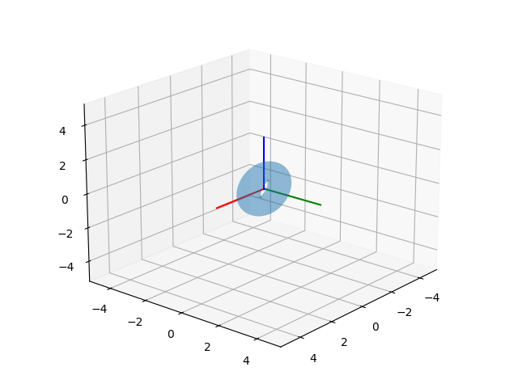

# 3D Baskıya Hazır CAD Tasarımlarına Erişmek, Numpy-STL

3 boyutlu baskı (3d printing) için tasarım dosyaları hazırlamaya
yardım eden STL formatı var. Bir objeyi mesela Tinkercad ile
tasarlayıp objeyi STL formatında kaydedebiliriz, bu dosya 3 boyutlu
baskıya hazırdır.

Örnek bir objeye bakalım [1], bir pervane bu, `propeller1.stl` olarak
kaydedelim. Obje tasarımına, verisine Python'dan erişmek istersek,
`numpy-stl` kullanılabilir.

```
pip install numpy-stl
```

Şimdi

```python
from stl import mesh
from mpl_toolkits import mplot3d

# Create a new plot
figure = plt.figure()
axes = mplot3d.Axes3D(figure)

# Load the STL files and add the vectors to the plot
your_mesh = mesh.Mesh.from_file('propeller1.stl')
axes.add_collection3d(mplot3d.art3d.Poly3DCollection(your_mesh.vectors))

# Auto scale to the mesh size
scale = your_mesh.points.flatten()
axes.auto_scale_xyz(scale, scale, scale)

# Show the plot to the screen
plt.savefig('prop.png')
```


Daha detaylı işlemler için dokümana [2] bakılabilir,

STL Veri Yapısı

Şekil dosyaları bir objenin yüzeyini kapsayan ve birbirini tamamlayan
üçgenler üzerinden tanımlanıyor. Bu yassı iki boyutlu üçgenleri temsil
etmek için üç tane 3D nokta bir de yüzeyin hangi yöne işaret ettiği
(bir normal vektör üzerinden) yeterli. Mesela biraz önceki şekil için,

```python
from stl import mesh
from mpl_toolkits import mplot3d

your_mesh = mesh.Mesh.from_file('propeller1.stl')

print (len(your_mesh.vectors))
ns = your_mesh.get_unit_normals()
print (ns.shape)
print (your_mesh.vectors[0])
```

```text
7668
(7668, 3)
[[ 42.881 -14.357   0.562]
 [ 43.095 -15.066   0.752]
 [ 41.793 -14.443   0.463]]
```

Görüldüğü gibi 7668 tane üçgen ve normal vektör var. Üçgenlerden
sıfırıncı olana baktık ve üstteki 3x3 matris geldi, bu matrislerden
ilk satır üçgenin bir köşesi, ikinci satır ikinci köşesi, vs. Aynı
üçgene tekabül eden normal vektör yine aynı indiste, onu
`your_mesh.get_unit_normals()[0]` ile alabilirdik.

Üçgenler hakkında bir fikir olması için iki tanesini, normalleriyle beraber
grafikleyelim,


```python
fig = plt.figure()
axes = mplot3d.Axes3D(fig)

axes.add_collection3d(mplot3d.art3d.Poly3DCollection(your_mesh.vectors,alpha=0.3))
scale = your_mesh.points.flatten()
axes.auto_scale_xyz(scale, scale, scale)

def plot_vector(fig, orig, v, color='blue'):
   ax = fig.gca(projection='3d')
   orig = np.array(orig); v=np.array(v)
   ax.quiver(orig[0], orig[1], orig[2], v[0], v[1], v[2],color=color)
   ax = fig.gca(projection='3d')  
   return fig

SCALE = 30
tidx = 2314
tc = your_mesh.vectors[tidx][0]
axes.plot (tc[0],tc[1],tc[2],'r.')
tc = your_mesh.vectors[tidx][1]
axes.plot (tc[0],tc[1],tc[2],'r.')
tc = your_mesh.vectors[tidx][2]
axes.plot (tc[0],tc[1],tc[2],'r.')

o = np.mean(your_mesh.vectors[tidx],axis=0)
n = your_mesh.get_unit_normals()[tidx]
plot_vector(fig, o, n*SCALE)

tidx = 314
tc = your_mesh.vectors[tidx][0]
axes.plot (tc[0],tc[1],tc[2],'r.')
tc = your_mesh.vectors[tidx][1]
axes.plot (tc[0],tc[1],tc[2],'r.')
tc = your_mesh.vectors[tidx][2]
axes.plot (tc[0],tc[1],tc[2],'r.')

o = np.mean(your_mesh.vectors[tidx],axis=0)
n = your_mesh.get_unit_normals()[tidx]
plot_vector(fig, o, n*SCALE)

axes.set_xlim(20,40);axes.set_ylim(-10,-20)

plt.savefig('prop2.png')
```


İki tane üçgeni gösterdik, yön oklarında okun başlangıcı için üçgenin üç
noktasının ortalamasını aldık, böylece kabaca bir orta noktadan çıkan
`SCALE` ile ölçeklediğimiz normal yönde bir ok çizebilmiş olduk.

Özet Verileri

Küre, kare gibi basit objelerin analitik hacim formülü bilinir. Fakat
elimizde çetrefil bir şekilde ve ayrıksal olarak yüzeyi tanımlanmış
bir nesne var, onun hacmi için ayrıksal, hesapsal bazı teknikler
gerekebilirdi, neyse ki `numpy-stl` içinde bu fonksiyonlar var,

```python
prop = your_mesh.get_mass_properties()
print ('\nhacim',prop[0])
print ('\nyercekim merkezi (COG)',prop[1])
print ('\nCOG noktasinda atalet matrisi')
print (prop[2])
```

```text
hacim 508.81107187133966

yercekim merkezi (COG) [ 14.99940119 -14.99999338   1.13988199]

COG noktasinda atalet matrisi
[[ 2.14550670e+03 -2.23269194e-03 -2.31301332e-02]
 [-2.23269194e-03  1.01219910e+05  6.33494132e+01]
 [-2.31301332e-02  6.33494132e+01  1.02767050e+05]]
```

3D Döndürme

Bir objeyi döndürmek için gereken matematiği [6]'da görmüştük. Eğer bir simit
şeklindeki bir objeyi bir eksen, mesela x, etrafında döndürmek istiyorsak,
gerekli döndürme matris şekli [6]'da işlendi. Bu matris yaratıldıktan sonra
mesh üzerinde `rotate_using_matrix` çağrısı yapılabilir. Matrisi yaratmanın
farklı yolları var tabii, bunlar detaylı olarak yazıda işlendi. Örnek olarak
yatay şekilde başlayan bir simit (torus) şeklini x ekseni etrafında 90 derece
döndürelim,

```python
from mpl_toolkits import mplot3d
import numpy as np
from stl import mesh
fig = plt.figure()
axes = mplot3d.Axes3D(fig)
your_mesh = mesh.Mesh.from_file('../../../phy/phy_008_sim_rigbod/torus.stl')
axes.add_collection3d(mplot3d.art3d.Poly3DCollection(your_mesh.vectors,alpha=0.3))
scale = your_mesh.points.flatten()
axes.auto_scale_xyz(scale, scale, scale)
AS = 3
axes.plot([0,AS],[0,0],[0,0],color = 'r')
axes.plot([0,0],[0,AS],[0,0],color = 'g')
axes.plot([0,0],[0,0],[0,AS],color = 'b')
LIM = 5
axes.set_xlim(-LIM,LIM);axes.set_ylim(-LIM,LIM);axes.set_zlim(-LIM,LIM)
axes.view_init(azim=40,elev=30)
plt.savefig('torus-begin.png')
```


```python
your_mesh = mesh.Mesh.from_file('../../../phy/phy_005_basics_04/torus.stl')
theta = np.deg2rad(90) # 90 derece x ekseni etrafinda dondur
R = np.array(
  [[1, 0, 0],
  [0,np.cos(theta),np.sin(theta)],
  [0,-np.sin(theta),np.cos(theta)]])
print (R)
your_mesh.rotate_using_matrix(R)
fig = plt.figure()
axes = mplot3d.Axes3D(fig)
scale = your_mesh.points.flatten()
axes.add_collection3d(mplot3d.art3d.Poly3DCollection(your_mesh.vectors,alpha=0.3))
AS = 3
axes.plot([0,AS],[0,0],[0,0],color = 'r')
axes.plot([0,0],[0,AS],[0,0],color = 'g')
axes.plot([0,0],[0,0],[0,AS],color = 'b')
axes.auto_scale_xyz(scale, scale, scale)
LIM = 5
axes.set_xlim(-LIM,LIM);axes.set_ylim(-LIM,LIM);axes.set_zlim(-LIM,LIM)
axes.view_init(azim=40,elev=20)
plt.savefig('torus-rotated.png')
```

```text
[[ 1.000000e+00  0.000000e+00  0.000000e+00]
 [ 0.000000e+00  6.123234e-17  1.000000e+00]
 [ 0.000000e+00 -1.000000e+00  6.123234e-17]]
```



Ekler

STL dosyalarını çabuk bir şekilde Ubuntu'da görebilmek için, bir program `meshlab`.

```
sudo apt-get install meshlab

meshlab dosya.stl
```

Kaynaklar

[1] [Tinkercad](https://www.tinkercad.com/things/h3gtFbihOx3-helice-2-pales-arrondies-propeller-2-rounded-blades)

[2] [Numpy STL](https://pythonhosted.org/numpy-stl/)

[3] [C++ ile STL Dosyasi Okumak](http://www.sgh1.net/posts/read-stl-file.html)

[4] [Cornell, Triangle meshes I, PDF](http://www.cs.cornell.edu/courses/cs4620/2014fa/lectures/02trimesh1.pdf)

[5] [STL File Format, Simply Explained](https://all3dp.com/what-is-stl-file-format-extension-3d-printing/#pointone)

[6] [Döndürme (Rotation)](https://burakbayramli.github.io/dersblog/phy/phy_072_rot/dondurme__rotation_.html)
