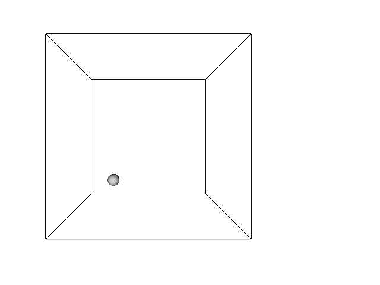

# OpenGL, PyOpenGL

3 boyutlu simülasyonlar için OpenGL ünlü bir paket. Çeşitli objeler,
satıhlar, onları gösteren bir kamera gibi kavramların kodlaması
basit. Birkaç örnek C++ kodunu [SPH](sph.html) yazısında gördük. Ek bazı
kodlar [2]'den alınmıştır,

[bouncingballs.cpp](glcode/bouncingballs.cpp),
[checkeredtriangles.cpp](glcode/checkeredtriangles.cpp),
[colorcube.cpp](glcode/colorcube.cpp),
[cometride.cpp](glcode/cometride.cpp),
[fish.cpp](glcode/fish.cpp),
[litsolids.cpp](glcode/litsolids.cpp),
[moon.cpp](glcode/moon.cpp),
[robotarm.cpp](glcode/robotarm.cpp),
[sierpinski2d.cpp](glcode/sierpinski2d.cpp),
[sierpinski3d.cpp](glcode/sierpinski3d.cpp),
[spinningsquare.cpp](glcode/spinningsquare.cpp),
[tetrahedron.cpp](glcode/tetrahedron.cpp),
[torus.cpp](glcode/torus.cpp),
[triangle.cpp](glcode/triangle.cpp)

Derlemek icin

```
sudo apt-get install mesa-common-dev libgl1-mesa-dev libglu1-mesa-dev freeglut3-dev
```

Sonra

```
g++ dosya.cpp -lX11 -lGL -lGLU -lglut -g -Wall -O2 -o islet.exe
```

Alttaki kodlarda [2]'den alınan bir uçuş simulatörü var

[fly.cpp](glcode/flight/fly.cpp)
[geometry.h](glcode/flight/geometry.h)
[landscape.cpp](glcode/flight/landscape.cpp)
[landscape.h](glcode/flight/landscape.h)
[ship.h](glcode/flight/ship.h)

Derlemek icin

```
g++ -c landscape.cpp -o landscape.o -lX11 -lGL -lGLU -lglut -g -Wall -O2 
g++ fly.cpp -g -Wall -O2 -o r.exe -lX11 -lGL -lGLU -lglut landscape.o
```

Python

Kurulus

```
pip install PyOpenGL==3.1.0
```

[1] kodu baz alınarak bir topun düşüşünü, duvarlara, yere çarpmasını
simüle eden bir kod altta görülüyor. Top sayısını `self.n` ile
arttırabiliriz.

```python
from OpenGL.GL import *
from OpenGL.GLU import *
from OpenGL.GLUT import *
from random import random
from PIL import Image
from PIL import ImageOps
import sys

class Simulation:
    def __init__(self):
        self.i = 0
        self.n   = 1
        self.r   = 0.1
        self.g   = 9.8
        self.dt  = 0.01
        self.cor = 0.6
        self.balls = []
        self.tm  = 0.0
        self.th  = 0.0
        self.mmax =  1.0-self.r
        self.mmin = -1.0+self.r
        self.right = False
        self.left = False
        
    def init(self):
        for i in range(self.n):
            p = [
                self.mmin + random()*(self.mmax-self.mmin),
                self.mmin + random()*(self.mmax-self.mmin),
                0.9]
            v = [
                -1.5 + random()*3.0,
                -1.5 + random()*3.0,
                -1.0 + random()*2.0]
            self.balls.append({'pos':p,'vel':v})
        tm = 0.0

        glEnable(GL_LIGHTING)
        glEnable(GL_LIGHT0)
        glEnable(GL_DEPTH_TEST)
        glClearColor(1.0,1.0,1.0,1.0)

        glMatrixMode(GL_PROJECTION)
        glLoadIdentity()
        gluPerspective(60.0,1.0,1.0,50.0)
        glTranslatef(0.0,0.0,-3.5)
        glMatrixMode(GL_MODELVIEW)
        glLoadIdentity()

    def update(self):
        for b in self.balls:
            b['vel'][2] += -self.g*self.dt
            b['pos'][0] += b['vel'][0]*self.dt
            b['pos'][1] += b['vel'][1]*self.dt
            b['pos'][2] += b['vel'][2]*self.dt

            if (abs(b['pos'][0]) >= self.mmax):
                b['vel'][0] *= -self.cor
                if b['pos'][0] < 0:
                    b['pos'][0] = self.mmin
                else:
                    b['pos'][0] = self.mmax

            if (abs(b['pos'][1]) >= self.mmax):
                b['vel'][1] *= -self.cor
                if b['pos'][1] < 0:
                    b['pos'][1] = self.mmin
                else:
                    b['pos'][1] = self.mmax

            if (abs(b['pos'][2]) >= self.mmax):
                b['vel'][2] *= -self.cor
                if b['pos'][2] < 0:
                    b['pos'][2] = self.mmin
                else:
                    b['pos'][2] = self.mmax

        # kamerayi saga sola dondurmek icin
        if self.right:
            self.th += 0.2
            if self.th>360.0:
                self.th -= 360.0

        if self.left:
            self.th -= 0.2
            if self.th>360.0:
                self.th -= 360.0

        glutPostRedisplay()

    def display(self):
        glClear( GL_COLOR_BUFFER_BIT | GL_DEPTH_BUFFER_BIT)
        glPushMatrix()
        glRotatef(self.th,0.0,1.0,0.0)
        glRotatef(90.0,-1.0,0.0,0.0)
        glutWireCube(2.0)
        for b in self.balls:
            glPushMatrix()
            glTranslatef(b['pos'][0],b['pos'][1],b['pos'][2])
            glutSolidSphere(self.r,50,50)
            glPopMatrix()
        glPopMatrix()
        glutSwapBuffers()

	# her 40'inci resmi diske png olarak yaz
        if self.i % 40 == 0: 
            width,height = 640,480
            data = glReadPixels(0, 0, width, height, GL_RGBA, GL_UNSIGNED_BYTE)
            image = Image.frombytes("RGBA", (width, height), data)
            image = ImageOps.flip(image)
            image.save('/tmp/glutout-%03d.png' % self.i, 'PNG')
        self.i += 1

    def mouse(self,button,state,x,y):
        if button == GLUT_LEFT_BUTTON:
            self.right = not state
        elif button == GLUT_RIGHT_BUTTON:
            self.left = not state

if __name__ == '__main__':
    s = Simulation()
    glutInit(())    
    glutInitDisplayMode(GLUT_DOUBLE | GLUT_RGB | GLUT_DEPTH)
    glutInitWindowSize(500,500)
    glutCreateWindow("GLUT Bouncing Ball in Python")
    glutDisplayFunc(s.display)
    glutIdleFunc(s.update)
    glutMouseFunc(s.mouse)
    s.init()
    glutMainLoop()
```

Sonuc




Dikkat üstteki kodda duvar çarpım fiziği var fakat topların birbirine
çarpma fiziği yok.

Görüntüsüz (Headless) İsletmek

Bazen uzun sürebilecek, ya da otomize şekilde script içinden grafik
rutinleri çağırmak isteyebiliriz, ve program işlerken bir pencere
açılip görüntü gösterilsin istemiyoruz. Bu durumda normal bir Unix
script çağırır gibi OpenGL ya da PyOpenGL çağrıları yapabiliriz,
görüntüyü işletim sistemi seviyesine yakalayıp göstermemek
lazım. `xvfb` ile bunu yapabiliriz, Ubuntu'da

```
sudo apt-get install xvfb
```

İşletmek için

```
xvfb-run -s "-screen 0 1x1x24"  python -u script.py
```

Görüntü gösterilmeyecek fakat program işleyecek, eğer kod içinde png
dosyaları yazıyorsak mesela bunların normal olduğu gibi üretildiğini
göreceğiz. .


Kaynaklar

[1] http://fab.cba.mit.edu/classes/864.05/people/knorton/01-balls/

[2] https://cs.lmu.edu/~ray/notes/openglexamples/

