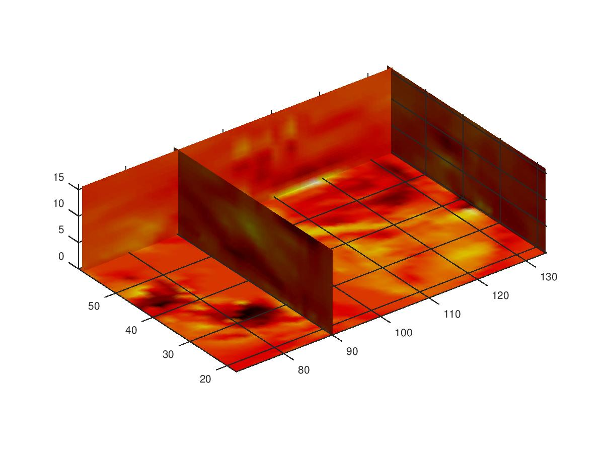
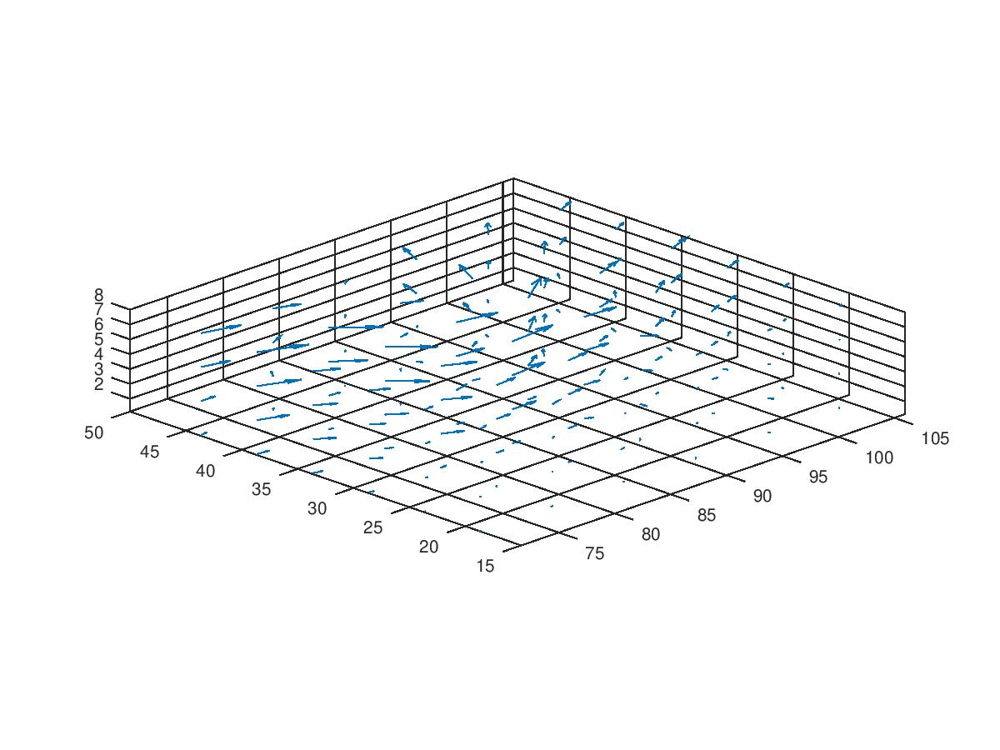
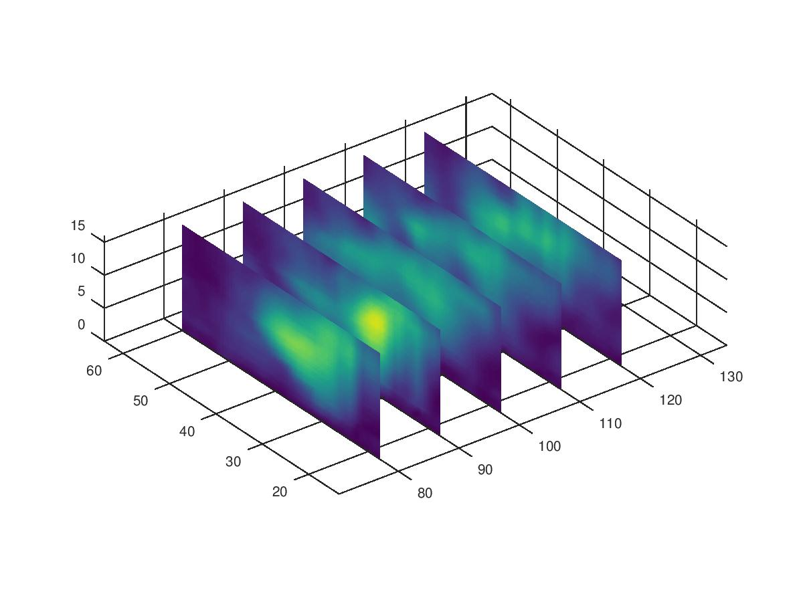
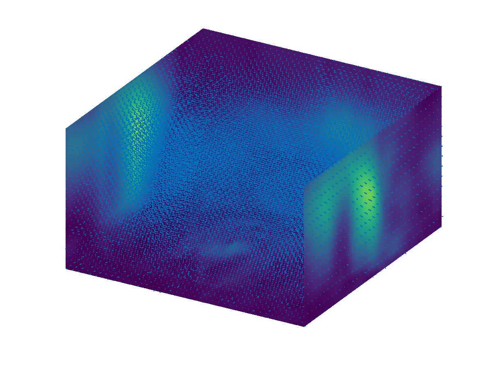
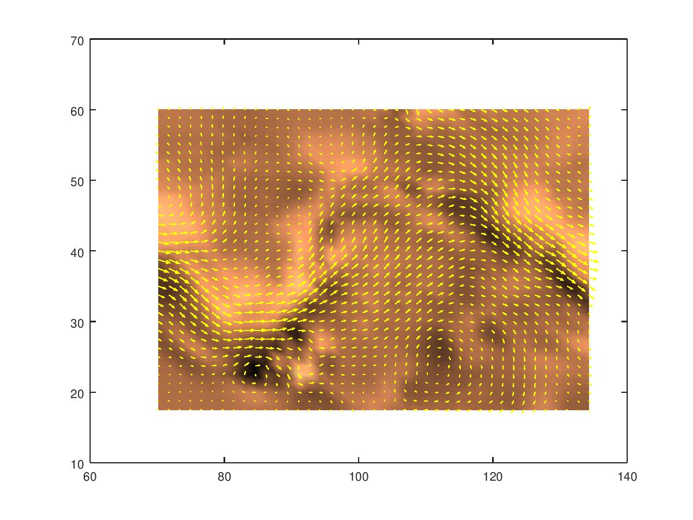
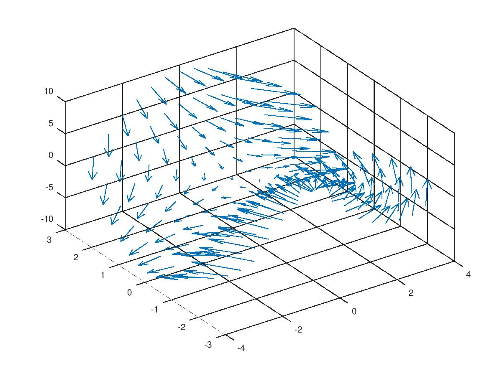
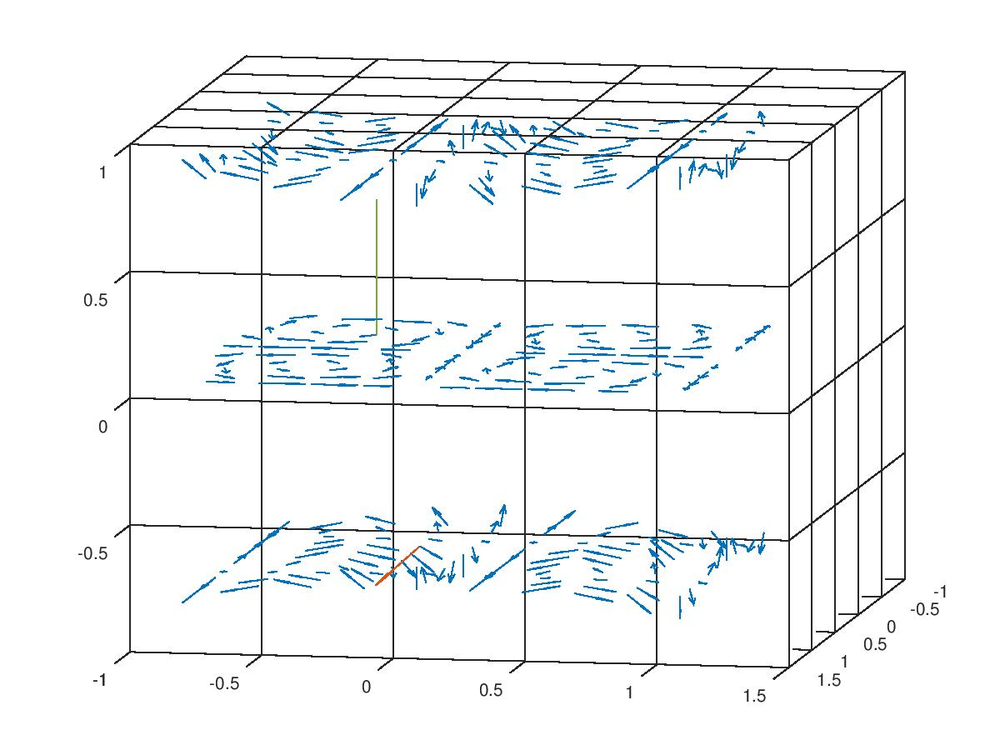

# Octave ile Ruzgar Verisi, wind.dat, Curl Ornekleri

Matlab ile `wind.dat` rüzgar verisi ilginç bazı analizler,
grafiklemeler yapılabiliyor. Bu veri x,y,z kordinatlarında u,v,w ile
bir vektör alanı tanımlıyor ki vektörler o noktalarda rüzgarın hızını
gösteriyor. Matlab'ın `curl`, `div` örnekleri kodlanmış.

Matlab örneklerinin bazılarını onun açık yazılım kardeşi Octave'a
geçirdik, altta bu kodlar görülebilir.

Veri [1]'den indirilebilir. 


```
load ../../../calc_multi/calc_multi_70_div_curl_lap/wind
figure()
cav = curl(x,y,z,u,v,w);
slice(x,y,z,cav,[90 134],[59],[0]); 
shading interp
daspect([1 1 1]); axis tight
colormap (hot);
camlight
print -djpg image1.jpg
```



```
figure()
load ../../../calc_multi/calc_multi_70_div_curl_lap/wind
idx = [2  6  10  14  18  22];
idz = [2 4 6 8];
x = x(idx,idx,idz);y = y(idx,idx,idz);z = z(idx,idx,idz);
u = u(idx,idx,idz);v = v(idx,idx,idz);w = w(idx,idx,idz);
quiver3(x,y,z,u,v,w);
view(-45,20)
set(gca, 'Color', 'black');
axis tight
axis equal
print -djpg image2.jpg
```



```
figure()
load ../../../calc_multi/calc_multi_70_div_curl_lap/wind
wind_vel = sqrt(u.^2 + v.^2 + w.^2);
slice(x,y,z,wind_vel,[80,90,100,110,120],Inf,Inf)
axis equal
shading interp 
print -djpg image3.jpg
```




```
figure()
load ../../../calc_multi/calc_multi_70_div_curl_lap/wind
xmin = min(x(:));
xmax = max(x(:));
ymin = min(y(:));
ymax = max(y(:));
zmin = min(z(:));
daspect([2,2,1])
xrange = linspace(xmin,xmax,8);
yrange = linspace(ymin,ymax,8);
zrange = 3:4:15;
[cx cy cz] = meshgrid(xrange,yrange,zrange);
hcones = quiver3(x,y,z,u,v,w);
hold on
wind_speed = sqrt(u.^2 + v.^2 + w.^2);
hsurfaces = slice(x,y,z,wind_speed,[xmin,xmax],ymax,zmin);
set(hsurfaces,'FaceColor','interp','EdgeColor','none')
hold off
axis tight; view(30,40); axis off
print -djpg image5.jpg
```



```
figure()
load ../../../calc_multi/calc_multi_70_div_curl_lap/wind
k = 4;
x = x(:,:,k); y = y(:,:,k); u = u(:,:,k); v = v(:,:,k);
cav = curl(x,y,u,v);
pcolor(x,y,cav); shading interp
hold on;
quiver(x,y,u,v,'y')
hold off
colormap copper
print -djpg image6.jpg
```



```
x = -3:0.5:3;
y = -3:0.5:3;
[X,Y] = meshgrid(x, y);
Z = Y.^2 - X.^2;
[U,V,W] = surfnorm(Z);
figure
quiver3(X,Y,Z,U,V,W)
view(-35,45)
print -djpg image7.jpg
```




İlginç bir örnek daha, iki noktada curl sonucunu grafikliyoruz,
grafiğe sığması için okları `S` kadar küçülttük,

```
x = -0.8:0.2:1;
y = -0.8:0.2:1;
z = -0.8:0.8:1;
[xx,yy,zz] = meshgrid(x, y, z);
size(xx)
u = sin(pi .* xx) .* cos(pi .* yy) .* cos(pi .* zz);
v = -cos(pi .* xx) .* sin(pi .* yy) .* cos(pi .* zz);
w = (sqrt(2.0 / 3.0) .* cos(pi .* xx) .* cos(pi .* yy) .*  sin(pi .* zz));
h = quiver3(xx,yy,zz,u,v,w);
set (h, "maxheadsize", 0.25);
hold on;

[CURLX, CURLY, CURLZ, CAV] = curl(xx,yy,zz,u,v,w);

i=3;j=3;k=2;
ci=CURLX(i,j,k)
cj=CURLY(i,j,k)
ck=CURLZ(i,j,k)
S = 10.0;
quiver3(xx(i,j,k),yy(i,j,k),zz(i,j,k),ci/S,cj/S,ck/S); 
hold on;

i=4;j=4;k=1;
ci=CURLX(i,j,k)
cj=CURLY(i,j,k)
ck=CURLZ(i,j,k)
quiver3(xx(i,j,k),yy(i,j,k),zz(i,j,k),ci/S,cj/S,ck/S);
hold on;

view(-10,-10);

print -djpg image8.jpg
```



Curl kodu [5]'teki Octave kodunu kullanıyor, bu kodun basitleştirilmiş
hali [curl3.m](curl3.m) bağlantısında bulunabilir. Üstteki kod `curl`
yerine `curl3` çağrısı yaparsa aynı şekilde işleyecektir.

Kaynaklar

[1] https://github.com/burakbayramli/classnotes/blob/master/calc_multi/calc_multi_70_div_curl_lap/wind.mat

[2] http://matlab.izmiran.ru/help/techdoc/ref/divergence.html

[3] http://matlab.izmiran.ru/help/techdoc/ref/curl.html

[4] https://www.mathworks.com/help/matlab/ref/quiver3.html

[5] http://ab-initio.mit.edu/octave-Faddeeva/scripts/general/curl.m


