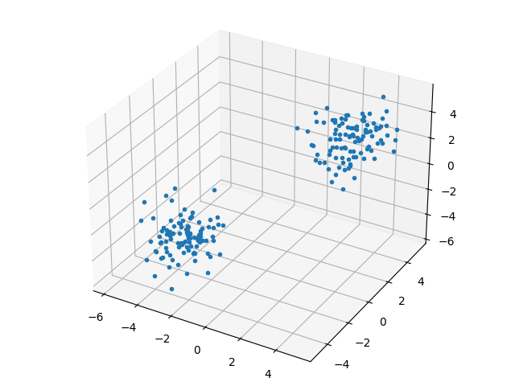
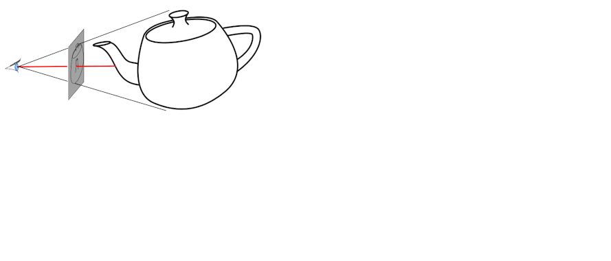
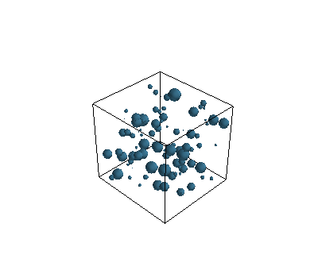
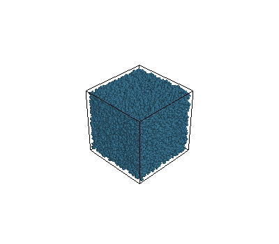
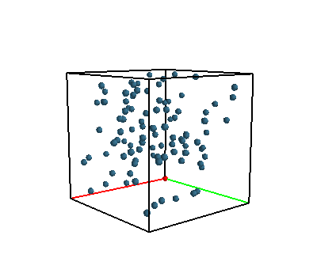

# Animasyon, Matplotlib, Mayavi

Hareketli bilimsel grafikler (hareketli dalga, cisim) için şu an
tercih edilen yaklaşım bir dinamik sistem içinden "fotoğraf kareleri"
almak, mesela en basit ortamda Matplotlib ile `plt.savefig('')`
kullanarak, ve bu dosyaları ardından İmageMagick `convert` ile
birleştirip bir animasyonlu .gif yaratmak. Bu sayede genel
grafiklemede zaten kullandığımız, bildiğimiz `plt.plot` çağrılarını
kullanmış oluyoruz, ve alttaki yöntemlerle gerekli bazı fotoğraf
karelerini birleştirince bir anımasyon da elde etmiş
oluyoruz. Animasyon için farklı şekilde çağrılar yapmak, farklı
kütüphaneler kullanmak gerekmiyor.

Matplotlib

En basit 3 boyutlu parçacık grafiği,

```python
N = 100
c1 = np.random.multivariate_normal(np.array([-3,-3,-3]), np.eye(3), size=N)
c2 = np.random.multivariate_normal(np.array([3,3,3]), np.eye(3), size=N)
c = np.vstack((c1,c2))

import matplotlib.pyplot as plt
from mpl_toolkits.mplot3d import Axes3D

fig=plt.figure()
ax=Axes3D(fig)
ax.plot(c[:, 0], c[:, 1], c[:, 2],'.')
plt.savefig('mayavi6.png')
```



Animasyon bağlamında sistem ileri doğru işletilirken bir indis `i` ile
hangi karede, hangi zaman diliminde olduğumuzu biliyorsak, bunu
kullanarak, belli dilimlerde (mesela her 5'inci dilim) çıktıyı alıp
diske yazabiliriz,

```
for i in ..
   # hesaplar yap
   if i%5 == 0:
      plt.plot(...)
      ...
      plt.savefig('out-%02d.png' % i)
      plt.close('all')
```

Dikkat, eğer `close` çağrısı olmazsa fazla resim basma ve yoğun grafik
işlemleri ardindan hafıza tükenebilir.

Bu program işleyince elimizde `out-01.png`, `out-02.png`, gibi dosyalar
olacak. Bu dosyaları basit bir şekilde

```
convert -delay 20 -loop 0 out*.png out.gif
```

ile birleştirebiliriz. Üstte `%02d` kullanmış olmamız dosya
isimlerinde iki basamaklı sayı eklenmesini sağladı, 01, 02 gibi,
böylece basit yıldız kullanımı dosyaları sıralı bir şekilde
getirecektir.

Üç Boyutlu Grafikler İçin Mayavi

Simulasyon amaçlı pek çok parçacığı ekranda çizmemiz hareketlerini
takip etmemiz gerekebilir. Fakat çok hızlı olarak bilinen bir dilden,
mesela C++'dan bile, OpenGL çağırıp ekranda parçacıkları
`glutSolidSphere` ile çizdirmemiz hızlı bir cevap almamız için yeterli
olmayabilir. Belki arka planda, gözükmeyecek toplar vardır, bunları
göstermeye gerek var mı?

Bilgisayar grafikleme algoritmalarından (ki bilgisayar oyunlarında
yaygın şekilde kullanılır) ışın takip etme (ray tracing) burada
gerekli olabilir, görüntüye bakılma açısından sanal ışınlar hayal edip
bunların sadece ilk çarpıktıklarını çizmek, arka plana kalanları
çizmemek bir hızlandırıcı ilerleme olurdu.



O zaman teker teker top çiz demek yerine tüm topların kordinatlarını
bir seferde verip özel bir kütüphanenin görünecek olan objelere karar
vermesi daha mantıklı olabilir. MayaVi ve onun arka planda kullandığı
VTK işte bu işi başarıyor.

Kurmak icin

```
pip install pyqt5 mayavi
```

En basit örnek üzerinde görelim, 

```python
from mayavi import mlab
mlab.options.offscreen = True

N = 100
c1 = np.random.multivariate_normal(np.array([-3,-3,-3]), np.eye(3), size=N)
c2 = np.random.multivariate_normal(np.array([3,3,3]), np.eye(3), size=N)
c = np.vstack((c1,c2))

fig = mlab.figure(fgcolor=(0., 0., 0.), bgcolor=(1, 1, 1), size=(640, 360))
r = np.ones(2*N)*0.2
color=(0.2, 0.4, 0.5)
mlab.points3d(c[:, 0], c[:, 1], c[:, 2], r, color=color,
              colormap = 'gnuplot', scale_factor=1, figure=fig)
mlab.outline()
mlab.view(azimuth=00, elevation=80, focalpoint=[1, 1, 1], distance=30.0, figure=fig)
mlab.savefig(filename='mayavi7.png')
```

Farklı boyutlarda,

```python
mlab.figure(fgcolor=(0., 0., 0.), bgcolor=(1, 1, 1))
N = 100
c = np.random.rand(N, 3)
r = np.random.rand(N) / 10.
mlab.points3d(c[:, 0], c[:, 1], c[:, 2], r, color=(0.2, 0.4, 0.5))
mlab.outline()
mlab.savefig(filename='mayavi1.png')
```




Şimdi 80,000 tane topu, arka arkaya iki grafikte çizdirelim,


```python
mlab.figure(fgcolor=(0., 0., 0.), bgcolor=(1, 1, 1))
N = 80000
c = np.random.rand(N, 3)
r = np.random.rand(N) / 10.
mlab.points3d(c[:, 0], c[:, 1], c[:, 2], r, color=(0.2, 0.4, 0.5))
mlab.outline()
mlab.savefig(filename='mayavi2.png')

mlab.figure(fgcolor=(0., 0., 0.), bgcolor=(1, 1, 1))
N = 80000
c = np.random.rand(N, 3)
r = np.random.rand(N) / 10.
mlab.points3d(c[:, 0], c[:, 1], c[:, 2], r, color=(0.2, 0.4, 0.5))
mlab.outline()
mlab.savefig(filename='mayavi3.png')
```




Bu iki grafikleme oldukca hızlı şekilde geri döndü. Eğer bir sıvı
dinamiğini simüle ediyorsak ve milyonlarca parçacık varsa bu perfomans
belki anlık ekranda göstermek için yeterli olmayabilir, fakat arka
planda birkaç dakika beklenerek tüm simülasyonun gidişatı belli birkaç
kare yanyana koyularak kabul edilir bir zaman içinde yaratılabilir.

Kordinat Eksenleri

Eğer `outline` kullanmak yerine sabit büyüklükte, x,y,z kordinat
eksenlerini göstermek istersek, bunu teker teker kendimizin yapması
lazım. Altta orijinde duran her kenarı 2 birim büyüklükte bir küp
gösteriyoruz,

```python
BS = 2.0
N = 100
c = np.random.rand(N, 3)*2.0
r = np.ones(N)*0.1

fig = mlab.figure(figure=None, fgcolor=(0., 0., 0.), bgcolor=(1, 1, 1), engine=None)
color=(0.2, 0.4, 0.5)
mlab.points3d(c[:, 0], c[:, 1], c[:, 2], r, color=color, colormap = 'gnuplot', scale_factor=1, figure=fig)
mlab.points3d(0, 0, 0, 0.1, color=(1,0,0), scale_factor=1.0, figure=fig)

mlab.plot3d([0.0,0.0],[0.0, 0.0],[0.0, BS], color=(0,0,0), tube_radius=None, figure=fig)
mlab.plot3d([0.0,BS],[0.0, 0.0],[0.0, 0.0], color=(1,0,0), tube_radius=None, figure=fig)
mlab.plot3d([0.0,0.0],[0.0, BS],[0.0, 0.0], color=(0,1,0), tube_radius=None, figure=fig)
mlab.plot3d([0.0,0.0],[0.0, BS],[BS, BS], color=(0,0,0), tube_radius=None, figure=fig)
mlab.plot3d([0.0,BS],[0.0,0.0],[BS,BS], color=(0,0,0), tube_radius=None, figure=fig)
mlab.plot3d([BS,BS],[0.0,BS],[BS,BS], color=(0,0,0), tube_radius=None, figure=fig)
mlab.plot3d([BS,0],[BS,BS],[BS,BS], color=(0,0,0), tube_radius=None, figure=fig)
mlab.plot3d([0,0],[BS,BS],[BS,0], color=(0,0,0), tube_radius=None, figure=fig)
mlab.plot3d([BS,BS],[0.0,0.0],[0.0,BS], color=(0,0,0), tube_radius=None, figure=fig)
mlab.plot3d([BS,BS],[0.0,BS],[0.0,0.0], color=(0,0,0), tube_radius=None, figure=fig)
mlab.plot3d([BS,0.0],[BS,BS],[0.0,0.0], color=(0,0,0), tube_radius=None, figure=fig)
mlab.plot3d([BS,BS],[BS,BS],[0.0,BS], color=(0,0,0), tube_radius=None, figure=fig)

mlab.view(azimuth=50, elevation=80, focalpoint=[1, 1, 1], distance=8.0, figure=fig)

mlab.savefig(filename='mayavi5.png')
```



Problemler

Eğer ardı ardına grafik basıyorsak, döngü dışında `fig = mlab.figure`
komutu kullanıp, her döngü sonunda `mlab.savefig` ardından
`mlab.clf()` uygulamak hafıza problemlerini çözecektir. 

Daha once yazdigimiz kesit seviyeleri yazisini not defteri ortamina
gecirdik, ve bu yazida kesit seviyeleri diferansiyel denklemi
hesaplanirken, onun uzerinden yapilan imaj bolumu aninda not defteri
icinde gosteriliyor. Not defteri icinde animasyon gostermek icin
kullanilan kalip

Eski bazi yaklasimlar altta bulunabilir

Not Defteri Icinde Animasyon

```
from IPython.display import clear_output
f, ax = plt.subplots()
..
while True: # bir dongu
    ...
    ax.imshow(...)
    CS = ax.contour(...)
    clear_output()
    display(f)
    ax.cla()
```

Biz `ax.imshow`, `ax.contour` kullandık, fakat `ax` üzerinde pek çok
grafiksel işlem yapılabilir tabii ki.

Not: iPython not defterinin indirilip yerel, ya da kod işletilmesine
izin veren bir defter servisi üzerinde işletilmesi lazım.


Matplotlib, Pylab ve hareketli plot, animasyonlar

Bir kordinat sistemı üzerinde canlı olarak bir hesabın sonucunu
seyretmek istersek, Pylab için faydalı bir örnek kod altta. Kod arka
arkaya 10 tane x,y değeri üretiyor, sayılar 0..1 arası, ve eksenlerin
sabit kalması için set_xlim, set_ylim çağrılarını yapmak lazım.

```python
from pylab import *
from random import *
from time import *
ion()
fig = plt.figure()
ax = fig.add_subplot(111)
for i in xrange(10):
sleep(0.5)
ax.plot([random()], [random()], 'd')
ax.set_xlim(0, 1)
ax.set_ylim(0, 1)
hold(False)
draw()
```

Kaynaklar

[1] https://docs.enthought.com/mayavi/mayavi/mlab.html

[2] https://www.toptal.com/data-science/3d-data-visualization-with-open-source-tools-an-example-using-vtk


