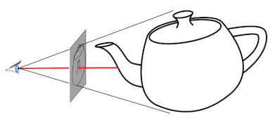

# Üç Boyutlu Grafikler İçin Mayavi

Simülasyon amaçlı pek çok parçacığı ekranda çizmemiz hareketlerini
takip etmemiz gerekebilir. Fakat çok hızlı olarak bilinen bir dilden,
mesela C++'dan bile, OpenGL çağırıp ekranda parçacıkları
`glutSolidSphere` ile çizdirmemiz hızlı bir cevap almamız için yeterli
olmayabilir. Belki arka planda, gözükmeyecek toplar vardır, bunları
göstermeye gerek var mı?

Bilgisayar grafikleme algoritmalarından (ki bilgisayar oyunlarında
yaygın şekilde kullanılır) işin takip etme (ray tracing) burada gerekli
olabilir, görüntüye bakılma açısından sanal ışınlar hayal edip
bunların sadece ilk çarpıklarını çizmek, arka plana kalanları çizmemek
bir hızlandırıcı ilerleme olurdu.



O zaman teker teker top ciz demek yerine tüm topların kordinatlarını
bir seferde verip özel bir kütüphanenin görünecek olan objelere karar
vermesi daha mantıklı olabilir. MayaVi ve onun arka planda kullandigi
VTK isti bu isi basariyor.

Kurmak icin

```
pip install pyqt5 mayavi
```

Birkac tane top cizelim,

```python
from mayavi import mlab
mlab.options.offscreen = True
```

```python
mlab.figure(fgcolor=(0., 0., 0.), bgcolor=(1, 1, 1))
N = 100
c = np.random.rand(N, 3)
r = np.random.rand(N) / 10.
mlab.points3d(c[:, 0], c[:, 1], c[:, 2], r, color=(0.2, 0.4, 0.5))
mlab.outline()
mlab.savefig(filename='mayavi1.png')
```


Şimdi 80,000 tane topu, arka arkaya iki grafikte çizdirelim,


```python
mlab.figure(fgcolor=(0., 0., 0.), bgcolor=(1, 1, 1))
N = 80000
c = np.random.rand(N, 3)
r = np.random.rand(N) / 10.
mlab.points3d(c[:, 0], c[:, 1], c[:, 2], r, color=(0.2, 0.4, 0.5))
mlab.outline()
mlab.savefig(filename='mayavi2.png')

mlab.figure(fgcolor=(0., 0., 0.), bgcolor=(1, 1, 1))
N = 80000
c = np.random.rand(N, 3)
r = np.random.rand(N) / 10.
mlab.points3d(c[:, 0], c[:, 1], c[:, 2], r, color=(0.2, 0.4, 0.5))
mlab.outline()
mlab.savefig(filename='mayavi3.png')
```


Bu iki grafikleme oldukca hızlı şekilde geri döndü. Eğer bir sıvı
dinamiğini simüle ediyorsak ve milyonlarca parçacık varsa bu perfomans
belki anlık ekranda göstermek için yeterli olmayabilir, fakat arka
planda birkaç dakika beklenerek tüm simülasyonun gidişatı belli birkaç
kare yanyana koyularak kabul edilir bir zaman içinde yaratılabilir.


Kaynaklar

[1] https://docs.enthought.com/mayavi/mayavi/mlab.html

[2] https://www.toptal.com/data-science/3d-data-visualization-with-open-source-tools-an-example-using-vtk


