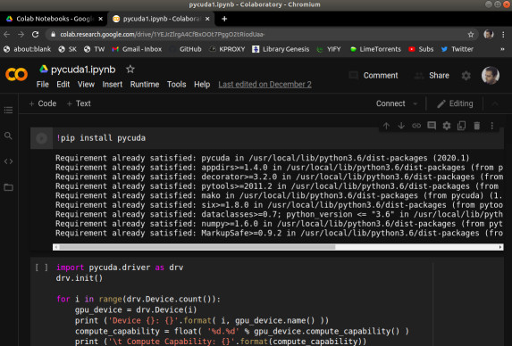
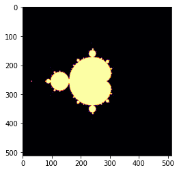

# GPU, CUDA, PyCuda

Bilgisayarımızda hesapları yapan işlemci var, bu işlemci son
zamanlarda çok çekirdekli hale de gelmeye başladı. Fakat
bilgisayarımızda işlem yapan çok kuvvetli bir parça daha var: grafik
işlemci (GPU).GPU paralel işlem açısından neredeyse pür mikroişlemci
kadar kuvvetlidir, hatta bazı açılardan daha hızlıdır, çünkü tarihsel
sebeplerle parallelliğe daha fazla yatkın olması gerekmiştir. GPU bir
görüntünün hızla çizilmesi (rendering) için piksel bazında paralelliğe
gitmek zorundaydı ve NVİDİA şirketinin ürünleri için artık bu normal
bir operasyondur.

Araştırmacılar bu paralellikten istifade etmeye karar vermişler, ve
grafiksel olmayan hesap işlemlerini sanki öyleymiş gibi GPU'ya
sunuyorlar, ve cevabı geri tercüme ediyorlar, böylece GPU'nun hızlı
paralel işlemci özelliğinden faydalanıyorlar. Pek çok matematiksel
hesabı bu şekilde yaptıran olmuş, mesela matris çarpımı, PDE çözümü,
simülasyon.

NVidia şirketi grafik kartlarının GPU'suna erişim için CUDA diye bir
kütüphane sağlıyor. Onun üstüne PyCUDA ile Python bazlı erişim de
var. Bazı ülkelerin üniversitelerinde CUDA eğitimini müfredata dahil
edilmiş. Dikkat: NVidia kartı piyasadaki grafik kartlarından bir
tanesidir, her laptop üzerinde NVidia olmayabilir (fakat NVidia
piyasadaki en ünlülerden birisi, bunu da ekleyelim). Şimdilik GPU
kodlaması için NVidia kartına sahip bir bilgisayar lazım.

Fakat GPU bazlı kodlama oldukca popüler hale geldi ki video kart
üreticisi NVidia dışarıdan bilgisayara dahil edilebilen ayrı bir ufak
GPU ünitesi bile yarattı. Ünitenin ismi Jetson kartı.

https://developer.nvidia.com/buy-jetson

Kart üzerinde Ubuntu işleyebiliyor, network aktarıcısı (router) dahil
edilip hemen ssh ile alete bağlanabiliyorsunuz. Yapay öğrenim ile
uğraşanlar için müthiş haber GPU üzerinde mevcut 192 çekirdek aşırı
seviyede paralellik isteyen deep learning yaklaşımı için biçilmiş
kaftan, ki burada birisi denemiş, ve nasıl yapılabileceği
anlatılıyor. Blog sahibi Pete Warden imaj üzerinde yapay öğrenim
algoritmaları kullanma konusunda uzmanlardan biridir, bu iş için
kurduğu şirketini geçende Google satın aldı. Tabii ki Jetson üzerinde
direk CUDA kodlaması da yapılabilir.

CUDA

Pek çok türde paralelellik, eşzamanlılaştırma tekniği var. Mesela disk
bazlı çalışan [eşle/indirge](../../2014/09/esle-indirge-mimarisi-mapreduce-mr.html)
bunlardan biri. Her teknik paralleliği hangi birim üzerinde, nerede,
ne zaman yaptırdığı bağlamında birbirinden farklı. GPU kodlaması SIMD
yaklaşımını benimser, SIMD = Single Instruction Multiple Data, yani
Tek Komut Pek Çok Veri yaklaşımı. SIMD ile bir işlem, ki bu çarpma,
toplama, vs gibi temel işlemler ya da onların toplamı olan bir hesap
ünitesi olabilir, birden fazla veri noktası üzerinde aynı anda
uygulanır. Bu yaklaşımın grafik kartları, grafikleme için nasıl
faydalı olacağını görmek zor değil, çünkü grafik kartları için veri,
görüntü pikselleri, ve her piksel üzerinde, resim kare kare
oluşturulurken tek bir işlemi aynı anda uygulamak faydalı olur. Bu
işlem transformasyon olabilir, ki aynı matrisi çarpmayı gerektirir,
işin takip etme (ray tracing) olabilir, vs.

CUDA NVidia'nın kendi kartlarına programcı erişimi sağlayan bir
arayüzdür. Python üzerinde PyCuda üzerinden erişilebilir. NVidia'nın
`nvcc` adlı genişletilmiş C++ derleyicisi aynı şekilde CUDA
kodlamasına C++ üzerinden izin verir.

Turkiye'de Alım

NVidia grafik kartına sahip bir makina fazla pahalı değil, özellikle
yıllarca önce bir süperbilgisayar seviyesinde işletim gücüne
eriştiğimizi düşünürsek. Bir oyun makinası PC ile beraber alınabilir,
ya da, mesela harici Jetson kartı 70-100 dolar arasında.

GPU Var mı Kontrol

Dizüstü ya da masaüstü bilgisayarında acaba dışarıdan kodlanabilen GPU
var mı? Kontrol etmenin en kolay yolu Chromium tarayıcısına
sormak. Tarayıcı bu tür bilgilere sahip çünkü kendisi de mümkün olan
tüm hızlandırıcıları kullanmak istiyor, neyse tarayıcıya gidip adres
çubuğunda `chrome://gpu` yazarsak gösterilen raporda eğer varsa CUDA
yetenekli kart gösterilecektir.

CUDA ve Collab

Geliştiriciler için bir diğer seçenek Google bulutu üzerinde
barındırılan not defteri servisi [Google Collab](../../2018/11/gpu-tpu-saglayan-not-defter-ortami.html).
Bu servis [Jupyter](../../2018/09/jupyter-not-defterleri.html)
teknolojisine İnternet üzerinden erişim sağlıyor denebilir.

Collab'a girip bir not defteri yaratalım, ve menüde `Edit | Notebook
settings` seçelim, burada `Hardware accelerator` seçimi var. Bu seçimi
`GPU` haline getirelim. Bu kadar basit! Arka plandaki bir GPU
havuzundan Google size bir GPU atamış olacaktır.

Dikkat: Jupyter üzerinden GPU kullanımı direk kendi kartımız üzerinden
kullanıma oranla yavaş olablir. Ama 10/20 kat hızlandırmayı hala
Google Collab ile deneyimlemek mümkün.




Şimdi `pycuda` kuralım. Bu işlemi aynı not defterini ilk kez
açtığımızda her seferinde tekrar yapmamız lazım. Çünkü arka planda
bize Google tarafından bir makina atanıyor, ve eski makinanın kurulumu
yokolmuş oluyor, her seferinde yeni bir makinada, yeni bir süreçteyiz.

```
!pip install pycuda
```

Kurulum bitince artık pycuda çağrıları yapabiliriz. Acaba makinamızda
ne tür bir GPU var?

```python
import pycuda.driver as drv
drv.init()

for i in range(drv.Device.count()):
    gpu_device = drv.Device(i)
    print ('Device {}: {}'.format( i, gpu_device.name() ))
    compute_capability = float( '%d.%d' % gpu_device.compute_capability() )
    print ('\t Compute Capability: {}'.format(compute_capability))
    print ('\t Total Memory: {} megabytes'.format(gpu_device.total_memory()//(1024**2)))
```

```
Device 0: Tesla T4
	 Compute Capability: 7.5
	 Total Memory: 15079 megabytes
```

Fena bir kart değil, >2500 çekirdeği var.

En basit işlemle başlayalım. Bir vektör üzerindeki sayıları 2 ile çarpalım.

```python
from time import time
import pycuda.autoinit
from pycuda import gpuarray

host_data = np.array(range(10**7),dtype=np.float32)

device_data = gpuarray.to_gpu(host_data)

t1 = time()
device_data_x2 = np.float(2) * device_data
t2 = time()
host_data_x2 = device_data_x2.get()
print ('GPU %0.8f saniye.' % (t2-t1))
  
t1 = time()
host_data_x2_cpu = host_data * np.float(2)
t2 = time()

print ('CPU %0.8f saniye.' % (t2-t1))
```

```
GPU 0.00174046 saniye.
CPU 0.00841069 saniye.
```

GPU ile CPU arasında 8 kat civarı fark var, 10 milyon tane sayıyı
ikiye çarpmak için.

Not 1: Jupyter ortamında pycuda kodlarının daha yavaş işlediği
tecrübelenmiştir, bu hız karşılaştırmasını nihai olarak görmemek
lazım.

Not 2: pycuda bir kodu ilk işlettiğinde onu bir derleme sürecinden
geçirir, ama ikinci sefer aynı kodu görünce bunu yapmaz [1]. Bu
sebeple ikinci, üçüncü, vs. işletim daha hızlı olacaktır.

Kodu incelersek `gpuarray.to_gpu` ile GPU'ya veriyi gönderdik. Daha
sonra `np.float(2) * device_data` ile çarpma işlemi GPU üzerinde
yapıldı. Tabii arka planda Python bazı tutkallama işi yaptı mesela `*`
işlemi büyük ihtimalle belli tipler için üste tanımlı (overloaded), ve
`gpuarray` gibi özel tipler söz konusu olunca arka planda GPU üzerinde
ek işlemler yapılacağı biliniyor. 

Yapılan işlem çarpma, ve GPU bu her çarpma işlemini aynı anda, mümkün
olduğu kadar fazla vektör öğesi üzerinde işletti.

Çekirdek (Kernel) Kod Kullanımı

Daha direk bir yöntemi görelim. Aslında CUDA kodları çekirdek kod
temelli işler, dışarıdan programcının verdiği bir kod, veri üzerinde
(mümkün olduğu kadar paralel bir şekilde) işletilir / uygulanır. Bu
Python'un `map`, ya da Pandas `apply` operasyonuna benzer.

```python
import numpy as np
import pycuda.autoinit
from pycuda import gpuarray
from time import time
from pycuda.elementwise import ElementwiseKernel

host_data = np.float32( np.random.random(10**7) )

gpu_2x_ker = ElementwiseKernel(
"float *in, float *out",
"out[i] = 2*in[i];",
"gpu_2x_ker")

t1 = time()
host_data_2x =  host_data * np.float32(2)
t2 = time()
print ('CPU: %f' % (t2 - t1))
device_data = gpuarray.to_gpu(host_data)
device_data_2x = gpuarray.empty_like(device_data)
t1 = time()
gpu_2x_ker(device_data, device_data_2x)
t2 = time()
from_device = device_data_2x.get()
print ('GPU: %f' % (t2 - t1))
```

```
CPU: 0.007268
GPU: 0.079255
```

Üstte `ElementwiseKernel` objesine üç tane parametre verdik. Bunlardan
ilki çekirdeğe / fonksiyona verilecek parametreler, bunların ilki
giriş verisi, ikincisi çıkış verisi, sözdizim C dili sözdizimine
benziyor dikkat edilirse, C ile `*ptr` ile tanımlanan değişkene
`ptr[0]`, `ptr[1]`, vs ile erişilebilir, göstergeç aritmetiği
uygulanabilir. Ayrıca çıkış vektörünün verisini "içeriden" alabilmek
için `gpuarray.empty_like` ile onu dışarıda önceden tanımlamamız
gerekti.. Bu vektöre bir yer açtık, o yerdeki vektörün değerleri GPU
tarafından dolduruldu.

Metodun ana kodu ikinci parametrede, burada giriş vektör öğesi
üzerinde hangi işlem yapılıp hangi çıkış öğeye atandığı
kodlanıyor. İndis `i` ile vektör öğesine erişiliyor, kod işlediğinde
her çekirdek eşzamanlı olarak tek bir öğe üzerinde işlem yapacak, buna
dikkat. GPU parallelliğinin temeli bu.

Bu [1]'den alınan bir giriş kodu tabii, parallelliğin bazı detayları
arka planda saklanmış, Python için en azından. Mesela kod içinde
referans edilen `i` bir iş parçacığı (thread) indisidir, bu indislerin
eldeki N vektör öğesi için 0 ila N arası değerler olacağına emin
miyiz? Kodun işleyişi buna bağlı çünkü. Ayrıca N tane ayrı iş
parçacığı oluşturulacağını biliyor muyuz?

C ile iki vektörü toplayan bir kod suna benzer,

```cpp
__global__ void VecAdd(float* A, float* B, float* C)
{
   int i = threadIdx.x;
   C[i] = A[i] + B[i];
}
int main()
{
   ...
   VecAdd<<<1, N>>>(A, B, C);
   ...
}
```

Burada `<<<1, N>>>` tanımındaki `N` ile kaç iş parçacığı olacağı
önceden tanımlandı. Üstteki gibi basit bir Python çağrısı var ise, bu
tanım arka planda yapılıyor olmalı. Indis 0-N de aynı şekilde
garantileniyor muhakkak. 

Mandelbrot Kümesi

Fraktal resimleri üretmek için Mandelbrot yaklaşımı kullanılabilir,
[4]'te konunun matematiğinden bahsedilildi. Orada gösterilen
yaklaşımda her hücre üzerinde teker teker bir hesap yapıldığını
görüyoruz. Bu hesabı GPU üzerinde eşzamanlı olarak işletmek mümkün.


```python
import numpy as np
import pycuda.autoinit
from pycuda import gpuarray
from pycuda.elementwise import ElementwiseKernel

mandel_ker = ElementwiseKernel(
"pycuda::complex<float> *lattice, float *mandelbrot_graph, int max_iters, float upper_bound",
"""
mandelbrot_graph[i] = 1;

pycuda::complex<float> c = lattice[i]; 
pycuda::complex<float> z(0,0);

for (int j = 0; j < max_iters; j++)
{    
   z = z*z + c;
     
   if(abs(z) > upper_bound) {
       mandelbrot_graph[i] = 0;
       break;
    }
}         
""",
"mandel_ker")

width, height, real_low, real_high, imag_low, imag_high, max_iters, upper_bound =  512,512,-2,2,-2,2,256, 2

real_vals = np.matrix(np.linspace(real_low, real_high, width), dtype=np.complex64)

imag_vals = np.matrix(np.linspace( imag_high, imag_low, height), dtype=np.complex64) * 1j

mandelbrot_lattice = np.array(real_vals + imag_vals.transpose(), dtype=np.complex64)    

mandelbrot_lattice_gpu = gpuarray.to_gpu(mandelbrot_lattice)

mandelbrot_graph_gpu = gpuarray.empty(shape=mandelbrot_lattice.shape, dtype=np.float32)

mandel_ker( mandelbrot_lattice_gpu, mandelbrot_graph_gpu, np.int32(max_iters), np.float32(upper_bound))
          
mandelbrot_graph = mandelbrot_graph_gpu.get()   
```

```python
from matplotlib import pyplot as plt
fig = plt.figure(1)
plt.imshow(mandelbrot_graph, cmap='inferno')
```




x,y değerleri düz birer tek boyutlu vektördü, onları üst üste
istifleyip tek bir vektör ile GPU'ya gönderdik, böylece birbirine eş
olan x,y değerleri aynı indis üzerinden GPU içinden erişilir hale
geldi. Sonra, çekirdek içinde, özyineli döngüye girdik, bu döngü her
öge için mümkün olduğu kadar farklı GPU çekirdeği üzerinde koşturmayı
yapacak. Tabii `max_iters` döngüsü seri, senkron olarak işleyecek
fakat her x,y hücresinin paralel işlenmesi çok büyük bir ilerleme ve
hakikaten de Mandelbrot GPU kodu hızlı işliyor.

Üstteki kodda tam tekmilli program ifadeleri kullanabildiğimizi
görüyoruz, mesela for `for` döngüsü. Sözdizim C temelli ve hata
ayıklama süreci biraz uğraştırabilir çok çetrefil denemez.

Bir çekirdek çağrısı işletmenin tek yolu `ElementwiseKernel` değil,
aslında o yöntem en kolay olanı. Şimdi işleri biraz daha
zorlaştıralım, bir çekirdek fonksiyonu yazalım.

Ne zaman bu tür bir fonksiyon yazarsak ondan önce `__global__`
kelimesini kullanmamız gerekir. Dönüş tipi hep `void` olur çünkü
döndürelecek veriyi zaten çıkış parametresi olarak
tanımlayacağız. Kodlayacağımız yine vektörü skalar ile çarpmak olacak
ama bu sefer skaların kendisi bir parametre. 


```python
import pycuda.autoinit, time
import pycuda.driver as drv
import numpy as np
from pycuda import gpuarray
from pycuda.compiler import SourceModule

ker = SourceModule("""
__global__ void scalar_multiply_kernel(float *outvec, float scalar, float *vec)
{
     int i = threadIdx.x;
     outvec[i] = scalar*vec[i];
}
""")

scalar_multiply_gpu = ker.get_function("scalar_multiply_kernel")

testvec = np.random.randn(512).astype(np.float32)
testvec_gpu = gpuarray.to_gpu(testvec)
outvec_gpu = gpuarray.empty_like(testvec_gpu)

t1 = time.time()
scalar_multiply_gpu( outvec_gpu, np.float32(2), \
                     testvec_gpu, block=(512,1,1),
		     grid=(1,1,1))
t2 = time.time()
outvec_gpu.get()
print ('total time to compute on GPU: %f' % (t2 - t1))
```

Bu kodda bir diğer fark `threadIdx.x` ile eşzamanlı iş parçacığı
(thread) kimlik no'sunu çağrı yaparak kendimizin almış olmamız. Burada
bir soru acaba her ögeye yetecek kadar iş parçacığı (ki onların özgün
kimlik no'su) mevcut olacak mıdır, çünkü bu kimlik indeks olarak
vektör öğelerine erişmek için kullanılıyor? Cevap evet,
`scalar_multiply_gpu` çağrısına bakarsak orada 512 tane iş parçacığı
tanımlandı, vektörün büyüklüğü de aynı.

NVCC

Eğer Çollab içinde `nvcc` işletmek istersek, bunu ünlem ile yapabiliriz,

```
!nvcc --version

nvcc: NVIDIA (R) Cuda compiler driver
Copyright (c) 2005-2019 NVIDIA Corporation
Built on Sun_Jul_28_19:07:16_PDT_2019
Cuda compilation tools, release 10.1, V10.1.243
```

C++ kodu yazıp derlemek

```cpp
%%writefile test.cpp
#include <stdio.h>
//Main function
int main(int Argc,char* Args[]){
   printf("hello collab");
   return 0;
}

Writing test.cpp
```


```
%%script bash

g++ -std=gnu++17 test.cpp -o test
ls -laX
./test

total 32
drwxr-xr-x 1 root root 4096 Dec 21 17:29 sample_data
-rwxr-xr-x 1 root root 8304 Dec 25 10:05 test
drwxr-xr-x 1 root root 4096 Dec 25 10:05 .
drwxr-xr-x 1 root root 4096 Dec 25 10:04 ..
drwxr-xr-x 1 root root 4096 Dec 21 17:29 .config
-rw-r--r-- 1 root root  109 Dec 25 10:05 test.cpp
hello collab
```

Bu derlemek işlemini `nvcc` ile de yapabilirdik.

Kaynaklar

[1] Tuomanen, *Hands-On GPU Programming with Python and CUDA*

[2] https://colab.research.google.com/

[3] https://gist.github.com/jfpuget/60e07a82dece69b011bb

[4] [Gayri Lineer Dinamik, Ders 19](https://burakbayramli.github.io/dersblog/chaos/chaos_19/ders_19.html)

[5] https://developer.nvidia.com/blog/even-easier-introduction-cuda/

[6] [Jetson Nano](nvidia-jetson-nano-2GB-wifi.html)
